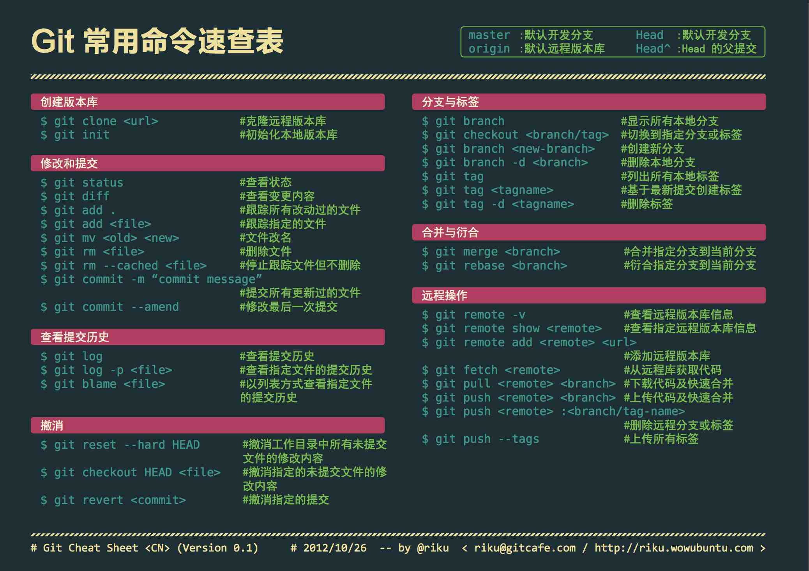
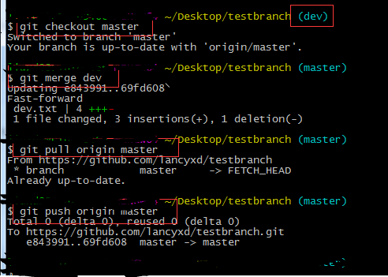

## 1、git常用命令

```shell
git clone http://xxxxxx.git // 克隆代码至本地
git clone username@host:/path/to/repository  //远端克隆

git checkout dev // 切换到dev分支（此时本地代码更新为远端代码的dev分支的版本）
git checkout 86429b650615b679e965446a1f6cff59e7c881aa

git branch // 查看分支，当前分支前会标一个*
git status //命令用于显示工作目录和暂存区的状态,时刻掌握工作区的状态
git tag // 查看标签
git log // 查看commit记录
git reflog // 查看head修改记录
git init // 命令把这个目录变成Git可以管理的仓库（初始化一个Git仓库）

//备注：添加新文件提交至dev分支：add，commit，pull，push ；修改文件提交至dev分支：commit，pull，push。pull代码时红色代表有冲突，需要解冲突；commit本地无冲突时，不需要commit了。
git add，这样把其添加上去，这样gitcommit才会看到
git commit提交至本地，如果没有变动，可以不用提交
git pull拉下来和别人代码合并
git push 上交代码至服务器

# HEAD detached at 原因： 
git checkout b311296ad9e25f12551c2d38adfc37516ac21c83   // HEAD指针没有指向任何的branch，而是指向了一个commit

正常情况下 head指向一个branch，而branch又指向一个commit

git checkout sit  //切换到远端sit分支
git checkout -b 分支名  // 避免这个状态
```

## 2、命令详解及举例

### 1、命令详解

**分支：**是用来将特性开发绝缘开来的，在创建仓库时，master是默认分支，非常稳定，仅用来发布新版本；代码开发均在dev分支，最终合并到master分支。


**分支应用举例：** 

  git branch dev  //创建dev分支

- **修改文件，提交至dev分支(使用bash，一定要先add):**

  ```shell
  git add 1.txt
  git commit –m “备注信息”
  git pull origin dev0611 拉取指定分支的代码（若远端不存在时，该项可省略）
  git push origin dev0611 提交代码至dev分支
  ```

  

- **dev分支合并至master（先提交至远端dev，然后再合并至master）**

  ```shell
  git checkout master // 切换到master，未改变
  git merge dev0611  // git merge命令用于合并指定分支到当前分支
  git commit –m ‘1.txt’
  git pull origin master
  git push origin master
  ```

- **其它应用**

  ```shell
  // 删除dev分支
  git branch –d dev 删除本地dev
  git push origin –d ‘dev0611’ 删除远端dev
  
  // 打tag(切换到对应的分支进行打tag)
  git tag -d v1.0 //本地删除tag
  git push origin :refs/tags/v1.0 //本地tag删除了，再执行该句，删除线上tag
  git tag v1.0  本地打标签
  git push origin v1.0   本地tag推送到线上
  
  // 版本回退
  git reset –hard HEAD^ //回退至上一个版本（上上一个版本就是HEAD^^，往上100个版本HEAD~100）
  git reset –hard 703197 //回退指定版本
  git reset –hard cbaedc3 //远程分支回退
  git reset –hard cbaedc3 //回退版本(找到需要回退的版本号进行回退即可) 
  
  git push –f origin dev0612 //强制覆盖远端代码
  git checkout –b dev3 //从当前分支拉copy开发分支dev3
  git push origin dev3 //将dev3推送至远端
  ```

___

**源码安装与速查表：**

**源码安装**：从Git官网下载源码，然后解压，依次输入：./config，make，sudo make install这几个命令安装就好了。 Github是一个基于git的代码托管平台，地址为：[github官网地址](https://github.com/)



### 2、使用举例

- **dev分支合并至master**

  


## 3、Git、Svn和Git服务器搭建

- **集中式vs分布式：** CVS及SVN都是集中式的版本控制系统；`Git是分布式版本控制系统`。

  **版本控制系统**可以保留一个文件集合的历史记录，并能回滚文件集合到另一个状态（历史记录状态）。另一个状态可以是不同的文件，也可以是不同的文件内容。

  **集中式版本控制系统：**最大的毛病就是必须联网才能工作，版本库是集中存放在中央服务器的；中央服务器就好比是一个图书馆，你要改一本书，必须先从图书馆借出来，然后回到家自己改，改完了，再放回图书馆。

  **分布式管理系统：**根本没有“中央服务器”，每个人的电脑上都是一个完整的版本库，分布式版本控制系统通常也有一台充当“中央服务器”的电脑，但这个服务器的作用是用来方便“交换”大家的修改，没有它大家也一样干活，只是交换修改不方便而已。

- **区别：**

  GIT是分布式的，SVN不是；GIT把内容按元数据方式存储，而SVN是按文件；GIT分支和SVN的分支不同；GIT没有一个全局的版本号，而SVN有；GIT的内容完整性要优于SVN。

- **Git服务器搭建：**

  [git服务器搭建参考链接](https://cloud.tencent.com/developer/article/1192648)