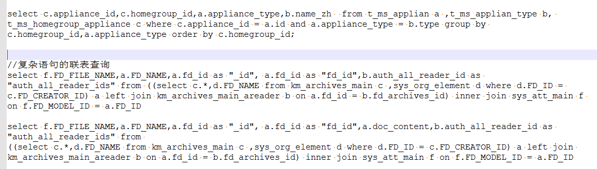
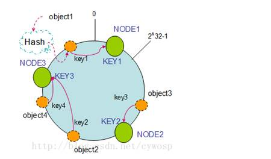

## 1、基本语句sql

- **连接数据库**

  ```shell
  mysql -uroot -h127.0.0.1 -p 
  service mysqld start #  启动mysql
  mysql 8小时重连机制 # 
  # 最大连接数和最大空闲连接数设置
  DB.SetMaxOpenConns(1)
  DB.SetMaxIdleConns(0)
  ```

- **db相关命令**

  ```mysql
  create database dbname; # 创建数据库
  show databases; # 查看数据库
  use dbname; 
  drop database dbname; # 删除数据库
  select database(); # 显示当前正在使用的数据库
  show tables; # 展示该db的所有表
  show tables like 't_vedio_index_%'; # 查看以t_vedio_index_开头的表
  ```

- **table相关命令**

  ```mysql
  desc tablename; # 查询表结构
  desc dbname.tablename;
  show create table tablename; # 查看建表语句
  show table status like 'tablename'; # 显示表的相关信息
  drop table tablename; # 删除表
  #  创建
  Create table tablename (    
  	`seqid` bigint unsigned NOT NULL AUTO_INCREMENT, 
  	`source_id` int(11) NOT NULL DEFAULT '0' COMMENT '主表ID',
  	`userid` varchar(64) NOT NULL, 
       PRIMARY KEY (`seqid`),
   	UNIQUE KEY `userid` (`userid`)
  	)ENGINE=InnoDB AUTO_INCREMENT=1 DEFAULT CHARSET=utf8 COLLATE=utf8_unicode_ci;
  
  INSERT INTO 表名 VALUES(值1,值2,....); # 因无字段名，则values值的顺序须与字段在表中顺序一致
  INSERT INTO 表名 (字段名1,字段名2,...) VALUES(值1,值2,...); # 值顺序、类型须与对应的字段相匹配
  
  
  alter table 表名 change 列名称 列新名称 新数据类型
  alter table tablename change token toke varchar(64); #  把token列名改为toke
  alter table tablename add name varchar(64) after token;	#  在toekn之后添加name列
  alter table tablename drop name; #  删除name列
  alter table image_info modify image_ver varchar(32) NOT NULL; #  修改字段image_ver类型
  alter table tablename ENGINE=InnoDB; #  引擎修改
  
  insert into table1 select *from table2;
  create table innodb_table like myisam_table;
  ```

- **表操作语句**

  ```mysql
  select *from pp_api_source where group_id>2; #  选所有字段，特定条件查询
  select source_name from pp_api_source limit 5; #  前5行
  select *from pp_api_source order by group_id desc limit 1,5; #  从第二行开始后数5行
  select id,(update_time-create_time) as `time` from pp_api_source; 
  select *from pp_api_source where create_time>(select MAX(create_time) from pp_api_source); #  获取最新时间以后的数据
  select count(*) from pp_api_source;
  select count(1) from pp_api_source;
  
  select *from pp_api_source where source_name like '%单%'; # 包含单的内容
  select *from pp_api_source where source_name like '%单'; # 以单结尾的内容
  select *from pp_api_source where source_name like '单%'; # 以单开头的内容
  select *from pp_api_source where source_name not like '%单%';//不包含单的内容
  SELECT * FROM TABLE WHERE col Like 'a%b';//检索以a开头以b结尾的内容
  select sum(field1) as sumvalue from table1; #  求和
  select avg(field1) as avgvalue from table1; #  平均
  select max(field1) as maxvalue from table1; #  最大，最下min
  
  delete from  tablename;// 清空表中全部数据
  delete from pp_api_source where id=8;
  update pp_api_source  set source_name='订单修改',status=0 where id=9; #  更新表中数据
  ```

- 联表查询join  [mysq联表查询](https://blog.csdn.net/qmhball/article/details/8000003)

  ```mysql
  左表：books  右表：articles
  #  LEFT JOIN查询：查询两表共有数据，以左表为基准显示左表全部数据，右表符合条件数据，不满足的显示NULL
  SELECT * FROM books a LEFT JOIN articles b ON a.title =b.title; 
  #  RIGHT JOIN查询： 查询两表共有数据，以右表为基准显示右表全部数据，左表符合条件数据，不满足的显示NULL
  SELECT  * FROM books a RIGHT JOING articles b ON a.title = b.title;
  #  INNER JOIN查询
  SELECT * FROM  books a INNER JOIN  articles b ON a.title =b.title; 
  #  内连接查询等价于SELECT  * FROM books a,articles b WHERE a.title = b.title;
  ```

  

---

## 2、mysqldump数据备份和还原

- **从数据库导出数据库文件**

  ```mysql
  mysqldump -u [数据库用户名] -p [要备份的数据库名称]>[备份文件的保存路径] # 导出指定数据库
  mysqldump -uroot -pdbpasswd  dbname >db.sql  # 导出数据库为dbname所有表结构及表数据（不加-d）
  mysqldump -u root -p --databases db1 db2 db3 > bak.sql
  
  # 将数据库mydb中mytable导出到mytable.sql文件中
  mysqldump -h localhost -u root -p mydb mytable>e:\MySQL\mytable.sql # 导出指定数据库中的表
  mysqldump -u用户名 -p 数据库名 表名 --where="筛选条件" > 导出文件路径  # 按条件导出表中的内容
  
  mysqldump -u [数据库用户名] -p -A>[备份文件的保存路径] # 导出所有数据库  
  mysqldump -u root -p --all-databases > all_bak.sql # 导出所有数据库 
  
  # 备注：若不用--databases，在后期进行数据还原操作时，若该数据库不存在，必须先创建该数据库；
  ```

-  **从外部文件导入数据库中**

  ```mysql
  mysql -u root -p < all_bak.sql  #  不需要指定库，因为是全部数据库
  mysql -u root -p mydb < mytable.sql #  这里就需要指定是mysql库了 
  
  #导入脚本建表
mysql -u用户名 -p密码 数据库名 < 数据库名.sql
  source /home/abc/abc.sql;  # use该db后，直接执行source
  ```
  

## 3、索引及存储引擎

- **key详解** (参考链接： [主键，外键，索引，唯一索引](https://blog.csdn.net/duck_arrow/article/details/8264686)    [key详解](https://blog.csdn.net/nanamasuda/article/details/52543177)）

  ```mysql
  # mysql Key值（PRI, UNI, MUL）的含义：PRI主键约束；UNI唯一约束；MUL可以重复
  primary key 约束作用，用来规范一个存储主键和唯一性；同时在此key上建立了一个主键索引，不允许有空值； 
  unique key 约束作用（constraint），规范数据的唯一性；同时在这个key上建立了一个唯一索引，允许有空值；
  foreign key一是约束作用（constraint），规范数据的引用完整性，但同时也在这个key上建立了一个index；
  全文索引：仅可用于 MyISAM 表，针对较大的数据，生成全文索引很耗时好空间。
  组合索引：遵循”最左前缀“原则。创建复合索引时应该将最常用（频率）作限制条件的列放在最左边，依次递减。
  
  PRIMARY KEY（主键索引）  ALTER TABLE `table_name` ADD PRIMARY KEY (`col`) 
  UNIQUE(唯一索引)     ALTER TABLE `table_name` ADD UNIQUE (`col`)
  INDEX(普通索引)     ALTER TABLE `table_name` ADD INDEX index_name (`col`) // 没有任何限制
  FULLTEXT(全文索引)      ALTER TABLE `table_name` ADD FULLTEXT (`col`)
  组合索引   ALTER TABLE `table_name` ADD INDEX index_name (`col1`, `col2`, `col3`) 
  
  KEY forum (status,type,displayorder)  # 是多列索引（键） 
  KEY tid (tid)                         # 是单列索引（键）
  NOT NULL	标识该属性不能为空
  AUTO_INCREMENT	标识该属性的值是自动增加，这是MySQL的SQL语句的特色
  DEFAULT	为该属性设置默认值
  `desc` 反引号：为区分保留字和普通个字符引入的符号;表名，字段名等用反引号;字符串用单引号
  ```

- **索引：** 是用来快速的寻找那些具有特定记录的值   ￥

  `优点：索引大大减少了服务器需要扫描的数据量；索引可以帮助服务器避免排序和临时表；索引可以将随机IO变为顺序`

  - B-Tree索引：不按最左列查找，无法使用索引;不能跳过索引中的列;若查询中有某个列的范围查询，则其右边所有列均无法用索引优化查找。索引顺序很关键，key(last_name,first_name,birthdate)。
  - HASH哈希索引:仅memory引擎支持hash索引。
  - R-Tree空间数据索引:myisam支持空间数据索引，可以用作地理数据存储。
  - 全文索引

- **常用存储引擎** （参考链接 [常用的三种数据库引擎](https://blog.csdn.net/t146lla128xx0x/article/details/78737290)     ）

  ```mysql
  MyISAM 引擎是一种非事务性的引擎，提供高速存储和检索，以及全文搜索能力，适合数据仓库等查询频繁的应用。
  InnoDB 用于事务处理应用程序，具有众多特性，包括ACID事务支持。(提供行级锁)
  Memory：将所有数据保存在RAM中，在需要快速查找引用和其他类似数据的环境下，可提供极快的访问。
  
  ACID（原子性Atomicity；一致性Consistency；隔离性Isolation；持久性Durability）
  MyIsam用表锁，InnoDB用行锁(InnoDB好一些)
  ```

  - **MyISAM特点**

    `不支持事务；表级锁定形式，数据存在更新时，锁定整个表；数据库在读写过程中相互阻塞，读取时不能写入，写入时不能读取；不支持外键约束，只支持全文索引;件`

    每个MyISAM在磁盘上存储成三个文件：.frm 文件存储表定义；.MYD(MYData) 数据文件； .MYI(MYIndex) 索引文件。

  -  **InnoDB（适用于：论坛、微博、银行等高并发的场所）**

    `支持事务，支持四个事务隔离级别；行级锁定，但是全表扫描仍然会是表级锁定；读写阻塞与事务隔离级别相关；具有非常高效的缓存特性，能缓存索引，也能缓存数据；表与主键以簇的方式存储，即存在外键约束；支持分区、表空间，类似Oracle数据库`

## 4、mysql高频题

### 4.1 sql注入及避免方式 

参考链接：[SQL注入攻击原理以及基本方法](https://blog.csdn.net/qq_34858648/article/details/52750038)

`SQL注入：通过把SQL命令插入到Web表单递交或输入域名或页面请求的查询字符串，最终达到欺骗服务器执行恶意的SQL命令`

**威胁**：绕过认证，获得非法权限；猜解后台数据库的全部信息；注入可以借助数据库的存储过程进行提权。

**典型手段**：判断应用程序是否存在注入漏洞；收集信息并判断数据库类型；根据注入参数类型，重构sql语句原貌；猜解表名和字段名；获取账户信息，攻击web或为下一步攻击做准备。 ￥

- **sql注入例子：**攻击者把SQL命令插入web表单的输入域或页面请求的字符串，欺骗服务器执行恶意的sql命令

  ```mysql
  
  
  ```

- **防止sql注入:** ：检查变量类型和格式；过滤特殊字符；绑定变量，使用预编译语句；数据库信息加密安全。

  ```sql
  永远不要信任用户输入，要对用户的输入进行校验，可以通过正则表达式，或限制长度，对单引号和双"-"进行转换等。
  永远不要使用动态拼装SQL，可以使用参数化的SQL或者直接使用存储过程进行数据查询存取。
  永远不要使用管理员权限的数据库连接，为每个应用使用单独的权限有限的数据库连接。
  不要把机密信息明文存放，请加密或者hash掉密码和敏感的信息。
  应用的异常信息应该给出尽可能少的提示，最好使用自定义的错误信息对原始错误信息进行包装，把异常信息存放在独立的表中。
  ```

### 4.2范式

**范式：**符合某一种级别的关系模式的集合，表示一个关系内部各属性之间的联系的合理化程度

```mysql
第一范式（1NF）：强调的是列的原子性，即列不能够再分成其他几列。
第二范式（2NF）：首先是1NF，另外包含两部分内容，一是表必须有一个主键；二是没有包含在主键中的列必须完全依赖于主键，而不能只依赖于主键的一部分。
第三范式（3NF）：首先是 2NF，另外非主键列必须直接依赖于主键，不能存在传递依赖
事务：ACID（原子性，稳定性，隔离性，持久性） #（a账户减去500，b账户增加500）
```

### 4.3mysql主从复制

`复制技术有以下一些特点： 数据分布 (Data distribution )； 负载平衡(load balancing)； 备份(Backups)；高可用性和容错行 High availability and failover `

**复制步骤：**

```mysq
(1)master将改变记录到二进制日志(binary log)中（这些记录叫做二进制日志事件，binary log events）；
(2)slave将master的binary log events拷贝到它的中继日志(relay log)；
(3)slave重做中继日志中的事件，将改变反映它自己的数据。
```


### 4.4**一致性hash算法（consistent hashing 是一种 hash 算法）**

[三分钟看懂一致性哈希算法](https://blog.csdn.net/gerryke/article/details/53939212)

`原因：传统取模方式进行hash，在增加节点时，迁移成本很高。因此需采用一致性hash方法。在移除和添加服务器时，它能够尽可能小的改变已存在key的映射关系`

`key2和key4之间增加一个node4节点，不增加node4节点时，key2顺时针应该放到node3中。增加节点之后，key2放置于node4中，key4放置于node3中。`



### 4.5聚簇索引和非聚簇索引

`聚簇索引的叶节点就是数据节点，而非聚簇索引的页节点仍然是索引检点，并保留一个链接指向对应数据块`

[聚簇索引与非聚簇索引（也叫二级索引）](https://www.jianshu.com/p/fa8192853184)

### 4.6mysql性能优化

[MYSQL性能优化的最佳20+条经验](https://coolshell.cn/articles/1846.html)

[达达 - 高性能服务端优化之路](http://www.infoq.com/cn/articles/imdada-high-performance-server-optimization)

- **分库分表**

  ```mysql
  # 分库分表原则
  垂直分表:大表拆小表，拆分是基于关系型数据库中的"列"（字段）进行的。
  垂直分库：按照业务模块来划分出不同的数据库，而不是像早期一样将所有的数据表都放到同一个数据库中。(DB库：user，order，product)
  
  水平分表：称为横向分表，将表中不同的数据行按照一定规律分布到不同的数据库表中（这些表保存在同一个数据库中），这样来降低单表数据量，优化查询性能。  //通过主键或者时间等字段进行Hash和取模后拆分
  水平分库分表：冷热数据分离(热数据:经常要访问的这个数据;	冷数据：过几天才会访问的
  ```

  

- **优化建议**

  ```mysql
  开启查询缓存；
  # 关键字EXPLAIN放到查询语句前面， 会出现一个表格，查询rows可以让我们找到潜在的性能问题
  explain关键字，分析查询语句或是表结构的性能瓶颈。explain select *from tenant_info limit 1;  
  只要一行数据，采用limit；
  尽量少用join，联表查询；
  避免select *，需要什么就取什么；
  为每个表设置主键id， 为 `seqid` bigint unsigned NOT NULL AUTO_INCREMENT
  尽可能的使用NOT NUL
  分库分表
  存储引擎myisam和innodb（事务处理或外键，超大数目的数据选innodb；全文索引myisam）
  某个字段经常用来搜索，为其建立索引index    //alter table `users` add index(`last_name`)
  ```

[MySQL B+Tree索引和Hash索引的区别](https://cloud.tencent.com/developer/article/1590565)