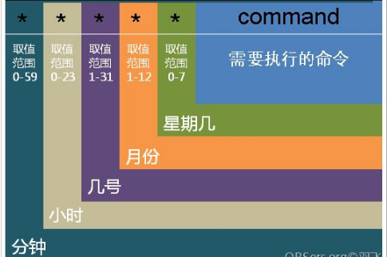
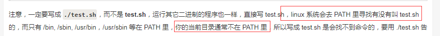

## 1、基本指令

### 1、常用命令

- **mount**  挂载硬盘或镜像；**umount** 解除挂载

  ```powershell
  mount -t 类型 -o 挂接方式 源路径 目标路径  # mount windows文件网络共享，推荐cifs；-t 指定文件系统的类型; -o 设备或档案的挂接方式
  mount /dev/vdb /app #挂载至app目录下
  mount -t cifs -o username=xxx password=xxx //windowsIP地址/共享名 /挂载目录  # windows共享文件夹挂载至linux
  
  mkdir project(/home/uxx/project or ~/project)
  //127.0.0.54/work  # 设置windows共享文件夹；cmd找到ip；选中文件，右击属性，设置该文件夹为共享模式
  sudo mount -t cifs -o username=xxx,dir_mode=0777,file_mode=0777,uid=1009,gid=0 //127.0.0.54/work /home/uxx/project   # 执行挂载
  ln -sf  /home/lxx/project/go/src godir # 创建软连接 
  # 备注：本地work目录挂载，需关闭widows防火墙;有线和无线不能混合挂载，一定要注意先卸载掉，才可以挂载
  
  umount  /mnt/floppy #卸载
  fuser -mv  /data/xxx/lxx/project  # 查看占用的进程，-m显示所有文件系统和块设备；-v 详细输出
  sudo umount project 解除挂载
  ```

  ```powershell
  # 跨服务器挂载  mount 127.0.0.28:/zr1  /data  在127.0.0.46机器上挂载127.0.0.28的/zr1
  步骤：文件服务器（被挂载机）：192.168.1.100；操作机（挂载到机）：192.168.1.200
  1)开启NFS开机运行，chkconfig --level 35 nfs on；手动启动服务 service nfs start；
  2)编辑/etc/exports文件：/tmp 192.168.1.100 (rw,sync,no_root_squash) #编辑需要共享的目录和允许访问的服务器及权限；
  3)在操作机（挂载到机）200新建目录，配置权限：mkdir tmp；chmod  777 –R /tmp；
  4)建立连接，在操作机（挂载到机）200操作:mount 192.168.1.100:/tmp /tmp；
  5)开机自动挂载，200机器操作：mount 192.168.1.100:/tmp /tmp添加至/etc/rc.local文件；
  ```

- **工作常用指令**

  ```powershell
  ls -al /proc/9466/exe # 由pid找出其对应程序的完整路径；ll /proc/25344  根据进程号查看文件位置
  ls -lSrh # 找到最大的文件，-r: 倒着排序 reverse；-S: 按照文件大小排序；-h: 以人类理解的范围显示
  cat 1.txt |grep -o "功能" |wc -l # 准确统计字符数目；-n显示行号
  tail -f log/xxxserver.log
  tail -n 10  testESadd.go  # 显示后10行(-f动态查看，有新内容追加到末尾)
  less/more  testESadd.go # 显示文本内容(每页显示后停下来)
  rm -rf *.go
  
  grep -rnw 'hello' 1.txt 
  cat search.log|grep HANDLE_LOG|awk -F ":" '{print $6}'  |awk -F "," '{print $1}'| sort -r -n 
  sed -n '/2019-12-27 15:06:11/,/2019-12-27 15:06:13/p' indexmanager.log     # 过滤某个时间段的日志(sed -n '/开始时间日期/,/结束时间日期/p' all.log)
  sed -i 's/root/world/g' yum.log  # 用world替换yum.log文件中的root（s==search查找并替换，g==global 全部替换。-i直接修改读取的文件内容，而不是输出到终端）
  sed "s/catalogue_index_0/catalogue_index_$i/g" cs_index_0_99.sql # 需要输出到终端
  
  nohup ./proxx &
  nohup ./bulk_inserter >/dev/null 2>&1 &
  netstat -ntlp
  netstat -ntlp  # 用与检查某个端口是否开放
  netstat -nat # 查看状态
  netstat -nat|grep -i "80"|wc -l # 统计80端口连接数
  netstat -na|grep ESTABLISHED|wc -l # 统计已连接上的，状态为“established
  
  ps -ef|grep hostmanger 
  tcpdump -iany -Xs0 port 8090 # 抓包命令(注意查看握手进程)
  
  
  
  ```

  

- **基础指令**

  ```powershell
   # ~ 家目录（/home/lxx）； # 超级用户提示符 ；$ 普通用户提示符 ； Linux用正斜线/，划分目录；反斜线\标识转义字符；window反斜线\表示目录
   
  ls --help 或 info ls 或 man ls #获取帮助
  logout 或 exit 或 ctrl+d  # 退出登录
  history #查询曾经操作的指令
  stat test22 #某文件的所有状态信息
  !26 #执行第26个操作的指令；!!执行下一个操作的指令
  ls # 列出文件；ls -l详细列表；ls|more分屏显示
  clear #清除屏幕显示操作
  echo $PATH # 输出PATH变量目录
  dir # 显示目录
  pwd # 显示当前目录
  cd # 切换目录；cd .当前目录；cd ..可进入上一层目录；cd -可进入上一个进入的目录；cd ~可进入用户的家目录
  rmdir test # 删除test目录； -f强制删除
  mkdir test1 test2 # 创建目录test1，test2
  
  #wc统计指定文件包含的行数、单词数和字符数 (-c统计字节数;-l统计行数;-w统计字数)
  wc -l  run.sh # 行数
  wc -c  run.sh # 字节数
  wc -w  run.sh # 单词数
  wc -m  run.sh # 字符数
  
  date;sleep 1m;date   # 显示目前时间后延迟1分钟，之后再次显示时间
  passwd # 修改linux服务器密码(输入新密码即可) 
  cat /etc/passwd|grep root
  cat /etc/shadow|grep root
  
  rm #删除文件或目录；-i 删除前逐一询问确认；-f 即使原档案属性设为唯读，亦直接删除，无需逐一确认；-r 将目录及以下之档案亦逐一删除
  rm -r dirname  # 删除目录（可删除多个目录）；-rf 强制删除目录或文件
  rm -f  *.go # 删除所有以.go为后缀的文件
  
  cp *.txt *.doc *.bak /home # 将当前目录中扩展名为txt、doc和bak的文件全部复制到/home目录中
  cp -r test test1  # 将目录test复制(已存在)，并命名为test1
  cp -r ./_site/*  /app/elasticsearch/plugins/paramedic # 将文件夹的全部内容复制到指定目录
  
  mv #移动文件或者将文件改名
  mv ye.txt  /home   # 将当前目录下的ye.txt文件移至/home目录下(具体)；
  mv a   b  # 将a改名为b
  
  find which whereis # 查找
  find / -name nginx # 搜索根目录所有名称为nginx的文件
  which ls # 查找可执行文件路径
  whereis ls # 查看运行文件所在路径
  
  # windows与unix文件格式互换：DOS下的文本文件以\r\n作为断行标志，十六进制表示0D 0A；Unix下的文本文件以\n作为断行标志，十六进制表示0A；syscall.Dup2是windows下的linux下不可编译
  dos2unix build.sh  # 在源文件基础上将此文件从dos格式转换为unix格式
  unix2dos build.sh  # unix转换为dos
  
  #sudo提升权限，比su安全，su与sudo区别：su用户之间切换，但前面的用户依然保持在登录状态；sudo为想使用root权限的普通用户设计；su在不加任何参数，默认为切换到root用户，但没有转到root用户家目录下。
  su user2  # 切换到user2登陆；
  sudo su root或 su # 切换到root用户；sudo su lxx切换到lxx目录
  
  ln # 创建软硬链接（link66类似于快捷方式）；ln -s 源文件 目标文件 
  ln -s /var/log/nginx/ logs #-s软连接类似于快捷方式，只会在选定的位置上生成文件镜像，不占磁盘空间；硬链接无参数-s，只会在选定的位置上生成和源文件大小相同的文件
  ln -sf log/run.log link66    # 创建link66软链接
  rm -rf link66 #解除软链接
  # 将日志写入/var/log/nginx/目录（日志需放到大盘，不要放到系统盘。创建logs软链接，指向 /var/log/nginx/目录）
  
  chmod # 改变权限属性，三个基本属性：r、w、x的数字类型代表：r:4、w:2 、x:1（user  group  others）
  chmod [-R] xyz 文件或目录
  chmod 754 str.c  # 等价于 chmod u=rwx,g=rx,o=r str.c
  chmod +x lx #将lx文件变为可执行的
  
  # 账户管理命令
  chown # 改变指定文件的用户或组的拥有者
  chown [-cfhvR] [--help] [--version] user[:group] file # user:新的档案拥有者的使用者id；group:新的档案拥有者的使用者群体(group)，-R : 对目前目录下的所有档案与子目录进行相同的拥有者变更(即以递回的方式逐个变更)
  chown -R elsearch:elsearch elasticsearch
  groupadd www # 创建www用户组
  useradd -g www www  # 新添加用户www,同时增加www用户到www用户组（-g组名或组id;-p密码）
  passwd testuser #  给已创建的用户testuser设置密码
  usermod --help  # 修改用户这个命令的相关参数
  userdel -r testuser  # 删除用户testuser
  
  #文件传输指令 scp（secure copy）：一个基于SSH安全协议的文件传输命令，只提供主机间的文件传输。
  scp remote_username@remote_ip:remote_file local_folder # 远程复制到本地               
  scp root@localhost:/root/test/1203.txt /home/lxx/ #本地机器执行，复制txt文件至/home/lxx
  scp local_file remote_username@remote_ip:remote_folder   #本地传至远程                   
  scp cs.lua  root@localhost:/root/test # 本地执行该指令传cs.lua文件至xx机器
  # sz/rz: 基于ZModem传输协议的命令。对传输的数据会进行核查，并且有很好的传输性能。
  sz filename1 filename2  # 下载数据到本地下载目录,下载文件的路径SCRT终端可以设置
  rz –be # 上传数据到远程，客户端会弹出上传窗口，用户自行选择(可多选)要上传的文件
  
  
  # 压缩相关指令：打包指将一大堆文件或目录变成一个总文件；压缩是将一个大的文件通过一些压缩算法变成小文件
  tar #-z通过gzip压缩文档；-v, --verbose详细地列出处理的文件过程；f, --file=ARCHIVE使用归档文件或 ARCHIVE 设备，后面只接文件名
  tar -zcvf test.tar.gz ./test/* # 压缩文件； -c创建一个新归档
  tar -zxvf test.tar.gz #解压文件 ；-x从归档中解出文件
  
  gzip    # 压缩  gzip 1.txt
  gzip -d 1.txt.gz 或者 gunzip 1.txt.gz #解压缩
  
  zip -r xxx.zip ./*     # 压缩文件；-r 递归处理，将指定目录下的所有文件和子目录一并处理
  unzip filename.zip   # 解压缩文件
  
  # 常用的关机/重启命令有 shutdown、halt、reboot、及init
  shutdown # 命令安全地将系统关机
  reboot  # 重启命令, 它是引发主机重启
  halt    # 关机命令,其实halt就是调用shutdown –h
  
  # 颜色含义
  # 浅蓝色：表示链接文件； 灰色：表示其他文件； 绿色：可执行文件； 红色：压缩文件；
  # 深蓝色：目录； 红色闪烁：表示链接的文件有问题了； 黄色：设备文件，包括block,char,fifo。
  # 用"dircolors -p"命令可以看到缺省的颜色设置，包括各种颜色和"粗体"，下划线，闪烁等的定义。
  # 隐藏文件 ；/  一个目录名； *  可执行文件； @  符号链接文件； |  管道文件 ；=  socket文件
  
  echo 10001|md5sum # 生成字符10001的MD5值； 
  md5sum  filename  # md5sum校验文件的一致性
  echo 10001|base64 # 生成字符10001的base64编码
  echo  "MTAwMDEK" | base64 –d # base64解码
  
  # 系统信息
  uname -a ; cat /proc/version; uname -r; cat /etc/redhat-release # 查看版本信息
  curl ifconfig.me # 查看外网ip
  cat /etc/group # 查看用户组 
  cat /etc/passwd | grep username # 查看某个具体用户
  # 查看系统日志:/var/log/messages   /var/log/secure   .bash_history(历史命令) /etc配置信息
  /etc/fstab    /etc/inittab  # 文件系统挂载信息   
  iptables -L –n  # 检查访问权限，查看防火墙设置
  itop # 查看网卡流量 iftop -i eth1
  # 配置yum源：yum源的指向文件存在于/etc/yum.repos.d/目录下
  
  #环境变量
  /etc/profile,export ES_HEAP_SIZE=2g,  source  /etc/profile # 全局环境变量（系统级）
  ~/.bashrc,export ES_HEAP_SIZE=2g , source ~/.bashrc #(/home/elsearch/.bashrc 具体elsearch用户的设置)
  export NGINX=/usr/local/nginx #配置环境变量
  export PATH=$MAVEN_HOME/bin:$PATH:/usr/local/bin:$NGINX/sbin
  # /etc/profile 设置系统环境参数，比如$PATH. 这里面的环境变量是对系统内所有用户生效的
  # /etc/bashrc 设置系统bash shell相关的东西对系统内所有用户生效。只要用户运行bash命令，则其就起作用
  # ~/.bash_profile （用来设置一些环境变量，是针对用户来设定的，在/home/user1/.bash_profile 中设定了环境变量，那么这个环境变量只针对 user1 这个用户生效）
  # 临时生效（仅对当前会话有效） export PATH=$PATH:/usr/local/apache/bin
  
  # nohup程序后台启动
  nohup ./bulk_inserter >/dev/null 2>&1 &    #( /dev/null 2>&1错误重定向到标准输出，然后再重定向 /dev/null，此处的顺序不能更改，否则达不到想要的效果，nohup会自动将输出写入nohup.out文件中)
  
  >  # 重定向到哪里（例如：echo "123" > /home/123.txt）
  # 0表示标准输入 ； 1表示stdout标准输出，系统默认值为1（”>/dev/null”等同于”1>/dev/null”）；2 表示stderr标准错误 ；& 表示等同于的意思,2>&1,表示2的输出重定向等同于1 ；/dev/null所有重定向到它的信息都会消失得无影无踪
  # 1>/dev/null 首先表示标准输出重定向到空设备文件，也就是不输出任何信息到终端；2>&1 标准错误输出重定向等同于标准输出，因之前标准输出已经重定向到了空设备文件，所以标准错误输出也重定向到空设备文件
  
  ./program  2>log # 标准输出还是在屏幕上，错误信息会输出到log文件中
  2>&1 # 将错误信息重定向到标准输出
  cat $filename >/dev/null  # 文件内容丢失，而不会输出到标准输出，禁止标准输出  
  2>/dev/null # 这样错误信息[标准错误]就被丢到太平洋去了，禁止标准错误   
  ls -al > list.txt # 输出到 list.txt 文件中（>输出重定向到一个文件或设备覆盖原来的文件）
  ls -al >> list.txt # 显示结果累加到 list.txt 文件中（>>输出重定向到一个文件或设备追加原来的文件）
  >! # 输出重定向到一个文件或设备 强制覆盖原来的文件
  < # 输入重定向到一个程序
  ```

  

- **ulimit ** 修改linux最大文件限制数

  ```powershell
  ulimit -a   # 显示当前所有的limit信息
  ulimit -n   # 可以打开最大文件描述符的数量，每个进程最多允许同时打开文件数
  
  # 文件描述符修改，退出登录exit或ctrl+D，重新登录即可生效
  vi /etc/security/limits.conf # 修改链接限制，支持更高数量的TCP并发连接的通讯处理程序，就必须修改Linux对当前用户的进程同时打开的文件数量的软限制(soft limit)和硬限制(hardlimit)
  * hard nofile 102400
  app soft nofile 102400 # *修改所有用户的限制，修改 app用户的限制。
  fs.file-max = 6553560  # 设置系统所有进程一共可以打开的文件数量
  
  vim /etc/security/limits.d/90-nproc.conf # 解除 Linux 系统的最大进程数
  *    soft    nproc     10240
  root  soft    nproc     unlimited
  ```

### 2、网络指令

```powershell
ifconfig # 查阅本机的网络卡卡号   （网卡信息：eno1第一块网卡； lo主机的回环地址）
UP(代表网卡开启状态) RUNNING(代表网卡的网线被接上);RX接收;TX发送
MULTICAS(支持组播)  MTU:1500(最大传输单元):1500字节;

netstat # 察看本机的网络联机与后门；用于显示与IP、TCP、UDP和ICMP协议相关的统计数据。命令用于显示各种网络相关信息， -n 拒绝显示别名，能显示数字的全部转化成数字。-t (tcp)仅显示tcp相关选项。-l 仅列出有在 Listen (监听) 的服務状态。-p 显示建立相关链接的程序名。-a display all sockets (default: connected)

netstat -ntlp  # 用与检查某个端口是否开放
netstat -an # 查看那些ip连接本机
netstat -nat # 查看状态
netstat -nat|grep -i "80"|wc -l # 统计80端口连接数
netstat -na|grep ESTABLISHED|wc -l # 统计已连接上的，状态为“established

ss(Socket Statistics) # 它能够显示更多更详细的有关TCP和连接状态的信息，而且比netstat更快速更高效。
ss -anp|grep redis-server # 显示socket状态
ss -anp|grep 9092|grep ar # 查看连接状态 获取socket的统计信息，显示和netstat相似的内容
ss -o state established|wc -l  # 统计服务器并发连接数。
ss -o state FIN-WAIT-1 dst xxx.xxx.xx.100/24 # 列举出处于 FIN-WAIT-1状态的源端口为80或者443，目标网络为xxx所有tcp套接字

ping ip   ping xx.xx.xx.xx  ping www.baidu.com  # ping工作在应用层，它直接使用网络层的ICMP协。ping无法检查系统端口是否开放，只是测试网络联接状况以及信息包发送和接收状况，判断与目标主机的连通性。ping [选项与参数] IP  （-c 次数；-s字节数；-i设定时间间隔多久发一次）
ping -c 2 -s 1000 -M do xx.xx.xx.xx # 若有响应，则可以接受该封包，若无响应，则MTU 太大了

# telnet[参数][主机]   检测主机和端口号是否是通的，远端登入
# 在10.xxx.xxx.250机器上启动端口为8090的server，telnet 10.xxx.xxx.250 8090可模拟客户端。telnet协议是TCP/IP协议族中的一员；
telnet IP Port #telnet可以检查某个端口是否开放

ftp ftp.ksu.edu.tw # 联机到昆山科大去看看
links http://www.kernel.org # 浏览 Linux kernel 网站

ssh root@127.0.0.113 # ssh远程登录服务器（在112机器上登录113）

ps(Process Status)# 列进程,ps提供了进程的一次性的查看，它所提供的查看结果并不动态连续的；如果想对进程时间监控，应该用 top 工具。列出系统中当前运行的进程(当前那些进程的快照，即执行ps命令的那个时刻的那些进程)
ps -ef|grep hostmanger # e 显示环境变量；f 显示程序间的关系；-au显示较详细的资讯
ps aux | grep -v `whoami` # 检查不是由你运行的程序
```

### 3、服务器性能指令

```powershell
# 查看cpu和内存
cat /proc/cpuinfo |grep -c "processor"  # 4核
free -g    # 8g        
fdisk -l    
cat /etc/redhat-release # 查看操作系统版本  CentOS Linux release 7.1.1503 (Core) 

# 查看空间：/dev/vda1系统磁盘，/dev/vdb挂载盘
#硬盘空间大小df:  df -m //以M为单位      
df -h # 以g为单位      df -hl
df -i   #查看inode使用情况 https://www.cnblogs.com/jiangxiaoxian/p/9610903.html
#fdisk 操作硬盘：fdisk –l查看设备
fdisk -l
#du（disk usage）命令的功能是用于显示文件目录或大小。能看到的文件只是一些当前存在的
du -sh 文件名  # 显示总目录的大小，但是不会列出目录中的每一个文件      du -sh *
du -sh test/*   # 列出test目录下的文件所占容量            
du -sh /usr/* |grep G  # 查找大文件
du -sh  # 只显示各档案大小的总合    
du -h # 各个文件的详细使用情况
lsof   lsof -p pid | wc -l # 列出当前系统打开文件的工具

# free -m （内存）  free -g    以g为单位
cat /proc/meminfo|more
grep MemTotal /proc/meminfo # 查看内存总量
grep MemFree /proc/meminfo # 查看空闲内存

# top（cpu和内存）  能够实时显示系统各个进程的资源占用状况，类似于Windows的任务管理器。top默认为总的cpu，会超过100%。在top基本视图中，按键盘数字1，可监控每个逻辑CPU的状况。P：按%CPU使用率排行   T：按MITE+排行  M：按%MEM排行   x 打开/关闭排序列的加亮效果   load average三值大小一般不能大于系统CPU的个数，若小于cpu数，则CPU有空闲时间片。  q 退出top命令；PR：进程的优先级别，越小越优先被执行；VIRT：进程占用的虚拟内存；RES：进程占用的物理内存；SHR：进程使用的共享内存；S：进程的状态。S表示休眠，R表示正在运行，Z表示僵死状态，N表示该进程优先值为负数。https://cloud.tencent.com/developer/article/1392882
top -p 574 #显示指定进程         
top -d # 5每5秒刷新一次
top -p 5212,26703  # 指定进程号监控
top -bn1 | less # 翻页查看，显示所有进程信息  
# htop进程监控加强版，强大的交互式进程管理器内存不足？swap used大0 ，基本判断遇到内存瓶颈，要么优化代码，要么加内存

iostat # 监测磁盘IO状态（查看块设备运行状态的工具）https://cloud.tencent.com/developer/article/1376507
iostat -x 2 5 # 每两秒显示一次，共显示5次
iostat -d -k 1 10 #参数 -d 表示，显示设备（磁盘）使用状态；-k某些使用block为单位的列强制使用kb为单位；1 10表示，数据显示每隔1秒刷新一次，共显示10次（%iowait值过高，表示硬盘存在I/O瓶颈；%idle值高，表示CPU较空闲；idle小于70%，I/O的压力就比较大了，说明读取进程中有较多的wait；%util接近100%,说明产生的I/O请求太多，I/O系统已经满负荷，该磁盘可能存在瓶颈

vmstat  # 重点监控cpu、内存等系统资源；
vmstat #显示虚拟内存状态 
vmstat 2 1   # 2表示每个两秒采集一次服务器状态，1表示只采集一次
vmstat 2      # vmstat每2秒采集数据，一直采集

sar # 全面分析系统的状态（yum install -y sysstat 安装此命令）https://cloud.tencent.com/developer/article/1037897
sar -n DEV 1 3   # 每间隔1秒统计一次，总计统计3次（DEV 磁盘设备的名称；-n主要是用来分析网络的）
sar -u # 监控系统cpu
sar -n TCP 1 3 #TCP连接的统计
sar -n #使用总结：-n DEV ： 网络接口统计信息；-n EDEV ： 网络接口错误；-n IP ： IP数据报统计信息。-n EIP ： IP错误统计信息；-n TCP ： TCP统计信息；-n ETCP ： TCP错误统计信息；-n SOCK ： 套接字使用。

route -n # 观察主机路由（-n 主机名以 IP 的方式显示）
route -nee # 不要使用通讯协议或主机名，直接使用 IP 或 port number；-ee ：使用更详细的信息来显示
traceroute# 追踪两部主机之间通过的各个节点(node) 通讯状况的好坏
traceroute -n tw.yahoo.com # 侦测本机到 yahoo 去的各节点联机状态
```

### 4、抓包tcpdump

[抓包二进制协议分析](https://blog.csdn.net/mergerly/article/details/47859255)

`tcpdump对网络上的数据包进行截获的包分析工具，可以将网络中传送的数据包的“头”完全截获下来提供分析。它支持针对网络层、协议、主机、网络或端口的过滤，并提供and、or、not等逻辑语句来帮助你去掉无用的信息。`

**用法和参数详解：**

```powershell
#指令用法 ，常见：host 主机；port 端口；src host 发包主机；dst host 收包主机。多个条件可以用and、or组合，取反可以使用
tcpdump -iany -Xs0 port 8090 # 
cpdump -iany -Xs0 host 10.xx.xx.xxx and port 33000  # 依据主机号和端口号进行抓包
tcpdump -iany -Xs0 src host 10.xx.xx.xxx and port 33000 # 只抓取该hostip发送的包

tcpdump -i eth0 -s 0 -vv -w /root/test.pcap port 23 and host 10.xx.xx.xxx # 抓取指定IP和端口的命令
tcpdump  -i eth1 tcp port 6881 -w test.pcap # 截取网络接口eth1，端口号6881的tcp数据包
tcpdump -i eth0 -s 0 -vv -w /root/test.pcap  # 抓取指定端口指令，保存至指定路径
tcpdump -i eth0 -nn 'icmp' # 在10.xx.xx.xxx机器上执行该抓包指令
tcpdump -i eth0 -nn 'host 10.xx.xx.xxx ' # 10.xx.xx.xxx主机接收包和发送包均被抓取 (单引号加不加都ok)
tcpdump -i eth0 -nnA 'port 80' # 用来监听主机的80端口收到和发送的所有数据包。
tcpdump -i eth0 -nnA '!port 22' # 如果需要排除某个端口或者主机，可以使用“!”符号，表示监听非22端口的数据包
tcpdump -r 20120606.pcap # -r选项进行读取

tcpdump --help # 来查看一下使用方法
-i  # 监视指定网络接口
-i any # 任意ANY网络接口
-s0 # 抓取数据包时默认抓取长度为68字节,加-s0可以抓到完整的数据包
-X # 输出包的头部数据，会以16进制和ASCII两种方式同时输出
-vv # 显示详细抓包信息
-w  /root/test.pcap  # 保存成pcap文件，方便用wireshark分析
-nn # 表示以ip和port的方式显示来源主机和目的主机，而不是用主机名和服务
-c 100 # 只抓取100个数据包
-n  # 可指定显示ip地址
-t # 不显示时间戳
-A # 以ascii的方式显示数据包，抓取web数据时很有用
```

**抓包分析**

```powershell
# 每个tcp包都带有win、ack，告诉对方还可以接收数据的滑动窗口是多少，如果A发到B的包的win为0，就是A告诉B我现在滑动窗口为0了，饱了，你不要再发给我了，就说明A端环境有压力（如带宽满了等）。A发给B的ack是告诉B，我已收到你发的数据包，收到ack号这里了，你下次要发seq为ack号的给我；
#seq表示这个包的序号，这个序号不是按1递增的，而是按tcp包内数据字节长度加上，如包内数据是21字节，而当前IP1发到IP2的包的seq是10的话，那下个IP1发到IP2的包的seq就是10+21=31。ack，应答序号；win len， 接收窗口；Sle： sack的左边界left edge；Sre： 右边界。

# wrieshark是Windows下非常简单易用的抓包工具。tcpdump + wireshark的完美组合实现：在 Linux 里抓包，然后在Windows 里分析包。
ip.src == 10.xx.xx.xxx
ip.dst == 10.xx.xx.xxx
tcp.srcport == 33000
tcp.dstport == 33000
tcp.window_size < 30336
tcp.flags==0x011

# web浏览器抓包： Fn+F12；切换到network界面即可
```


## 2、vi及文本三剑客grep、sed、awk

- **grep**    

  ```powershell
  # 参数详解
  -i # 不区分大小写
  -v # 显示不包含匹配文本的所有行
  -r # 在多级目录中对文本进行递归搜索
  -n # 显示匹配的行及行号
  -w # 被匹配的文本只能是单词，而不能是单词中的某一部分
  -P # 可以让grep使用perl的正则表达式语法
  -o # 匹配到部分
  
  #  用法：grep  '字符'  文件
  grep -rnw 'hello' 1.txt  
  grep -Po '"age":\d+' 2.txt|grep -Po '\d+'  # {"age":5,"name":"lily"}
  grep -i  "hello" *.doc  # 大小写hello均出现
  grep '48[34]' mydata.doc  # 在mydata.doc中匹配字符串“483”和“484”
  grep '^[^43]8[34]' mydata.doc /# 匹配除4或者3开头的行
  grep "a*z" mydata.doc  # 匹配首是a尾是z，中间为任意多个字符；
  grep "a..z" mydata.doc # 匹配中间为任意2个字符
  grep -n ^$ 1.txt # 过滤空行
  grep -n "^J" datafile  # 显示以J开头的行
  grep -n "700$" datafile # 显示所有以700结尾的行
  grep -vn '834' datafile # 显示不包括834的行
  grep -n '[A-Z][a-z]\{5\}:[0-9]' datafile  # 它包含1大写字母，后5个小写字母，1冒号和1数字
  grep -in 'lincoln' datafile # 显示包括Lincoln或lincoln的行，并且grep对大小写不敏感
  grep '[0-9]\{4\}-[0-9]\{7\}' 1.txt   # 电话号码0370-5471668
  grep '[0-9]\{11\}' 1.txt             # 电话号码17692691946
  grep -n '[0-9]\{6\}$' datafile # 显示工资六位数，在每行的尾部
  ```

- **awk：**根据内容分析并处理，用于文本处理的语言（取行，过滤），支持正则。对于grep的查找，sed的编辑，awk在对数据分析并生成报告时，显得尤为强大

  ```powershell
  # NR代表行数，$n取某一列，$NF最后一列；FS竖着切，列的分隔符 ；RS横着切，行的分隔符，参数-F是改变awk的默认分隔符
  
  # 用法：awk '条件{命令}' 文件 
  awk -F : '{print $2}' 2.txt|grep -Po '\d+'，-Po # 题目 {"age":5,"name":"lily"}
  awk 'NR==2' 1.txt # 打印第二行
  awk 'NR==1,NR==3' 1.txt # 打印第一行至第三行
  ls -l|awk '{print $1,$5,$(NF-1),$NF}' # 以空格为分隔符打印第1列，第5列，倒数第2列，最后一列
  awk -F ":" '{print $1,$NF}' 1.txt	# 以冒号为分隔符，打印第1列，最后一列。
  awk -F : '{print $1}' datafile |awk  '{print $2}'|awk '/^D/' #以冒号开头打印第一列；以空格分隔打印处理后的第2列；打印以D开头的姓
  awk '/^[CE]/'  datafile  # 显示所有以C或E开头的姓
  awk -F : '/238/' datafile    # 过滤含有238的文件行 
  awk '{print $0}' 1.txt # $0显示所有内容
  last -n 5 | awk  '{print $1}' # 显示最近登录的5个帐号。last -n 5 //前5行
  cat /etc/passwd |awk  -F ':'  '{print $1}'  # -F指定域分隔符为':'
  ifconfig|grep "inet"|awk '{print $2}' |head -1  # 打印第一行的第二列
  ifconfig |grep -o "[0-9][0-9]*\.[0-9][0-9]*\.[0-9][0-9]*\.[0-9][0-9]*"	# 只显示被模式匹配到的字符串
  cat search.log|grep HANDLE_LOG|awk -F ":" '{print $6}'  |awk -F "," '{print $1}'| sort -r -n 
  ```

- **sed：** sed自动编辑一个或多个文件（非交互式编译文件），简化文件的反复操作。

  ```powershell
  sed -n 3p exercise.go # 对第三行进行输出，p打印；
  sed -n 1,5p exercise.go # 显示1-3行的内容
  sed -n '1,3!p' exercise.go # 加感叹号就是除了1-3显示其他所有内容；
  sed -n '3,+3p' exercise.go # 显示第三行和之后的三行
  sed '$a@@@' 1.txt  # 尾部追加@@@ 
  sed '1i@@@' 1.txt # 头部追加@@@ ( 改完之后不保存，文件还是老样子)
  sed -n '/2019-12-27 15:06:11/,/2019-12-27 15:06:13/p' indexmanager.log     # 过滤某个时间段的日志(sed -n '/开始时间日期/,/结束时间日期/p' all.log)
  sed -i 's/root/world/g' yum.log  # 用world替换yum.log文件中的root（s==search查找并替换，g==global 全部替换。-i直接修改读取的文件内容，而不是输出到终端）
  sed "s/catalogue_index_0/catalogue_index_$i/g" xxx_filename.sql # 需要输出到终端
  sed 'a insert' 1.txt # 文件每行下面都插入insert
  sed '1,2a insert' 1.txt # 文件中1-2行的下边插入内容是insert
  sed '1,2i A\nB\nC' 1.txt  # 在第1-2行上面插入内容
  sed '1,2c A' 1.txt  # 文件中1-2行的内容替换为A，注意这里说的是将1-2行所有的内容只替换为一个A内容
  sed '1,3d' 1.txt
  sed 'y/hello/Helll/' 1.txt # 将文件中的hello字符替换为Helll
  sed '2r 2.txt' 1.txt # 将2.txt文件内容读取并插入到1.txt文件第2行的下边
  ```

- **文件查看操作**

  ```powershell
  more –s config_server.log # 逐页显示文档内容；  enter 向下n行，n默认为1；空格键，向下滚动一屏；:f 输出文件名和当前行的行号；Ctrl+b  返回上一屏； Ctrl+f /空格键   向下滚动一屏；v 调用vi编辑器；q 退出
  less  config_server.log  # 分页可控制查看文件内容  
  head  config_server.log  # 显示文件前10行   
  tail -n 10 a.log # 显示文件后10行      
  tail -n 10 a.log | head -n 5 # 显示后10行的前5行
  
  # cat：适合显示短小文件；’>’定向到输出文档
  cat -n log/push_server.log |grep "INFO"|more   # 得到关键日志的行号，并分页打印，空格翻页
  cat -n log/push_server.log |grep "INFO" >xxx.txt# 将其保存到文件中,到时可以拉下这个文件分析
  cat -n test.log |tail -n +92|head -n 20     # tail -n +92表示查询92行之后的日志;head -n 20 则表示在前面的查询结果里再查前20条记录
  cat > filename # 从键盘创建一个文件(可以在该文件中输入文字)，按ctrl+c终止
  cat file1name  file2name > filename # 将1,2文件写入filename文件，若其不为空，会覆盖掉原有内容
  cat -n textfile1 > textfile2 # 把 textfile1 的档案内容加上行号后输入，会覆盖掉textfile2 这个档案里
  ```

- **Vi技巧**

  ```powershell
  :q! # 无条件退出（等价于ZQ）   
  :wq # 存盘并退出（等价于ZZ）
  :1,3w 1.txt # 将 1 行到 3 行部分的内容保存到文件1.txt中
  
  :0 #移动到文件第一行
  gg #命令将光标移动到文档开头（非insert模式下）
  
  :$ # 移动到文件最后一行
  G # 命令将光标移动到文档末尾（非insert模式下）
  
  /text # 查找text, 按n查找下一个, N查找上一个
  ?text # 查找text(反向查找), 按n查找下一个, N查找上一个\相当于换行
  
  :%s  /SEARCH /REPLACE # 把文档中所有SEARCH替换成REPLACE；（:%s /hellodddd/world）
  :1,12s/search/搜索/g             # 将1行到12行中的字串search全部替换为字串搜索
  # 全局的配置文件位于/etc/vim/vimrc(或者/etc/vimrc)，自己独立的配置文件位于“~/.vimrc”，如果没有该文件，也可以直接用如下命令创建并编辑。
  
  set nu  # 显示行号
  set ruler  # 显示光标位置
  set undolevel # 显示光标位置
  set smartindent # 智能缩进
  syntax on(或syn on) # 语法高亮
  yy               # 表示拷贝光标所在行
  dd               # 表示删除光标所在行
  ^                # 移动光标到本行最开头的字符处
  $                # 移动光标到本行结尾处
  H                # 移动光标到屏幕的首行
  M                # 移动光标到屏幕的中间一行
  w(e)             # 移动光标到下一个单词
  b                # 移动光标到上一个单词
  
  
  
  
  
  ```

## 3、crontab定时任务

[crontab定时任务的设置](https://www.cnblogs.com/tankblog/p/6934987.html)

**cron是一个linux下 的定时执行工具，可以在无需人工干预的情况下运行作业**

- **crontab任务配置基本格式**

  `*  *  *  *  *  command`

  `分钟(0-59) 小时(0-23) 日期(1-31) 月份(1-12) 星期(0-6,0代表星期天)  命令`

  `第1列表示分钟1～59 每分钟用*或者 */1表示`

  `第2列表示小时1～23（0表示0点）`

  `第3列表示日期1～31`

  `第4列表示月份1～12`

  `第5列标识号星期0～6（0表示星期天）`

  `第6列要运行的命令`

  

- **用法**

  ```powershell
  # *所有可能的值 
  # ,逗号指定的列表范围1,2,5,7,8,9
  # -中杠表示整数范围  2-6表示2,3,4,5,6
  # /正斜线 */10，如果用在minute字段，表示每十分钟执行一次
  
  # 下面是每隔多少分钟，每隔多少小时，每天/每周/每月/每年的crontab的归纳总结
  每五分钟执行     */5 * * * *
  每五小时执行     0 */5 * * *
  每天执行         0 0 * * *
  每周执行         0 0 * * 0
  每月执行         0 0 1 * *
  每年执行         0 0 1 1 *
  
  每隔10天执行一次命令 0 0 */10 * * /etc/init.d/apache2 restart
  
  # crontab举例demo：(建立root用户的定时任务)
  1)crontab -e 按i进入编辑模式，0 0 */20 * * /app/ddtest/dellog.sh，保存。（每隔20天执行一次）
  2)查看刚刚输入的定时任务 crontab -l 或 cat /var/spool/cron/root
  
  
  # 查看cron服务是否起作用：cat /var/log/cron 
  /sbin/service crond start  # 启动服务  
  /sbin/service crond stop  # 关闭服务  
  /sbin/service crond restart # 重启服务  
  /sbin/service crond reload # 重新载入配置
  service crond status  # 查看服务状态 
  
  crontab -u # 设定某个用户的cron服务
  crontab -l # 列出某个用户cron服务的详细内容，查看用户下的定时任务
  crontab -r # 删除没个用户的cron服务
  crontab -e # 编辑某个用户的cron服务
  cat /etc/crontab # 查看全局配置情况，是针对系统任务的
  cat /var/spool/cron/用户名 # 一组是crontab命令生成的配置文件（/var/spool/cron下的文件），是针对某个用户的；/var/spool/cron的crontab文件不可以直接创建或者直接修改。该crontab文件是通过crontab命令创建的
  ps -ef|grep crond # 查看crond进程
  # /etc/cron.d/ 这个目录用来存放任何要执行的crontab文件或脚本
  
  # 定期删除文件举例： -n是判断一个变量是否是否有值
  # 查找n天前的文件： 访问时间atime，显示的是文件中的数据最后被访问的时间；修改时间mtime，显示的是文件的内容被改变时的最后时间，比如用vi编辑时就会改变；状态改动时间ctime，显示的是文件的权限，拥有者，所属的组，链接数发生改变时的时间
  find /app/m_search/query_server/log -mtime +543 -name "*.log*"  # 查找543天前的文件
  
  find 对应目录 -mtime +天数 -name "文件名" -exec rm -rf {} \;
  find /usr/local/backups -mtime +10 -name "*.*" -exec rm -rf {} \  #将/usr/local/backups目录下所有10天前带"."的文件删除；  -mtime：标准语句写法；＋10：查找10天前的文件，这里用数字代表天数；   "*.*"：希望查找的数据类型，"*.jpg"表示查找扩展名为jpg文件，"*"表示查找所有文件；-exec：固定写法
  rm -rf # 强制删除文件，包括目录
  {} \; # 固定写法，一对大括号+空格+\+;
  ```

## 4、shell脚本

Linux中默认的shell是`/bin/bash或/usr/bin/bash`，流行的shell有ash、bash、ksh、csh、zsh

101个shell脚本](https://blog.51cto.com/zero01/2046242)



- **基本语法**

  ```powershell
  # 单行注释，除了#!/bin/bash里的#特殊
  :<<!
  多行注释
  !
  
  str="I know your are \"$your_name\"! \n" # 单双引号区别：双引号里可以有变量，可以出现转义字符
  #!/bin/sh  指定脚本解释器，至于文件首行
  ./hello.sh  /bin/sh hello.sh  # 运行
  # 标准输入文件（stdin），通常对应终端的键盘；标准输出文件（stdout）和标准错误输出文件（stderr）；（0、1和2分别表示标准输入、标准输出和标准错误信息输出）； > 重定向输出符号 ； >>重定向输出符号，但有追加的功能
  ls -l /bin/*sh 
  readonly myUrl # 标识变量为只读变量 
  unset myUrl # 删除变量
  $ # 变量符，使其后的普通字符作为变量名，如$a表示变量a的值
  echo 'my $SHELL' # 单引号 被引起的字符全部做普通字符，即全部原样
  # 双引号：引号内的内容，除$、转义符\、倒引号`这三个保留特殊功能，其他字符均做普通字符
  * # 匹配任意字符
  ? # 匹配任意一个字符
  & # 后台进程符
  #
  
  ./hello.sh build test  # $0值 ./hello.sh，$1的值是build，$2的值是test
  $# # 是传给脚本的参数个数
  $@ # 是传给脚本的所有参数的列表
  $(dirname "$0") # 脚本放置的当前目录
  $* # 所有参数列表
  
  echo acceptor acceptor|tr ' ' '\n'  # 去除空格用换行符替换输出
  echo $your_name # 变量名前加美元符号 
  echo ${#greeting1} # 获取字符串长度 
  echo ${greeting:1:4} # 提取字符串长度 
  echo `expr index "$greeting" ho` # 查找字符h 或 o的位置(哪个字母先出现就计算哪个) 
  
  array_name=(1 2 3 4 7) # 数组
  echo ${array_name[2]}
  echo ${array_name[@]}
  echo ${#array_name[@]} # 长度
  echo ${#array_name[*]}
  echo ${#array_name[n]}
  
  echo acceptor acceptor|tr ' ' '\n'|awk '!a[acceptor]++'  # 去重
  echo acceptor acceptor|tr ' ' '\n'|sort -u
  echo acceptor acceptor|tr ' ' '\n'|uniq  # 先排序再去重
  echo acceptor excutor acceptor|tr ' ' '\n'|sort|uniq  # 所有重复的行，并计算行数
  
  # if语句用法
  if  condition
  then
      statement(s)
  fi
  
  #!/bin/bash
  cd /app/ddtest
  if test -e ./myfile
  then
      echo '文件已存在!'
  else
      echo '文件不存在!'
  fi
  ```
  
  **shell实践例子**
  
  ```shell
  # 坏的解释器:没有那个文件或目录。这是由于脚本文件在保存时使用了DOS文件格式造成的，可以用vim打开文件，然后执行下列操作   :set ff=unix ,  :wq 
  dos2unix build.sh 
```
  


