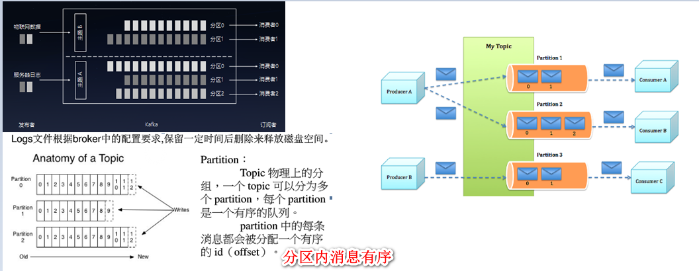

## 1、常用命令

[kafka常用命令](https://blog.csdn.net/zxy987872674/article/details/72493128)

```shell
# 启动指令
./kafka-server-start.sh -daemon ../config/.properties  
./kafka-server-start.sh -daemon ../config/server.properties

# 查看进程
Jps是JDK显示当前所有java进程pid的命令，适合在linux/unix平台上简单察看当前java JVM进程的一些简单情况。
jps -lm//列出皮带、主类全称和应用程序参数
jps -v//列出pid和JVM参数

# 测试相关命令
./kafka-topics.sh  查看有那些选项
./kafka-topics.sh --create --zookeeper 127.0.0.1:2181 --replication-factor 2 --partitions 4 --topic testtopicb  创建topic
# 查看topic
./kafka-topics.sh  --zookeeper 127.0.0.1:2181 --describe --topic testtopic  
./kafka-topics.sh --list --zookeeper 127.0.0.1:2181
# 增加topic分区
./kafka-topics.sh --zookeeper 127.0.0.1:2181  --alter --topic testtopica --partitions 5 
./kafka-topics.sh --zookeeper 127.0.0.1:2181 --topic testtopica –delete 删除topic

# 模拟pub生产和sub消费消息（--from-beginning，consumer从头开始pull消息）
./kafka-console-producer.sh  --broker-list 127.0.0.1:9092 --topic testtopic
./kafka-console-consumer.sh  --bootstrap-server 127.0.0.1:9092  --topic testtopic
./kafka-console-consumer.sh  --zookeeper 127.0.0.1:2181  --topic testtopic  --from-beginning

# 查看topic消费进度
./kafka-consumer-groups.sh --zookeeper 127.0.0.1:2181 --describe --group test1

# 查看topic某分偏移量最大（小）值（ time为-1时表示最大值，time为-2时表示最小值）
./kafka-run-class.sh kafka.tools.GetOffsetShell --topic test2  --time -1 --broker-list 127.0.0.1:9092 --partitions 8

# 备注：
replication-factor:每个partition的副本个数；一般情况下等于broker的个数；
没创建使用default.replication.factor配置的数量；
partitions： (分区数0-9)，不指定则会使用broker(server.properties)中的num.partitions配置的数量；
使用Kafka Connect来导入/导出数据
使用 Kafka Streams 来处理数据
若brokerid分别为1，2，3，Leader：3代表此时leader为brokerid 3。
```

## 2、kafka详解

[Apache Kafka 从 0.7 到 1.0：那些年我们踩过的坑](https://www.infoq.cn/article/MLMyoWNxqs*MzQX7lvzO)

[kafka中文文档](http://kafka.apachecn.org/)

- **kafaka的消费者pull和生产者push消费消息的模式**

  `生产者在写的时候，其实可以指定一个 key，比如说我们指定了某个订单 id 作为 key，那么这个订单相关的数据，一定会被分发到同一个 partition 中去，而且这个 partition 中的数据一定是有顺序的`

  ```shell
  同一topic的消息只能被同一个组内的一个consumer消费(eg:topic1,启动两个同组group1的consumer为c1和c2，此时该条消息只能被c1或c2中的一个消费)；
  批量发送100条消息每个consumer消费消息的条数是随机的，无法做到负载均衡；
  同一topic的消息，多个consumer group可同时消费这一消息。 kafaka本身是异步的，所以消息顺序发出，接收的时候顺序会有所改变；
  不指定group，直接按照topic消费，每个机器的consumer都可以同时消费该topic的消息；
  
  # 消息交付
  At most once——消息可能会丢失但绝不重传。
  At least once——消息可以重传但绝不丢失。
  Exactly once——这正是人们想要的, 每一条消息只被传递一次
  ```

- **概述**

  ```shell
  a)冗余备份的持久性日志服务，作用：降低组网复杂度和编程复杂度；
  b)基本架构：生产者发布消息到kafka的一个topic（主题有扮演KafkaServer的broker提供，消费者订阅该主题，从中获取消息）
  c)两大法宝：数据文件的分段；数据文件索引（索引包含两个部分均为4byte，offset偏移量和position）
  d)消息队列分类：
  点对点：消息被消费后，queue中不会有存储，已被消费的东西不可能被消费者消费；queue支持多个消费者，对于一个消息而言，只有一个消费者可以消费
  发布订阅（pub/sub）：将消息发布到topic，同时多个消息消费者订阅该消息，发布到topic的消息会被所有消费着消费。
  5)topic/log
  一个Topic一类消息，每个topic分成多partion，每个区在存储层面为append log文件。Offset偏移量，为message Id
  
  # 基本概念
  Topic：特指Kafka处理的消息源（feeds of messages）的不同分类。
  Partition：Topic物理上的分组，一个topic可以分为多个partition，每个partition是一个有序的队列。partition中的每条消息都会被分配一个有序的id（offset）。（默认情况下，Kafka根据传递消息的key来进行分区的分配，即hash(key) % numPartitions）
  Message：消息，是通信的基本单位，每个producer可以向一个topic（主题）发布一些消息。
  Producers：消息和数据生产者，向Kafka的一个topic发布消息的过程叫做producers。
  Consumers：消息和数据消费者，订阅topics并处理其发布的消息的过程叫做consumers。属于group，发送到topic中的消息只会被订阅此topic每个group的一个consumer消费；每个group的consumer消费互相独立。一个group的consumer只能消费不同的partion。接收消息pull。
  Broker：缓存代理，Kafa集群中的一台或多台服务器统称为broker。减少磁盘写入次数，buffer达到阀值，flush
  消息发送流程。中间缓存和分发的作用。
  Producer，consumer实现Kafka注册的接口。数据从producer发送至broker，承担一个中间缓存和分发的作用。
  
  Producer根据指定的partition方法（round-robin、hash等），将消息发布到指定topic的partition里面；kafka集群收到Producer的消息后，将其持久化到硬盘，并保留消息指定时长（可配置），而不关注消息是否被消费。
  Consumer从kafka集群pull数据，并控制获取消息的offset；
  由生产者将数据Push给代理，然后由使用者将数据代理那里Pull回来。
  每个日志文件的以它所包含的第一条消息的偏移量来命名。
  第一个创建出来的文件的名字将为00000000000.kafka，随后每个后加的文件的名字将是前一个文件的文件名大约再加S个字节所得的整数，其中，S是配置文件中指定的最大日志文件的大小。
  依分区的原子计数器（atomic counter），这个计数器可以同分区id以及节点id结合起来唯一的指定一条消息。
  Zookeeper主要用于在集群中不同节点之间进行通信。
  
  ```

  

- 

## 3、kafka性能优化

[kafka中处理超大消息的一些考虑](https://www.cnblogs.com/qiumingcheng/p/5631309.html)

[优化 Kafka ](https://www.infoq.cn/article/linkedIn-improving-kafka/)

```she
JVM参数配置：export KAFKA_HEAP_OPTS="-Xmx1G -Xms1G"
log.flush.interval.ms=1000  # 每间隔1秒钟时间，刷数据到磁盘
log.retention.hours=72 # 保留三天，也可以更短 
log.segment.bytes=1073741824 # 段文件配置1GB，有利于快速回收磁盘空间

export KAFKA_HEAP_OPTS="-Xmx1G -Xms1G"  设计初衷迅速处理短小消息，10k大小吞吐率好；默认配置为1M；

312M左右
修改server.properties的一些配置属性
num.io.threads主要进行磁盘io操作，高峰期可能有些io等待，因此配置需要大些。配置线程数量为cpu核数2倍，最大不超过3倍。
为了大幅度提高producer写入吞吐量，需要定期批量写文件。log.flush.interval.ms=1000
当kafka server的被写入海量消息后，会生成很多数据文件，且占用大量磁盘空间，如果不及时清理，可能磁盘空间不够用，kafka默认是保留7天。log.retention.hours=72（设置保留3天）。
配置一些相关配置文件的参数进行优化。

影响效率原因和避免方法：
磁盘性能:大量廉价、低转速的1+TBSATA硬盘:虽然这些硬盘的寻址性能很差，但他们在大规模读写方面的性能是可以接受的，而且价格是原来的三分之一、容量是原来的三倍。
网络IO:合理将消息分组，这使网络请求将多个消息打包成一组，而不是每次发送一条消息，从而使整组消息分担网络中往返的开销
字节拷贝:使用 producer ，broker 和 consumer 都共享的标准化的二进制消息格式，这样数据块不用修改就能在他们之间传递

producer 把数据 push 到 broker，然后 consumer 从 broker 中 pull 数据。
日志压缩为我提供了更精细的保留机制，所以我们至少保留每个key的最后一次更新。123 => bill@microsoft.com....123 => bill@gmail.com
kafka的topic被分割成了一组完全有序的patition，其中每个分区在任意给定时间只能被订阅了这个topic的consumer组合中的一个consumer消费。这意味着 partition 中 每一个 consumer 的位置仅仅是一个数字，即下一条要消费的消息的offset。
```

