## 1、**树**

- **树的基本定义**

  ```shell
  结点的度：结点拥有的子树的数目
  叶子结点：度为0的结点
  分支结点：度不为0的结点
  树的度：树中结点的最大的度
  层次：根结点的层次为1，其余结点的层次等于该结点的双亲结点的层次加1
  树的高度：树中结点的最大层次
  森林：0个或多个不相交的树组成。对森林加上一个根，森林即成为树；删去根，树即成为森林
  
  斜树：所有节点都只有左子树的二叉树叫左斜树；所有节点都只有右子树的二叉树叫右斜树。
  二叉树：二叉树是每个节点最多拥有两个子节点，左子树和右子树是有顺序的不能任意颠倒。
  满二叉树：高度为h，由2^h-1个节点构成的二叉树称为满二叉树。
  完全二叉树：如果一个二叉树与满二叉树前m个节点的结构相同，这样的二叉树被称为完全二叉树，不允许有空档
  线索二叉树：左孩子指向前驱节点;右孩子指向后继节点; 形成双向链表  lchild ltag data rtag rchild (ltag为0，指向其左孩子;ltag为1，指向其前驱)
  ```

  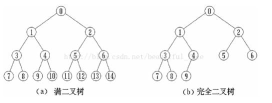

- **树的表示法**

  ```shell
  双亲表示法     data parent  (data数据域，parent指针域)
  孩子表示法     data child1 child2 .... childn
  孩子兄弟表示法  data firstchild rightsib
  ```

### 1.1 树的遍历

```she
前序遍历(根左右)  ABCDEF
中序遍历(左根右)  CBAEDF(左CB;根A;右EDF)
后续遍历(左右根)  CBEFDA 首先遍历左子树，然后遍历右子树，最后访问根结点
层序遍历(从上到下，从左到右)
```

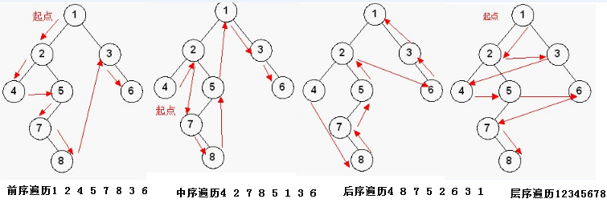


## 2、二叉树

[二叉树基础知识总结](https://blog.csdn.net/xiaoquantouer/article/details/65631708)

[你应该掌握的——树和二叉树](https://blog.csdn.net/yi_zz/article/details/7396987)

- **二叉树性质**

  ```shell
  第i层节点数:  至多 2^i-1
  k层节点总数:  至多 2^k-1
  n0=n2+1 (结点总数n:  n=n0+n1+n2(叶子节点数又名终端节点数,n0代表度为0的结点);分支总数=n-1=2*n2+n1)
  深度：  [log2n]+1  (i根节点 i左孩子 2i+1右孩子)
  ```

- **二叉树的存储结构**

  ```shell
  顺序存储: 放入到数组，下标和二叉树位置对应   (不存在的元素用^替换，弊端: 存储空间浪费)
  二叉链表: lchild data rchild
  ```

- **树、森林和二叉树转换**

  ```shell
  树——二叉树：加线(兄弟节点加一条)，去线(仅保留第一个孩子)，层次调整(第一个孩子是左孩子，兄弟转换过来为右孩子)
  森林——二叉树：每棵树转换为二叉树，然后再按照兄弟处理办法。
  ```

###  2.1 赫夫曼树

赫夫曼树：带权路径长度WPL最小的二叉树，又称最优二叉树。   abbcccddddeeeee   a1 b2 c3 d4 e5 
应用: 赫夫曼编码   [赫夫曼编码](https://www.cnblogs.com/wkfvawl/p/9783271.html)

### 2.2 二叉排序树

- **二叉排序树** (左结点<双亲; 右结点>双亲; 左右子树分别是二叉排序树)

  ```she
  二叉排序树 又叫二叉查找树、二叉搜索树。通过中序遍历会得到顺序数组。
  二叉排序树删除：
  a)仅有叶子结点
  b)仅有左子树或右子树  （子孙继承即可）
  c)既有左子树又有右子树    (若结点47被删除，从其左右子树中找到结点替换它)
  ```

- **平衡二叉树AVL**(前提是二叉排序树，左右子树高度差至多为1)  BF平衡因子 EH=0，LH=1，RH=-1

  ```shell
  左旋和右旋实现平衡（小于-1左旋，大于1右旋,BF=左-右）;二叉排序树的创建中实现平衡  ???
  平衡二叉树的构造，插入，删除  
  性质：它的左子树和右子树的深度之差(平衡因子)的绝对值不超过1，且它的左子树和右子树都是一颗平衡二叉树。
  平衡因子(bf)：结点的左子树的深度减去右子树的深度，那么显然-1<=bf<=1,这里我们定义:
  #define EH 0,#define LH 1,#define RH -1.依次为等高，左高，右高。
  左旋（右子为轴，使y成为孩子树的新根，y的左孩子β则成为x的右孩子。左旋中的“左”，意味着“被旋转的节点将变成一个左节点”）
  右旋（右旋中的“右”，意味着“被旋转的节点将变成一个右节点”）
  ```

  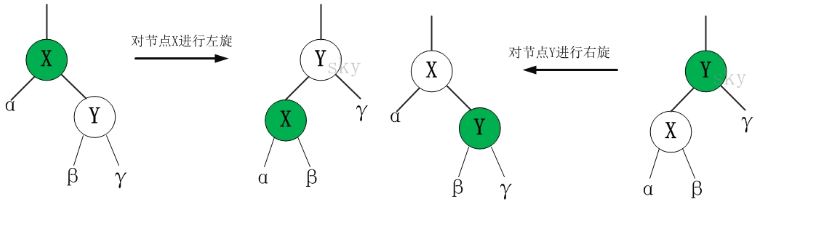

- **多路查找树(B树) ：**每个节点的孩子数可以多于两个，且没一个节点可以存储多个元素，元素之间存在某种特定的排序关系

  ```shell
  常见4种形式: 2-3树，2-3-4树，B树，B+树
  2-3树:每一个节点都具有两个孩子(2结点)或三个孩子(3结点)的多路查找树
  2-3-4树:
  B树: 平衡的多路查找树，节点最大的孩子是B树的阶(2-3树为3阶B树，2-3-4树为4阶B树，都是B树的特例)
  B+树: 遍历时每个元素只访问一次，B树变种。应文件系统需要所产生的
  B*树: 是B+树的变体，在B+树的非根和非叶子结点再增加指向兄弟的指针；
  ```

  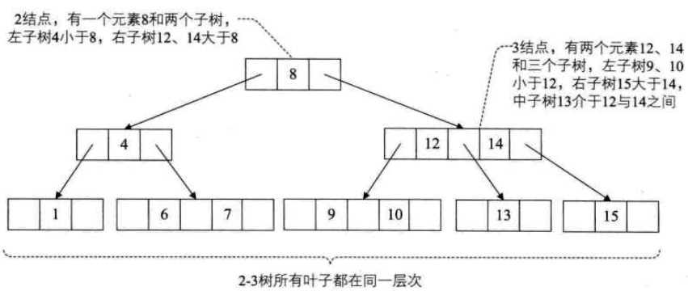

- **红黑树**

  ```shell
  红黑树是二叉搜索树的一种改进。红黑树的每个节点上的属性除了有一个key、3个指针：parent、lchild、rchild以外，还多了一个属性：color。它只能是两种颜色：红或黑。而红黑树除了具有二叉搜索树的所有性质之外，还具有以下4点性质：
  1. 根节点是黑色的。
  2. 空节点是黑色的（红黑树中，根节点的parent以及所有叶节点lchild、rchild都不指向NULL，而是指向一个定义好的空节点）。
  3. 红色节点的父、左子、右子节点都是黑色。
  4. 在任何一棵子树中，每一条从根节点向下走到空节点的路径上包含的黑色节点数量都相同。
  ```

  [30张图带你彻底理解红黑树](https://www.jianshu.com/p/e136ec79235c)

  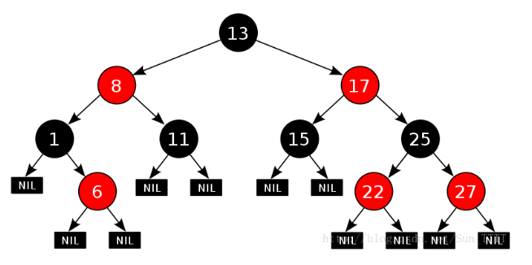

- **常见树的应用**

  ```shell
  AVL树:  最早的平衡二叉树之一。应用相对其他数据结构比较少。windows对进程地址空间的管理用到了AVL树。
  红黑树: 平衡二叉树，广泛用在C++的STL中。如map和set都是用红黑树实现的。
  B/B+树: 用在磁盘文件组织 数据索引和数据库索引。
  Trie树(字典树): 用在统计和排序大量字符串，如自动机。
  1.B树即为二叉搜索树或称二叉排序树（Binary Sort Tree），也有叫二叉查找树的。
  B/B+树: 用在磁盘文件组织 和数据库索引。
  ```

## 3、 排序

- **基本排序**

```shell
冒泡排序:两两比较相邻记录。
选择排序:从n-i+1个记录中选出最小的关键字和第i个元素进行交换。
插入排序:将记录插入到已排序的有序表中，从而得到一个记录数加1的新的有序表。
快速排序：（选择第一个元素作为基准值6，两个指针（下角标）i 和 j，首先哨兵j开始出动。因为此处设置的基准数是最左边的数，所以需要让哨兵j先出动。哨兵j一步一步地向左挪动（即j--），直到找到一个小于6的数停下来。接下来哨兵i再一步一步向右挪动（即i++），直到找到一个数大于6的数停下来。然后交换他们。停止的条件，哨兵i和j相遇，将该位置的数和基准数互换）。哨兵j的使命就是要找小于基准数的数，而哨兵i的使命就是要找大于基准数的数，直到i和j碰头为止
```

[快排的两种方式](https://blog.csdn.net/ricardo18/article/details/78867143)

[堆排序](https://www.jianshu.com/p/0d383d294a80)

[堆树（最大堆、最小堆）详解](https://blog.csdn.net/guoweimelon/article/details/50904346)

## 4、查找和散列表

[什么是HashMap](https://zhuanlan.zhihu.com/p/31610616)

[HashMap深度分析](https://www.jianshu.com/p/8b372f3a195d)

静态查找表:查找某个特定的元素是否存在以及其各种属性  (排序后，采用折半查找的方法，又名二分查找)
动态查找表:查找时插入数据元素; 查找时删除数据元素  (二叉排序树的方法)

- **有序表**

  顺序查找  ，折半查找（二分查找）

- **无序表**

  稠密索引:数据集中每个记录对应一个索引项；

  分块索引:类比图书馆藏书，块内无序，块间有序。（方法:先找块，再顺序查找关键码）

  倒排索引:最基本的搜索技术，基本项（次关键码和记录号）

- **散列表（hash表）**

  **哈希表**（Hash table，也叫散列表），是根据**关键码值**(Key value)而直接进行访问的数据结构。它通过把关键码值映射到表中一个位置来访问记录，以加快查找的速度。这个映射函数叫做散列函数，存放记录的数组叫做散列表或hash表。

  `散列技术是记录的存储位置和它的关键字之间建立一个确定的对应关系f；即为存储方法也是查找方法。不适用于：关键字男对应多个学生(一个关键字对应多个记录)；范围查找不适合`

  ```shell
  关键字key , f(key)散列函数 , 记录的存储位置=f(关键字)；关键字记录对应的存储位置叫散列地址。
  关键字key1！=key2，但f(key1)=f(key2),hash冲突。（要避免hash冲突，因为解决hash冲突会浪费大量时间）
  hash冲突解决方法：（设计较好的hash函数，“好”的标准是较低的冲突率和异于实现）
  
  hash函数构造：原则是设计简单；散列地址均匀。
  直接定址法：f(key)=a*key+b，线性函数。(事先知道关键字的分布，适合查找表较小且连续的情况)
  数字分析法：抽取数字的一部分作为散列存储位置（关键字位数比较大的情况，事先知道关键字的分布且均匀）
  平方取中法：1234其平方1522756，抽取中间三位227（不知道关键字分布，位数不是很大）
  折叠法：将关键字从左只有分割成位数相等的几部分，求和，并按照散列表长求后几位作为地址。例:987|654|312|0，987+654+321+0=1962，再求三位得地址962。（事先不知道关键字分布，适合关键字位数比较多的情况）  
  除留取余法：f(key)=key mod p（取余数，p<=m,m为散列表长度，最好取质数）
  随机数法：f(key)=random(key)
  ```

  **处理hash冲突方法：**

  ```shell
  开放定址法 ：又称线性探测法， 数组存储
  链地址法：所有关键字为同义词的记录在一个单链表中。如果哈希表空间为 0 ～ m - 1 ，设置一个由 m 个指针分量组成的一维数组 ST[ m ], 凡哈希地址为 i 的数据元素都插入到头指针为 ST[ i ] 的链表中
  再散列函数法：
  公共溢出法：冲突的放至溢出表中。查找时，先查找基本表，在查找溢出表。
  ```

  **优缺点:**

  ```shell
  优点：不论哈希表中有多少数据，查找、插入、删除（有时包括删除）只需要接近常量的时间即0(1）的时间级。实际上，这只需要几条机器指令。
  缺点：它是基于数组的，数组创建后难于扩展，某些哈希表被基本填满时，性能下降得非常严重，所以程序员必须要清楚表中将要存储多少数据（或者准备好定期地把数据转移到更大的哈希表中，这是个费时的过程）。
  ```


## 5、链表

 数组的特点是：寻址容易，插入和删除困难；链表的特点是：寻址困难，插入和删除容易。

**头指针和头结点区别：**

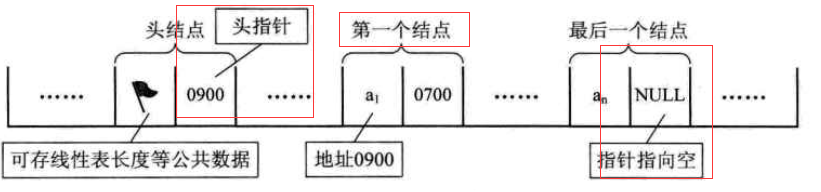

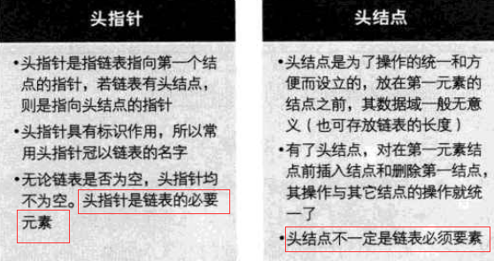

- **单链表**：链表中每一个元素都要保存一个指向下一个元素的指针

  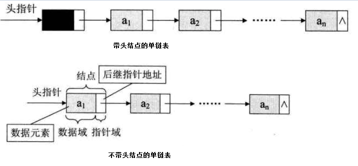

  ```c
  //单链表存储结构
  typedef struct Student{
  	int score;
  	struct Student *next;
  }LinkList;   //LinkList  *a;定义结构体类型变量了
  
  s->next=p->next; p->next=s //单链表的插入
  p->next=p->next->next;(q=p->next;p->next=q->next) //单链表的删除
  ```

  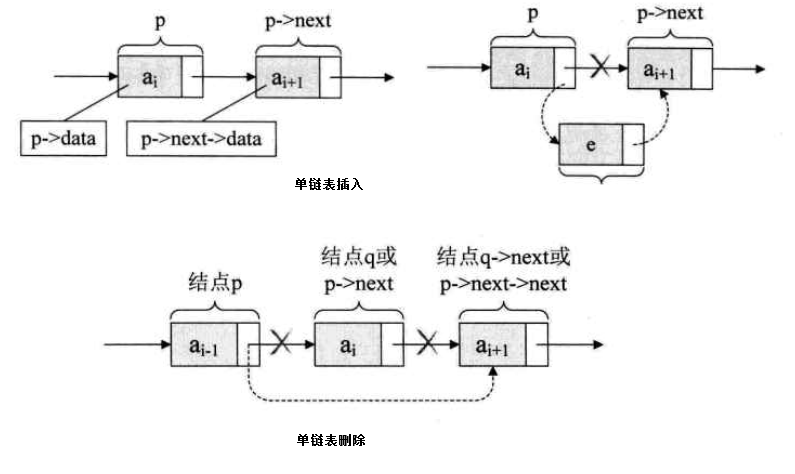

  **头插法（始终让新结点在第一的位置）和尾插法（每次新结点都插入到终端结点的后面）：**

  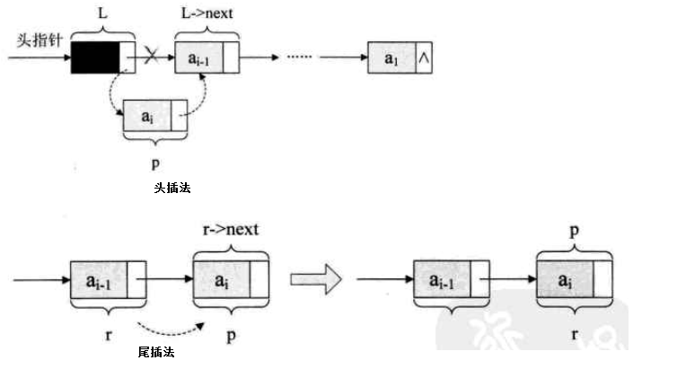

  

- **单链表和顺序存储结构的区别**

  ```shell
  存储分配方式：顺序存储结构用一段连续的存储单元依次存储线性表的数据元素；单链表采用链式存储结构，用一组任意的存储单元存放线性表的元素。
  时间性能：查找：顺序存储O(1)，单链表O(n)。插入和删除：顺序存储需要平均移动表长一半的元素O(n)；单链表在找出某位置的指针后，插入和删除仅需O(1)。
  空间性能：:顺序存储需要预分配存储空间，分大浪费，分小溢出；链式存储动态分配。
  若线性表频繁查找很少插入删除宜采用顺序存储结构；频繁插入删除宜采用单链表的链式存储结构。
  ```

- 循环链表：在最后一个元素中保存一个指向第一个元素的指针（循环链表一定要有头结点）。将单链表的终端结点指针由空指针改为指向头结点，这种头尾相接的单链表则成为单循环链表，简称循环链表。

  `单循环链表:`

  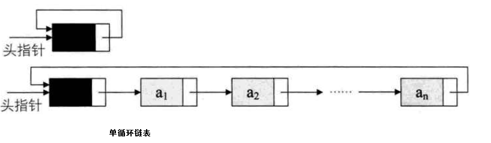

  `循环链表的合并：`

  ```c
  p=rearA->next //保存A的表头结点
  rearA->next=rearB->next->next
  rearB->next=p //将A的表头结点赋值给rearB->next
  free(p)
  ```

  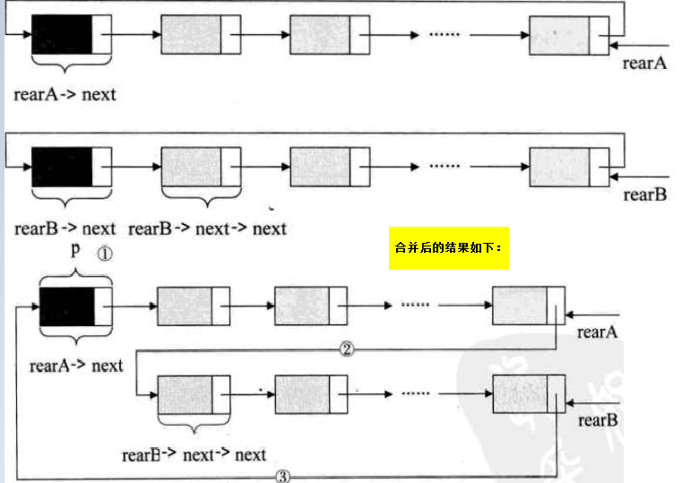

  

- **双向链表**:每个元素既要保存一个指向下一个元素的指针，还要保存一个指向上一个元素的指针

  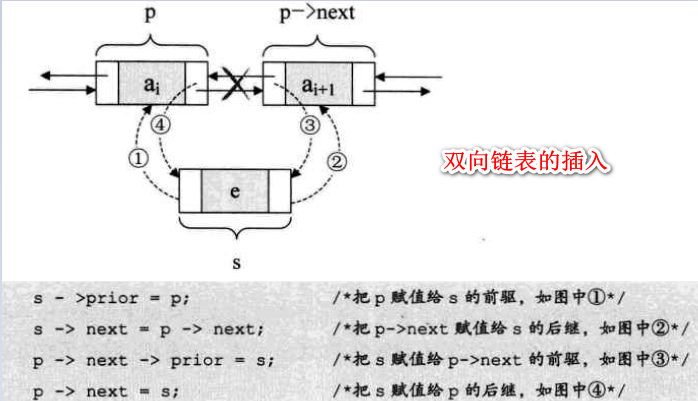

  

  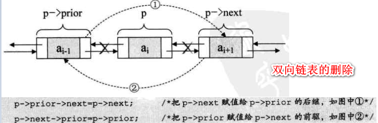

  

  **静态链表：**用数组描述的链表（元素由两个数据域组成，数据元素和下标）

- **线性表：**

  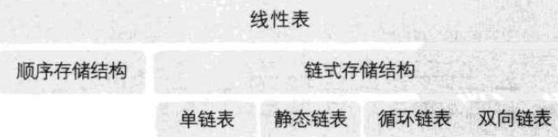

  

## 6、栈和队列

- **栈LIFO**（后进先出）:仅限定在表尾进行插入和删除的线性表（撤销操作，后退操作均采用栈实现）

  ```c
  允许插入和删除的一端成为栈顶，另一端成为栈底。
  栈的插入操作称进栈、压栈或入栈；push
  栈的删除操作称出栈或弹栈；pop
  
  //顺序栈结构
  typedef int SElemType;
  type struct 
  {
      SElemType data[MAXSIZE];
      int top;
  }SqStack;
  
  //链栈结构
  typedef struct StackNode
  {
      SElemType data;
      struct StackNode *next;
  }StackNode,*LinkStackPtr;
  
  typedef struct LinkStack
  {
      LinkStackPtr top;
      int count;
  }LinkStack;
  
  //备注：使用过程元素变化不可预料，采用链栈；元素变化在可控范围内，采用顺序栈
  
  //栈的应用：
  后缀(逆波兰)表示法定义:所有的符号都在运算数字后面出现。931-3*+10 2/+
  中缀表达式:所有的运算符均在数字之间。标准的四则混合运算就是中缀表达式。9+（3-1）x3+10/2。
  ```

- **队列（FIFO）**：只允许在一端进行插入操作，而在另一端进行删除操作的线性表。

  ```C
  允许插入的一端成队尾；允许删除的一端称队头；
  循环队列:头尾相接的顺序存储结构
  队列满:(rear+1)%QueueSize=front
  队列空:front=rear
  队列长度计算公式:(rear-front+QueueSize)%QueueSize
  ```

  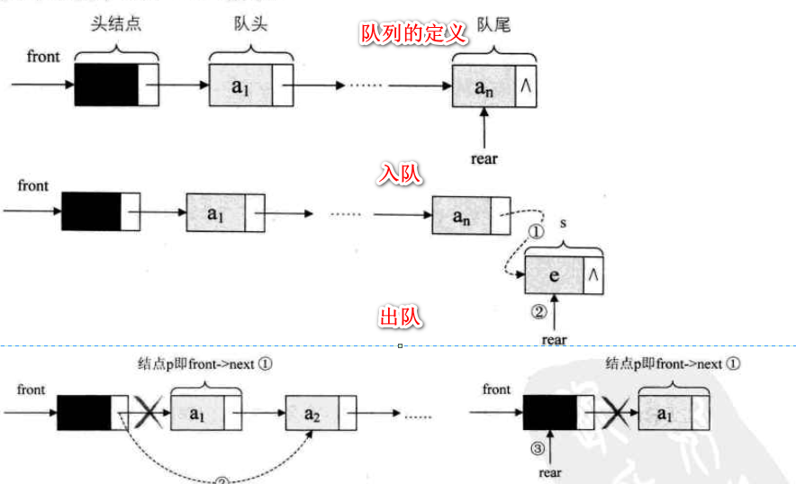

## 7、图

```shell
图：由顶点的有穷非空集合和顶点之间边的集合组成。带权的图称作网。
顶点：图中的数据元素（顶点集合V有穷非空）
有向图: 0<边数<n(n-1)  
无向图: 0<边数<n(n-1)/2  
无向边：(vi,vj)
有向边：<vi,vj>,vi弧尾,vj弧头。 
(V,{E})  顶点集合，边集合

# 图的存储结构
邻接矩阵： 顶点数组(一维)  边数组(二维)  v,e,w
邻接表: 避免不必要的空间浪费，数组和链表结合(入度和出度计算有弊端)
十字链表
邻接多重表
边集数组
```


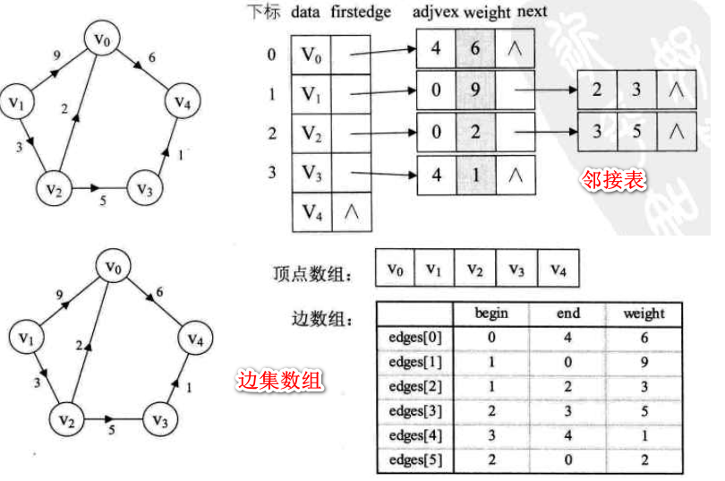

### 7.1 图的遍历

深度优先遍历 DFS ： 房间找东西，彻查完一个房间再找下一个房间
广度优先遍历 GFS ： 所有房间都简单找一遍，然后再大概率出现的房间细找

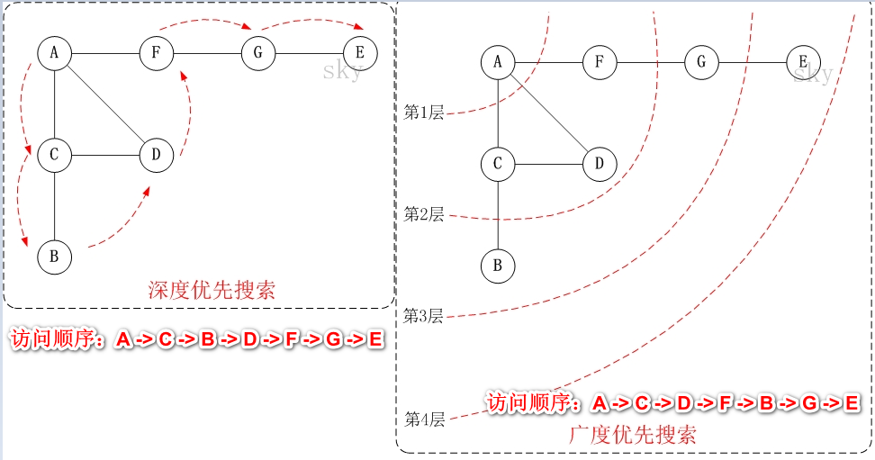

### 7.2 最短路径

迪杰斯特拉算法
弗洛伊德算法

### 7.3 最小生成树

 **最小生成树:**构造连通网最小代价生成树
普利姆算法prim 以顶点为起点找各个最小权值的边
克鲁斯卡尔算法 以边为目标创建

拓扑排序 (Vi必须在Vj之前，拓扑排序;不存在环回路的AOV网)
关键路径AOE网 (最大长度的路径关键路径)