## 1、GO语言

[GO知识图谱](https://www.processon.com/view/link/5a9ba4c8e4b0a9d22eb3bdf0#map)

[godoc文档](http://docscn.studygolang.com/pkg/)

https://godoc.org/

### 1.1 基本语法

- **概括**

  ```go
  代码规范（变量、文件目录、包等命名规范；级别：必须遵循)：
  全局变量：对外暴露的全局变量使用大驼峰，包内使用的全局变量使用小驼峰;   局部变量：小驼峰;
  文件、目录：unix风格，小写字母和下划线_拼接构成; a_file
  包：全部使用小写字母，不建议下划线；不同功能同一大类别package建议使用多级目录，进行子包隔离; 
  大驼峰：首字母大写，混合使用大小写字母来构成变量和函数的名字 ;MixedCap
  小驼峰：首字母小写，混合使用大小写字母来构成变量和函数的名字;mixCap
  除非必要，不建议使用JSON库中的omitempty标签
  文件名规范:
  xxx_xxx.go
  cmd_utils.go
  cmd.go
  orm_conds.go
  
  函数名规范:
  type queryM2M struct {
  	md  interface{}
  	mi  *modelInfo
  	...
  }
  func newQueryM2M() QueryM2Mer {
  	qm2m := new(queryM2M)
  	return qm2m
  }
  func (o *queryM2M) Add(mds ...interface{}) (int64, error) {
  	return 0,nil
  }
  
  变量名规范:
  只在本包用的变量： xxxXXX
  type dbBase struct {
  	xxx
  	xxx
  	xxx
  }
  
  type Configer interface {
  }
  
  
  包与包之间不可以循环导入
  快捷键：    Ctr+/注释    Ctr+R build and run
  大写开头包外可见，小写开头包内可见 ；变量或函数的首字母大写 的时候，在包外部可见， 或者说公有的 ；  公有函数的名字以大写字母开头；私有函数的名字以小写字母开头。  
  导入的包可以随意命名；
  标识符名的第一个字符为Unicode大写字母（Unicode类别“Lu”）；
  该标识符在包块中已声明或为字段名或方法名。
  <-libutil.ChanRunning防止main函数退出
  kafka初始化失败会自动重新连接，一般continue;不用return
  ```

- **go语法**

  ```go
  Go语言的工作空间为文件目录，目录中必须包含src、pkg、bin三个目录。bin存放编译后的可执行文件；pkg存放编译后的包文件；src存放项目源文件。一般，bin和pkg目录可以不创建，go命令会自动创建（如 go install），只需要创建src目录即可。
  GOROOT：go源码包目录；GOPATH：本人开发项目所在的目录；GOPATH下会有3个目录：src, bin, pkg。
  src目录：go编译时查找代码的地方
  bin目录：go get godep这种bin工具的时候，二进制文件下载的目的地
  pkg目录：编译生成的lib文件存储的地方。
  
  go build (切换到对应文件下，直接执行，生成的可执行程序即为文件夹名)
  go build filename.go (执行./filename，./代表当前目录)
  go run filename.go(编译并执行)
  
  Go 语言中 main() 和 init() 函数都不能有返回值
  一个工程中允许存在多个init函数，先执行init函数，再执行main函数。
  _ "net/http/pprof"  它会引入包，先调用包中init()，该方式仅让导入的包做初始化，而不使用包中其它函数。
  for _,v := range Slice{} // 表示丢弃索引值。
  _, err := func() // 单函数有多个返回值，用来获取某个特定的值，其他值不获取
  
  type Foo interface {
       Say()
  } //接口
  type Dog struct {
  }//结构体
  var _ Foo = Dog{} //判断Dog是否实现Foo这个interface,用作类型断言，若Dog没有实现Foo，则报编译错误
  
  变量声明 var v1 int = 10 //关键字var存在，类比C语言，变量名和类型互换；
  交换两数i, j = j, i； 常量声明：const pi float64 = 3.14
  预定义常量：iota一个可被编译器修改的常量
  make、new区别：make用于内建类型（map、slice和channel）的内存分配。make返回初始化后的（非零）值T。
  new用于各种类型的内存分配。new(T)分配了零值填充的T类型的内存空间，并且返回其地址，new返回指针*T。
  //创建一个初始元素个数为5的数组切片，元素初始值为0，并预留10个元素的存储空间  
  b := make([]int, 5, 10) //func make([]T, len, cap) len长度，cap可选的容量参数。[0 0 0 0 0]
  b = b[1:]      // len(b)=4, cap(b)=4
  var imgId interface{}
  imgId:="12345"
  imgId.(string) // 将imgId转换为string    字符串和int互转函数:Atoi  Itoa 
  string([]byte("123"))
  
  map 在使用之前必须用 make 而不是 new 来创建；值为 nil 的 map 是空的，并且不能赋值。
  map是无序的，每次打印都不一样，只能通过key获取。内置方法len返回map的key的数量。
  声明一个Arraymap；一个rmap；给rmap赋值；采用append函数追加至Arraymap（append循环内部）。
  
  匿名函数：没有实际名字的函数，都是Function对象。作用：在go语言中目前了解的作用就是用于构成闭包。
  go func{}()使用关键字go很容易实现并发编程，其花括号后面跟小括号，(小括号代表执行)；其属于匿名函数。
  func no_func() {
     //匿名函数1:有参数，返回值为int
     f := func(i, j int) (result int) {
        result = i + j
        return result
     }
     fmt.Fprintf(os.Stdout, "f = %v  f(1,3) = %v\n", f, f(1, 3))
     //匿名函数2
     func(i, j int) (m, n int) {
        return j, i
     }(1, 9) //创建匿名函数并执行
     //匿名函数3
     a := func(args int) int {
        fmt.Println("excute")
        return 5
     }(3) //先赋给变量a，然后再调用
     fmt.Println("func args a:", a)
     //匿名函数4
     var j int = 5
     acomplex := func() func() {
        var i = 10
        return func() {
           fmt.Printf("i=%d,j=%d\n", i, j)
        }
     }() //末尾括号表名函数被调用，并将返回的函数指针赋给变量acomplex
     fmt.Println(acomplex)
     acomplex()
     j = j * 2
     acomplex()
  }
  
  闭包	https://www.cnblogs.com/cxying93/p/6103375.html
  闭包主要涉及到js的几个其他的特性:作用域链,垃圾(内存)回收机制,函数嵌套,等等。闭包是由函数及其相关引用环境组合而成的实体(即：闭包=函数+引用环境)。闭包价值：但是如果有闭包的话，闭包会保存外部函数的活动对象（变量），所以如果不把对闭包的引用消除掉，闭包会一直存在内存中，垃圾收集器不会销毁闭包占用的内存。
  func A() func(int) int {
     sum := 0
     return func(x int) int {
        sum += x
        return sum
     }
  }
  
  func main() {
     a := A()
     b := a(4)
     fmt.Println(b)
  }
  
  defer和pannic、recover为go的异常处理，跟java中的try catch finially是类似的。
  （panic抛出异常，recover捕获异常，recover只能在defer语句中使用，直接调用recover无效）
  defer：简化资源回收（defer确实是在return之前调用的）;执行顺序后进先出；
  defer、return、返回值三者的执行逻辑应该是：return最先执行，return负责将结果写入返回值中；接着defer开始执行一些收尾工作；最后函数携带当前返回值退出。
  panic("触发异常")之后，程序退出，其后的defer语句是无法执行的。
  panic捕获异常；return之后修改函数返回值；安全的回收资源
  recover()函数可以用于获取/拦截panic。仅当在一个defer函数中被完成时，调用recover()将会完成这个小技巧。
  func main() {
     //defer_call()
     defer func() {
        fmt.Println("defer func  1")
        if err := recover(); err != nil {
           fmt.Println("defer func recover捕获异常", err) //err为panic传入的内容
        }
        fmt.Println("defer func 2")
     }()
  
     RevDef()
  }
  
  func RevDef() {
     for {
        fmt.Println("RevDef 1")
        panic("panic异常")        //生成panic文件，此时程序跳转到defer
        fmt.Println("RevDef 4") //不会运行
        time.Sleep(1 * time.Second)
     }
  }
  
  func defer_call() int {
     panic("触发异常")
     defer func() { fmt.Println("打印前") }()
     defer func() { fmt.Println("打印中") }()
     defer func() { fmt.Println("打印后") }()
     return 0
  }
  
  // 传值和传指针区别
  Go使用的*、&、new()这些运算符，和C++的用法完全一样。有传值和传引用/传地址的概念，和C++一样。
  Go没有new对应的delete操作，而是采用Java一样的垃圾自动回收机制。传引用或指针主要用于用户自定义类型。
  传值:实际传了值的copy，当在被调函数中修改参数值时，调用函数中相应实参不会变化，数值变化只作用在copy上。
  传指针：比较轻量级 (8bytes),只传内存地址。当传递大的结构体的时候，用指针是一个明智的选择。
  Go语言中string，slice，map这三种类型的实现机制类似指针，所以可以直接传递，而不用取地址后传递指针。（注：若函数需改变slice的长度，则仍需要取地址传递指针）
  func main() {
     i := 10
     pass_by_value(i)
     fmt.Println("pass_by_value:", i) //10
     pass_by_reference(&i)
     fmt.Println("pass_by_reference:", i) //100
  
     x := new(int)
     *x = 5
     fmt.Println("new *x:", *x) //5
     pass_by_reference(x)
     fmt.Println("pass_by_reference:", *x) //100
  }
  
  func pass_by_value(i int) {
     i = 100
  }
  func pass_by_reference(i *int) {
     *i = 100
  }
  
  // channel、select、signal用法
  channel即通道，可以执行数据的发送(Send)和接受(Receive)。在不同的goroutine之间通信或共享数据，有默认的deadlock检测机制。chan在使用make初始化时可附带一个可选参数来设置缓冲区。默认无缓冲，若是无缓冲区的chan，这样只有写入的元素直到被读取后才能继续写入，不然就一直阻塞。（有接受者才去放ch<-elem，没有接收者就会阻塞）
  设置缓冲区大小后，写入数据时可连续写入到缓冲区中，直到缓冲区被占满。从chan中接收一次便可从缓冲区中释放一次。可以理解为chan是可以设置吞吐量的处理池。
  chan可以与select相结合，chan会变成非阻塞的。
  c := make(chan int,3) //带缓冲
  c := make(chan int)  //无缓冲
  c <- 42//不带缓冲,不启携程会阻塞，42发送至到chanel c；
  v := <-c //从channel中读取数据，并将数据赋值给v
  
  // golang的多态必须借助于接口来实现。 参考链接：https://studygolang.com/articles/5054
  接口interface。效果上类似于C++多态的概念,在最终效果上，它实现了多态的影子。在Go语言中，一个类只需要实现了接口要求的所有函数，我们就说这个类实现了该接口。(非侵入式接口，除去繁杂的继承体系。golang不支持完整的面向对象思想，它没有继承，多态则完全依赖接口实现。golang只能模拟继承，其本质是组合，只不过golang语言为我们提供了一些语法糖使其看起来达到了继承的效果。)
  
  interface  go在语法上不支持类和继承，interface在效果上实现了类似于C++的“多态”概念
  
  goroutine并发
  并行:两个cpu上两个任务并列运行
  并发:一个cpu上多个任务交替运行
  Goroutine协程，并不是真正意义的线程，可理解为一种轻量级的线程（或微线程），用关键字go作为开头。它基本上是一种分配在同一个地址空间内的，能够并行执行的函数，可以在同一个地址空间中与其他goroutines并发运行。 它们在O.S.线程中进行多路复用，因此，如果一个块被阻塞，其他线程可以继续。所有的同步和内存管理都是通过Go进行的。它们不是真正的线程的原因是它们并不总是并行的。但是，由于多路复用和同步，您会得到并发行为。
  要启动一个新的goroutine，只需使用"go"这个关键字。（并行是关于性能的设计；并发是关于程序的设计）
  不等待goroutine的执行，main程序会立刻终止，任何正在执行的goroutine都会停止。
  go channel：在goroutines之间传递内存的通道。
  Channels与goroutine通讯的机制（通过 select（和其他东西）可以监听 channel 上输入的数据。
  
  // json Marshal Unmarshal参考代码即可
  // 打tag标签，标签冒号前是类型，后面是标签名。
  `json:"-"` // 表示不进行序列化
  `json:"product_id,omitempty"`//序列化加omitempty，忽略0值或者空值
  Number int `json:"number,string"`//结构体类型不一致时，可以指定结构体类型。支持string,number和boolean
  omitempty标签：就是说如果有一个属性是空的值，就不会出现在JSON结果中
  
  
  
  
  ```

使用 http 请求第三方接口时，如果丢弃 response，那么 response 的 body 系统不会帮你 close，所以会导致很多的 time_wait，然后内存会缓慢上升。
  ```

  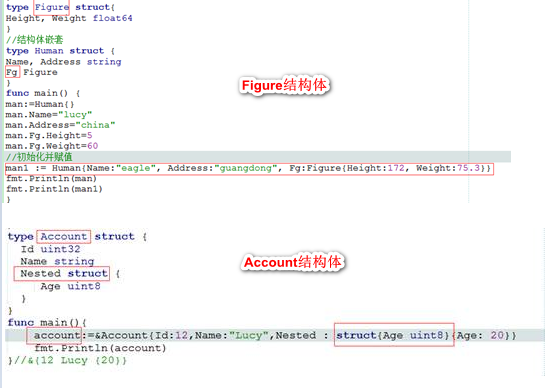

  
  
  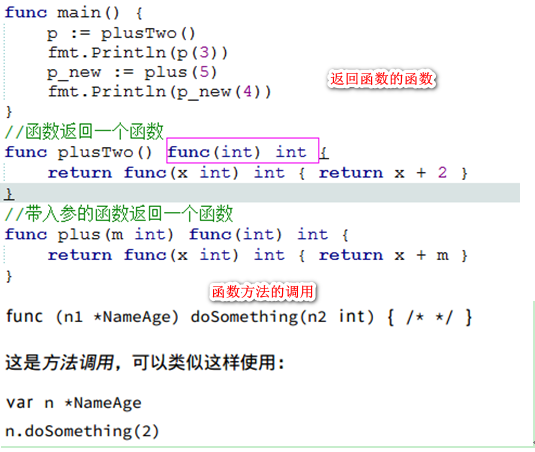


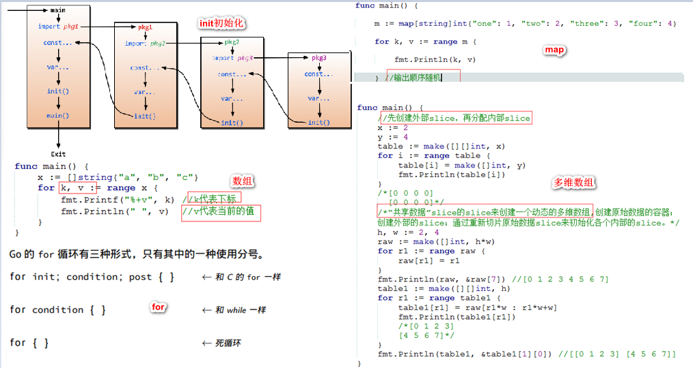


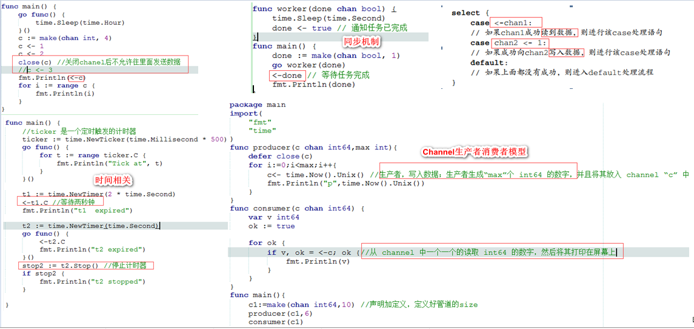


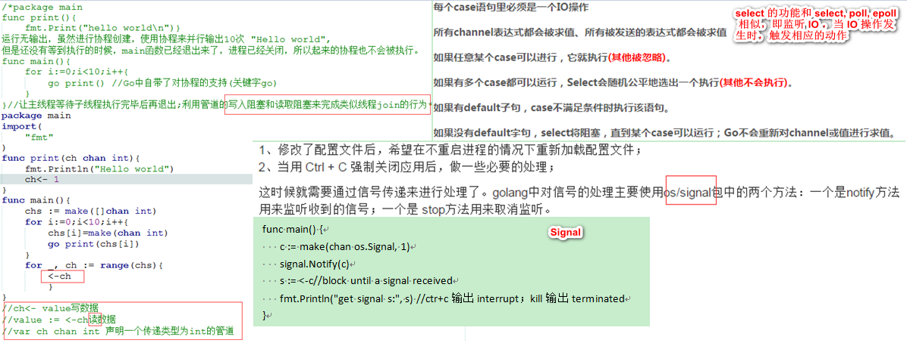


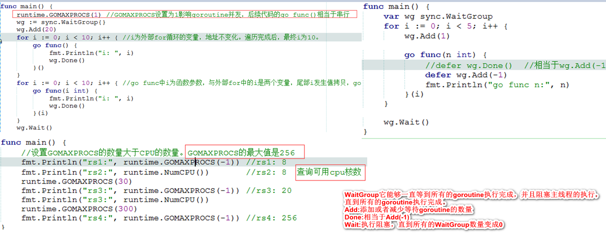

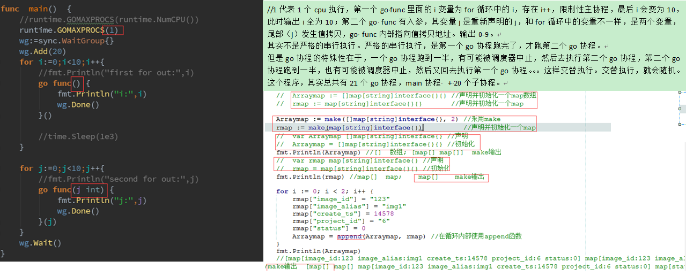

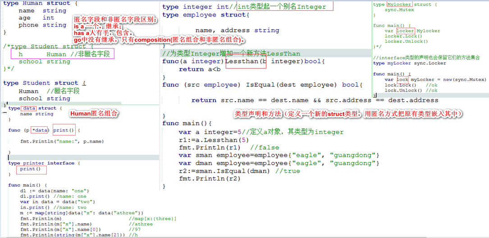


### 1.2 go常见坑

​```go
在代码中所有声明的变量都需要被用到，当然，全局变量除外。函数的参数也可以只被声明，不被使用。
import _ 包路径，只是引用该包，仅仅是为了调用init()函数。
隐式变量（作用域）：一个变量的作用范围仅仅是一个代码块。
除非特别指定,无法用nil给变量赋值。nil 可以用作 interface、function、pointer、map、slice 和 channel 的“空值”。
自增和自减：仅支持i++
map遍历(输出顺序随机)
以小写字母开头的结构体将不会被（json、xml、gob等）编码。
传值方法的接收者无法修改原有的值:声明为值，那么你的函数/方法得到的是接收者参数的拷贝。对接收者所做的修改将不会影响原有的值，除非接收者是一个map或者slice变量，而你更新了集合中的元素，或者你更新的域的接收者是指针。
json数据反解至结构体和map均可以
数组为值的属性很有用，但代价高昂；若你想要 C 那样的行为和效率，你可以传递一个指向该数组的指针。
每个文件都可以拥有多个 init 函数。
slice 和 map 的 nil 值：初始值为 nil 的 Slice 是可以进行“添加”操作的，但是对于 Map 的“添加”操作会导致运行时恐慌。(Map的添加一定要初始化)
golang的nil在概念上和其它语言的null、None、nil、NULL一样，都指代零值或空值。在golang中，nil只能赋值给指针、channel、func、interface、map或slice类型的变量。
修改原数组的数据，需要使用数组指针（array pointer）或使用 slice
string无法修改，可以采用byte slice
Rune 是 int32 的别名。用 UTF-8 进行编码。例如需要遍历字符串中的字符
判断字符串是否为utf8 utf8.ValidString(str1)
在多行的Slice、Array和Map语句中遗漏逗号
按位not
         var d uint8 = 2
         fmt.Printf("%08b\n", d)  //00000010
         fmt.Printf("%08b\n", ^d) //11111101,^取反操作符
 失败的类型断言
         var data interface{} = "great"
         fmt.Println(reflect.TypeOf(data)) //打印data类型
         res, ok := data.(int)             //判断data是否为int类型  res: 0 ok: false
 json中tag标签
json marshal后为字符串;json unmarshal反解到定义的结构体或mapping中
tag标签：
`json:"index_list,omitempty"` //若该字段为空，json marshal后不出现index_list这个字段
`json:"index_list"` //若该字段为空，json marshal后依旧出现出现index_list这个字段
获取MD5
appid是用来标记你的开发者账号的
appkey:两次md5(加上appid)
func MD5(b []byte) string {
         h := md5.New()
         h.Write(b)
         x := h.Sum(nil)
         y := make([]byte, 32)
         hex.Encode(y, x)
         return string(y)
}
  有一个struct值的map
         m := map[string]data{"x": {"one"}} // map[x:{one}]
         r := m["x"]
         r.name = "two"
         m["x"] = r
         fmt.Printf("%v\n", m) //prints: map[x:{two}]
 
         pm := map[string]*pdata{"x": {"one"}}
         fmt.Println("pm:", pm)
         pm["x"].name = "two"
         fmt.Println(pm["x"].name) //two
  ```


### 1.3 go tool命令

[go命令](https://wiki.jikexueyuan.com/project/go-command-tutorial/0.1.html)

```go
go工具目录:$GOROOT/pkg/tool/<平台相关目录>
go vet 代码静态检查发现可能的bug或者可疑的构造。（go vet exercise.go或go tool vet）
go build命令用于编译我们指定的源码文件或代码包以及它们的依赖包
go build(进入logging包，直接执行)
go build common/logging(在任意目录执行)
go build 用法( go build -h 或 go help build 查看)
go build -gcflags “-N -l” 关闭内联优化
go build -gcflags '-l' -o interface11 interface11.go
go build -ldflags //隐藏所有代码实现相关的信息
go tool objdump -s "operate\.Login" server //转换为汇编语言（解析可执行文件server，将其中的 operate 包的 Login 方法转成汇编代码。）

go install安装编译后的结果文件到指定目录
go fmt exercise.go 格式化文档

go get可以根据要求和实际情况从互联网上下载或更新指定的代码包及其依赖包，并对它们进行编译和安装。
go get github.com/astaxie/beego
go get -v -u -x github.com/astaxie/beego
go get -u github.com/astaxie/beego
git https 无法获取，请配置本地的 git，关闭 https 验证：git config --global http.sslVerify false

go clean命令会删除掉执行其它命令时产生的一些文件和目录
go clean -x -i m_search/bulk_inserter

go doc命令可以打印附于Go语言程序实体上的文档
go doc http.Request

godoc是一个很强大的工具，同样用于展示指定代码包的文档
godoc fmt Printf Println
godoc fmt
godoc -ex net/http FileServer

go run命令可以编译并运行命令源码文件
go run -n dd1.go 
go run dd1.go 

go list命令的作用是列出指定的代码包的信息
go list common/logging

go tool pprof命令来交互式的访问概要文件的内容
????

go tool cgo

go env命令可打印出的Go语言通用环境信息

go test
采用go test命令。编写even_test.go函数，来测试even.go中函数的正确性
```

### 1.4 其它(proto,thirft等)

#### 1.41  **Protobuffer（基于二进制，消息表示高效简洁）**

[gRPC之proto语法](https://www.jianshu.com/p/da7ed5914088)

[Golang + Protobuf 构造通讯协议](https://www.jianshu.com/p/669184a95c7c)

```shell
Protobuf好处：可以保证同一消息报文新旧版本之间的兼容性。作用：和XML差不多，即把某种数据结构的信息，以某种格式保存起来。主要用于数据存储、传输协议格式等。是一种轻便、高效的结构化数据存储格式，可以用于结构化和数据串行化，很适合做数据存储和rpc数据交换。ProtoBuf对小数据有效。

# Protocol buffer使用步骤
1)创建.proto文件，相当于确定数据协议，数据结构中存在那些数据，数据类型怎样
创建扩展名为. proto文件，如：MyMessage.proto，并将以下内容存入该文件中。通过Protocol Buffer编译工具，可以将每个.proto文件生成出一对.h和.cc的C++代码文件。最终文件组成：如：MyMessage.proto生成的文件为MyMessage.pb.h和MyMessage.pb.cc。
2)命令行编译工具解析：
protoc --proto_path=IMPORT_PATH --cpp_out=DST_DIR --java_out=DST_DIR --python_out=DST_DIR
path/to/file.proto
例子：protoc --go_out=. *.proto
protoc为Protocol Buffer提供的命令行编译工具；
--proto_path等同于-I选项，主要用于指定待编译的.proto消息定义文件所在的目录；
--cpp_out选项表示生成C++代码，--java_out表示生成Java代码，--python_out则表示生成Python代码，--go_out则表示生成go代码，其后的目录为生成后的代码所存放的目录；path/to/file.proto表示待编译的消息定义文件。
3). proto文件解析
message是消息定义的关键字；（数据协议以message形式表现出来）
required前缀表示该字段为必要字段；
repeated主要用于表示数组字段（可重复字段）；
optional可选字段，可删除，可以不初始化。
import消息定义文件可以通过import的方式将该文件中定义的消息包含进来;
import "myproject/CommonMessages.proto"
4)Packages
我们可以在.proto文件中定义包名，如： package ourproject.lyphone;该包名在生成对应的C++文件时，将被替换为名字空间名称，既namespace ourproject { namespace lyphone}

用法举例（参考route_server）
demo：https://www.cnblogs.com/jkko123/p/7161843.html，现在是3.多版本
创建test.proto文件（导入包即为package test，有分号）；
protoc --go_out=. test.proto，生成test.pb.go文件；
./protoc --go_out=. *.proto编译全部的proto文件（备注：一定要切换到proto文件所在目录下）
```

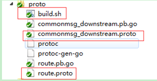

#### 1.4.2 **Thrift(一款高性能、开源的 RPC 框架）**

[Thrift学习笔记—IDL基本类型](http://my.oschina.net/helight/blog/195015)

[Golang RPC 之 Thrift](https://studygolang.com/articles/9607)

[Golang通过Thrift框架完美实现跨语言调用](http://www.open-open.com/lib/view/open1380527669353.html)

```shell
生产中用的最多的IDL是Google开源的protobuf。最常见的是Facebook开源的Thrift RPC框架。
用于描述通讯协议的方式很多，xml,json,protobuf，thrift；两种目前在大型系统中，应用比较普遍的两种通讯框架，thrift和Protobuf；采用RPC（Remote Procedure Call Protocol）编程，RPC被认为是在分布式环境中运行的客户机和服务器应用程序之间进行可靠通信的最强大、最高效的方法之一；属于跨语言通讯框架；
1) RPC（Remote Procedure call）远程过程调用 RPC是两个在不同物理机上的进程之间的通信。即是在一台机器上调用另一台机器的方法。RPC是一种C/S架构的服务模型，server端提供接口供client调用，client端向server端发送数据，server端接收client端的数据进行相关计算并将结果返回给client端。RPC工具大多使用"接口描述语言" (IDL:interface description language) 来提供跨平台跨语言的服务调用。 
2)Thrift通过一个中间语言(IDL接口定义语言)来定义RPC的接口和数据类型，然后通过一个编译器生成不同语言的代码（目前支持C++,Java, Python, PHP, Ruby, Erlang, Perl, Haskell, C#, Cocoa, Smalltalk和OCaml）, 并由生成的代码负责RPC协议层和传输层的实现。

# 利用Thrift用户只需要做三件事：
a)利用IDL定义数据结构及服务;
b)利用代码生成工具将(1)中的IDL编译成对应语言（如C++、JAVA），编译后得到基本的框架代码;
c)在(b)中框架代码基础上完成完整代码（纯C++代码、JAVA代码等）

# 举例说明
1)定义 Thrift RPC 接口，创建thriftport.thrift文件
2)编译
thrift -out . --gen go example.thrift，就会在 thrift_file 的同级目录下生成 golang 的包：example，其中 format_data-remote 是生成的测试代码可以不用特别关注
3)创建client目录，server 目录进行thrift测试
client目录下的 client.go 实现了客户端用于发送数据并打印接收到 server 端处理后的数据
server 目录下的 server.go 实现了服务端用于接收客户端发送的数据，并对数据进行大写处理后返回给客户端
thrift_file 用于存放 thrift 的 IDL 文件： *.thrift
先启动server,再启动client。
```

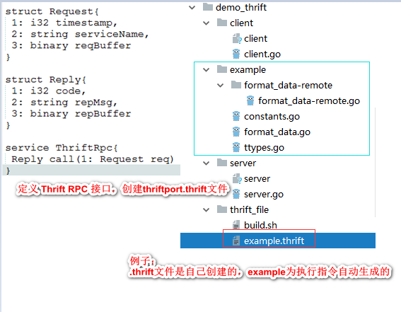


#### 1.4.3  **包管理工具go module**

[go module 基本使用](https://www.cnblogs.com/chnmig/p/11806609.html)

```go
go module可以将某个项目(文件夹)下的所有依赖整理成一个 go.mod 文件,里面写入了依赖的版本等。
on/off/auto
set GO111MODULE=on  windows
export GO111MODULE=on  linux/mac  暂时有效
go env -w GO111MODULE=on   永久生效

go mod init test(test为项目名)  # 项目根目录会出现一个go.mod文件，仅标识了go的版本号
go mod tidy   # 检测依赖 tidy会检测该文件夹目录下所有引入的依赖,写入 go.mod 文件
```

- go mod优势

```shell
Golang包管理工具 go mod
优势: 使用gomod管理，不用非得把go包放到GOPATH，可在磁盘的任何一个位置新建项目。

一 go mod开启
https://zhuanlan.zhihu.com/p/103534192
https://gocn.vip/topics/9820

开启go mod： export GO111MODULE=auto 或者 export GO111MODULE=on  #  cat ~/.bashrc 

二  go mod实践
参考链接:
https://www.jianshu.com/p/bbed916d16ea

在非GOPATH目录下创建wserver目录，操作步骤:
1 mkdir wserver
2 vi main.go
3 go mod init wserver   # go mod init 后面需要跟一个名字 ，此时成功创建了go.mod文件
4 写入main.go文件    
package main

import (
        "fmt"
        "gopkg.in/olivere/elastic.v3"
)

var EsCli *elastic.Client

func main() {

        _ = EsCli
        fmt.Println("hello world")
}

5 编译  go build main.go   # 项目目录下多出了一个文件 go.sum 。 go.sum 是记录所依赖的项目的版本的锁定。

# 扩展 在wserver目录下创建 route文件夹，并在route文件夹下写入函数。 其内的函数可以导入。go build 执行ok
# 想使用GOPATH模式的话，，只需要把这个项目移到GOPATH环境变量包含的任意一个目录下面的src目录里，就可以启用GOPATH模式了。


三 gomod疑问和坑
1) 有些包由于特定网络原因无法访问怎么办
go env -w GOPROXY=https://mirrors.aliyun.com/goproxy/,direct    或者
export GOPROXY=https://mirrors.aliyun.com/goproxy/

2) 依赖包指定版本
go list -m -versions rsc.io/sampler
go list -m -versions gopkg.in/olivere/elastic.v7  # 查看版本
go get rsc.io/sampler@v1.3.1  # 获取指定版本的包
```

备注：golang包管理工具参考链接：

https://zhuanlan.zhihu.com/p/33926171

https://studygolang.com/articles/10523

go包管理工具:比较常用的有godep, govendor, glide

### 1.5  go调度器和结构体、interface

- Goroutine调度器

  参考链接：

  https://www.zhihu.com/question/20862617

  http://johng.cn/goroutine1-pmg/

  ```shell
  # 堆heap和栈stack、GOMAXPROCS
  堆(Heap)：二叉树，是一种树状结构。
  栈stack和队列:线性结构。是限定只能在表的一端进行插入和删除操作的线性表。栈后进先出，队列先进先出。
  
  c/c++程序占用内存:
  栈区（stack）:由编译器自动分配释放，存放函数的参数值，局部变量的值等。其操作方式类似于数据结构中的栈。
  堆区（heap）:一般由程序员分配释放，若程序员不释放，程序结束时可能由OS回收。注意它与数据结构中的堆是两回事，分配方式倒是类似于链表。
  全局区（静态区）（static）:全局变量和静态变量的存储是放在一块的，初始化的全局变量和静态变量在一块区域，未初始化的全局变量和未初始化的静态变量在相邻的另一块区域。程序结束后由系统释放。
  文字常量区:常量字符串就是放在这里的。程序结束后由系统释放。
  ```

  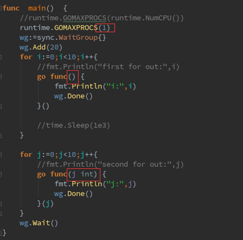

说明：1代表1个cpu执行，第一个go func里面的i变量为for循环中的i，存在i++，限制性主协程，最后i会变为10，此时输出i全为10；第二个go func有入参，其变量j是重新声明的j，和for循环中的变量不一样，是两个变量，尾部（j）发生值拷贝，go func内部指向值拷贝地址。输出0-9。其实不是严格的串行执行。严格的串行执行，是第一个go协程跑完了，才跑第二个go协程。但是go协程的特殊性在于，一个go协程跑到一半，有可能被调度器中止，然后去执行第二个go协程，第二个go协程跑到一半，也有可能被调度器中止，然后又回去执行第一个go协程。这样交替执行。交替执行，就会随机。这个程序，其实总共有21个go协程，main协程 + 20个子协程。

- interface

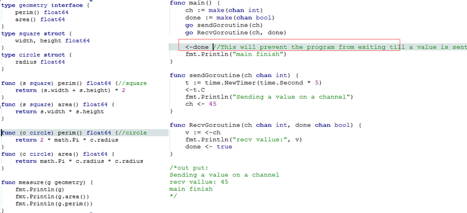

- 结构体和map

  

  ```go
  func main() {
     //映射初始化
     map1 := make(map[string]string, 5)
     map2 := make(map[string]string)
     map3 := map[string]string{}
     map4 := map[string]string{"a": "1", "b": "2", "c": "3"}
     fmt.Println(map1, map2, map3, map4)
  
     //映射填充
     map1["a"] = "1"
     map1["b"] = "2"
     map1["c"] = "3"
     for key, value := range map1 {
        fmt.Printf("%s->%-2s", key, value)
     }
     fmt.Println()
  
     //映射的查找、删除和修改
     val, exist := map4["b"]
     val2, exist2 := map4["d"]
     fmt.Printf("%v,%v\n", exist, val)
     fmt.Printf("%v,%+v\n", exist2, val2)
     map4["a"] = "8" //修改映射和添加映射没什么区别
     fmt.Printf("%v\n", map4)
     delete(map4, "b") //删除映射
     fmt.Printf("%v", map4)
  }
  
  ```

  结构体struct声明和初始化：公有函数的名字以大写字母开头；私有函数的名字以小写字母开头。访问一个包中的函数的语法是<package>.Function()，变量 <package>.Var。当变量或函数的首字母大写的时，函数会被从包中导出（在包外部可见，或者说公有的）；

  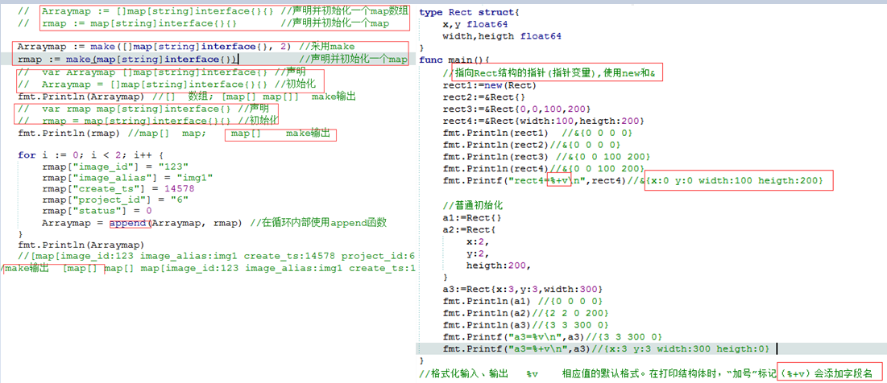

- 结构体的marshal和unmarshal

  ```go
  // 结构体的marshal和unmarshal
  marshal、unmarshal键/值对集合的文本描述，在Web 开发领域中，JSON被广泛应用于Web 服务端程序和客户端之间的数据通信（marshal数据目的是以json格式返回；unmarshal数据目的是获取其内部的值）
  1）编码Marshal：    func Marshal(v interface{}) ([]byte, error)
  该函数接收任意类型的数据v，返回值为[]byte的json数据和error。成功时，这个错误代码为nil。
  2）解码Unmarshal：  func Unmarshal(data [] byte, v interface{}) error
  该函数会把传入的 data 作为一个JSON来进行解析，解析后的数据存储在参数 v 中（但一定是一个类型的指针）
  3）自定义数据类型的编码和解码
  
  ```

  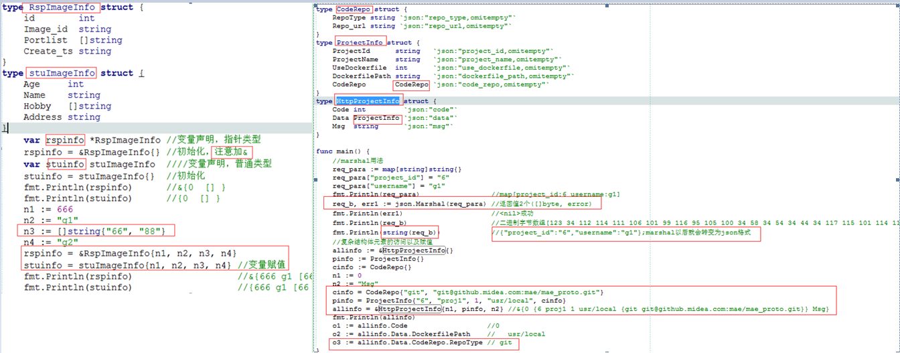

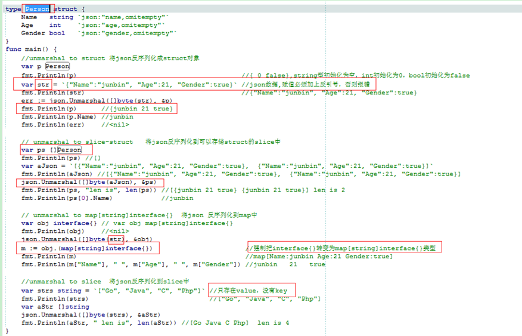


- 结构体marshal、unmarshal、数组、自定义结构体、func int()函数、map数据

  json marshal(map or struct转换为string)

  json unmarshal(json数据反解到map or struct)

  

  

### 1.6 go高频题目

Go Http包解析：为什么需要response.Body.Close()  https://segmentfault.com/a/1190000020086816
uuid是什么    https://www.jianshu.com/p/da6dae36c290 ; https://tech.meituan.com/2017/04/21/mt-leaf.html

[go50度灰](http://colobu.com/2015/09/07/gotchas-and-common-mistakes-in-go-golang/#%E5%BC%80%E5%A4%A7%E6%8B%AC%E5%8F%B7%E4%B8%8D%E8%83%BD%E6%94%BE%E5%9C%A8%E5%8D%95%E7%8B%AC%E7%9A%84%E4%B8%80%E8%A1%8C)

```go
1 golang基本数据类型
int，float，double，string，struct，map，slice，array，channel，complex，interface{}，bool，pointer，rune（用一个rune（int32）类型来表示unicode的字符），function，method（func (t T) funcname(param T1) {} ）
https://yushuangqi.com/blog/2017/golang-mian-shi-ti-da-an-yujie-xi.html
2 defer执行顺序（defer逆序执行，defer是在return之前执行的，LIFO，类似于栈stack）
3 return value 不是原子操作。在编译器中分解为两部分：返回值赋值 和 return 
func main()  {
   fmt.Println(doublescore(0)) //0
   fmt.Println(doublescore(20.0))//40
   fmt.Println(doublescore(50.0))//50
}

func doublescore(source float32)(score float32)  {
   defer func() {
      if score<1||score>=100{
         score=source //将影响返回值
      }
   }()
   score=source*2
   return  //其返回的就是score
}

4 GOMAXPROCS函数
golang中只允许使用i++

5 Go中没有继承！ 没有继承！没有继承！是叫组合！组合！组合！
type People Struct{}
type Teacher Struct{
    People
}

6 互斥锁和读写锁（Go1.9新版本中将提供并发安全的map）
之前版本的map属于并发不安全的map
sync.Mutex互斥锁。
sync.RWMutex读写锁，基于互斥锁的实现，可以加多个读锁或者一个写锁。
channel（chan可以与select相结合，chan会变成非阻塞的）
c := make(chan int,3) //带缓冲
c := make(chan int)  //无缓冲
c <- 42//不带缓冲,不启携程会阻塞，42发送至chanel c；v := <-c //从channel中读数据，并将数据赋给v
read_only := make (<-chan int)//定义只读的channel
write_only := make (chan<- int)//定义只写的channel
read_write := make (chan int)//可同时读写

7 50度灰
未使用的变量或者包通过加下划线的方式解决
go tool vet -shadow exercise.go  //可将相同变量多处声明位置显示出来
nil标志符用于表示interface、函数、maps、slices和channels的“零值”。
m := make(map[string]int,99)
cap(m) //error，不可以用cap计算map的容量
数组array和切片slice区别
Go中的数组是数值，因此当你向函数中传递数组时，函数会得到原始数组数据的一份复制。

string类型无法直接修改，转化为[]byte类型进行修改
x := "text"
xbytes := []byte(x)
xbytes[0] = 'T'
fmt.Println(string(xbytes)) //prints Text

panic和recover
recover()的调用仅当它在defer函数中被直接调用时才有效

变量位置分配
go中变量的位置由编译器决定。编译器根据变量的大小和“泄露分析”的结果来决定其位置。
在C++中，使用new创建的变量总是在堆上。
go run -gcflags -m app.go   //查看变量的分配位置
make和new区别？
make(T) 返回的初始化的 T，只能用于 slice，map，channel。make(T, args) 返回的是 T 的 引用。即 map，slice，channel 通过函数传参之后在函数内部修改将影响函数外部的值。
new只分配内存，返回 T 的指针 *T 并指向 T 的零值。

golang和C++相比，其优势？
go优势：简单易用、高性能、原生持并发、部署运维方便
1）golang自动的垃圾回收机制，无需delete和free来释放内存；c++和c允许程序员自己管理内存，包括内存的申请和释放，因为没有GC垃圾回收机制，所以c/c++运行速度很快
2）支持函数多返回值；c++中不支持多个函数返回值的，一般是通过将返回值定义成一个结构体或者通过函数的参数的引用的形式返回。
3）错误处理，defer、panic和recover捕获异常。c++为try，throw，catch
直接用panic，不用recover，程序会在panic处退出，并打印出调用栈的地方；
利用defer延迟处理的recover进行恢复 ，运行panic出现故障，程序会退出。此时跳转到包含recover的defer执行，recover捕获panic后，此时panic不会继续传递，而是在recover这个点继续执行以后的动作。


```

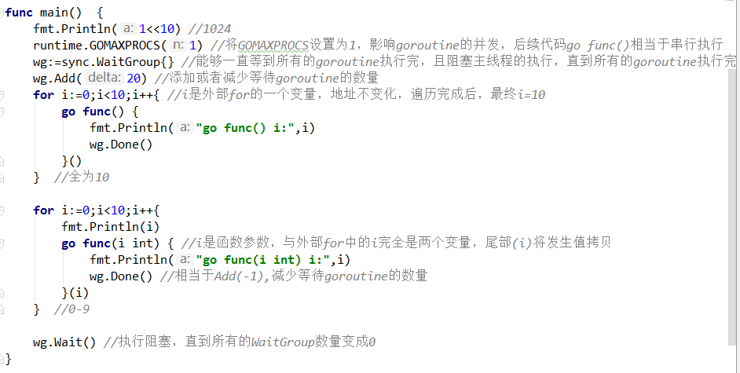

## 2、C语言

