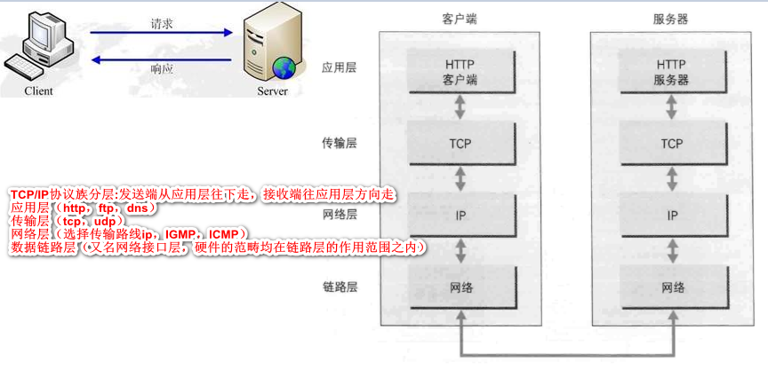
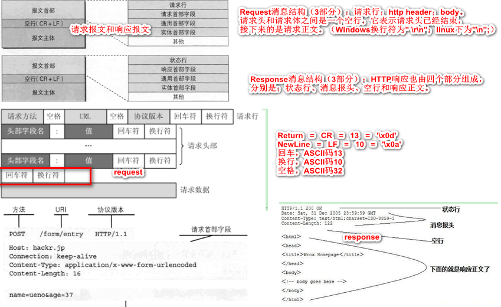
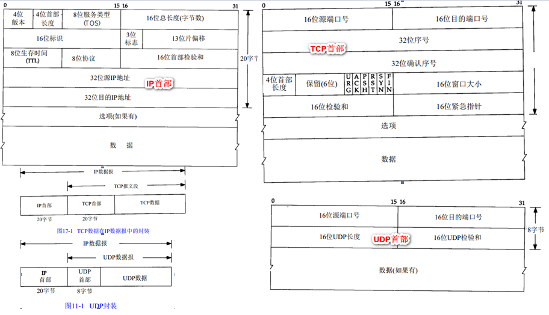
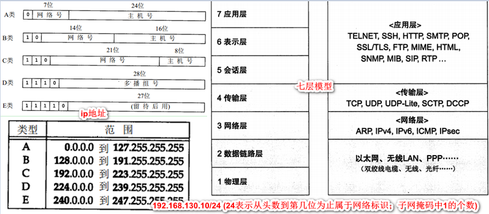
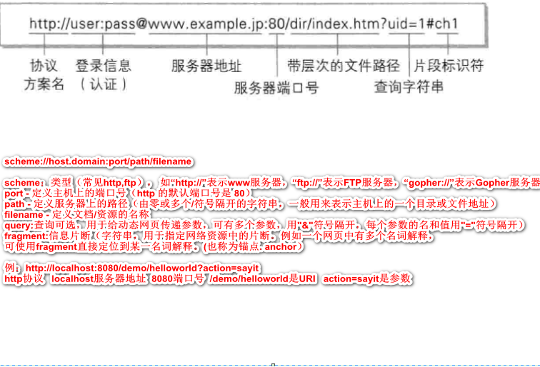

## 1、http**超文本传输协议**

[HTTP简介](https://www.cnblogs.com/ranyonsue/p/5984001.html)    参考书：《http权威指南》 《图解http》

[post常见数据的提交方式](https://blog.csdn.net/a236209186/article/details/51736886)

[理解Cookie和Session的区别及使用](https://blog.csdn.net/liyifan687/article/details/80077928)

- **http请求和响应**

```shell
http在客户端和服务器之间以request-response protocol（请求-回复协议）工作。
支持B/S及C/S模式。（Browse/Server、Client/Server）
# get和post区别：
GET提交的数据放在URL之后，以?分割URL和传输数据，参数之间以&相连，如：login.action?name=hyddd&password=idontknow&verify=%E4%BD%A0%E5%A5%BD；如果数据是英文字母/数字，原样发送，如果是空格，转换为+，如果是中文/其他字符，则直接把字符串用BASE64加密，得出如：%E4%BD%A0%E5%A5%BD，其中％XX中的XX为该符号以16进制表示的ASCII。
POST提交的数据放在HTTP包的Body中。{"xxx":"xx","xxx":"xxx"}。
GET请求有长度限制（最多只是1024字节），而POST方法提交的数据没有限制。
GET方式需要使用Request.QueryString来取得变量的值，而POST方式通过Request.Form来获取变量的值。
GET方式提交数据，会带来安全问题，GET请求能够被缓存；GET请求会保存在浏览器的浏览记录中；以GET请求的URL能够保存为浏览器书签。
POST的安全性要比GET的安全性高；POST请求不能被缓存下来；POST请求不会保存在浏览器浏览记录中；以POST请求的URL无法保存为浏览器书签。

# post常见数据的提交方式
application/x-www-form-urlencoded       常见POST提交数据方式
multipart/form-data 图片或文本文件
multipart/byteranges  多重范围的范围请求
application/json  (告诉服务端消息主体是序列化后的 JSON 字符串;{"sub":[1,2,3]})
text/xml

# HTTP 请求方法有 OPTIONS、GET、HEAD、POST、PUT、DELETE、TRACE、CONNECT 这几种。其中 POST 一般用来向服务端提交数据。
# 基本方法四种：GET, POST, PUT, DELETE，对应这资源的查、改、增、删操作
GET - 从指定的服务器中获取数据；GET一般用于获取/查询资源信息。GET请求会向数据库发索取数据的请求，从而来获取信息，该请求就像数据库的select操作一样，只是用来查询一下数据，不会修改、增加数据，不会影响资源的内容，即该请求不会产生副作用。无论进行多少次操作，结果都是一样的。
PUT - 该请求是向服务器端发送数据的，从而改变信息，该请求就像数据库的update操作一样，用来修改数据的内容，但是不会增加数据的种类等，也就是说无论进行多少次PUT操作，其结果并没有不同。
POST -提交数据给指定的服务器处理 POST一般用于更新资源信息。POST请求同PUT请求类似，都是向服务器端发送数据的，但是该请求会改变数据的种类等资源，就像数据库的insert操作一样，会创建新的内容。几乎目前所有的提交操作都是用POST请求的。
DELETE请求，就是用来删除某一个资源的，该请求就像数据库的delete操作。
就像前面所讲的一样，既然PUT和POST操作都是向服务器端发送数据的，那么两者有什么区别呢。POST主要作用在一个集合资源之上的（url），而PUT主要作用在一个具体资源之上的（url/xxx），通俗一下讲就是，如URL可以在客户端确定，那么可使用PUT，否则用POST。

# 参数：
Form：存储了post、put和get参数，在使用之前需要调用ParseForm方法。
PostForm：存储了post、put参数，在使用之前需要调用ParseForm方法。
MultipartForm：存储了包含了文件上传的表单的post参数，在使用前需要调用ParseMultipartForm方法。

# 首部字段名: 字段值
Content-Type: application/json 报文主体的对象类型
Connection: keep-alive
Cache-Control: no-store 控制缓存的行为
cookie的工作机制：用户识别及状态管理。 cookie服务的首部字段：Cookie请求首部字段，Set-Cookie响应首部字段
```






- **http状态码**

```shell
# 状态代码有三位数字组成，第一个数字定义了响应的类别，共分五种类别:
1xx：指示信息--表示请求已接收，继续处理
2xx：成功--表示请求已被成功接收、理解、接受
3xx：重定向--要完成请求必须进行更进一步的操作
4xx：客户端错误--请求有语法错误或请求无法实现
5xx：服务器端错误--服务器未能实现合法的请求
# 常见返回码：
200 ok
客户端错误:400 错误请求、401 未授权、403 禁止(服务器拒绝请求)、404 not found
服务端错误:500 内部服务错误、503服务不可用
```

- **http安全**

```shell
# http主要不足:通信使用明文（不加密），内容可能会被窃听；
不验证通信方的身份，有可能遭遇伪装；无法证明报文的完整性，有可能已遭篡改；
http没有加密机制，但可以通过SSL(Secure Socker Layer安全套接层)或TLS（Tansport Layer Security安全传输层的组合，加密http通信）
SSL安全套接层，证书（服务器和客户端持有的证书，客户端先确认服务器的证书）
https（加密处理和认证机制）比http多个SSL层。https要比http慢2~100倍。加密通信会消耗更多的cpu和资源（加解密运算很消耗内存）；仅仅需要隐藏信息时，才会加密处理。
公开密钥加密使用非对称密钥的方法，一种叫私有密钥（不能让任何人知道），一种叫公开密钥。发送密文的一方使用对方的公开密钥进行加密处理，对方收到被加密的信息后再用自己的私有密钥进行解密。
  
# http认证方式  常用认证方法：基于表单的认证（加密时间戳+可变的加密串）
basic认证（基本认证）
digest认证（摘要认证）
SSL客户端认证
FormBase认证（基于表单的认证）
  
关于服务端保存用户密码的保存方式，一种方法时先利用给密码加盐（salt）的方式增加额外信息，再使用散列（hash）函数计算出散列值后保存。盐（salt）：服务器随机生成的一个字符串（长度足够长，并且是真正随机生成的）。又可分别固定盐和随机盐，随机盐是根据一定条件（比如密账号的创建时间，用户的账户名）随机生成的，然后将它和密码字符串连接起来生成散列值。即使两个用户使用同一个密码，由于随机生成的salt值不同，对应的散列值也是不同的。
  
# cookie（客户端保持状态）和session（服务端保持状态）
登录网站，今输入用户名密码登录了，第二天再打开很多情况下就直接打开。这个时候用到的一个机制就是cookie。
cookie机制：发给顾客一张卡片，上面记录着消费的数量，一般还有个有效期限。每次消费时，如果顾客出示这张卡片，则此次消费就会与以前或以后的消费相联系起来。这种做法是在客户端保持状态。
cookie的内容主要包括：名字，值，过期时间，路径和域。
  
session机制：发给顾客一张会员卡，除了卡号之外什么信息也不纪录，每次消费时，如果顾客出示该卡片，则店员在店里的纪录本上找到这个卡号对应的纪录添加一些消费信息。这种做法就是在服务器端保持状态。 除非程序通知服务器删除一个session，否则服务器会一直保留，程序一般都是在用户做log off的时候发个指令去删除session。用户首次与Web服务器建立连接的时候，服务器会给用户分发一个SessionID作为标识。（token即为sessionid）7bae40db-8f4b-48fe-86fb-5cde119a6b6a
```

## 2、TCP、UDP、IP

[TCP、UDP、IP首部讲解](https://blog.csdn.net/zhangliangzi/article/details/52554439)



- **TCP传输控制协议**（连接：三次握手 关闭：四次挥手）

```shell
TCP：连接是全双工的，可以在任何时刻在进出两个方向上即发送数据又接收数据。安全可靠，传输速度慢。
TCP状态（位码即tcp标志位，有6种标示）：
SYN(synchronous建立联机)同步序号用来发起一个连接。当SYN=1而ACK=0时表明这是一个请求报文段；若对方同意连接，则响应报文中SYN=1，ACK=1。
FIN(finish)发端完成发送任务。 用来释放一个连接，当FIN=1表示此报文段的发送方已经发送完毕。并要求释放连接。
ACK(acknowledgement 确认)确认序号有效。  仅当ACK=1时确认字段才有效，当ACK=0时无效。
PSH有DATA数据传输，接收方应该尽快将这个报文段交给应用层。PSH为1表示的是有真正的TCP数据包内容被传递。
RST重置，重建连接。
URG(urgent紧急)。

seq：序号，占4个字节
SYN和ACK可能同时为1，它表示的就是建立连接之后的响应；只是单个的一个SYN，它表示的只是建立连接。
一般地，当出现FIN包或RST包时，我们便认为客户端与服务器端断开了连接；而当出现SYN和SYN＋ACK包时，我们认为客户端与服务器建立了一个连接。

tcp传输：
可靠性：通过序列号与确认应答号提高可靠性；接收端查询接收数据的tcp首部中的序列号以及数据长度，将自己下一步应该接收的序号作为应答返回出去。
超时重发：特定的时间间隔没收到，重发机制；(重发超时都是0.5整数倍)。
TCP以段为单位发送数据MMS:以MMS大小将数据进行分割发送。
滑动窗口：利用窗口提高速度。发送端发送一个段后，不必一直等待，而是继续发送
流控制：超时重发还未收到窗口更新通知时，会发送一个窗口探测包，此包仅含1个字节。
拥塞控制:慢启动算法等
```

- **UDP简单的面向数据报的运输层协议**

```shell
UDP用户数据报协议，无需建立连接。不安全，允许丢包。
```

- 常用术语**

```shell
帧、报文、报文段、分组、包、数据报的概念区别：
分组、包（packet），信息在互联网当中传输的单元，网络层实现分组交付。用抓包工具抓到的一条条记录就是包。
帧，frame，数据链路层的协议数据单元。我们将链路层分组称为帧。
数据报，Datagram，通过网络传输的数据的基本单元，包含一个报头（header）和数据本身，其中报头描述了数据的目的地以及和其它数据之间的关系。可以理解为传输数据的分组。通过网络传输的数据的基本单元称为数据报。
报文段，segment，组成报文的每个分组。我们将运输层分组称为报文段。
报文（message）是网络交换与传输的数据单元，也是网络传输的基本单位。一般指完整的信息，传输层实现报文交付。我们将位于应用层的信息分组称为报文。报文在传输过程中会不断的封装成分组、包、帧来传输，封装的方式就是添加一些信息段，那些就是报文头。
数据包：包(Packet)是TCP/IP协议通信传输中的数据单位，一般也称“数据包”。在局域网中，“包”是包含在“帧”里的。邮寄东西例子：产品包装盒相当于数据包，里面放着的产品相当于可用的数据，而专用纸箱就相当于帧，且一个帧中只有一个数据包。数据包主要由“目的IP地址”、“源IP地址”、“净载数据”等部分构成。
目的IP地址是说明这个数据包是要发给谁的，相当于收信人地址；
源IP地址是说明这个数据包是发自哪里的，相当于发信人地址；
净载数据相当于信件的内容。
cpu中央处理器:cpu的性能很大程度上决定着一台计算机的处理性能。
OS操作系统:是一种基础软件，集合了cpu管理，内存管理，计算机外围设备管理以及程序运行管理等重要功能。
分组交换：大数据分隔成一个个叫包packet的较小单位进行传输
半双工和全双工：半双工只发送或者只接收的方式；全双工允许在同一时间即发送数据也接收数据。
ppp点对点：纯粹的数据链路层，仅有ppp无法进行通信，还需要有物理层的支持。
主机：配有ip地址但不进行路由控制；即配有ip地址又进行路由控制的设备叫路由器；节点是主机和路由器的统称。
分片处理：将较大的ip分成多个较小的ip包，到达对端目的地址以后再被组合起来传递给上一层。
环回接口（LoopbackInterface）：允许运行在同一台主机上的客户程序和服务器程序通过TCP/IP进行通信
IP地址127.0.0.1并命名为localhost
最大传输单元MTU  
```

## 3、ip、dns概念



```shell
# ip网际协议
IP：用作唯一标识互联网上计算机的逻辑地址，让电脑之间可相互通信。每台连网计算机都靠IP地址来互相区分、相互联系。
ip地址指明了节点被分配到的地址。
MAC地址指网卡所属的固定地址，通常显示的格式为12位的16进制数。
ARP地址解析协议根据通信方的ip地址就可以反查MAC地址。
路由选择：类似于快递运输，由集散中心自己判断下一个目的地。
32位的IP地址用4个十进制数表示，并用句点(.)隔开，每个数都在0-255之间共256个不同的取值，通常被分割为4个“8位二进制数”(也就是4个字节)。例如,11001010011000000011110110101001，用4个十进制数表示成202.96.61.1

# DNS负责域名解析的系统〔domainname，system)
DNS域名系统：在Internet上域名与IP地址之间是一对一（或者多对一）的，域名的最终指向是IP。IP地址是数字标识，不便记忆。域名是符号化地址与特定的IP地址对应。
域名通常包含组织名，而且始终包括两到三个字母的后缀，以指明组织的类型和所在的国家或者地区.例如.域名www.bta.net.cn各部分的含义如下
cn 表示中国的internet
net.cn 表示中国邮电部负责组建的internet商业网，即ChinaNET
bta.net.cn 表示北京地区的ChinaNET
www.bta.net.cn 表示北京地区的ChinaNET上一台联网服务器的名字

# URI和URL  （URI=URL+URN）
URI(Uniform Resource Identifier)统一资源标识符：用字符串标识某一互联网资源
URL(Uniform Resource Locator)统一资源定位符：标识资源的地点。像一个人的地址。
URN作用就好像一个人的名字，确定了东西的身份。
去寻找一个具体的人（URI）；如果用地址：XX省XX市XX区…XX单元XX室的主人就是URL；如果用身份证号+名字去找就是URN（身份证号+名字 无法确认资源的地址）

`#符号含义`
`#代表网页中的一个位置。其右面的字符是该位置的标识符，http://www.example.com/index.html#print 代表网页index.html的print位置。浏览器读取这个URL后，会自动将print位置滚动至可视区域。HTTP请求不包括#，在第一个#后面出现的任何字符，都会被浏览器解读为位置标识符。这意味着，这些字符都不会被发送到服务器端。比如，访问下面的网址，http://www.example.com/index.html#print，浏览器实际发出的请求是这样的：GET /index.html HTTP/1.1    Host: www.example.com。改变#不触发网页重载，单单改变#后的部分，浏览器只会滚动到相应位置，不会重新加载网页 。改变#会改变浏览器的访问历史，每一次改变#后的部分，都会在浏览器的访问历史中增加一个记录，使用"后退"按钮，就可以回到上一个位置。`

# ？含义
连接作用：http://www.xxx.com/Show.asp?id=77&nameid=2905210001&page=1
清除缓存：http://www.xxxxx.com/index.html http://www.xxxxx.com/index.html?test123123
两个url打开的页面一样，但有问号的，说明不调用缓存的内容，而认为是一个新地址，重新读取
& 的含义：不同参数的间隔符
```



## 4、网络编程和操作系统术语

### 4.1 [同步、异步、阻塞与非阻塞](https://www.jianshu.com/p/aed6067eeac9)

```shell
# 1）同步和异步、阻塞和非阻塞
同步/异步是下载完成消息通知的`方式`（针对C端，关注的是消息通知机制）
阻塞/非阻塞则是在等待下载完成消息通知`过程中的状态`（主要针对S端，线程关注程序在等待调用结果时的状态)

同步：在发出一个调用时，在没有得到结果之前，该调用就不返回。但是一旦调用返回，就得到返回值了。由调用者主动等待这个调用的结果。（提交请求->等待服务器处理->处理完毕返回 这个期间客户端浏览器不能干任何事）
异步：调用在发出之后，这个调用就直接返回，所以没有返回结果。当一个异步过程调用发出后，调用者不会立刻得到结果。而是在调用发出后，被调用者通过状态、通知来通知调用者，或通过回调函数处理这个调用。（通过状态、通知和回调来通知调用者。使用通知的方式，效率则很高，因为执行部件几乎不需要做额外的操作。至于回调函数，其实和通知没太多区别）

阻塞：是指调用结果返回之前，当前线程会被挂起。调用线程只有在得到结果之后才会返回。
非阻塞：指在不能立刻得到结果之前，该调用不会阻塞当前线程。

eg：你打电话问书店老板有没有《分布式系统》这本书
同步通信机制:书店老板会说，你稍等我查下，然后开始查，等查好了（可能是5秒，也可能是一天）告诉你结果（返回结果）
异步通信机制:书店老板直接告诉你我查一下啊，查好了打电话给你，然后直接挂电话了（不返回结果）。然后查好了，他会主动打电话给你。在这里老板通过回电这种方式来回调。
阻塞式调用:你会一直把自己挂起，直到得到这本书有没有的结果。
非阻塞式调用:你不管老板有没有告诉你，你自己先一边去玩了， 当然你也要偶尔过几分钟check一下老板有没有返回结果。

# 同步阻塞、同步非阻塞等
同步阻塞：服务器实现模式为一个连接一个线程，即客户端有连接请求时服务器端就需要启动一个线程进行处理，如果这个连接不做任何事情会造成不必要的线程开销，当然可以通过线程池机制改善。如果这个线程等待当前函数返回时，没有执行其它消息处理，而是出于挂起等待状态。（效率最低）

同步非阻塞：服务器实现模式为一个请求一个线程，即客户端发送的连接请求都会注册到多路复用器上，多路复用器轮询到连接有I/O请求时才启动一个线程进行处理。如果这个线程等待当前函数返回时，仍在执行其它消息处理。（效率低下，一边打电话一边等银行排队，是不是切换，效率低下）

异步阻塞：异步的方式去等待消息被触发（通知），异步操作是可以被阻塞住的，只不过它不是在处理消息时阻塞，而是在等待消息通知时被阻塞。

异步非阻塞：服务器实现模式为一个有效请求一个线程，客户端的I/O请求都是由OS先完成了再通知服务器应用去启动线程进行处理。效率更高（这个人突然发觉自己烟瘾犯了，需要出去抽根烟，于是他告诉大堂经理说，排到我这个号码的时候麻烦到外面通知我一下(注册一个回调函数)，那么他就没有被阻塞在这个等待的操作上面，自然这个就是异步+非阻塞的方式了）

# 2）串行、并行、并发
串行：程序会顺序的执行每一条指令，在整个程序的运行过程中，仅存在一个运行上下文。即一个调用栈，一个堆。
并行：两个队列同时使用两台咖啡机。是每个cpu运行一个程序。不同实体上的多个事件;两个或多个事件在同一时刻发生;在多台处理器上同时处理多个任务。(并行有同时处理多个任务的能力。)
并发：两个队列交替使用一台咖啡机。在同一个cpu上同时（不是真正的同时，而是看来是同时，因为cpu要在多个程序间切换）运行多个程序。(并发关键有处理多个任务的能力，不一定要同时。)
并发和并行都可以是多个线程，就看这些线程能不能同时被多个cpu执行，如果可以就是并行。并发是多线程在一个cpu上轮流切换执行。
例子：并发就像一个人（cpu）喂2个孩子（程序），轮换着每人喂一口，表面上两个孩子都在吃饭。并行就是2个人喂2个孩子，两个孩子也同时在吃饭。

# 3）进程、线程和协程
进程Process：进程是资源分配的基本单位，进程的调度涉及到的内容比较多（存储空间，CPU，I/O资源等，进程现场保护），调度开销较大。它是由一组机器指令、数据和堆栈等组成的，是一个能独立运行的活动实体。
备注：进程一般有三个状态：就绪状态、执行状态和等待状态【或称阻塞状态】；进程只能由父进程建立，系统中所有的进程形成一种进程树的层次体系；挂起命令可由进程自己和其他进程发出，但是解除挂起命令只能由其他进程发出。

线程:线程比进程更轻量，线程能独立运行，独立调度，拥有资源（一般是CPU资源，程序计数器等），同一个进程的多个线程共享进程的资源（省去了资源调度现场保护的很多工作）。作为系统调度和分派的基本单位。Linux下的线程看作轻量级进程。通常都是把进程作为分配资源的基本单位，而把线程作为独立运行和独立调度的基本单位。

多线程：是为了同步完成多项任务，不是为了提高运行效率，而是为了提高资源使用效率来提高系统的效率。（进程为火车；多线程就像火车的每一节车厢；）

协程：是一种用户态的轻量级线程。其调度完全有应用程序来控制，操作系统不管这部分的调度。一个线程可以包含一个或多个协程。协程拥有自己的寄存器上下文和栈，协程调度切换时，将寄存器上下纹和栈保存起来，在切换回来时恢复先前保运的寄存上下文和栈。

基于事件驱动的编程是单线程思维，其特点是异步+回调。
IO密集型应用：多进程->多线程->事件驱动->协程
CPU密集型应用：多进程-->多线程
如果说多进程对于多CPU，多线程对应多核CPU（物理cpu一个，多核多个运算核心），那么事件驱动和协程则是在充分挖掘不断提高性能的单核CPU（物理cpu一个，核数一个，逻辑cpu为：1X1）的潜力。

# 4）负载均衡、分布式、集群和原子操作
负载均衡系统：核心是分摊压力。负载均衡又有DNS负载均衡（比较常用）、IP负载均衡、
反向代理负载均衡等，也就是在集群中有服务器A、B、C，它们都是互不影响，互不相干的，任何一台的机器宕了，都不会影响其他机器的运行，当用户来一个请求，有负载均衡器的算法决定由哪台机器来处理，假如你的算法是采用round算法，有用户a、b、c，那么分别由服务器A、B、C来处理。
集群：将几台服务器集中在一起，实现同一业务。
分布式distributed：分布式在并行处理的基础上，强调任务正在执行的物理设备，如处理
器、内存等等硬件，在物理上是分开的。将不同的业务分布在不同的地方。
全双工：是指在发送数据的同时也能够接收数据，两者同步进行。
半双工：指一个时间段内只有一个动作发生。
原子操作：不能被中断的一系列操作。原子操作可以实现互斥锁；当我们知道一个操作在它的执行环境原子的，那么多任务处理时，我们可以省去加锁带来的开销；反过来，如果我们实现互斥锁，那么我们可以扩大原子操作的范围。（临界区可以有多个指令执行）。
RPC调用程序（Remote Procedure Call）：用户程序、用代理程序、PRC通信包软件、服
务员代理程序、服务员程序。一个系统上（客户主机）某个程序调用另外一个系统上（服务主机）某个程序的方法。在顾客服务员模型中，进程之间的相互作用是由一个进程先向另一个进程发送一个报文请求服务，然后等待回答；服务进程接收一个请求，然后发送回答。这样一种交互作用是过程调用。远程过程调用的基础是XDR协议。
举例：两台服务器A和B，应用部署在A服务器上，想要调用B服务器上应用提供的函数（这种调用可能在不同的机器上执行，因此称远程过程调用）

# 5）localhost、机器ip和127.0.0.1区别
本机IP，确切地说，"本机地址"并不是一个规范的名词。通常情况下，指的是本机物理网卡所绑定的网络协议地址。
127.0.0.1回环地址，这个地址通常分配给 loopback 接口。一般用来测试使用；ping 127.0.0.1一般作为测试本机TCP/IP协议栈正常与否的判断之一。若能ping通，本机的网卡和IP协议安装都没有问题。
localhost首先是一个域名（如同：www.baidu.com），也是本机地址，它可以被配置为任意的IP地址。IPv4：表示  127.0.0.1；IPv6：表示  [::1]。

# 6）常见端口号
熟知端口号：0~1023  每个端口应用于特定的应用协议
动态端口号: 1024~65535  客户端的为每个应用进程分配
tcp (6)：
FTP数据（20）      FTP控制（21） telnet(23) 简单邮件传输协议SMTP（25）HTTP（80）
POP3（电子邮局协议）（110）
UDP（17）
简单文件传输协议TFTP（69） 简单网络管理协议SNMP（161）
DNS域名系统（80）—既是tcp,也是udp

# 7）进程间通信IPC（Inter-Process Communication）
进程间通信:多个进程之间相互通信交换信息的方法。
根据进程通信时信息量大小的不同，可以将进程通信划分为两大类型：
低级通信：控制信息的通信（主要用于进程之间的同步，互斥，中止和挂起等等控制信息的传递）。
高级通信：大批数据的通信（主要用于进程间数据块数据的交换和共享,常见的高级通信有管道,消息队列,共享内存）。

高级通信包括如下形式：
管道：一种半双工通信方式，数据只能单向流动，且只能在具有亲缘关系的进程间使用。进程的亲缘关系是指父子进程关系。
有名管道FIFO：有名管道也是半双工的通信方式，但是它允许无亲缘关系进程间的通信。mkfifo函数创建。
信号量：信号量是一个计数器，可以用来控制多个进程对共享资源的访问。不是用于交换大批数据,而用于多线程之间的同步。常作为一种锁机制,防止某进程在访问资源时其它进程也访问该资源。因此，主要作为进程间以及同一进程内不同线程之间的同步手段。
消息队列：消息队列是由消息的链表，存放在内核中并由消息队列标识符标识。消息队列克服了信号传递信息少、管道只能承载无格式字节流以及缓冲区大小受限等缺点。
信号：信号是一种比较复杂的通信方式，用于通知接收进程某个事件已经发生。
共享内存：是映射一段能被其他进程所访问的内存，这段共享内存由一个进程创建，但多个进程都可以访问。共享内存是最快的IPC方式，它是针对其他进程间通信方式运行效率低而专门设计的。它往往与其他通信机制，如信号两，配合使用，来实现进程间的同步和通信。
套接字: 套解口也是一种进程间通信机制，与其他通信机制不同的是，它可用于不同机器间的进程通信。

管道的两种形式：命令行和非命令行。
命令行   mkfifo testfifo；echo "testfifo" >fifo；cat fifo
非命令行（有名管道和无名管道）

# 应用场景：
数据传输：一个进程需要将它的数据发送给另一个进程，发送的数据量在一个字节到几兆字节之间。
共享数据：多个进程想要操作共享数据，一个进程对共享数据的修改，别的进程应该立刻看到。
通知事件：一个进程需要向另一个或一组进程发送消息，通知它（它们）发生了某种事件（如进程终止时要通知父进程）。
资源共享：多个进程之间共享同样的资源。为了作到这一点，需要内核提供锁和同步机制。
进程控制：有些进程希望完全控制另一个进程的执行（如Debug进程），此时控制进程希望能够拦截另一个进程的所有陷入和异常，并能够及时知道它的状态改变。
# 常用信号：
1 ~ 31的信号为UNIX支持的信号，不可靠信号(非实时的)， 32 ~ 63的信号是后来扩充的，称可靠信号(实时信号)。
SIGHUP在用户终端连接(正常或非正常)结束时发出, 通常是在终端的控制进程结束时, 通知同一session内的各个作业, 这时它们与控制终端不再关联。
SIGINT在用户键入INTR字符(通常是Ctrl-C)时发出，用于通知前台进程组终止进程。
SIGQUIT字符(通常是Ctrl-\)来控制，进程因收到SIGQUIT退出时会产生core文件,类似于一个程序错误信号。
一个程序运行命令后面加个&可以放到后台运行，R+表示前台进程，无+表示后台进程。
Linux查看操作系统所有退出信号：kill -l
Ctrl+C组合键。并且其对应信号为2号SIGINT
Ctrl+\ 它对应的是3号信号SIGQUIT
./sig &  # shell可以接收其它命令
./sig    # shell被占用，不可以接收其它命令
```
**大小端：**Big-Endian就是高位字节排放在内存的低地址端，低位字节排放在内存的高地址端。
网络字节序又称bigendian字节序。低地址存放高位0x12345678 [大小端](./image/08_04大小端.png)

### 4.2 锁

```shell
对共享资源操作前一定要获得锁。完成操作以后一定要释放锁。尽量短时间地占用锁。如果有多锁, 如获得顺序是ABC连环扣, 释放顺序也应该是ABC。线程错误返回时应该释放它所获得的锁。锁可以保护共享资源（坑位）只能被一个任务（人）访问，保证各个任务能够正确得访问资源。它是一种机制，目的是做到多任务环境中的对资源访问的同步。

# 常用锁：读写锁、互斥锁、自旋锁
1）rwlock读写锁（也称共享互斥锁:读模式共享，写模式互斥。适用于对数据结构的读操作次数多于写操作的场景）
Lock()加写锁,Unlock()解写锁;写加锁状态时，在这个锁被解锁之前，所有试图对这个锁加锁的线程都会被阻塞。
RLock加读锁,RUnlock释放读锁;读加锁状态时，所有试图以读模式对它进行加锁的线程都可以得到访问权，但是以写模式对它进行加锁的线程将会被阻塞。
可由任意数量的读者同时使用，或者只由一个写者使用的锁（大家都在上厕所时，保洁不能打扫厕所）。当该线程进行写入操作时，其他线程不可读取和写入（保洁打扫厕所时，任何人不能入内）。
读写锁三种状态：
多个读者可以同时进行读;
写者必须互斥(只允许一个写者写，也不能读者、写者同时进行);
写者优先于读者(一旦有写者，则后续读者必须等待，唤醒时优先考虑写者)
读写锁分为读锁和写锁，规则如下：
1）如果某线程申请了读锁，其它线程可以再申请读锁，但不能申请写锁。
2）如果某线程申请了写锁，其它线程不能申请读锁，也不能申请写锁。
2)mutex（互斥锁）
Lock()加锁,Unlock()解锁;互斥锁是一种信号量，常用来防止两个进程或线程在同一时刻访问相同的共享资源。保证一下三点（原子性；唯一性；非繁忙等待）；解锁前，其它线程不可以锁定该互斥量。lock将语句块标记为临界区，当一个线程获取到锁后，其他线程如果需要使用该临界区则必须要等待前一个线程使用完毕后释放锁后才可以使用。（想象成上厕所，锁门一样）。一次只能一个线程拥有互斥锁，其他线程只有等待。
3）互斥量和信号量区别
互斥量用于线程的互斥，信号量用于线程的同步;互斥量的加锁和解锁必须由同一线程分别对应使用，信号量值可以由一个线程释放另一个线程得到;
互斥：某一资源同时只允许一个访问者对其进行访问，具有唯一性和排他性。但互斥无法限制访问者对资源的访问顺序，访问无序。
同步：对资源的有序访问，多数情况下，同步已经实现了互斥，特别是所有写入资源的情况是互斥的。少数情况可以允许多个访问者访问资源。
4)自旋锁与互斥锁区别
一次只能有一个进程进入临界区，读写锁是自旋锁的一个特例。只是在加锁后，有线程试图再次执行加锁操作的时候，该线程不会阻塞，而处于循环等待的忙等状态（CPU不能够做其他事情）。 
自旋锁适用的情况是：锁被持有的时间较短，而且进程并不希望在重新调度上花费太多的成本。
区别:
对于自旋锁来说，它只需要消耗很少的资源来建立锁；随后当线程被阻塞时，它就会一直重复检查看锁是否可用了，也就是说当自旋锁处于等待状态时它会一直消耗CPU时间。
对于互斥锁来说，与自旋锁相比它需要消耗大量的系统资源来建立锁；随后当线程被阻塞时，线程的调度状态被修改，并且线程被加入等待线程队列；最后当锁可用时，在获取锁之前，线程会被从等待队列取出并更改其调度状态；但是在线程被阻塞期间，它不消耗CPU资源。自旋锁适用于那些仅需要阻塞很短时间的场景，而互斥锁mutex适用于那些可能会阻塞很长时间的场景。
死锁
死锁：指多个进程在运行过程中，因为争夺资源而造成的一种僵局，如果没有外力推进，处于僵局中的进程就无法继续执行。
死锁原因：竞争资源：请求同一有限资源的进程数多于可用资源数；进程推进顺序法：进程执行中，请求和释放资源顺序不合理，如资源等待链
死锁产生的必要条件：互斥条件：进程对所分配的资源进行排他性的使用。请求和保持条件：进程被阻塞时并不释放锁申请的资源。不可剥夺条件：进程对于已申请的资源在使用完之前不可剥夺。环路等待条件：发生死锁的时候存在的一个进程-资源环形等待链。
避免死锁的几种方式：
破坏死锁产生的必要条件；
设置加锁顺序:（线程按照一定的顺序加锁）,若一个线程需要锁，则他必须按照一定得顺序获得锁。
设置加锁时限:（超时重试）,在获取锁时尝试加一个获取锁的时限，超过时限不需要再获取锁，放弃操作（对锁的请求）。
死锁检测:当一个线程获取锁时，会在相应的数据结构中记录下来，相同下，若有线程请求锁，也会在相应的结构中记录下来。当一个线程请求失败时，需要遍历一下这个数据结构检查是否有死锁产生
```

### 4.3 socket及time_wait

- **socket ** [socket](./image/08_04socket.png)

```shell
# socket
socket用于描述IP地址和端口，是一个通信链的句柄。(两个程序通信用的) socket非常类似于电话的插座。以一个电话网为例。电话的通话双方相当于相互通信的2个程序，电话号码当作IP地址。任何用户在通话之前，首先要占有一部电话机，相当于申请一个socket；同时要知道对方的号码（IP地址），相当于对方有一个固定的socket。然后向对方拨号呼叫，相当于发出连接请求。对方假如在场并空闲，拿起电话话筒，双方就可以正式通话，相当于连接成功。双方通话的过程，是一方向电话机发出信号和对方从电话机接收信号的过程，相当于向socket发送数据和从socket接收数据。通话结束后，一方挂起电话机相当于关闭socket，撤消连接，通信完成。

Unix/Linux基本哲学之一就是“一切皆文件”，都可以用“打开open –> 读写write/read –> 关闭close”模式来操作。socket即是一种特殊的文件，一些socket函数就是对其进行的操作（读/写IO、打开、关闭）。

流式Socket（STREAM）：面向连接的Socket，针对于TCP服务应用，安全，但是效率低；
数据报式Socket（DATAGRAM）：无连接的Socket,对应于UDP服务应用.不安全(丢失,顺序
混乱,在接收端要分析重排及要求重发),但效率高udp将数据包拆开为若干份编号后来传输。在传输的过程中容易出现数据的丢失。但是传输速度要比tcp的快。

# 通信协议
通信协议的引入：假如通信中的一个人是外国人（说英语），一个人是中国人（说普通话），他们相互通信，他们的沟通就不能完成。若我们给一个规定，给通话双方，只能讲普通话，那么双方沟通就没有障碍了。这就引出来了通信协议。
```

- time_wait

```shell
# TIME_WAIT状态(主动关闭的一方引起time_wait)
可靠地实现TCP全双工连接的终止。TCP协议在关闭连接的四次握手过程中，最终的ACK是由主动关闭连接的一端（后面统称A端）发出的，如果这个ACK丢失，对方（后面统称B端）将重发出最终的FIN，因此A端必须维护状态信息（TIME_WAIT）允许它重发最终的ACK。如果A端不维持TIME_WAIT状态，而是处于CLOSED 状态，那么A端将响应RST分节，B端收到后将此分节解释成一个错误（在java中会抛出connection reset的SocketException)。因而，要实现TCP全双工连接的正常终止，必须处理终止过程中四个分节任何一个分节的丢失情况，主动关闭连接的A端必须维持TIME_WAIT状态。

time_wait存在的意义：
1、 可靠地实现TCP全双工连接的终止。
2、 允许老的重复分节在网络中消逝。
```

- **coredump**

```shell
当系统受到异常信号ARORT/SEGV时，会终止当前进程，并保留下来当时手机出现异常时的现场数据，类似于照相机按下快门的一瞬间，得到的照片即为coredump。coredmp包含了程序运行时的内存，寄存器状态，堆栈指针，内存管理信息等。可以理解为把程序工作的当前状态存储成一个文件。许多程序和操作系统出错时会自动生成一个core文件。
原因分析：浅层，当前进程存在bug，需要程序员修复。深层次，当前进程触犯了某些OS层级的保护机制，逼迫 OS向当前进程发送诸如SIGSEGV(即signal 11)之类的信号, 例如访问空指针或数组越界，实际上是触犯了OS的内存管理，访问了非当前进程的内存空间，OS需要通过发出终止信号，产生Coredump来进行警示。

一个是多核多线程导致的难以重现的bug，还有一个是有可能的memory corruption。

epoll方式设计tcp服务器，采用非阻塞模式。
```

## 5、curl (**http请求模拟**)

```shell
curl是Linux下一个很强大的http命令行工具，其功能十分强大。
# 模拟http请求举例：
curl -v '127.0.0.1:9093/rpc/getrouternamebyid?routerid=1'    发请求（？属于分隔符，）
curl -XPOST '127.0.0.1:10080/mmm/v1/image/create_img' -d '{"projectid":"5","git_tag":"v1","image_desc":"xxxxxx"}'
url引号可加可不加；若存在非纯英文文字或数字外的字元，不加引号可能会有问题，最好加引号；
单引号’’和双引号””:引号内的字符全部做普通字符；引号内除$、转义符\、倒引号`这三个保留特殊功能，其他字符均做普通字符。
？之后的内容，表单提交的内容。
？第一个参数，&（多个参数，起连接作用）
-X 指定http方法 HOST:PORT:ADDRESS；指定代理服务器地址和端口，端口默认为1080 
-H 設定request裡的header；指定请求头参数
-d 設定 http parameters；-d帶入參數間用&串接，或使用多個-d；  HTTP POST方式传送数据
-v参数可以显示一次http通信的整个过程，包括端口连接和http request头信息（响应rsp返回详细的信息）
-i 参数显示HTTP头：    curl -i -XGET 'localhost:9200/'

在linux指令下模拟发请求
python test.py '127.0.0.1:9073' /openapi/open/third_server_info/update '{ "sessionid":"xxxx", "notify_url":"123.13.0.1", "token":"aaa","encryt_key":"bbb","encryt_type":5 }
 
例子：curl –v “ 127.0.0.1:9090/test”
```


