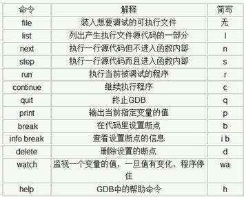

## 1、gdb调试

 - **编译go**

   ```powershell
   go build # 一定要切换到当前目录里，若有多个main函数，需指定文件名编译
   go build main.go # 指定特定的.go文件进行编译
   go build -o mygo hello.go # 指定可执行文件名为mygo
   go build -v -x  分步编 #go build 文件名  只是编译；go run  文件名  有输出结果
   go get gopkg.in/olivere/elastic.v3 # 从指定源上面下载或者更新指定的代码和依赖
   go install # 与build命令相比，install命令在编译源码后还会将可执行文件或库文件安装到指定的目录
   go build -gcflags "-N -l" exd.go # 编译，关闭内联优化
   go build -ldflags "-w -s -X main.Version=${VERSION} -X main.Build=${BUILD}"
   # -w 去掉DWARF调试信息，得到的程序就不能用gdb调试了；-s 去掉符号表,panic时候的stack trace就没有任何文件名/行号信息了，这个等价于普通C/C++程序被strip的效果；-X 设置包中的变量值
   go build -ldflags "-linkmode=external -X 'main.BuildTime=`date`' -X 'main.GitHash=`git rev-parse HEAD`'" -o ../target/$1
   ```

   

 - **编译C或C++**

   ```powershell
   # 一般c程序就用gcc编译，c++程序就用g++编译
   
   # 编译C代码
   gcc hello.c # 会出现a.out文件   ./a.out  （可执行程序的文件名，编译器采用默认的 a.out）
   gcc -o hello hello.c # 编译成功完成后,生成一个名为hello的文件,然后执行./hello在屏幕上。
   gcc -g hello.c -o hello # 调试C文件
   
   # 编译C++代码
   g++ -g hello.cpp -o hello # 调试C++文件
   g++  -o  hello  helloworld.cpp        ./hello         
   # 最基本的用法是∶gcc [options] [filenames]
   -c # 只编译不链接，只生成目标文件（.o文件）。通常用于编译不包含主程序的子程序文件。
   -o output_filename # 指定生成可执行文件的名称。如果不使用-o选项，则会生成默认可执行文件a.out。
   -O # 优化编译过的代码，采用这个选项，整个源代码会在编译、连接过程中进行优化处理，这样产生的可执行文件的执行效率可以提高，但是，编译、连接的速度就相应地要慢一些。
   -g # 选项的意义是生成调试信息，该程序可以被调试器调试
   ```

 - **gdb调试:**是GNU开源组织发布的一个强大的UNIX下的程序调试工具，具备如下功能：启动程序；设置断点；动态地改变程序的执行环境；追索上文。

   

   ```powershell
   gdb -q # 启动时不显示提示信息
   show version；show warranty；show copying
   .gdbinit # gdb初始化文件，
   set confirm off # 除去退出时的提示信息
   set pagination off或者set height 0命令 # 输出信息多时不会暂停输出
   
   # C代码编译步骤及调试参数
   g++ -g except.cpp -o main  # 注意必须使用-g参数，编译会加入调试信息，否则无法调试执行文件
   gdb main  # main编译好的二进制文件
   info functions # 列出可执行文件的所有函数名称
   info functions print* # 列出符合正则表达式的函数名称
   r或run  # 运行
   list 1 # 查看源文件，显示程序第1行周围的源程序，enter（回车）重复上一次指令
   clear 行号  # 清除断点
   continue # 继续运行至下一个断点（类似于VS里的F5）
   next # 逐过程步进，不会进入子函数（类似VS里的F10）
   step # 逐语句步进，会进入子函数（类似VS里的F11）
   q  # 退出
   n# 单步执行命令
   print b 或者 p b # 查看变量 
   disable b_id    # 使中断失效（b_id为行号）
   enable b_id     # 使中断有效
   until        # 运行至当前语句块结束
   finish    # 运行至函数结束并跳出，并打印函数的返回值（类似VS的Shift+F11）
   disassemble main    # main函数汇编代码
   tcatch fork  # 程序只触发一次
   i frame # 输出了当前函数堆栈帧的地址，指令寄存器的值，局部变量地址及值等信息，可以对照当前寄存器的值和函数的汇编指令看一下。i register
   1)断点b
   
   break 17 # 在17行设置断点 
   break filename:linenum  # 在源文件filename的linenum行处停住    b except.cpp:5
   b Foo::foo  # namespace Foo中的foo函数设置断点
   b (anonymous namespace)::bar # 对匿名空间中的bar函数设置断点
   b *0x400522 # 在程序地址上打断点
   b 10 if i==4 # 满足某一条件时，断点才会被触发
   
   info break  # 查看断点信息
   info files # 获取入口地址
   watch sum  # watch I 观察变量
   wa a thread 2
   gdb -tui [可执行程序名]
   
   gcc –g tst.c –o testtst #必须使用-g参数，编译会加入调试信息，否则无法调试执行文件；No symbol table is loaded. Use the "file" command的原因源文件在编译时，没有使用 -g 参数。 加了-g参数后，重新编译，然后再调试就么有问题了。当进入gdb环境时，未加可执行文件名，会出现No symbol table is loaded.  Use the "file" command.提示。
   g++ -g -O  except.cpp -o main
   ```

## 2、makefile

[跟我一起写 Makefile](https://blog.csdn.net/haoel/article/details/2886/)


## 3、GOLAND

- **编译方法**

  ```powershell
  # go语言编译window下编译
  SET CGO_ENABLED=0
  SET GOOS=linux
  SET GOARCH=amd64
  go build main.go
  ```

- **使用技巧**

  无干扰模式：View | Enter Distraction Free Mode. Ctrl+Shift+F12 

  File | Settings/Preferences | Project Structure

  最近的文件：Ctrl+E

  后退：Ctrl+Alt+Left

  快速导航：Ctrl+F12

  go fmt格式化：Settings/Preferences | Tools| File Watchers

  版本控制系统VCS

  运行：Run | Edit Configurations 

  导入项目： File | New | Project

  行号和列号：Ctrl+G

  显示行号：Settings/Preferences | Editor | General | Appearance Show line numbers

  设置：Ctrl+Alt+S

## 4、securecrt终端和xshell

- **securecrt**

  `公钥创建终端:`

  1. 文件——快速连接
  2. 选择属性——导入公钥
  3.  配置窗口和相关参数（终端—发送协议要勾选，防止不用断开连接；仿真—linux；外观—UTF—8）

  `密码创建终端`

  1. 文件—连接—在sessions处右键—新建会话
  2.  输入主机名，用户名，点击下一步,设置回话名称
  3. 完成后，点击连接；输入密码
  4. 配置窗口和相关参数（终端—发送协议要勾选，防止不用断开连接；仿真—linux；外观—UTF—8）

- **xshell**

  略

  