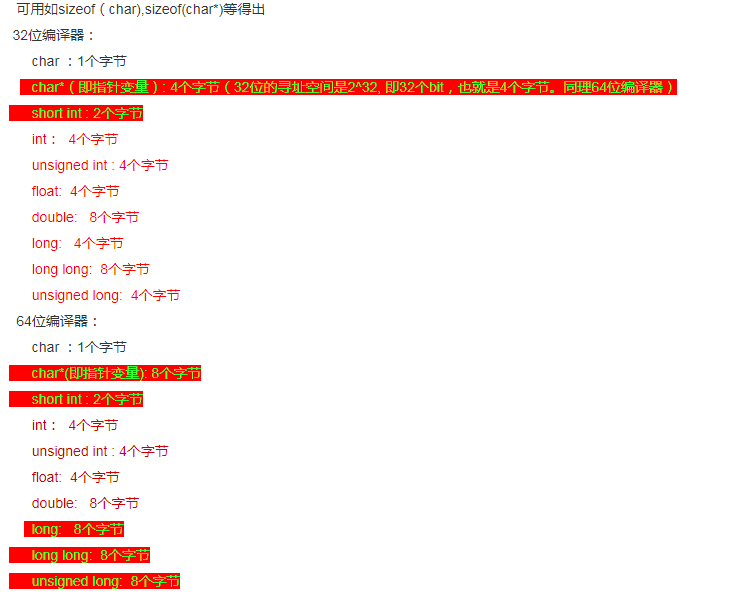
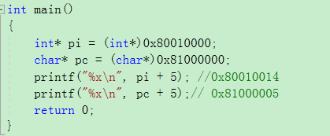

## 1、 c++题目（tx SNG）

### 1.1 ++i, i++ 的使用

```C++
++i返回加1后的值。（左值与右值的根本区别在于是否允许取地址&运算符获得对应的内存地址）。如非必须，尽量避免使用后置形式。
++i 是i=i+1,表达式的值就是i本身
i++ 也是i=i+1,但表达式的值是加1前的副本，由于要先保存副本，因此效率低一些。
i++返回原来的值，i++不可以作为左值
    
a++和++a区别（++运算优先级要高于算术运算）
a++;先用后加 。      ++a;先加后用
b=a++;先把a的值赋给b,然后a自增1.
Int ta= 3;  int tb = ++ta; //tb为4；
```

### 1.2 函数参数传值和传指针/传引用的区别

```c++
传指针本质上属于值传递，它所传递的是一个地址值；
传值：实参拷贝传递给形参，单向传递。不会影响主调函数的实参变量的值。
传引用：传引用本质没有任何实参的拷贝，一句话，就是让另外一个变量也执行该实参。就是两个变量指向同一个对象。这是对形参的修改，必然反映到实参上。

// 指针和引用的区别
一个对象a，它有值a和地址&a；计算机会分配存储空间来存储该对象的值，通过该对象的地址，来访问存储空间的值。
指针是个实体，引用只是别名；
指针需要解引用（*）；
引用只能在定义时被初始化一次，之后不可变，而指针可变；int a,&r=a;
指针有const，引用没有const；
指针可以为空，引用不能为空；
从内存分配上，指针需要分配内存，引用则不需要；
```

### 1.3 [epoll和select的区别](https://blog.csdn.net/jiange_zh/article/details/50811553)

```c++
分别适合什么场景（select比较适合fd比较少，而且fd读写比较频繁的场景）
epoll：
执行epoll_create时，创建了红黑树和就绪链表；
执行epoll_ctl时，如果增加socket句柄，则检查在红黑树中是否存在，存在立即返回，不存在则添加到树干上，然后向内核注册回调函数，用于当中断事件来临时向准备就绪链表中插入数据; 
执行epoll_wait时立刻返回准备就绪链表里的数据即可。
Epoll的提升：
本身没有最大并发连接的限制，仅受系统中进程能打开的最大文件数目限制；
效率提升：只有活跃的socket才会主动的去调用callback函数；
省去不必要的内存拷贝：epoll通过内核与用户空间mmap同一块内存实现。
Select缺点:
最大并发数限制：使用32个整数的32位，即32*32=1024来标识fd，虽然可修改，但是有以下第二点的瓶颈；
效率低：每次都会线性扫描整个fd_set，集合越大速度越慢；
内核/用户空间内存拷贝问题。
LT模式：当epoll_wait检测到描述符事件发生并将此事件通知应用程序，应用程序可以不立即处理该事件。下次调用epoll_wait时，会再次响应应用程序并通知此事件。水平触发，只要有数据都会触发
ET模式：当epoll_wait检测到描述符事件发生并将此事件通知应用程序，应用程序必须立即处理该事件。如果不处理，下次调用epoll_wait时，不会再次响应应用程序并通知此事件。边缘触发，只有数据到来才触发
```

### 1.4  cpu、内存、网络、磁盘、抓包命令

```c++
scp  ssh远程登录  
netstat –ntlp看端口
ping 10.xx.xx.xx 检测网络的连通性
telnet ip port  检测端口的连通性
ps看进程
内存free –m
df –m //以M为单位，查看磁盘大小
df –h //查看硬盘大小
du命令的功能是用于显示文件目录或大小。  Du –h
iostat –d –k 1 10//参数 –d 表示，显示设备（磁盘）使用状态；-k某些使用block为单位的列强制使用kb为单位；1 10表示，数据显示每隔1秒刷新一次，共显示10次
sar –n DEV 1  每间隔1秒统计一次 查看网卡流量
grep，sed，awk文本命令
```

### 1.5 [写一个迭代版二分查找程序](https://blog.csdn.net/swliao/article/details/5337896) [04_二分查找.png](./i_image/04_二分查找.png)

```c++
递归和迭代的区别: (递归中一定有迭代,但是迭代中不一定有递归,大部分可以相互转换.能用迭代的不用递归)
程序调用自身的编程技巧成为递归，是函数自己调用自己。
迭代:利用变量的原值推算出变量的一个新值.如果递归是自己调用自己的话,迭代就是A不停的调用B.
```

### 1.6 [笔试题算法](http://blog.csdn.net/chief_cf/article/details/51397412)

```c++
题目：char a[n], char b[m], n > m > 1000，b中的值在a中都存在，写一个程序，将在a中但不在b中的值拷贝到数组c中。
```

### 1.7 开放题

**题目一：**A和B是两个独立的服务，A通过网络调用B，发现有很多请求超时，也有很多请求没超时，怎么排查原因（提示：出问题的可能是A、也可能是B、也可能是A和B之间的网络状况，要分别怎么定位和排查。这题没有标准答案，会围绕这个问题问很多相关的基础问题，比如抓包，抓完包后怎么分析，怎么查找程序占CPU的原因等等）

[服务器丢包故障的解决思路](https://www.sdnlab.com/17530.html)

**题目二：**如果你设计王者荣耀，你会选TCP还是UDP。（同样无标准答案，会围绕TCP和UDP的特性问基础知识）

[TCP 的那些事儿](https://coolshell.cn/articles/11564.html)

**题目三：**map、set的底层数据结构，插入删除查找时间复杂度，红黑树的5个特征

[[map,set的底层实现：红黑树](https://www.cnblogs.com/xiaoyi115/p/3719192.html)](https://www.cnblogs.com/xiaoyi115/p/3719192.html)

### 1.8、[struct和union内存对齐方式和区别](https://www.cnblogs.com/webber1992/p/5950199.html)

```c++
1 根本区别：内存单元的分配和使用。结构体按声明的变量顺序来存放的；联合体所有元素共享同一内存单元，由类型最大的元素size决定，最后赋予它的值决定。
1.在存储多个成员信息时，编译器会自动给struct第个成员分配存储空间，struct 可以存储多个成员信息，而Union每个成员会用同一个存储空间，只能存储最后一个成员的信息。
2.都是由多个不同的数据类型成员组成，但在任何同一时刻，Union只存放了一个被先选中的成员，而结构体的所有成员都存在。
3.对于Union的不同成员赋值，将会对其他成员重写，原来成员的值就不存在了，而对于struct 的不同成员赋值 是互不影响的。
Sizeof(u2)为16，u2中的成员int b，由于int类型成员的存在，使u2的对齐方式变成4；sizeof(u3)为13
  uion u2{
    char a[13];
    int b;
};
  uion u3{
    char a[13];
    char b;
};

sizeof(s1)为24字节。解析：s1，首先把a放到8的对界，假定是0，此时下一个空闲的地址是1，但是下一个元素d是double类型，要放到8的对界上，离1最接近的地址是8了，所以d被放在了8，此时下一个空闲地址变成了16，下一个元素c的对界是4，16可以满足，所以c放在了16，此时下一个空闲地址变成了20，下一个元素d需要对界1，也正好落在对界上，所以d放在了20，结构体在地址21处结束。由于s1的大小需要是8的倍数，所以21-23的空间被保留，s1的大小变成了24。
    struct s1{
        char a;
        double b;
        int c;
        char d;
    };
#pragma pack(x)宏可以改变编译器的对界方式

2 常用变量类型的位数以及取值范围https://www.cnblogs.com/reality-soul/p/6141074.html
一个8位的signed char类型整数表示的范围：-2^7~2^7-1
一个8位的unsigned char类型整数表示的范围: 0~2^8-1
    
3 下面程序有什么错误？
    void foo(){
    unsigned char i=0;
    for(;i<500;i++){
        printf("i=%d\n",i)
    }
}
解析: 死循环，i为无符号char型，最大为2^8-1

4 指针和地址
int* pi = (int*) 0x80010000;
char* pc = (char*) 0x81000000;
pi + 5 =？    Pc + 5 = ？  （解析：int 4byte，加5，相当于多了20个byte）
    


```






## 2、混合题目

```c++
// vector和list区别
vector和数组类似，拥有一段连续的内存空间，并且起始地址不变。因此能高效的进行随机存取，时间复杂度为o(1);
list是由双向链表实现的，因此内存空间是不连续的。由于链表的特点，能高效地进行插入和删除。

TCP快速重传机制
13、TCP慢启动机制，有什么缺点，怎么解决
慢启动会对海量小文件的拷贝造成重大性能损失；
（解决方法：尽量把大量小文件放在一个TCP连接中排队传输，避免大量的三次握手和四次挥手时间上的消耗）

14、C++多态的实现，虚函数表的实现

15、union和struct的内存对齐规则，long在32位系统和64位系统分别占多少个字节
union，struct，class的对齐方式为成员中对齐方式最大的成员的对齐方式。
Union它所有的元素共享同一内存单元，且分配给union的内存size 由类型最大的元素 size 来确定。
16、char *p1; int *p2; p1 + 5 等于多少，p2+5等于多少
p1+5代表后移5个字节    char 1byte
p2+5代表后移20个字节   int   4byte

17、常用的进程间通讯方式。管道和FIFO有名管道有什么特性或局限。
管道，信号，消息队列，共享内存
18、C++进程内存空间分布
http://blog.csdn.net/qq792326645/article/details/49783347
栈区stack：编译器自动分配和释放，存放函数的参数值和局部变量的值；
堆区heap：一般由程序员分配和释放，若程序员不释放，程序节结束由操作系统回收；
全局区static：静态数据内存空间，存储全局变量和静态变量。
文字常量区：常量字符串放置在这里，程序结束后由系统释放。
程序代码区：存放函数体的二进制代码。
解决数据存储问题：
2.	从栈空间中申请(即直接定义数组)
第二，从堆空间中申请(使用malloc或者new动态申请内存)
第三，使用文件存储数据
数据量较小时，推荐使用栈空间申请，即直接定义数组
数据量稍大或者不确定时，推荐使用堆空间内存，即使用malloc或者new动态申请，因为栈空间常常会有大小的限定，当栈空间耗尽时，栈溢出会导致程序崩溃
当数据量超大的，建议重新审阅算法或者使用文件存储
栈空间与子函数，递归与栈溢出
当一个子函数被调用时，子函数的数据及代码都会被装入栈中，因为栈空间通常会有大小限制，如果子函数太多时，就会有栈溢出的风险。所以当程序员考虑使用递归函数解决问题时，应当考虑到栈溢出的风险。建议学会使用将递归函数写成非递归函数的方法。

20、TCP三次握手、四次挥手、状态转换、TIME_WAIT、滑动窗口、TCP头部包含哪些字段、TCP协议栈内核参数调优
21、TCP的recv函数的返回值有哪些可能
http://blog.csdn.net/tiandyoin/article/details/30044781
三种。成功，返回收到字节数；失败返回-1；另一端已关闭返回0

22、epoll的ET和LT模式区别
http://blog.csdn.net/eroswang/article/details/4481521
LT模式（默认的工作模式）：水平触发。当epoll_wait检测到描述符事件发生并将此事件通知应用程序，应用程序可以不立即处理该事件。下次调用epoll_wait时，会再次响应应用程序并通知此事件。水平触发，只要有数据都会触发
ET模式：边缘触发。当epoll_wait检测到描述符事件发生并将此事件通知应用程序，应用程序必须立即处理该事件。如果不处理，下次调用epoll_wait时，不会再次响应应用程序并通知此事件。边缘触发，只有数据到来才触发。
    
25.面向对象的三大特性（封装和继承是为了代码重用；多态是为了接口重用）
封装：隐藏代码细节，使代码模块化。
继承：扩展已存在的代码模块（由一般到特殊）
多态：接口重用（覆盖和重载 。覆盖：子类重新定义父类虚函数的做法。重载：函数名相同，参数不同）

虚函数和纯虚函数：虚函数为了重载和多态。 在基类中是有定义的，即便定义为空。 在子类中可以重写。纯虚函数在基类中没有定义， 必须在子类中加以实现。
26.常见STL？
容器 vector，list，deque;
算法 排序，复制
迭代器 iterator
27.开发常用数据结构
数组，链表，树，栈（FILO）和队列（FIFO）

struct和class区别：struct的成员默认是公有的，而class的成员默认是私有的。


前缀（操作符在前面）、中缀（操作符在中间）、后缀（操作符在后面）表达式。

    
19、多进程和多线程区别
http://blog.csdn.net/luoweifu/article/details/46595285
任务调度？采用时间片轮转的抢占式调度方式。
进程是程序的一次执行过程。
线程是程序执行中一个单一的顺序控制流程，是程序执行流的最小单元。


进程：子进程是父进程的复制品。子进程获得父进程数据空间、堆和栈的复制品。 线程：相对与进程而言，线程是一个更加接近与执行体的概念，它可以与同进程的其他线程共享数据，但拥有自己的栈空间，拥有独立的执行序列。 两者都可以提高程序的并发度，提高程序运行效率和响应时间。 线程和进程在使用上各有优缺点：线程执行开销小，但不利于资源管理和保护；而进程正相反。

    
1.循环左移
2.字符串转换“A879”转换为十进制
3.8x8方格，求最短距离
4. a=0x123456789
  
二分查找
mysql  redis集群
求一个数的平方根
epoll多路复用技术

数字0个数
两个链表的合并
链表去重


pa：
1.身份证号登陆
2.选择语言进行考试
3.选择题目选项多随机

me：
快速排序
二分查找
线性表
链表
top10
hashmap

性能测试：
loaderrunner，写好脚本，指定好路径即可参与
python或者java写测试脚本
熟悉一些数据库的操作指令
linux相关命令
a,b,c三边，判定其为等腰三角形

linux常用命令
查看cpu：top,cat /proc/cpuinfo,vmstat
查看监听某个端口号的进程的命令是：ps 
将目录/tmp/dir/下面的所有目录和文件都拷贝到当前目录，命令是：cp –r /tmp/dir/* ./
查看所有进程的命令是:netstat
查看内存的命令是:free,cat /proc/meminfo
查看网卡IO负载的命令是:sar
查看磁盘IO负载的命令是:iostat –x 10


```

## 3、链接汇总

[c++面试题](https://www.cnblogs.com/bozhicheng/p/6259784.html)

[常见腾讯C++面试问题总结](https://www.2cto.com/kf/201607/527032.html)

[面试试题](https://blog.csdn.net/xiongchao99/article/details/73381280)


