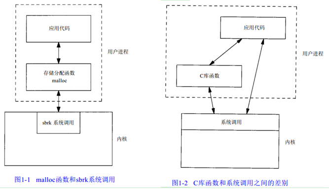
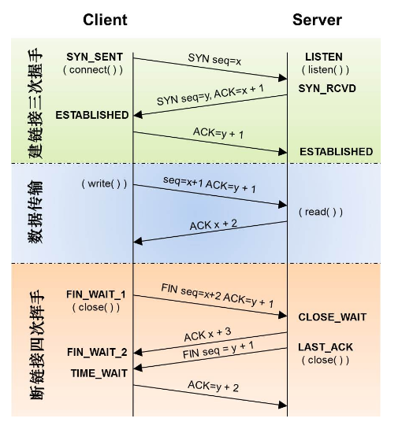
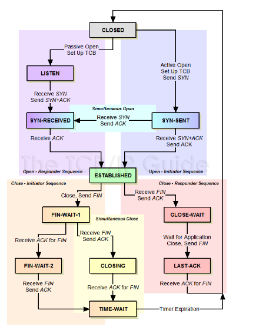
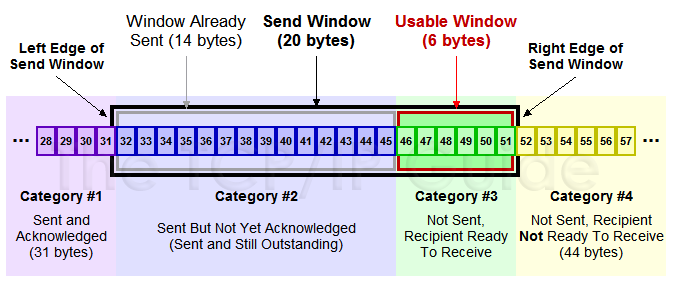

## 1、高频题目（网络编程相关)

https://blog.csdn.net/u010126059/article/details/50670801
https://blog.csdn.net/lisonglisonglisong/article/details/51327586

- 系统调用和库函数的区别
  系统调用：操作系统为用户程序与硬件设备进行交互提供的一组接口，发生在内核地址空间。
  库函数：把一些常用的函数编写完放到一个文件里，编写应用程序时调用，这是由第三方提供的，发生在用户地址空间。
  区别：简单点说，库函数就是系统调用的上层封装，为了让应用程序在使用时更加方便。
  在移植性方面，不同操作系统的系统调用一般是不同的，移植性差；而在所有的ANSI C编译器版本中，C库函数是相同的。
  在调用开销方面，系统调用需要在用户空间和内核环境间切换，开销较大；而库函数调用属于“过程调用”，开销较小。



- c++内存分区

低地址  0x08048000 
高低址 0xC0000000（由低————高）
正文段：由CPU执行的机器指令部分，通常正文段是可共享的，而且是只读的（存放程序的二进制代码）
初始化数据段（数据段）：包含了程序中需明确赋初值的变量；
未初始化数据段（bss段）：
堆：由用户通过 malloc/new 手动申请，手动释放。
栈：自动变量以及每次函数调用时所需保存的信息都存放在此段中，由系统自动分配释放。
C++的内存分区共有五个：
栈区（stack）：主要存放函数参数以及局部变量，由系统自动分配释放。
堆区（heap）：由用户通过 malloc/new 手动申请，手动释放。
全局/静态区：存放全局变量、静态变量；程序结束后由系统释放。
字符串常量区：字符串常量就放在这里，程序结束后由系统释放。
代码区：存放程序的二进制代码。


- epoll和select   https://blog.csdn.net/jiange_zh/article/details/50811553
  IO多路复用：如果一个tcp服务器既要处理监听套接字又要处理已连接套接字；一个服务器既要处理tcp又要处理udp；一个服务器既要处理多个服务或多个协议

epoll与select区别：
select：
最大并发数限制：select单个进程能够监视的最大描述符的文件数量有限制，linux为1024；
效率低：每次都会线性扫描整个fd_set，找就绪的描述符，集合越大速度越慢；调用select函数会阻塞，直到遇到有描述符就绪（可读，可写，或except）或超时时，才返回。
Select内核/用户空间内存拷贝问题
epoll：
本身没有最大并发连接的限制，仅受系统中进程能打开的最大文件数目限制；
效率提升：只有活跃的socket才会调用callback；
省去不必要的内存拷贝：epoll通过内核与用户空间mmap同一块内存实现。
ET和LT区别：
ET边缘触发：0跃变到1。对编程要求高，需要细致的处理每个请求，否则容易发生丢失事件的情况。效率非常高，在并发，大流量的情况下，会比LT少很多epoll的系统调用，因此效率高。
LT水平触发：一直为1。只要有数据没有被获取，内核就不断通知你，因此不用担心事件丢失的情况。LT效率触发会低于ET触发，尤其是大并发，大流量的情况下。
Epoll原理（底层数据结构）：
epoll_create创建红黑树和就绪表（内核cache里建了红黑树用于存储epoll_ctl传来的socket；list存储准备就绪的事件）
epoll_ctl若增加socket句柄，则检查在红黑树中是否存在，存在立刻返回；不存在添加至树干，然后向内核注册回调函数，当中断来临时，向准备就绪链表插入数据。
Epoll_wait执行epoll_wait时，立刻返回准备就绪链表中的数据（观察list链表里有没有数据。有数据就返回，没有数据就sleep，等到timeout时间到后即使链表没数据也返回）
epoll代码示例：https://blog.csdn.net/ljx0305/article/details/4065058

EPOLLIN ： 表示对应的文件描述符可以读（包括对端SOCKET正常关闭）；
EPOLLOUT： 表示对应的文件描述符可以写；

## 2 、tcp相关

- Tcp与udp区别
  基于连接与无连接 
  对系统资源的要求（TCP较多，UDP少） 
  UDP程序结构较简单 
  流模式与数据报模式 
  TCP保证数据正确性，UDP可能丢包，TCP保证数据顺序，UDP不保证

- tcp三次握手和四次挥手
  三次握手（建立tcp连接）；四次挥手（终止tcp连接）。

  为什么连接时三次握手，关闭是四次挥手呢？

  TCP是全双工的，即客户端在给服务器端发送信息的同时，服务器端也可以给客户端发送信息。

  建立tcp连接时，服务端在listen状态下收到建立连接请求的syn报文，把ack和syn放到一个报文里发送给客户端。

  关闭tcp连接时，收到对方的FIN报文，仅表示对方不再发送数据了，已方也未必全部数据都发送给了对方，所以己方可以立刻关闭，也可以发送一些数据给对方，再发送FIN报文给对方同意现在关闭连接，所以ack和FIN都会分开发送。

  建立连接时，syn超时？（S接到C发的SYN后，回复SYN-ACK后，客户端C掉线）

  如果S在一定时间没有收到ACK回复是，会重发SYN-ACK，linux默认重试5次，时间间隔从1s开始每次翻售，5次重试的时间间隔为1s，2s，4s，8s，16s，共31s。第五次发出后还要等32s。共63s，TCP才会断开这个链接。

  Syn flood攻击？（客户端给服务器发送一个syn就下线了，于是服务器需要默认等待63秒才断开链接，会把syn连接的队列耗尽，让正常的连接请求不能处理）

  tcp_max_syn_backlog，可以增大SYN连接数

  MSL？（从TIME_WAIT状态到CLOSED状态，有一个超时设置，这个超时设置是 2*MSL。RFC793定义了MSL为2分钟，Linux设置成了30s）

  TIME_WAIT存在意义？ 

  Time_wait确保有足够的时间让对端收到ack，如果被动关闭的那端没有收到ack，就会触发重发fin，一来一回正好2msl；有足够的时间让这个连接不会跟后面的连接混在一起。（防止丢包）

  重发可能丢失的ack报文（网络是不可靠的，你无法保证你最后发送的ACK报文会一定被对方收到），时间2msl。

  TIME_WAIT数量过多？

  一旦达到句柄数上限，新的请求就无法被处理了，而且大量 time_wait 连接占用资源影响性能。

  

  

- TCP滑动窗口？（通过滑动窗口进行流量控制）

  \#1已经收到ack确认的数据；

  \#2发出还没收到ack；

  \#3在窗口中还没有发出的；（接收方还有空间）

  \#4窗口以外的数据

  滑动窗口协议的基本原理：在任意时刻发送方都维持了一个连续的允许发送的帧的序号，称为发送窗口；同时，接收方也维持了一个连续的允许接收的帧的序号，称为接收窗口。发送窗口和接收窗口的上下界不一定要一样，甚至大小也可以不同。

  窗口大小：接收端告诉发送端自己还有多少缓冲区可以接收数据。于是发送端就可以根据这个接收端的处理能力来发送数据，而不会导致接收端处理不过来。 

  接收端给发送端回ack时汇报窗口大小：MaxRcvBuffer – LastByteRcvd – 1;

  发送方会根据这个窗口来控制发送数据的大小，以保证接收方可以处理。

  为了避免发送大量的小数据包，TCP提供了Nagle算法，Nagle算法默认是打开的，可以在Socket设置TCP_NODELAY选项来关闭这个算法。

  

- 重传机制（快速重传机制）

  原理：在发送一个数据之后，就开启一个定时器，若是在这个时间内（RTO定时器时间）没有收到发送数据的ACK确认报文，则对该报文进行重传，在达到一定次数还没有成功时放弃并发送一个复位信号。 

  TCP拥塞控制？

  产生原因：网络能够提供的资源不足以满足用户的需求，这些资源包括缓存空间、链路带宽容量和中间节点的处理能力。

  **拥塞控制的四个算法：慢启动；拥塞避免；拥塞发生；快恢复；**

  慢启动算法： 刚刚加入网络，一点点提速，不要一上来就把路占满了。

  1.开始cwnd=1，表明可以传一个mss大小的数据

  2.每当收到ack，cwnd++，mss线性增加

  3.每当过了一个往返时间RTT，cwnd=cwnd*2

  4.当cwnd >= ssthresh（阈值slow start threshold）时，就会进入“拥塞避免算法”

  RTT（round trip time）一个数据包从发出去到回来的时间，RTT = t1 – t0（t0发送端发包时，t1接收端ack记录t1）。Congestion Window拥挤窗口，在发送数据时，将拥塞窗口的大小和接收端ack的窗口大小做比较，取较小者作为发送数据量的上线。RTO：（retransmission time out）：超时时间。

  拥塞避免：当拥塞窗口 cwnd 达到一个阈值时，窗口大小不再呈指数上升，而是以线性上升，避免增长过快导致网络拥塞

  1.每当收到一个ack，cwnd=cwnd+1/cwnd

  2.每当过了一个RTT，cwnd=cwnd+1

  拥塞发生：当发生丢包进行数据重传时，说明网络已经拥塞。分两种情况处理：

  1.等到RTO超时时，重传数据包（ssthresh=cwnd/2;cwnd重置为1;进入慢启动过程）

  2.在收到三个重复的ack时，就开启重传，而不用等RTO超时(ssthresh=cwnd=cwnd/2；进入快                   速恢复算法)

  快速恢复：至少收到了三个重复的ack，说明网络也不那么糟糕，可以快速恢复

  1.cwnd = sshthresh + 3 * MSS （3的意思是确认有3个数据包被收到了）

  2.重传Duplicated ACKs指定的数据包

  3.如果再收到 duplicated Acks，那么cwnd = cwnd +1

  4.如果收到了新的Ack，那么，cwnd = sshthresh ，然后就进入了拥塞避免的算法了。

- TCP数据格式

  Sequence Number是包的序号，用来解决网络包乱序（reordering）问题。
  Acknowledgement Number就是ACK——用于确认收到，用来解决不丢包的问题。
  Window又叫Advertised-Window，也就是著名的滑动窗口（Sliding Window），用于解决流控的
  TCP Flag ，也就是包的类型，主要是用于操控TCP的状态机的。（CEUAPRSF）

  

  tcpdump工作在数据链路层。

- tcp参考链接：

  https://coolshell.cn/articles/11564.html

  https://www.cnblogs.com/zhuzhenwei918/p/7465467.html

  http://blog.csdn.net/omnispace/article/details/52701752

- 备注tcp other

  状态机（主动关闭的一方会进入TIME-WAIT：等待足够的时间以确保远程TCP接收到连接中断请求的确认）

  http://blog.csdn.net/wangzhaotongalex/article/details/47128373

  半连接：server发送SYN-ACK之后，收到客户端的ACK之前的TCP连接为半连接，此时server处于SYN_RECV状态。

  Tcp各种异常（超时、断电、程序崩溃等）:http://blog.csdn.net/icyday/article/details/20638321

  服务器端异常：

  超时：客户端正常运行时，拔网线或杀掉客户端。服务器没有检测到任何异常，并最后等待超时才断开TCP连接。

  客户端退出忘记关闭socket，服务器可以收到部分tcp消息，然后收到“104: Connection reset by peer”（Linux下）

   

  序列号和确认应答号实现可靠传输。

  TCP以段为单位发送数据，MSS最大消息长度，

   

  netstat –nap | grep SYN_RECV 当Server上有大量半连接状态且源IP地址是随机的，则可以断定遭到SYN攻击了

  查看tcp连接状态的linux命令：

  tcpdump

  sar –n SOCK

  sar -n DEV

  netstat

## 3、top n问题

- topn问题

海量问题处理思路：

1.分治 数据量大无法加载到内存

2.哈希hash 快速查找，总数据可以放入内存

3.bit(位集和bitmap)

4.heap堆排序

1.海量日志数据，提取某日访问百度次数最多的那个ip top1

分治思想

有效的划分数据；（ip转换为数字，除1024取余，取模可以随意选，保证小文件可以放到内存即可，这样大文件就可以放到小文件中，并且相同的ip一定放到相同的文件中）

如何在子集上解决问题；（找小文件的topn，hashmap，其中key为ip，value为当前出现次数，最后找到value最大的Key即为当前文件中出现次数最多的IP）

如何合并结果。(直接将1024个子文件的统计结果进行比较，不用排序，直接选择最大的一个就好)

 

- 有一个1G大小的一个文件，里面每一行是一个词，词的大小不超过16字节，内存限制大小是1M。返回频数最高的100个词  top100

划分2048份；

堆排序；

归并排序；

- 给定a、b两个文件，各存放50亿个url，每个url各占64字节，内存限制是4G，让你找出a、b文件共同的url？

对a,b进行分片，a,b文件大小都大约320G，那么每个文件都切分成1G的320个小文件

 

- 二分查找

int Bsearch(int *a, int n, int key)

{

​     int low =0;

​     int high = n-1;

​     while (low<=high)

​     {

​          int mid = (low + high) / 2;

​          if (a[mid] < key)

​          {

​              low = mid + 1;

​          }

​          else if(a[mid]>key)

​          {

​              high = mid – 1;

​          }

​          else {

​              return mid;

​          }

​     }

​     return 0;

}

- 求平方根

//仅限于求能开方的数的平方根

int sqrt2(int x) {

​     int low = 0;

​     int high = x;

​     while (low <= high) {

​          long mid = (low + high) / 2;//防止溢出

​          if (mid * mid == x)

​              return (int)mid;

​          else if (mid * mid < x)

​              low = (int)(mid + 1);

​          else

​              high = (int)(mid – 1);

​     }

​     return high;

}

- 快速排序

先从数列中取出一个数作为基准数；分区过程将比这个数大的数全放到它的右边，小于或等于它的数全放到它的左边；再对左右区间重复第二步，直到各区间只有一个数。

Void Qsort(int a[], int l, int r)

{

​     if (l < r)

​     {

​          int i = l, j = r, basekey = a[l];

​          while (i<j)

​          {

​              while (i < j&&a[j] >= basekey)//从右向左找第一个小于basekey的数

​                   j--; 

​              a[i++] = a[j];

​              while (i < j&&a[i] <= basekey) //从左向右找第一个大于basekey的数

​                   i++;

​              a[j--] = a[i];

 

​          }

​          a[i] = basekey;

​          Qsort(a, l, i – 1);

​          Qsort(a, i + 1, r);

​     }

}

- 堆排序后续再看？？？

大顶堆：每个节点的值均大于等于其左右孩子节点的值。

小顶堆：每个节点的值均小于等于其左右孩子节点的值。

 

- 链表(单链表，双向链表)： 查阅大话数据结构

单链表（插入，删除，初始化，获取单链表的元素）

获取第i个位置的元素，赋给e

- **迭代和递归的区别：**

程序调用自身的编程技巧成为递归，是函数自己调用自己。

迭代:利用变量的原值推算出变量的一个新值.如果递归是自己调用自己的话,迭代就是A不停的调用B.

 

## 4、go相关

### 4.1 go记录

```shell
golang记录：
如何避免大量time_wait？SO_LINGER   keepalive
阻塞和非阻塞，同步IO/异步IO区别？
golang 50灰题目
golang 面试题
死锁(读写锁和互斥锁)
golang与c++区别
语言框架,写个简单的程序(3年以后，学习框架的设计思想)
从客户端，WEB端，服务端，数据库，通信，性能，操作系统，网络还有主机设备，各个方面，新技术层出不穷。
golang常用http服务的框架
go所以括号更少
go interface接口，类似于c++多态实现。
 
总体上看 go 要比c/c++慢2-3倍的样子. 我感觉这种对比意义不大， 因为根据解决的问题不同,不同语言相差很大， 更多的时候开发效率重要性远大于运行效率。
golang支持 Goroutine，轻量级线程。在高并发的系统中，可以按照多线程的方式写程序，从而保证逻辑的清晰和简单，又可以获得非常高的性能。
同样的事情在C++中，如果采用多线程，会导致系统线程过多带来的大量的上线文切换overhead,如果采用基于消息的架构，虽然可以获得较高的效率，但程序逻辑会被打散，可读性和可维护性较差。
golang拥有强大的接口interface,从而可以放弃 C++ 的继承+虚方法覆盖的编程方式，对于复杂系统来说前者具有更好的可维护性。
 
golang特性:
简单：没有泛型、没有异常、单一可执行文件、没有动态库
Goroutines：CSP、go、同步、channel
错误处理

>>>>>咨询？？？
问他们招聘的岗位 是做什么项目的
这个项目做到什么规模了 现在或者预计有多少用户量
在公司里怎么晋升  怎么涨工资

让你印象最深刻的事情
你为什么跳槽
你比别人的优势是什么
```

### 4.2 go项目

https://www.w3cschool.cn/go_internals/

- 搜索

```shell
# 机器配置（61-64）：1T硬盘，cpu32核，内存64g
cat /proc/cpuinfo |grep –c “processor” 32核
free –g 64g
fdisk –l 1T
cat /etc/redhat-release 查看操作系统版本
机器配置（197-199）:400G，4核，内存8g 
# mysql，es，kafka，redis均采用集群的方式
# 数据量：
公文：（400万条）ms级返回结果
知识管理系统：40多万
说吧：50万
云盘：100万
通讯录：12万左右
性能测试： ab工具
ab –n 1000 –c 10 –p ./tenant.json –T ‘application/json’ ‘10.0.0.1:31000/v1/search/tuser/info’
单机： qps：10000/s
实际观察：查询服务请求400/分钟

# kafka：3台（消息队列）
优化：
1）log.retention.hours=72（日志保存三天）
2）定期批量写文件 log.flush.interval.ms=1000
3）进行磁盘io操作，高峰期可能有些io等待，因此配置需要大些。配置线程数量为cpu核数2倍，最大不超过3倍。Num.io.threads=8
4）设计初衷迅速处理短小的消息，一般10k大小的吞吐率比较好；默认配置为1M；（大消息配置312M左右）
 
kafka简介：（设计初衷迅速处理短小的消息，一般10k大小的吞吐率比较好；默认配置为1M；）
Producer发送消息push
Broker中间缓存和分发的作用。Zookeeper作用：主要用于在集群中不同节点之间进行通信。
Consumer接收消息pull，consumer拉取消息好处：易于控制消息的消费，防止消息丢失
Producer，consumer实现Kafka注册的接口。数据从producer发送至broker，其承担一个中间缓存和分发的作用。
Kafka服务器可以接收到的消息的最大大小是1000000字节。
Kafka丢包及解决方案：https://www.jianshu.com/p/ec93eb4f7733
首先 kafka 的设计目标是 at least once，总结 kafka 可能丢消息的场景，kafka 丢消息分三种，producer 丢消息、broker 丢消息、consumer 丢消息：
2.	producer 向 broker 推消息时，采用了异步模式；
2，consumer 从 broker 取消息后，先 ack 再处理；
3，ISR里面的所有节点都宕机了，kafka 从存活的非 ISR 节点中选一个做为新的 leader（可以将unclean.leader.election.enable设为false来避免这种情况）；
4，consumer 能 pull 的消息的最大 size 设置太小；
5，broker 能从 producer 接收的消息的最大 size 设置太小；
6，broker 之间允许复制的消息的最大 size 设置太小；
7，能追加给 topic 的消息的最大 size 设置太小；
8，consumer offset 设置为了 earliest 跳过了一些消息（这其实不算丢，还可以前置 offset 找回历史消息）；
9，日志清理设置（时间或大小）不合理，导致数据还没被处理就被清理了。
https://www.cnblogs.com/paul8339/p/7412512.html
https://blog.csdn.net/suifeng3051/article/details/48053965

# es：4台
倒排索引：词-文档序号
TF/IDF， 即检索词频率/反向文档频率。https://blog.csdn.net/sangyongjia/article/details/52440063
TF：检索词在该字段出现的频率？出现频率越高， 相关性也越高。IDF：每个检索词在索引中出现的频率？频率越高， 相关性越低。
 
以上式子中 n{i,j} 是该词t{i} 在文件d{j}中的出现次数，而分母则是在文件d{j}中所有字词的出现次数之和。|D|：语料库中的文件总数。
优化：
使用bulk请求；（达到一定的数目或超过一定的时间，进行入库）
使用 multiple workers/threads发送数据到ES （达到一定的数目或超过一定的时间，进行入库）
增加刷新间隔（默认是1s，可以改成30s以减少合并压力）
尽可能使用过滤器上下文（Filter）替代查询上下文（Query）；
增加副本数。Elasticsearch可以在主分片或副本分片上执行搜索。副本越多，搜索可用的节点就越多；一个分片不超过20G。
禁用swapping；

```

### 4.3 其它记录

```shell
http://blog.csdn.net/lisonglisonglisong/article/details/51327586
sql注入：利用现有程序，将恶意的sql命令注入到后台数据库执行一些恶意的操作。
SQL注入攻击的总体思路（代码规范，字符串过滤，正则过滤，参数校验全面）
      1、寻找到SQL注入的位置
      2、判断服务器类型和后台数据库类型
      3、针对不通的服务器和数据库特点进行SQL注入攻击
在浏览器输入：http://www.baidu.com/，最后，浏览器呈现出相应网页：
（参考链接：http://blog.csdn.net/qq991029781/article/details/50938475）
第一步解析域名，找到主机ip
第二步浏览器与网站建立tcp连接
第三部浏览器发送get请求
第四部显示页面或返回
快速排序：6  1  2 7  9  3  4  5 10  8
找基准数，比基准数大的放到右边，基准数小的放到左边，3  1  2 5  4  6  9 7  10  8
先从右往左找一个小于6的数，再从左往右找一个大于6的数，然后交换他们。需要将这个序列中所有比基准数大的数放在6的右边，比基准数小的数放在6的左边。

滑动窗口
拥塞控制

进程、线程和协程区别：线程是操作系统调度的, 抢占式的.；协程是应用自己调度的.
对于进程和线程都是有内核进行调度，有cpu时间片的概念，进行抢占式调度；
对于协程（用户级线程），对内核是透明的，也就是系统并不知道有协程的存在，通常只能进行协作式调度，需要协程自己主动把控制权转让出去之后，其他协程才能被执行到。
内存消耗方面：每个 goroutine (协程) 默认占用内存远比 Java 、C 的线程少。Goroutine: 2KB ，线程: 8MB。

GPM模型：用户空间和内核空间线程之间的关系：N:1(N个用户线程始终在1个内核线程上跑)、1：1和M:N
M真正操作系统的线程
P调度器
G协程运行~

TCP流量控制：滑动窗口，分为接受窗口，发送窗口
http://blog.csdn.net/wdscq1234/article/details/52444277 滑动窗口

前序、中序和后序（前序：根-左-右；中序：左-根-右；后序：左-右-根）
前序遍历，中序遍历，求后序遍历；中序遍历和后序遍历求前序遍历；
前序、后序求中序结果不唯一？？？
http://blog.csdn.net/u013252072/article/details/52912385


go语言规范，任何类型在未初始化时都对应一个零值：布尔类型是false，整型是0，字符串是””，而指针，函数，interface，slice，channel和map的零值都是nil。

函数调用协议：
go关键字的调用协议和普通函数的调用协议有所不同。
Goroutine可以初始时只给栈分配很小的空间，然后随着使用过程中的需要自动地增长。这就是为什么Go可以开千千万万个goroutine而不会耗尽内存。

Go语言是一门带垃圾回收的语言，Go语言中有指针，却没有C中那么灵活的指针操作。大多数情况下是不需要用户自己去管理内存的，但是理解Go语言是如何做内存管理对写出优秀的程序是大有帮助。

内存分配器采用了跟tcmalloc库相同的实现，是一个带内存池的分配器，底层直接调用操作系统的mmap等函数。


interface{}：runtime/？？
Goroutine：runtime/runtime2.go    runtime/proc.c
channel：runtime/chan.go
低位和高位的区分：
map在c++中使用红黑树；golang中使用了hashmap，用数组来实现。
1<<10   2^10=1024
slice:runtime/slice.go
defer
逆序输出：遇到defer的闭包调用，则压入堆栈。当函数返回时，会按照后进先出的顺序调用闭包。Defer是在return之前执行的（return xxx这一条语句并不是一条原子指令）
channel
循环队列加锁实现。
Recover，panic 。程序不退出打印堆栈信息。
如何打印panic文件的?DumpPanic函数用于生成panic文件。

Goroutine如果panic了，并且没有recover，那么整个Golang进程就会异常退出。一旦Golang程序部署后，在任何情况下发生的异常都不应该导致程序异常退出，我们在上层函数中加一个延迟执行的recover调用来达到这个目的，并且是否进行recover需要根据环境变量或配置文件来定，默认需要recover。
在调用recover的延迟函数中以最合理的方式响应该异常：
打印堆栈的异常调用信息和关键的业务信息，以便这些问题保留可见；
将异常转换为错误，以便调用者让程序恢复到健康状态并继续安全运行。
异常处理的作用域（场景）：（选择在一个合适的上游去recover，并打印堆栈信息，使得部署后的程序不会终止）
空指针引用；下标越界；除数为0；不应该出现的分支，比如default；输入不应该引起函数错误
除此之外，其它场景使用错误处理。

闭包
goroutine协程
epoll
udp和tcp区别
timewait存在意义


多态C++
hash算法
panic文件
堆栈
 内存布局
 
 
//golang相关
go知识：
golang map实现原理(在底层是用哈希表实现的)hashmap作为底层实现的？？？？
https://blog.csdn.net/m0_37579159/article/details/79344079
map 在使用之前必须用 make 而不是 new 来创建；值为 nil 的 map 是空的，并且不能赋值。
//var m =map[string]interface{}{}
m:=make(map[string]interface{})
公共溢出法（基本表和溢出表：先从基本表里面查，查找不出再从溢出表里面查）
先比较hash值高位与bucket的tophash[i]是否相等，如果相等则再比较bucket的第i个的key与所给的key是否相等。如果相等，则返回其对应的value，反之，在overflow buckets中按照上述方法继续寻找。

Interface 底层实现https://zhuanlan.zhihu.com/p/27652856  ？？？内部实现原理
golang的多态可以通过interface{}接口来实现
空的interface（空接口）无方法，可以代表任何类型。Interface{}中有类型信息，可以实现反射。
Iface 和 eface。Eface表示不含 method 的 interface 结构，或者叫 empty interface。


```


