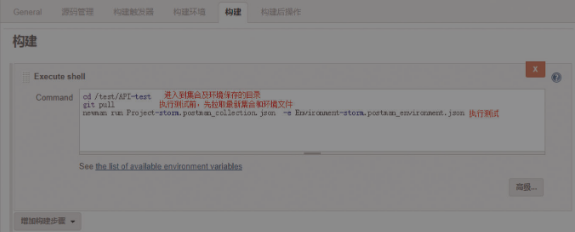
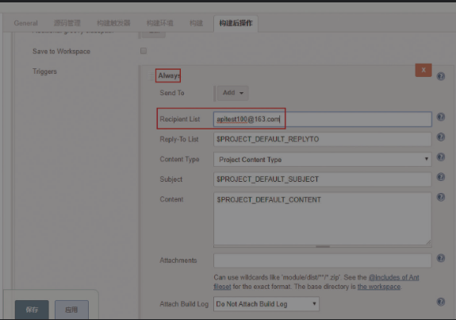
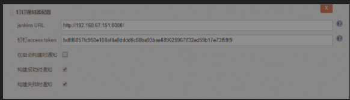

项目 登录  场景id

### 1  postman概述

`Postman在发送网络HTTP请求方面可以说是Chrome插件类产品中的代表产品之一`

 `备注: test中js语法 以及 Pre-request Script 重点学习`

[Postman教程大全](https://www.jianshu.com/p/97ba64888894)


```shell
1 右上角设置setting软件主题背景；导出文件名：  测试小例子.postman_collection.json

2 基本功能介绍:左侧（接口请求历史记录，接口集）；右半部分（请求方式，响应测试，请求参数，请求url；响应内容，响应状态码，响应时间及响应抬头）

3 环境变量优先级：数据data—》局部local—》environmen环境变量（指定环境，该env的变量才能被引用）—》Global全局（所有api均可以使用）

4 test区域（接口请求之后返回信息校验）: 具备简单的测试脚本（Tests Scripts）。Tests中构造测试点，这里选择验证Response响应和预期值一致。基本语法如下：
pm.test("Status code is 200", function () {
    pm.response.to.have.status(200);
});

pm.test("Body is correct", function () {
    pm.response.to.have.body({"code": 200, "id": "1", "name": "\u5c0f\u660e", "age": 18});
});

将返回值的某个数据设置为环境变量，定义一个xxx，获取body中返回的所有参数,并转化为JSON格式 var xxx = JSON.parse(responseBody);   使用变量： {{变量名}}  csv文件中使用变量：data.变量名

5 pre-requestScpri（预请求脚本，采用的js语法）：如果想要每次运行不一样的数据，我们需要其他的方法，比如，使用pre-requestScprit功能，导入或者生成随机数据进行测试。
js语法：
var data=JSON.parse(responseBody); // 获取body中返回的所有参数
tests["program's lenght"] = data.programs.length === 5; // 检查json中某个数组元素的个数
pm.environment.set("key",xxx.data.value); postman.setEnvironmentVariable("key", "value"); // 将返回值设置一个环境变量
 pm.globals.set("key",xxx.data.value);或者postman.setGlobalVariable("key", "value"); // 将返回中的值设置为一个全局变量

6 接口自动化: run (选择运行的集合；选择运行的环境变量；重复次数；等待时间；上传测试数据；启动运行。run summary会给出基本的概况)
collections——项目名——扩展按钮——run——左侧进行一些设置(运行集合、运行环境、重复次数、设置等待时间、上传测试数据、启动运行)


# 备注：   https://www.jianshu.com/p/97ba64888894
csv测试集和数据驱动：注意中文编码格式为UTF-8格式。
参数传递：响应结果取出来，设置到环境变量中
api接口重点关注点：（请求和响应）
  发起请求：填写接口url ，设置http方法， 设置请求头域 ，填写参数。
  响应参数:   http状态码， 收到响应 ，检查返回头域 ，查看返回主题内容（状态码，响应头，响应正文）
```


### 2  postman项目实战和关键点

**参考书籍： <<接口自动化测试持续集成 Postman+Newman+Git+Jenkins+钉钉>>**

#### 2.1 项目3w

````shell
# 环境构造  
1 安装python
2 安装 pip install tornado
3 安装storm.py   http://box.ptpress.com.cn/y/50341，提取码：8e7a (E:\资源 )
4 环境变量导入 storm-test.postman_environment.json  和 collection导入 storm.postman_collection.json 

# 单个请求执行步骤
1 设置params，req body， http://{{domain}}/getuser?userid=1  #  {{domain}}引用环境变量中的域名
2 在Tests中构造测试点，这里选择验证Response响应和预期值一致。
3 单击send
4 查看测试结果

# 运行项目下的所有接口
点storm项目下的run按钮，设置环境变量，执行次数，延时时间，结果展示(pass绿色，fail红色)。
环境变量文件,collections文件，运行结果文件均以json格式导出。（导入或导出环境变量文件，collections文件）

# 运行设置
Iterations这里设置集合运行的次数。设置为n，则被选集合中的请求将被发送n遍。
Environment这里设置运行集合时使用的环境变量。
Delay这里设置发送每个请求之间的时间间隔（单位为ms）。若设置为x，意思就是发送完一个请求，等待x毫秒才发送下一个请求
Data这里可以为集合提供运行的数据文件。
Persist Variables默认情况下，集合运行器中的任何变量更改都不会在请求构建器中反映出来。假设环境变量中有个变量“name=storm”，如果请求执行会设置“name=lina”，选中此选项，将不会更改环境变量name的值。

````

####  2.2 工作流和js脚本 

```shell
# 创建工作流
用户启动一个集合运行时，所有请求都按照其在Postman中的顺序运行，即内部的所有请求首先按其所在文件夹的顺序执行。使用setNextRequest()的内置方法更改此行为（运行的请求的名称或ID）。#  postman.setNextRequest("获取用户余额-1")
setNextRequest()，有一定的适用范围。如果运行一个集合，可以跳转到集合中的任何请求。但是，如果运行一个文件夹，setNextRequest()的范围仅限于该文件夹。这意味着可以跳转到该文件夹内的任何请求，但不能跳转到文件夹之外的任何请求。

# 添加脚本介绍 (脚本总是按照下面的层次结构运行：集合级脚本、文件夹级脚本、请求级脚本)
单个请求的脚本执行顺序：pre-request script——req——rsp——test script
1）为集合添加脚本：依次选择集合右侧的“>”“→”“…”“→”“Edit”选项
2）为文件夹添加脚本： 依次选择文件夹右侧的“…”“→”“Edit”选项
3）为请求添加脚本打开请求，直接在“Pre-request Script”和“Tests”选项卡下添加脚本

1 在请求发送到服务器之前，添加作为“Pre-request Script”选项卡下的预请求脚本。
#Postman准备了常用脚本示例，这些脚本能够满足大多数接口测试的需求,右侧区域脚本请求示例：
pm.environment.set("rand_userid",1)  # http://{{domain}}/getuser?userid={{rand_userid}}
console.log("colletions Pre-request Script") # 窗口输出信息
pm.globals.set("var_key","var_value") # Set a global variable（设置一个全局变量）
pm.environment.set("var_key","var_value") # Set an environment variable（设置一个环境变量）
pm.globals.get("var_key") # Get a global variable（获取一个全局变量）
pm.environment.get("var_key") # Get an environment variable（获取一个环境变量）
pm.variables.get("var_key") # Get a variable（获取一个变量）的示例如下
pm.environment.unset("var_key") # Clear an environment variable（清除一个环境变量）
# 发送post请求
const regRequest = {
  url: 'http://115.28.108.130:5000/api/user/reg/',
  method: 'POST',
  header: 'Content-Type: application/json',  //注意要在Header中声明内容使用的类型
  body: {
    mode: 'raw',  // 使用raw(原始)格式
    raw: JSON.stringify({ name: '小小', password: '123456' }) //要将JSON对象转为文本发送
  }
};

//发送请求
pm.sendRequest(regRequest, function (err, res) {
  console.log(err ? err : res.json());  // 响应为JSON格式可以使用res.json()获取到JSON对象
});

2 在收到响应之后，添加作为“Tests”选项卡下的测试脚本。
操作变量及发送请求脚本，与与请求脚本类似。
pm.test("body match string",function(){
pm.expect(pm.response.text()).to.include("str you want to search")
})# Response body: Contains string（检查响应体中是否包含一个字符串）

var JSONObj ect=xml2JSON(responseBody) # 将XML格式的响应体转换成JSON对象
pm.test("body is correct",function(){pm.response.to.have.body("resp body str")})# 检查响应体等于一个字符串
pm.test("your test name",function(){
var jsonData =pm.response.JSON()
pm.expect(jsonData.value).to.equal(100)
}) # JSON value check（检查响应体的JSON值）
```

#### 2.3 脚本js

```javascript
var date =new Date(); // 构造当前日期
var year = date.getFullYear(); // 获取年（4位，1970-xxxx）
var month = date.getMonth()+1; // 获取月份（获取当前月份(0-11,0代表1月，所以要+1)）
var day = date.getDate(); //获取当前日(1-31)

// 把生成的数据set给postman
pm.environment.set("year", year);
pm.environment.set("month", month);
pm.environment.set("day", day);

console.log(date)  // 控制台输出一下原始日期

//对所有的post请求体加密
if('POST' == request.method) {
    const echoPostRequest = {
        url: request.url,
        method: 'POST',
        header:'Content-Type:application/json',
        body: encrypt(JSON.stringify(request.data), "aaaaaaaaaaaaaaaa")
    };
    pm.sendRequest(echoPostRequest, function (err, res) {
        console.log(res.json());
    });
}


 

```


### 3 配置Jenkins自动化测试任务

`借助于newman执行定时任务，需安装nodejs和newman`

```shell
# nodejs安装
node -v
npm -v

# 安装newman
npm install newman

# 自动化测试步骤，以列表信息呈现结果
1) 导出测试集 xxx.json
2) 执行文件 newman run D:\xxx.json -e D:\百度ip环境 

常用参数： -e 环境变量文件  -d 数据驱动文件  -g 全局变量文件 -n 迭代次数  -r 生成测试报告类型，这里生成html格式报告

# jekins定时构建，执行任务：  https://www.cnblogs.com/gsxl/p/12147110.html
设定执行时间  # 定时器构建语法，五星隔开大法：* * * * *  分钟 时 一个月的第几天 第几月 一周的第几天
粘贴执行命令
console output查看运行结果

```


1) 配置构建任务，创建jenkins任务

newman run setNextRequest.postman_collection.json -d data.json -r html  



2) 配置构建后操作

`邮件提醒`



`钉钉提醒`




3)执行一次构建

手动执行一次构建，观察构建结果

### 4 笔记总结（重点知识记录）

《接口自动化测试持续集成 Postman+Newman+Git+Jenkins+钉钉》

```shell
# 测试理论
1 unit代表单元测试：需要强大的代码能力。 service代表服务集成测试（接口集成测试）。ui代表页面系统测试：UI测试介入时机较晚，修复发现的漏洞成本较大；UI测试很难发现底层逻辑问题；页面元素经常变导致自动化产出、投入偏低；
2 接口自动化:接口的变更概率远远小于用户界面（User Interface,UI）的变更概率，因此，接口测试自动化维护成本比UI自动化维护成本更低。持续集成是接口测试低成本、高收益的根源，是接口测试的灵魂。
3 常见接口分类: http接口;Web Service接口，它是系统对外的接口; RESTful接口，简称为REST

# http理论
HTTP请求包含4个部分，分别是统一资源定位符、方法（Method）、头（Headers）和体（Body）。
统一资源定位符（Uniform Resource Locator，URL）：URL的一般形式为“<协议>://<主机>:<端口>/<路径>/<文件名>”
方法（Method）:常用的方法为 GET、POST、PUT和DELETE。
HTTP请求报文由请求行、头、空行和请求数据4个部分组成（请求头和请求体之间有空行）
响应码：常见响应码 200 ok； 400 Bad Request； 401 Unauthorized：请求未经授权； 403 Forbidden：服务器收到请求，但是拒绝提供服务； 404 Not Found：请求资源不存在，如输入了错误的URL； 500 Internal Server Error：服务器发生不可预期的错误； 503 Server Unavailable：服务器当前不能处理客户端的请求，一段时间后可能恢复正常；
get和post区别：
GET：请求的数据会附在URL之后，以“?”分隔URL和传输数据，多个参数用“&”连接，如login.action?name=hyddd&password=idontknow&verify=%E4%BD%A0%E5%A5%BD ； 传输大小限制：特定浏览器和服务器对URL的长度有限制，如IE对URL长度的限制是2083Byte。其他浏览器，如FireFox，其限制取决于操作系统；通过GET方式提交数据，用户名和密码将以明文的形式出现在URL上，由于登录页面有可能被浏览器缓存，因此，其他人通过查看浏览器的历史记录，就可能知道你的账号和密码。
POST:提交的数据放置在HTTP包的请求体＜request-body＞中。POST方式比GET方式的安全性更高

# 接口自动化持续集成要点
流程方面：在回归阶段加强异常场景覆盖，并逐步向系统、冒烟测试阶段延伸，最终达到全流程自动化。
结果展示:更加丰富的结果展示，趋势分析
质量统计分析等。
问题定位：报错信息、日志更精准，方便问题复现与定位。
结果校验：加强自动化校验能力
代码覆盖率：不断尝试从黑盒向白盒下探，提高代码覆盖率。
性能需求：完善性能测试体系，通过自动化的手段监控接口性能指标是否正常。

# 可视化接口管理平台
Mock-高效、易用、功能强大的可视化接口管理平台
使用 YApi 管理 API 文档 https://github.com/ymfe/yapi
完整接口包括： ① 接口名称 ② 简要描述 ③ 请求的URL ④ 请求方式（GET / POST等）⑤ 请求参数（参数名、是否必选、参数类型、说明） ⑥ 返回示例 ⑦ 返回参数说明（参数名、类型、说明） ⑧ 备注及责任人


# postman相关
1 Postman也可以作为Chrome浏览器插件使用；打开Chrome浏览器，单击右上角“自定义及控制”按钮，选择“更多工具”→“扩展程序，单击“获取更多扩展程序”链接， 在左上角搜索框输入关键字“postman”，搜索扩展插件，单击“ADD TOCHROME”按钮安装。
2 Postman本地应用版支持一些Chrome浏览器插件版没有的功能，因此推荐安装Postman本地应用版。
3 postman工具使用
Collections选项卡：用来创建和管理集合。一般来说，我们会将一组“关系密切”的请求放到一个集合中进行统一管理，类似于将接口测试相关文档放到一个名为“接口测试”的文件夹中，将性能测试相关文档放到名为“性能测试”的文件夹中。
构建器:是一种选项卡布局模式，用户可在构建器中发送和管理API请求。上半部分请求构建器，下半部分响应查看器。
控制台: View”→“Show Postman Console”命令（见图2-17）即可打开Postman控制台。
选项卡和窗口: Postman允许使用多选项卡和多窗口配置，这样就可以同时处理多个请求，甚至多个集合。
Postman限制每个账号最多同时在3个设备上登录。
在“Add-ons”选项卡中，会提示用户可以通过npm来安装Postman的插件Newman（这是可以持续集成的关键），在setting中找。
raw输入req body。超时时间设置；
日志排错：DevTools控制台日志(View→Show DevTools);View→Show Postman Console

# newman 命令行执行的方式
参考链接： https://www.cnblogs.com/youngleesin/p/10926189.html#autoid-8-2-0
1 将postman的集合导出到桌面新建文件夹pmtest，打开cmd进入pmtest目录
2 newman run setNextRequest.postman_collection.json -d data.json -r html  
run 代表要执行的postman脚本，即为导出的集合。
-d 表示要执行的数据，也就是执行 Collection数据驱动的data.json 的数据
-r 生成测试报告类型，这里生成html格式报告


# 导出脚本语言
点击右侧的code字样即弹出图下界面可以选择语言。最后你需要选择语言版本即可生成对应的代码。
```


