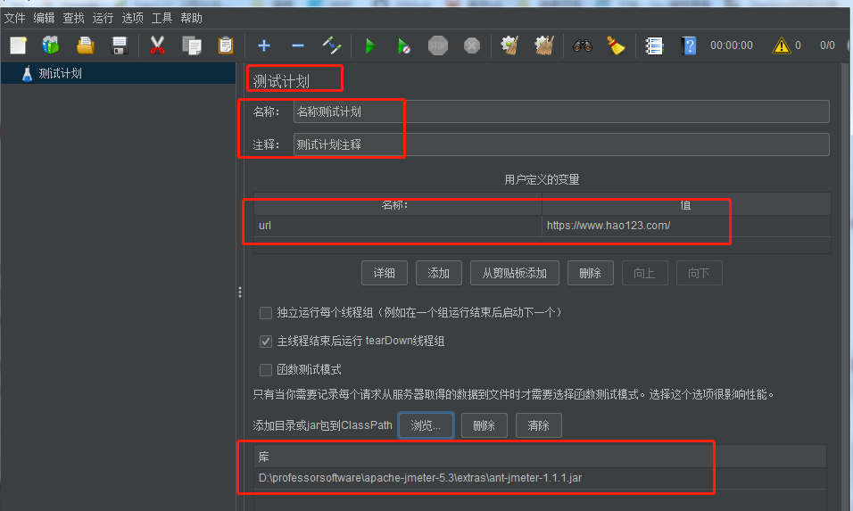
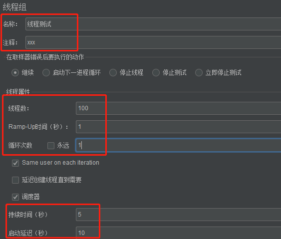
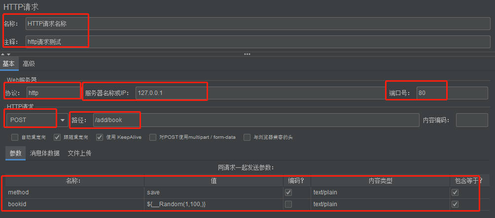
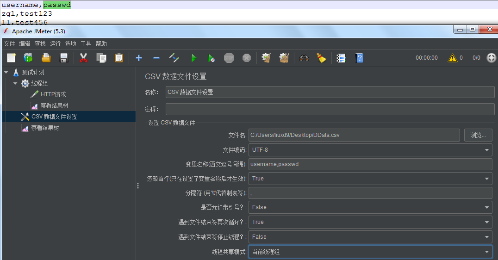
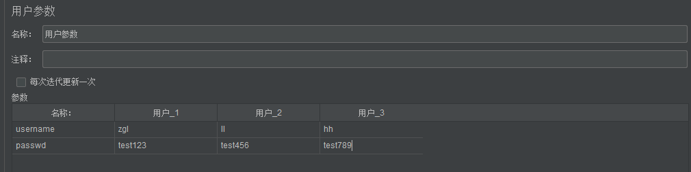

[JMeter性能测试，完整入门篇](https://blog.csdn.net/u012111923/article/details/80705141)

### 1  环境安装步骤

```shell
# https://zhuanlan.zhihu.com/p/93567044
1 java jdk安装
1）下载jdk: https://www.oracle.com/java/technologies/javase-downloads.html 
2）设置环境变量：
JAVA_HOME   D:\professorsoftware\javajdk  # jdk的安装路径
path  D:\professorsoftware\javajdk\bin    # %JAVA_HOME%\bin;%JAVA_HOME%\jre\bin
CLASSPATH D:\professorsoftware\javajdk\lib # .;%JAVA_HOME%\lib;%JAVA_HOME%\lib\tools.jar
3）查看是否安装成功:java -version

2 jmeter安装和配置
1）下载jmeter： http://jmeter.apache.org/download_jmeter.cgi，解压（无中文路径下解压）
2）配置环境变量
JMETER_HOME D:\professorsoftware\apache-jmeter-5.3
CLASSPATH D:\professorsoftware\apache-jmeter-5.3\lib\ext\ApacheJMeter_core.jar
		 D:\professorsoftware\apache-jmeter-5.3\lib\jorphan.jar
		 D:\professorsoftware\apache-jmeter-5.3\lib  # 未发现logkit-2.0.jar
3）启动D:\professorsoftware\apache-jmeter-5.3\bin路径下的 jmeter.bat（linux jmeter.sh）
# 中文设置： options——choose language——简体中文 或 打开jmeter.properties配置文件，修改language=zh_CN
# jmeter默认按照ISO-8859-1编码格式进行解析，修改为utf-8, 防止中文乱码

3 jmeter插件安装  https://jmeter-plugins.org/install/Install/
D:\professorsoftware\apache-jmeter-5.3\lib\ext  # 下载外部jar包存放位置
```

### 2 jmeter概述

[jmeter入门教程](http://www.manongjc.com/article/99228.html)

使用建议：Don't use GUI mode for load testing !, only for Test creation and Test debugging.

- **可以做什么？**  接口测试、性能测试、压力测试、数据库测试、java程序测试。

- **优缺点？**
  优点：开源免费；支持多协议（http、jdbc）；轻量级；功能强大。操作方便，容易掌握。完全swing、完全多线程、支持脚本取样器。
  缺点：无法验证js程序；无法验证页面ui；因为需要配合selenium配合完成web2.0应用的测试。

- **组成部分？**
  
  负载发生器(产生负载，多进程或多线程模拟用户行为)；
  
  用户运行器(脚本运行引擎，根据脚本模拟指定用户的行为)；
  
  资源生成器(生成测试过程中的服务器和负载机的资源数据)；
  
  报表生成器(根据测试中的数据生成报表，提供可视化的数据显示方式)。
  
- **目录结构介绍？**
  1) bin目录
  examples 目录中有csv样例
  jmeter.bat windows启动文件; jmeter.sh linux启动文件;
  jmeter.log jmeter运行日志文件
  jmeter.sh  linux启动文件
  jmeter.properties 　　  系统配置文件 # 修改需重启jmeter才会生效
  jmeter-server.bat      windows分布式测试要用到的服务器配置
  jmeters-server         linux分布式测试要用的服务器配置
  系统配置jmeter.properties文件中的SSL设置重点关注如下几个：

  指定HTTPS协议层（ hhtps=http+ssl） ： https.default.protocol=TLS

  指定SSL版本： https.default.protocol=SSLv3

  设置启动的协议： https.socket.protocols=SSLv2Hello SSLv3 TLSv1

  缓存控制，控制SSL是否可以在多个迭代中重用：https.use.cached.ssl.context=true

2)docs目录 : 接口文档目录。例C:\apache-jmeter-3.0\docs\api下的index.html
3)extras目录: 扩展插件目录。
4)lib目录所用到的插件目录，里面均为jar包。jmeter会自动在jmeter_HOME/lib和ext目录下寻找需要的类，lib下存放JMeter所依赖的外部jar，如：httpclient.jar、httpcore.jar、httpmime.jar等。
其中lib\ext目录下存放有Jmeter依赖的核心jar包，ApacheJMeter_core.jar、ApacheJMeter_java.jar在写client端需要引用，JMeter插件包也在此目录下。
lib\junit下存放junit测试脚本。
5)licenses目录: jmeter证书
6)printable_docs目录:jmeter用户使用手册，例C:\apache-jmeter-3.0\printable_docs下的index.html

### 3  jmeter使用

**体系结构：**

x1： （采样器+监听器+断言：三者组合在一起可以完成发送请求，验证结果，记录结果的工作）
采样器（向服务器发送http请求，接收服务器的相应数据）
断言（判断请求是否成功，返回结果是否正确）
监听器（用来收集测试结果，即添加结果监听和展示结果，监听器组件也有多种元件）

x2：（前置处理器+配置元件+后置处理器，都是为采样器提供数据支持的，而采样器关注的是业务逻辑）
前置处理器：来完成请求发送前的一些环境或者参数的准备工作，比如操作数据库前需要建立一个数据库连接。
配置元件 ：为采样器提供预备数据，比如做参数化、生成动态数据等。
后置处理器：后置处理器用来处理服务器响应中的数据，比如获取登录后的session_id，后置处理器一般放在采样器之后。

x3：
控制器: 用来控制采样器的执行逻辑，如执行顺序、执行次数等，各种控制器组合在一起，也能完成各种奇葩等需求；
定时器: 用来完成集合的功能，比如为了足够真实地模拟用户负载，会需要模拟这些请求在同一时刻发送，定时器也有很多种类的元件。
线程组: 用来模拟大量用户负载的情况，可以设置运行的线程数（一个线程一个用户）、运行时长、定时运行等；


[**Jmeter工具使用**](https://www.jianshu.com/p/9868c49224c5)

[jmeter入门教程](http://www.manongjc.com/article/99228.html)

####  3.1 jmeter小例子

Jmeter的所有任务都必须由线程处理，所有任务都必须在线程组下面创建。

- **添加测试计划 ：**描述一个性能测试，包含本次测试的所有相关功能。

- **添加线程组** （鼠标在测试计划上—》右键—》添加—》线程用户—》线程组）

- **添加http请求**（鼠标在线程组—》右键—》取样器—》http请求）：

   请求头常见格式：application/x-www-form-urlencoded格式 key1=value1&key2=value2; application/json; multipart/form-data 

- **配置http请求：**修改名称，填写协议，服务器域名

- **添加察看结果树：**（鼠标在线程组—》右键—》监听器—》http请求）

- **保存 xxx.jmx文件**

#### 3.2 测试计划元件

测试计划(Test Plan)是使用 JMeter 进行测试的起点，它是其它 JMeter 测试元件的容器。

**名称：**为测试计划起一个有意义的名称；**注释：**测试计划的注释；

**用户定义的变量：**${变量名}引用,在需要https://www.hao123.com/时直接用${url}即可；

**Add directory or jar to classpath**：向类路径即%JMETER-HOME%\lib中添加目录及jar包。



- **线程组（名称：为线程组起名称）**

  - **线程属性-线程数**:设置发送请求的用户数目，即并发数。模拟的用户数 200个线程就是模拟200个用户。

  - **线程属性-Ramp-Up Period(in seconds)**: 设置线程多长时间全部启动。若线程数为200，启动时长为10，则1秒需要启动20个线程。

  - **线程属性-循环次数（线程数的循环）**：每个线程发送的请求次数；若线程数为200 ，循环次数为10 ，总请求数：200*10=2000次；

  - **调度器配置－持续时间**：测试计划持续多长时间，会覆盖结束时间。

  - **调度器配置－启动延迟**：测试计划延迟多长时间启动，会覆盖启动时间。

  

- **取样器**：向服务器发送请求，记录响应信息，记录响应时间的最小单元，支持多种不同的取样器，如（http、ftp、tcp等）。以http请求为例（名称；web服务器:协议、ip、端口等；同请求一起发送的参数：**需用到参数化和动态数据关联**；同请求一起发送的文件：可以制定同请求一起发送哪个文件；）。

  

- **逻辑控制器**

  可以自定义jmeter发送请求的行为逻辑，它与sample结合使用可以模拟复杂的请求序列。

  

  

- **配置元件**：维护Sampler需要的配置信息，并根据实际的需要会修改请求的内容。我们主要在参数化中用到**CSV Data Set Config**。

  用于提供对静态数据配置的支持。CSV Date Set Config可以将本地数据文件形成数据池（Date Pool），而对应于HTTP Request Configuration和TCP Request Sample等类型的Configuration元件则可以修改这些Sample的默认数据等

- **定时器**：用于操作之间设置等待时间，等待时间使性能测试中常用的控制客户端QPS的手段，jmeter定义了Constant Times、Constant Throughput Times、Guass Ramdon Times等不同类型的Times

- **前置处理器**：实际请求发出之前对即将发出的请求进行特殊处理，常常用来修改请求的设置。

- **后置处理器**：一般用来提取响应中的特定数据（类似loadrunner中的关联）。**主要在动态关联中，用到后置处理器的表达式。**

- **断言**：用于检查测试中得到的响应数据等是否符合预期，Assertions一般用来设置检查点，用以保证性能测试过程中的数据交互与预期一致。

- **监听器：**对测试结果进行处理和可视化展示的一系列组件，常用的有图形结果、查看结果树、聚合报告等。**常用的监视器有'查看结果树'和'聚合报告'**

- **测试片段:**一种特殊的线程组，在测试树上与线程组一个层级，但它不被执行，除非它是一个模块控制器或者被控制器所引用时才会被执行；

#### 3.3 jmeter运行原理

- 以线程的方式运行，运行在jvm虚拟机上。每个进程开销大，若以进程的方式运行的话，每台负载机上的进程数量就不允许太多，并发高时会需要大量的负载机做测试，显然不够经济。
- jmeterGUI模式运行测试脚本对电脑本身的资源消耗较大，无法实现大的并发和压力测试。使用GUI模式主要目的是编写和调试jmeter测试脚本。非GUI模式100个线程可以产生100TPS的负载，而GUI模式只能产生80TPS的负载。
- 使用命令行模式实现高并发和压力测试。
- 本地运行和远程运行 
  本地运行:只有一台jmeter机器，所有的请求从一台机器上发出。
  远程运行:一台JMeter控制机（Master）控制远程的多台机器（Slave）来产生负载；控制机也可以参与脚本的运行，同时担负着管理和指挥远程的负载机运行的任务，并且收集远程的负载机的测试结果。

#### 3.4 jmeter测试计划要素

- 测试计划
- 至少要有一个线程组
- 在线程组中至少有一个取样器
- 测试计划中必须要有监听器

#### 3.5 jmeter脚本制作

##### 	3.5.1 jmeter录制脚本

- **badboy录制**

  -  [安装badboy](http://www.badboy.com.au)

  - 打开badbody，在地址栏输入录制地址，回车

  - 操作完成，点击停止记录，导出脚本（ save或者export to jmeter，将文件保存为jmeter的脚本格式：.jmx；启动jmeter，打开刚录制保存的文件，就可以进行测试了）。

    在jmeter中打开已有jmx文件，选择文件路径，进行打开。不需要的页面可以删掉或者禁用。

    

    **备注：**录制常见问题如下（`badboy脚本里设置好的东西（比如参数化、检查点）是不会带到jmeter里的，只能录制基本的东西，导入到jmeter里还需要重新调试`）

    1）提示脚本错误，解决方案：直接点击脚本提示“是”即可；IE浏览器，在Internet选项>高级属性>浏览器标签>选中禁止脚本调试。

    2）版本不一致：解决方案：排查badboy和jmeter版本不匹配，把badboy升级到最新版。

    3）录制后的脚本，在导入Jmeter后会使线程组的循环次数失效：解决办法：先将循环控制器改成其他任一类型控制器，然后再改回来。

- **利用jmeter自身代理录制（原生http代理服务器录制）**

  - 配置jmeter
    - 1 打开jmeter创建新的测试计划
    - 2 在测试计划下右键添加线程组
    - 3 添加http代理服务器（在测试计划下右键—》非测试原件—》http代理服务器）
    - 4 配置http的代理服务器 （端口默认8888；机器本地ip或localhost；目标控制器—》线程组；点击启动按钮，点击ok）
  - 配置手机或者浏览器代理服务器ip和端口进行录制
  
    - 录制APP端脚本：无线设置》WLAN》链接对应的无线网络》点击链接的无线网络》配置代理
  - 浏览器设置:设置-高级设置-打开代理设置-局域网设置-代理服务器
  
- **安装浏览器插件实现脚本录制（ BlazeMeter 插件）**

##### 3.5.2 通过Fiddler抓包导出Jmeter脚本

  - 下载插件，将FiddlerExtensions.dll、FiddlerExtensions.pdb 放置到Fiddler的安装目录下的ImportExport里面。
  - 抓包。
  - 导出抓包请求为jmx格式，点击File，选择 Export Sessions ，根据需求选择 All Sessions 或者 Selected Sessions，在弹出框的下拉菜单中选择JMeter，然后保存即可。
  - 在JMeter中打开jmx文件。

  ##### 3.5.3 手写脚本

1 添加测试计划 2 创建线程组 3 添加http请求 4 配置http请求 5 添加查看结果树 6 保存 xxx.jmx文件

### 4 jmeter接口测试回顾

#### 4.1 发送http请求

- 三要素：请求地址，请求参数，返回值 

- http请求配置（http默认端口80；https默认端口443；）

  协议；域名；端口；请求方式；接口地址；内容编码utf-8；参数（针对post请求参数是x-www-urlencode格式或form-data格式）；消息体数据；文件上传接口；

- http管理器（HTTP信息头管理器：content-type）

- http请求默认值（线程组—》添加—》配置元件—》请求默认值）：将同一线程组下的所有http请求和服务器域名做统一的管理。

- http协议请求方式：

  - GET  不带参数，带参数
  - POST x-www--form-urlencoded 参数类型，键值对； json格式
  - PUT
  - DELETE 

#### 4.2 http请求参数化

数据驱动测试(DDT):脚本在运行时根据需要选取不同的参数作为输入值; 数据池（Data Pool）: 参数的取值范围。
https://www.cnblogs.com/imyalost/p/6229355.html
csv传参 (动态传参)。

- 参数化：根据需求动态获取数据，进行动态赋值的过程。

- jmeter参数化方式？  **应用变量方法：** **${变量名}**

  - **1）csv数据控件**  ：**适用于需要有大量测试数据的前提**，如系统增加100条数据，设置1000个用户登录等。

    - 1 创建测试计划；2 创建线程组；3 在测试计划添加csv Data set config组件；4 在线程组添加http请求；添加结果树，查看结果。   **${username}**  **${passwd}**

      

    备注：有3组数据，线程数写3。

  - **2）用户参数化：使用与少量测试数据，位置处于前置处理器中**

    - 位置：http请求—》添加—》前置处理器—》用户参数—》

    - 配置用户参数?（添加变量名；添加用户：一个用户就是一组测试数据）
    - 使用用户参数？在http请求中引用变量${username}；在线程组中设置线程数，线程数的值和用户参数的用户数目保持一致。

    

    

  -  **3）用户定义的变量参数化，适用于常量配置、数据库地址和测试环境地址配置等**

    - 用户定义的变量位置（1 测试计划 2 配置原件—》用户定义的变量）
    - 配置：添加变量
    - 使用：凡是输入的位置，都可以使用该变量

#### 4.3 jmeter mysql实践

导数据库驱动包， 配合好mysql相关地址。

配置mysql的最大连接数，最大等待时间，db连接的相关配置（db url;jdbc driver class;用户名和密码）

#### 4.4 jmeter关联

先完成某个操作，获得某个值或者数据信息才可以进行下一步的操作(关联/将上一个请求的响应结果作为下一个请求的参数)

- 正则表达式提取器（后置处理器中找到）： 提取出来，可以根据变量的值进行引用。

  ```she
  正则表达式提取器：
  {"code":0,"msg":"ok","data":{"aggs":{},"cost":2,"docs":[{"_id":"D_E_cnQBjd-zimz4erbu","brand":"长虹","color":"红色","price":1000}],"total":8}}
  
  "msg":(.*?),
  ```

- xpath提取器

  

#### 4.5 jmeter响应断言

[**JSON与JSONPath提取器语法**](https://zhuanlan.zhihu.com/p/72918260?from=singlemessage)

```shell
{ "store": {
    "book": [ 
      { "category": "reference",
        "author": "Nigel Rees",
        "title": "Sayings of the Century",
        "price": 8.95
      },
      { "category": "fiction",
        "author": "Evelyn Waugh",
        "title": "Sword of Honour",
        "price": 12.99
      },
      { "category": "fiction",
        "author": "Herman Melville",
        "title": "Moby Dick",
        "isbn": "0-553-21311-3",
        "price": 8.99
      },
      { "category": "fiction",
        "author": "J. R. R. Tolkien",
        "title": "The Lord of the Rings",
        "isbn": "0-395-19395-8",
        "price": 22.99
      }
    ],
    "bicycle": {
      "color": "red",
      "price": 19.95
    }
  }
}


$..author  所有作者
$.store.*  商店里的所有东西，包括一些书和一辆红色自行车
$.store..price  所有价格
$..book[2] 第2本书
$..book[?(@.isbn)] 
```

### 5 jmeter命令行测试

[linux模式下生成测试报告](https://www.cnblogs.com/imyalost/p/9808079.html)

GUI模式多用来创建脚本或者debug，执行测试建议在非GUI模式下运行。jmeter由java开发，实际运行在jvm中，GUI模式运行需要耗费较多的系统资源，一般来说，GUI模式要占用10%-25%的系统资源。非GUI模式降低资源消耗，提升单台负载机所模拟的并发数。

1）将本地生成的jmx文件上传到服务器
2）linux jmeter脚本运行
jmeter -n -t /home/jessica/httpThread.jmx -l log.jtl，查看结果 
-n 以NoGUI方式运行脚本
-t 后要运行的 JMeter 测试脚本文件 
-l 后面接日志名称保存运行结果
-r 在Jmter.properties文件中指定的所有远程服务器
-H 设置 JMeter 使用的代理主机
-P 设置 JMeter 使用的代理主机的端口号

**结果分析：**summary =      1 in 00:00:02 =    0.5/s Avg:   692 Min:   692 Max:   692 Err:     0 (0.00%)

执行了1条用例，错误率为0。

3）报告查看
打开Jmeter GUI界面——在测试计划下，添加对应的测试报告元件，此处演示，增加了：聚合报告、查看结果树、Summary Report测试报告——在所有数据写入一个文件，浏览中选择对应的日志文件——下面就会有对应的表格展示

- 生成html可视化报告 (jmeter引入了Dashboard Report模块，用于生成HTML类型的可视化图形报告)

1)利用已有的.jtl文件生成报告
jmeter -g test.jtl -o /path

-g：后跟test.jtl文件所在的路径

-o：后跟生成的HTML文件存放的路径

2)无.jtl生成测试报告
如果还未生成.jtl文件，则可以通过如下命令，一次性完成测试执行和生成HTML可视化报告的操作，进入jmeter的bin目录下，输入如下命令：

jmeter -n -t test.jmx -l test.jtl -e -o /path

-n：以非GUI形式运行Jmeter 

-t：source.jmx 脚本路径 

-l：result.jtl 运行结果保存路径（.jtl）,此文件必须不存在 

-e：在脚本运行结束后生成html报告 

-o：用于存放html报告的目录

windows下运行指令： jmeter.bat -n -t D:\jmeter\code\查询接口测试.jmx  -l test.jtl -e -o  D:\jmeter\code\  

### 6 jmeter分布式测试原理及步骤

jmeter的GUI模式下（Windows），最多支持300左右的模拟请求线程，再大的话，容易造成卡顿、无响应等情况，这是限于jmeter其本身的机制和硬件配置。支持分布式压测，将大量的模拟并发分配给多台压力机，来满足大流量的并发请求场景。

- **原理**

选择一台作为管理机（Contorller或master），其他的机器作为测试执行的代理机（Agent或slave）；
执行测试时，由Contorller通过命令行将测试脚本发给Agent，然后Agent执行测试（不需要启动GUI），同时将测试结果发送给Contorller；
测试完成，可以在Contorller上的监听器里面看到Agent发来的测试结果，结果为多个Agent测试结果汇总而成；

- 步骤
修改管理机配置 remote_hosts=127.0.0.1,127.0.0.2:80,127.0.0.3:80  （其中127.0.0.2和127.0.0.3为Agent机的IP）；
启动jmeter后，设置线程组、配置元件、取样器、监听器等原件，点击"运行-远程启动",可以选择远程启动一个Agent机，或者选择远程全部启动，这样，就可以进行分布式测试了。
如果1S启动100个模拟请求，有5个Agent机，那么需要将脚本的线程数设置为20。

  

### 7 jmeter常见问题及解决办法

```shell
# jmeter常见问题及管理办法
1)请求响应乱码: jmeter.properties文件中的一个属性：将encoding=后面的编码格式改为utf-8 或者指定content encoding编码格式为utf-8
2)内存OOM（OutOfMemoryError：内存溢出）：执行压力测试，会内存溢出，JMeter是一个纯Java开发的工具，内存是由java虚拟机JVM管理；如果出现了内存溢出的问题，可以通过调整JVM内存相关的参数进行优化(备注:调整后记得重启服务)。
调整堆内存的大小：将默认的set HEAP=-Xms512m -Xmx512m，调整为set HEAP=-Xms1024m -Xmx1024m；
调整堆内存中新生带的大小：将默认调整为set NEW=-XX:NewSize=256m -XX:MaxNewSize=256m；
调整堆内存中永久带的大小：将默认调整为set PERM=-XX:PermSize=128m -XX:MaxPermSize=256m；

内存泄露：指应用资源没有及时释放，导致内存中持有了不需要的资源,是一种状态描述。
内存溢出：指你的内存不能满足正常使用了，堆栈已经达到系统设置的最大值。
在利用jmeter测试过程中，出现这个提示：java.lang.OutOfMemoryError: Java heap space：意思就是堆内存溢出，不够用了。
堆heap：存储函数的参数值、局部变量等值;队列优先，先进先出;new分配的内存，速度较慢，存放到二级缓存中，生命周期由垃圾回收算法决定。优点（动态分配内存，垃圾回收期自动回收）。缺点（存储较慢，受系统的虚拟内存的影响）。
栈stack：存放对象，先进后出。使用一级缓存，由系统自动分配。

3) listen使用技巧:
listener作为一个收集sampler的结果数据和呈现结果的文件，其本身会在每次sampler运行完成后执行一次，即一个test plan中的listener数量越多，运行时listener本身带来的资源消耗就越大。
去掉listener，为sampler添加断言（一般是响应断言），根据断言结果来判断请求是否成功，测试报告以plugins插件中的报告形式或文本形式写入文件中来提升测试效率。

# 阶梯式加压测试及jmeter相关插件
Stepping Thread Group 插件
下载https://jmeter-plugins.org/downloads/old/JMeterPlugins-Standard.jar，包放在jmeter安装目录的jmeter-3.0\lib\ext路径下，重新启动jemter即可。
```

### 8 性能测试报告格式

1)测试对象拓扑结构
2)测试环境
服务器环境: 主机地址 操作系统 处理器 内存 硬盘 带宽  备注
负载机环境: 主机地址 操作系统 处理器 内存 硬盘 带宽  备注
3)测试数据
编码实现执行搜索与推送，并参数化操作数据
4)测试设计
4.1 测试方案
使用LR工具模拟用户调用搜索数据接口和推送数据接口操作;使用nmon工具监控服务器所使用的资源。
4.2 测试场景
用户同步调用推送数据接口
用户同步调用搜索数据接口
4.3 性能指标
搜索响应时间在1秒以内的最大并发数
5)测试结果
5.1 搜索数据接口 
用户并发量  最小响应时间  最大响应时间  平均响应时间  90%用户响应时间
4000用户并发事务响应时间
6000用户并发事务响应时间
8000用户并发事务响应时间
1w用户并发事务响应时间
2w用户并发事务响应时间
6)结果分析
6.1 搜索数据接口
cpu利用率偏低，在2w用户并发时，cpu利用率约为40%，另外若加大并发用户数，将导致cpuwait出现。
6.2 推送数据接口
2000个用户并发，服务器响应时间在1秒以内，服务器资源cpu wait值非常高，由Avg disk tps during an interval  和 Max disk tps during an interval监控值可知，磁盘访问存在性能问题，测试时发现url推送时会出现大量解析附件失败。
7)改进与建议
8)测试结论
根据当前配置下的性能指标（平均最长响应时间小于1秒）得出：
搜索接口：最大用户并发数适合12000个。
推送接口：继续进行性能调优。


