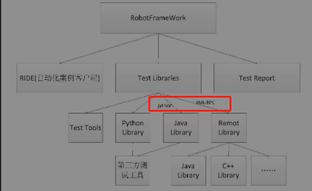
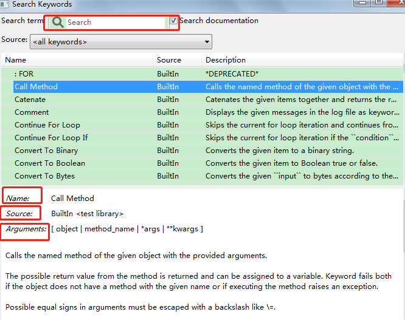
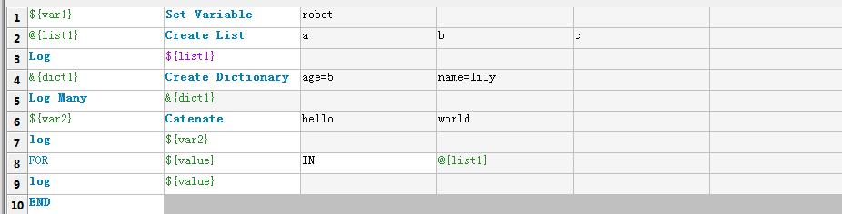
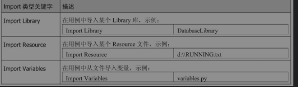
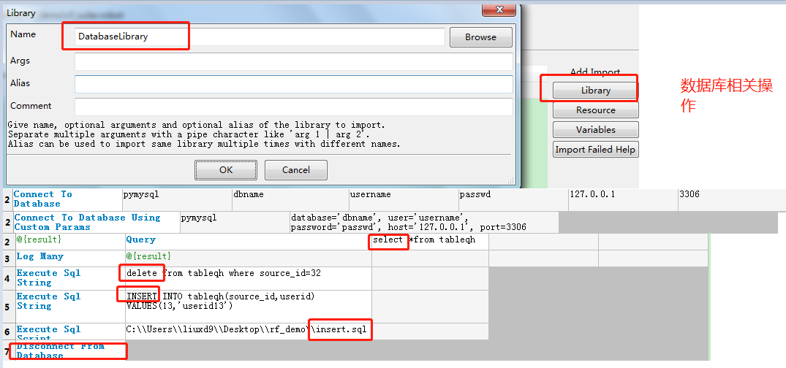
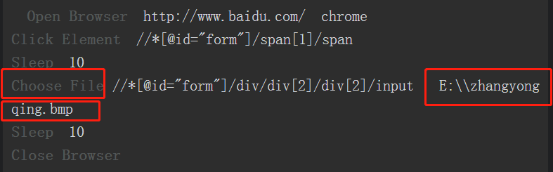
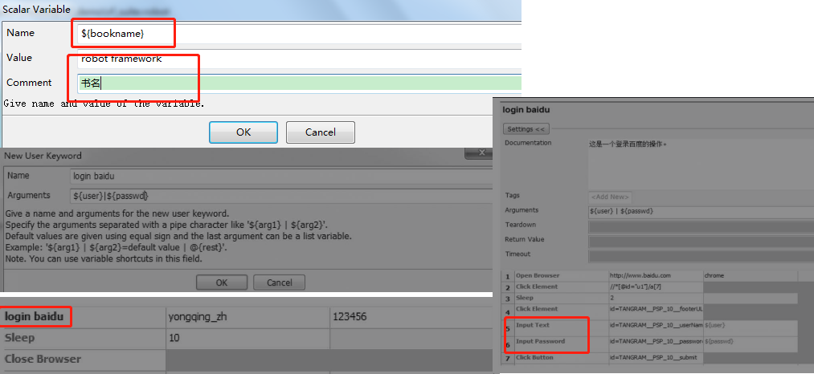
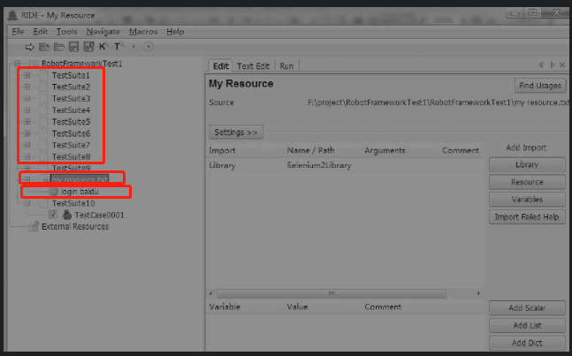
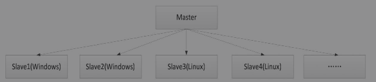

# 1 初始Robot Framework

基于python语言设计的、可扩展、关键字驱动模式的测试自动化框架。具备良好的扩展性（可支持xml-rpc服务扩展支持其它的常用编程语言，可同时测试各种类型的客户端或接口，可支持进行分布式测试执行）

- **rf特点**

  易于使用，采用表格式输入语法以及统一的测试用例格式。

  重用性好，可利用现有关键字来组合新的用户自定义关键字。

  支持资源文件，支持多种变量类型，包括字符串变量、list列表变量、dic字典变量等。

  测试用例执行结果报告和日志采用HTML格式，易于阅读和邮件转发。

  提供标签以分类来选择被执行的测试用例，使得测试用例的选择更加灵活。

  支持web界面测试、web接口服务测试、GUI测试、多种终端测试。

  支持多种数据库操作，包括常用的关系数据库和非关系数据库。

  易于扩展自定义的lib库，可以通过Python或者Java等其他开发语言来动态扩展Lib库。

  

- **robotframework组成**

  由客户端RIDE、测试库、测试报告组成。

  


## 1.1 如何创建一个自动化项目

**robotframe工具：** [RIDE](https://pypi.org/project/robotframework-ride) , 插件工具（pycharm下载 intelliBot 插件；jekins plugin等）。

- **ride安装方法**

  pip install robotframework-ride 或者 下载Ride工具包进行离线安装。

- **ride编辑器的使用**

  1）创建测试项目RF_DEMO 

  File→New Project，Name文本框中输入项目名，Type选Directory，单击OK，即可创建成功。

  2）创建测试套件： 选择该测试项目，右击鼠标键，选择New Suite，输入测试套件名称，即可创建成功。

  3）创建测试用例：选择该测试套件，右击，选择New Test Case，输入用例名称，单击OK，创建成功。

  创建成功后，可看到下面的用例编写表格，通过该表格，可以编写测试用例。
  
  4）测试用例的执行：勾选我们的测试用例，单击菜单栏Tools→Run Tests（或者直接快捷键F8）来执行

## 1.2 Robot Framework基础关键字

- **如何搜索rf关键字**

  方法一：选择菜单栏中的Tools→Search Keywords选项。该对话框类似于关键词API的功能，提供了关键字的名称、来源库、关键字的参数和使用描述。

  


​	方法二：直接按F5快捷键，就可以自动弹出我们需要的关键字搜索框

- **常用关键字**

  关键字log：等同于python中的print函数              **log**  hello

  定义变量：通过Set Variable来定义一个变量。${var1}    **Set Variable**    robot

  定义列表：使用Create List来创建一个列表。

  定义字典：使用Create Dictionary来创建一个字典。

  拼接字符串：通过Catenate来拼接字符串。

  for循换： FOR  xxx in xx  END。

  注释关键字使用：Comment关键字是用来做注释使用的。

  return关键字：Return From Keyword关键字和很多编程语言中的return关键字一样。Return From Keyword If关键字用if条件来进行判断，当满足指定的if条件后，就执行return返回。

  **快速查询关键字：选中关键字，同时按住Ctrl+Alt组合键，即可显示该关键字的帮助API以及使用示例。**

  **快速补全某个关键字：键盘输入关键字的前缀，然后同时按住Ctrl+Alt+空格键，即可快速补全某个关键字。**

  

- **断言关键字**

  Should Be Equal关键字的使用（用来判断实际结果是否和预期结果相等）；Should Be True关键字用来判断返回值是否为True；Should Contain 关键字用来判断某个字符串中是否包含了我们预期需要的字符或者字符串等。

- **BuiltIn库剩余关键字**

  类型转换关键字(转换成bool、整型等)：Convert To Boolean。

  GET类型关键字（获取变量、获取长度、获取时间）：Get Count。

- **import关键字**

  

- **set类型关键字**

  Set Log Level    Set Global Variable   Set Variable If

- **Run Keyword类型关键字**

  

# 2 Robot Framework对数据库的操作

- **库的安装**

  **pip install -U robotframework-databaselibrary**

  **pip install PyMySQL**

- **库的导入及数据库的连接和断开以及数据库的查询**

**库的导入： Library           DatabaseLibrary**

连接数据库：Connect To Database

断开数据库：Disconnect From Database 



- **数据库其它库扩展**

  MongoDBLibrary库


# 3 http接口自动化

## 3.1 HttpLibrary.HTTP库的使用

[HttpLibrary.HTTP的下载和安装](https://github.com/peritus/robotframework-httplibrary/#readme)

pip install --upgrade robotframework-httplibrary

导入库：HttpLibrary.HTTP


Create Http Context：关键字其作用相当于创建了一个HTTP调用的环境。接收两个参数：host和scheme。

**使用说明暂时略**

## 3.2 RequestsLibrary库的使用

- **库的安装**

  pip install -U  requests  

  pip install -U robotframework-requests  # 用于进行接口自动化测试 

- 关键字用法讲解

  Create Session：关键字用来向HTTP服务端创建一个Session。

  Get Request：关键字用来在创建好Session的基础上向服务端发送一个get请求。

  Post Request：关键字用来在创建好Session的基础上向服务端发送一个post请求。

  [在线http模拟示例](https://getman.cn/)

  ```shell
# 示例
  *** Settings ***
  Library           RequestsLibrary
  
  *** Variables ***
  ${vt}             robot    # 具体的变量
  
  *** Test Cases ***
  rf_http_requestlib_case
      Create Session    RobotFramework    http://robotframework.org
      ${resp}=    Get Request    RobotFramework     /#libraries
  
  rf_http_requestlib_case2
      ${headers}    Create Dictionary    Accept=text/html,application/xml;q=0.8
      ${param}    Create Dictionary     tel=18680673197
      Create Session    tcc    https://tcc.taobao.com    ${headers}
      ${resp}=    Get Request    tcc    /cc/ json/mobile_tel_segment.htm    ${headers} \     ${param}
      Log    ${resp}
  
  rf_http_requestlib_post_case
      ${data}    Create Dictionary    book=RobotFramework
      Create Session    getman    https://getman.cn
      ${resp}=    Post Request    getman    /echo    ${data}
      log    ${resp}
  ```
  
  

## 3.3 RESTinstance库的使用

- **库的安装**

  pip install --upgrade RESTinstance

- **库的导入和使用**

  Library           REST

  

# 4 移动手机自动化测试

- **Appium概述**

`Appium是一个开源、跨平台的自动化测试工具，可以用来测试Native及混合的移动端应用，Appium可以支持IOS、Android及FirefoxOS平台。它把IOS、Android等自身提供的第三方框架都封装成了一套API，即WebDriver。`

**Appium核心：**是一个web服务器，提供了一套REST的接口。它收到客户端的连接，监听到命令，接着在移动设备上执行这些命令，然后将执行结果放在http响应中返回给客户端。

[Appium下载地址](http://appium.io/downloads.html)					[Appium官网](http://appium.io/slate/cn/master/)

- **Appium真正的工作引擎**

其真正的工作引擎为第三方自动化框架。ios：苹果的UIAutomation。Android 4.2+：谷歌的UiAutomator。Android 2.3+：谷歌的Instrumentation。Instrumentation由单独的项目Selendroid提供支持。

- **Appium术语**

**session**：Appium自动化建立在一个Session上运行，客户端初始化一个Seesion来与服务端进行请求和交互，客户端会发送一个POST请求给服务端，请求中包含一个JSON对象，被称作“desired Capabilities”。然后，服务端就会开启一个自动化的Session，并且返回一个Session ID给客户端，客户端的后续请求都会带上该Session ID给服务端做识别。

**Desired Capabilities**：是一些键值对的集合 (比如，一个map或者hashmap），客户端将这些键值对发给服务端，告诉服务端需要怎么执行测试。比如，我们可以把platformNamecapability设置为Android，告诉Appium服务端，我们想要一个Android的Session，而不是一个iOS的。也可以设置safariAllowPopupscapability为True，确保在Safari自动化Session中可以使用JavaScript来打开新窗口。

**Appium Server**：是基于Node.js实现的，可以使用NPM直接安装。


## 4.1 Appium Library库的使用

1）预先安装好Appium自动化工具 [Appium官网](http://appium.io/)

2）库的安装

[RobotFramework-appiumlibrary的地址](https://github.com/serhatbolsu/robotframework-appiumlibrary)

pip install robotframework-appiumlibrary


- **常用关键字介绍**

Open Application 关键字用来打开一个待测试移动APP。

Input Text关键字一般用来给输入框进行输入操作，接收[locator | text]两个参数。 

Click Button关键字用来模拟单击APP上的一个button按钮，该关键字接收一个参数[ index_or_name ]。

Clear Text关键字用来清除输入框的数据，接收一个参数[ locator ]，这里的locator指的是界面元素的定位方式。

Click Element关键字用来模拟单击APP界面上的一个元素，接收一个参数[ locator] ，这里的locator指是界面元素的定位方式。

Click A Point关键字用来模拟单击APP界面上的一个点，接收 [ x=0 | y=0 |duration=100 ]三个参数，x和y代表的是点的坐标位置，duration代表的是单击持续的时长。这三个参数如果没有传入，就会默认x=0、y=0、duration=100。

Get Contexts关键字用于获取当前所有的上下文，不需要接收任何参数。

`安卓SDK提供的Ui Automator Viewer工具来进行这个界面的资源定位。id定位或者xpath定位。`

# 5 web自动化

## 5.1 Selenium和Robot Framework Selenium2Library库介绍

[Selenium官网](http://www.seleniumhq.org/)

[Selenium的文档和介绍等信息](http://www.seleniumhq.org/docs/)

- **浏览器驱动下载**(多用谷歌或火狐)

  chromedriver 下载  版本选择:  如何为Chrome配对chromedriver，版本要一致。

- **Selenium2Library库常用关键字**

  库的导入： Library           SeleniumLibrary

  Open Browser关键字用来打开一个指定的浏览器。 Open Browser	http://www.baidu.com	chrome

  Input Text关键字用于模拟向一个输入框中输入文字内容。 Input Text	id=kw	Robot Framework

  Click Button关键字用于模拟单击页面中的按钮，接收一个参数[ locator ]。Click Button	id=su （通过id=su来定位“百度一下”这个按钮）。

  Click Element关键字用于模拟单击一个通过locator定位到的具体元素，可以是通过id或者name、xpath等。该关键字接收一个参数[ locator ]。 Click Element	id=su 

  Click Link关键字用于模拟单击一个链接。该关键字接收一个参数[ locator ] 。Click Link	http://map.baidu.com

  Add Cookie、Get Cookie和Delete Cookie关键字。

  Choose File 关键字上传文件。

  

  

# 6 编写自定义的Robot Framework Lib

备注：java和python均可以编写自定库。本例中以python为例记录。

[robotframe扩展本地库，远程库和第三方库](https://blog.csdn.net/panda62/article/details/80859008)

## 6.1 python编写自定义lib库

- **自定义库方式**
  1)代码含有类名必须和文件名一致MyKeywords.py
  2)代码块不含类名，此时文件名没有特殊要求

- **自定义库的引用**

  若文件放在文件夹site-packages下面则可以直接通过文件名 MyKeywords.py引用; 
  若放在别的目录，则通过绝对路径引用，例如../customlib/NewLibrary/MyKeywords.py, 注意斜线而不是反斜线。

- **自定义库创建步骤**

  1) 在customlib目录下建立库文件文件夹 NewLibrary
  2) 在 NewLibrary 内建立 MyKeywords.py 文件, 这个文件里面写自己的关键字（既方法），注意各种索引
  class MyKeywords(object):
      def __init__(self):
          pass

  ```python
  def print_msg(self, msg):  # 方法也可以定义 print_msg, 大小写不用太在意, RF最后都会把这个方法处理成关键字 Print Msg
      print(msg)
  ```

  3) 在MyLibrary 内建立 __init__.py 文件; 如下文件内容模板，注意类名要与库文件夹名称一致。
  from  study_cs.customlib.NewLibrary.MyKeywords import  MyKeyword
  version = '1.0'
  class NewLibrary(MyKeywords):
      ROBOT_LIBRARY_SCOPE = 'GLOBAL'

  4） RIDE中导入库，用文件夹名字导入即可。
  备注 : 文字注意utf-8转义

  ```shell
  # 采用自定义库ExcelUtil.py，读取excel测试用例
  *** Settings ***
  Library           E:/work/python_work/robotframe_expls/customlib/NewLibrary/ExcelUtil.py
  
  *** Test Cases ***
  rf_customlib_case
      ${list}    ExcelUtil.Get Excel Bysheetname    D:\\资源优化调整清单_优化实施.xlsx
      log    ${list}
  ```

  `备注：Library放到Python的Lib\site-packages目录下了,在RIDE中就可以直接导入我们定义的名称为ExcelLibrary的Library了`

## 6.2 远程库（remote lib）

为了解决本地自动化测试环境安装多个Library库所带来的复杂工作量，RobotFramework设计了通过Remote的方式来进行远程调用。通过远程调用的方式，可以调用服务器上的远程库，调用时采用XML-RPC远程调用协议。

[远程调用接口库github地址](https://github.com/robotframework/RemoteInterface)

- **远程库使用步骤**

  1）自己定义一个远程Python接口服务端，然后将其启动起来。

  2）调用RobotRemoteServer服务的初始化方法。

  3）运行RemoteExample.py脚本，会在本地启动我们需要的远程接口服务。

  ```python
  # RemoteExample.py
  from robotremoteserver import RobotRemoteServer
  from examplelibrary import ExampleLibrary
  
  server = RobotRemoteServer(ExampleLibrary(), host='10.0.0.42', port=0,
                             port_file='/tmp/remote-port.txt', serve=False)
  server.serve()
  ```

  

# 7 自动化用例的编写技巧

- 自动化测试用例的容错性：某一条测试用例执行失败，导致整个测试用例集都执行失败或浏览器资源无法释放

- 测试数据初始化和脏数据的处理：

  DatabaseLibrary库中的Execute Sql Script关键字和Execute Sql String关键字都可以用来完成数据初始化操作和脏数据的清理操作。

  OperatingSystem库来对自动化测试用例执行过程需要的文件数据做初始化操作，以及执行完成后文件脏数据的清理。（文件的删除、目录的创建、获取文件等）

## 7.1 高效的维护自动化测试用例

**Add Scala**定义出来的测试用例集都能共用的变量。

**Add List**来定义测试用例集都共用的List变量。

- 在单个自动化测试用例中多使用变量。

- 提取复用的业务或者步骤，封装自定义的用户关键字。

  

- 封装全局可用的资源文件(封装多个测试用例集都可以重用的步骤或者变量定义，需用到resource)

  

  

# 8 自动化测试框架的设计

## 8.1 Jenkins下自动化测试的调度管理

[Jenkins官网](https://jenkins.io/)

Master节点可以用来负责Slave节点的管理、用户提交的Job的配置以及把Job分发到不同Slave节点上进行运行的调度和管理。



- **配置jenkins任务常见步骤**

  创建任务->配置任务名称->任务运行触发器->任务运行环境配置->任务执行前置工作->任务执行插件->任务执行后置工作->任务执行结果通知->接收任务执行结果->任务结束

- **在Jenkins上运行Robot Framework自动化测试用例**

  1）建立一个Robot Framework的构建任务，并在任务中配置重试次数、构建的依赖日志等。

  2）配置自己的源码管理。我们可以在这个步骤中配置测试用例的路径。

  3）配置构建触发器。顾名思义，触发器就是配置任务触发的方式、触发时间。Jenkins支持触发远程构建、其他工程构建后触发、定时构建、轮询SCM这几种构建触发方式。

  4）配置构建步骤，也就是自动化测试用例的执行步骤。构建步骤可以配置多个，每一个构建步骤都可以通过拖动的方式来调整其执行的先后顺序。

  5）构建任务结束后的操作，包括归档、继续构建其他的工程任务、记录指纹跟踪等。

## 8.2 如何做到自动化平台的设计