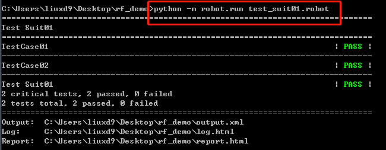

# 1 认识自动化测试

- **引入自动化测试目的**：更高的质量+更高的效率。  提高产品质量，加快测试效率。

- **自动化的必要性？**

  降低成本；节省人力时间（自动化测试系统建立了，就可以重用这些测试）；自动化测试是推动CI（储蓄集成）和DevOps的基础；准确性和可靠性；模拟人工难以实现的测试手段；增强产品快速持续迭代发布的能力；衡量质量指标（还提供了测量产品代码质量指标的功能，例如代码覆盖率、技术债、代码语义检查等）

- **手工测试和自动化测试区别？**

  手工测试有较强的异常处理能力，通过人为的逻辑判断来校验当前的步骤是否正确，同时用例的执行具有一定的步骤跳跃性，能够步步跟踪，细致定位问题。

  自动化测试执行的对象是脚本，能通过人为的逻辑判断校验当前的步骤是否正确，用例步骤之间关联性强，不像手工测试用例那么有跳跃性。

  两个并不对立，属于互补状态。自动化测试可以把更多的时间和精力放在更有价值的测试中。

- **自动化测试分类？**

  从产品类型角度：PC端产品自动化测试；web端产品自动化测试；App移动端产品自动化测试。

  从产品研发阶段角度：单元自动化；接口自动化；契约自动化测试、集成自动化测试、验收自动化测试。

- **测试三层金字塔（由上到下）？**

  1）UI测试：UI指的就是用户可以用肉眼看到的界面。原理：即基于页面元素的识别和定位来模拟用户行为。对于UI层自动化的开展，一般不建议做大规模的应用（原因：UI界面变化频繁；初期见效太慢；前端开发不规范，元素识别定位较困难）。

  2）集成或接口测试：接口测试关注的重点更多在于数据（数据处理、数据状态、数据传递），对测试工程师的编码能力要求较高，一般接口自动化测试都会用Python、Java等语言开发。

  3）单元测试：其对测试工程师的编码能力要求较高，要求测试工程师能看懂业务的实现代码。如Java有JUnit、testNG，Python有UnitTest、Pytest等。

  `备注：UI层自动化测试关注的重点是用户的操作行为是否正确;集成或接口测试关注的重点是一个函数、类（方法）所提供的接口数据是否正确；单元测试关注重点在于代码的内部实现逻辑是否正确，例如一个if分支或一个for循环的实现。`

- **什么项目适合自动化？**

  项目变动少；项目周期足够长；项目资源足够；产品型项目（每个项目只改进少量的功能）；能够自动编译、自动发布的系统；回归测试；多次重复、机械性动作；需要频繁运行测试。

- **做好自动化测试需具备的能力？**

  业务知识储备；编码开发能力；熟悉被测系统；掌握一套自动化测试框架或工具（常见的开源自动化测试框架有Selenium、Appium、Robot Framework等）；善于学习，达到知其然必知其所以然；逻辑思维能力；

- **自动化测试用途和使用场景？**

  回归测试：能够很好的验证你是否引入了新缺陷，老的缺陷是否修改过来了。

  冒烟测试：对产品主流程或环境服务连通性进行快速冒烟测试。

  每日线上巡检：构建自动化测试每日巡检，用于每日实时监测线上产品重要功能的稳定性和可用性。

  构造测试数据：构造生成大批量测试数据，为人工测试或其他（例如性能）测试提供数据上的便利。

  固化资产：通过自动化测试可固化测试资产（流程、工具、代码、文档）。

  建立测试与代码的覆盖联系：通过自动化工具能够确定测试用例的覆盖路径，确定测试用例集对程序逻辑流程和控制流程的覆盖。

- **引入自动化测试目的**：更高的质量+更高的效率。  提高产品质量，加快测试效率。

- **自动化的必要性？**

  降低成本；节省人力时间（自动化测试系统建立了，就可以重用这些测试）；自动化测试是推动CI（储蓄集成）和DevOps的基础；准确性和可靠性；模拟人工难以实现的测试手段；增强产品快速持续迭代发布的能力；衡量质量指标（还提供了测量产品代码质量指标的功能，例如代码覆盖率、技术债、代码语义检查等）

- **手工测试和自动化测试区别？**

  手工测试有较强的异常处理能力，通过人为的逻辑判断来校验当前的步骤是否正确，同时用例的执行具有一定的步骤跳跃性，能够步步跟踪，细致定位问题。

  自动化测试执行的对象是脚本，能通过人为的逻辑判断校验当前的步骤是否正确，用例步骤之间关联性强，不像手工测试用例那么有跳跃性。

  两个并不对立，属于互补状态。自动化测试可以把更多的时间和精力放在更有价值的测试中。

- **自动化测试分类？**

  从产品类型角度：PC端产品自动化测试；web端产品自动化测试；App移动端产品自动化测试。

  从产品研发阶段角度：单元自动化；接口自动化；契约自动化测试、集成自动化测试、验收自动化测试。

- **测试三层金字塔（由上到下）？**

  1）UI测试：UI指的就是用户可以用肉眼看到的界面。原理：即基于页面元素的识别和定位来模拟用户行为。对于UI层自动化的开展，一般不建议做大规模的应用（原因：UI界面变化频繁；初期见效太慢；前端开发不规范，元素识别定位较困难）。

  2）集成或接口测试：接口测试关注的重点更多在于数据（数据处理、数据状态、数据传递），对测试工程师的编码能力要求较高，一般接口自动化测试都会用Python、Java等语言开发。

  3）单元测试：其对测试工程师的编码能力要求较高，要求测试工程师能看懂业务的实现代码。如Java有JUnit、testNG，Python有UnitTest、Pytest等。

  `备注：UI层自动化测试关注的重点是用户的操作行为是否正确;集成或接口测试关注的重点是一个函数、类（方法）所提供的接口数据是否正确；单元测试关注重点在于代码的内部实现逻辑是否正确，例如一个if分支或一个for循环的实现。`

- **什么项目适合自动化？**

  项目变动少；项目周期足够长；项目资源足够；产品型项目（每个项目只改进少量的功能）；能够自动编译、自动发布的系统；回归测试；多次重复、机械性动作；需要频繁运行测试。

- **做好自动化测试需具备的能力？**

  业务知识储备；编码开发能力；熟悉被测系统；掌握一套自动化测试框架或工具（常见的开源自动化测试框架有Selenium、Appium、Robot Framework等）；善于学习，达到知其然必知其所以然；逻辑思维能力；

- **自动化测试用途和使用场景？**

  回归测试：能够很好的验证你是否引入了新缺陷，老的缺陷是否修改过来了。

  冒烟测试：对产品主流程或环境服务连通性进行快速冒烟测试。

  每日线上巡检：构建自动化测试每日巡检，用于每日实时监测线上产品重要功能的稳定性和可用性。

  构造测试数据：构造生成大批量测试数据，为人工测试或其他（例如性能）测试提供数据上的便利。

  固化资产：通过自动化测试可固化测试资产（流程、工具、代码、文档）。

  建立测试与代码的覆盖联系：通过自动化工具能够确定测试用例的覆盖路径，确定测试用例集对程序逻辑流程和控制流程的覆盖。

# 2 初始Robot Framework及RF语法

[robotframework官网](https://robotframework.org/#examples)

[robot framework中文文档最新版](https://robotframework-userguide-cn.readthedocs.io/zh_CN/latest/)

`Robot Framework变量是大小写不敏感的，并且变量中的空格和下画线将被忽略。一般建议全局变量全用大写字母，局部变量全用小写字母。`

## 2.1 Robot Framework概述

基于python语言设计的、可扩展、关键字驱动模式的测试自动化框架。具备良好的扩展性（可支持xml-rpc服务扩展支持其它的常用编程语言，可同时测试各种类型的客户端或接口，可支持进行分布式测试执行）

- **rf特点**

  易于使用，采用表格式输入语法以及统一的测试用例格式。

  重用性好，可利用现有关键字来组合新的用户自定义关键字。

  支持资源文件，支持多种变量类型，包括字符串变量、list列表变量、dic字典变量等。

  测试用例执行结果报告和日志采用HTML格式，易于阅读和邮件转发。

  提供标签以分类来选择被执行的测试用例，使得测试用例的选择更加灵活。

  功能全面，支持web界面测试、web接口服务测试、GUI测试、多种终端测试。

  支持跨平台运行，如Windows、Linux、Mac OS。

  支持多种数据库操作，包括常用的关系数据库和非关系数据库。

  易于扩展自定义的lib库，可以通过Python或者Java等其他开发语言来动态扩展Lib库。

  易于集成，提供了命令行接口和基于XML的输出文件，支持持续集成（CI），如Jenkins、Maven等的集成。

  强大的数据驱动，支持外部数据文件、变量文件、资源文件。

  **不足：**自定义HTML报告较为麻烦；框架有自身的一套语法有一定的学习成本；不支持即时断点、逐行调试跟踪功能，调试时，无法像IDEA这类工具一样方便。

- **robotframework组成**

  由客户端RIDE、测试库、测试报告组成。

  

- **RF基本库、扩展库和内建工具**

  *基本库*：如 Builtin：提供内置常用的关键字。String：用于生成、修改、验证字符串的库。

  *扩展库*：如 DatabaseLibrary：用于数据库测试的库，分为Java和Python两类库，一般默认是基于Python的库。HttpLibrary.HTTP：用于使用请求进行HTTP级别测试的库。Selenium2Library：使用Selenium 2的Web测试库，用于Web UI自动化测试。

  *内建工具*：Libdoc：用于为测试库和资源文件生成关键字文档的工具。Testdoc：基于Robot Framework测试用例生成高层次HTML文档的工具。

- **RF编辑器**： RIDE：独立的Robot Framework测试数据编辑器。

## 2.2 RF自动化环境搭建

[Robot Framework 自动化测试框架安装](https://www.jianshu.com/p/985331427cbe)

[Robot Framework 安装配置](https://www.jianshu.com/p/9dcb4242b8f2)

[使用pycharm编写和运行RF脚本](https://blog.csdn.net/CCGGAAG/article/details/77529724)

**1）安装python**

[Python安装包下载](https://www.python.org/downloads/)，一路next，安装完成后配置环境变量，将 <python_path> 和 <python_path>\Scripts 加入环境变量PATH系统变量中即可（C：\Python36和C：\Python36\Scripts添加到系统环境变量Path后面）

**备注：**pip是一个安装和管理Python包的工具，通过pip来安装Python包十分简单。Python 2.7.9以上版本默认集成了pip。

```shell
# pip升级方法
python -m pip install --upgrade pip
pip install --upgrade pip
pip install -U pip
```

**2）RF框架安装及第三方库安装**

```shell
# 安装RobotFramework, cmd窗口 pybot --version , 如成功显示版本号，则表示robot安装成功
pip install robotframework  # 通过pip安装最新版本
pip install robotframework==3.0.4 # 通过pip安装指定版本
pip install -U robotframework  # 通过pip升级到最新版本

# RobotFramework源码安装： 下载tar.gz源码包并解压，从命令行进入解压后的目录（有setup.py文件的那一层），输入命令python setup.py install


# 安装第三方库
pip install wxpython   # 不安装则无法运行 RIDE 编辑器
pip install robotframework-ride  # 安装 RIDE 编辑器 （一般Ride.py会自动被安装到python的Scripts目录下）
pip install robotframework-seleniumlibrary  # 用于进行 Web 自动化测试
pip install robotframework-appiumlibrary  # 用于进行 app 自动化测试
pip install robotframework-requests  # 用于进行接口自动化测试      >>>
pip install robotframework-autoitlibrary  # 用于进行 Windows GUI 自动化测试（专用于 Windows 系统，安装时需要管理员权限）  ??? 

# 其它包下载参考
python -m pip install --upgrade pip
pip install -U selenium  # 源码包位置 E:\work\python\src\python36\Lib\site-packages
pip install Django
pip install -U Django # 升级Django
```

**3） 浏览器驱动下载**（多用谷歌和火狐）

chromedriver 下载  版本选择:  [如何为Chrome配对chromedriver](https://zhuanlan.zhihu.com/p/110274934)
chromedriver当置到改目录下    E:\work\python\src\python36\Scripts (windows 环境变量已配置好)

驱动下载： 
http://npm.taobao.org/mirrors/chromedriver/
https://ftp.mozilla.org/pub/firefox/releases/

**4）pycharm插件配置** （Robot Framework Support 暂未启用; 目前仅启用了 intelliBot）

**备注：[在PyCharm编辑器下如何配置Robot Framework和运行Robot Framework的脚本](https://weread.qq.com/web/reader/deb3263071df0073debdc1ak6c8328f022d6c8349cc72d5)

```shell
Robot Framework support plugin for IntelliJ Idea

https://blog.csdn.net/hy245120020/article/details/50776197  使用pycharm配置python的virtualenv环境
https://www.cnblogs.com/Huangzena/p/11772650.html  Pycharm+Rf框架的自动化

1）pycharm下载 intelliBot 插件 : Settings——Plugins——intelliBot, 重启
2）配置RF的文件类型识别: 编辑器——文件类型——Robot Feature——添加*.txt
3）配置suite和case的运行配置：在运行脚本时，可以单独运行一个用例，也可以直接运行一个用例集合suite。
所以我们这里要配置两个，打开File——settings——tools——external tools：
配置suite
Robot Run TestSuite
-d results $FileName$
$FileDir$

设置case
Robot Run SingleTestCase
-d results -t "$SelectedText$" ./
$FileDir$

4）导入已编写好的rf脚本，即可运行： 右键调出编辑菜单，然后通过external来运行
5）查看测试报告：
```


## 2.3 RIDE介绍及如何创建一个自动化项目

**robotframe工具：** [RIDE](https://pypi.org/project/robotframework-ride) , 插件工具（pycharm下载 intelliBot 插件；jekins plugin等）。**RIDE是Robot Framework框架官方提供的GUI工具。**

- **ride安装方法和启动**

  pip install robotframework-ride 或者 下载Ride工具包进行离线安装。

  - **启动方式**

    通过界面图标双击打开；在命令行终端输入ride.py；进入Python的安装目录下的/Scripts目录，找到ride.py文件，然后在其上单击鼠标右键，在弹出的菜单中选择“发送到”，再选择“桌面快捷方式”。

- **RIDE编辑器的特点**

  测试用例采用文本文件保存；提供了表格语法和代码文本两种编辑用例的组织风格；强大的用例执行辅助功能，如Setup、Teardown、Template、Tag等；测试用例支持变量、if语句、for循环等逻辑语句，且测试人员可根据自身需要灵活创建关键字或测试库；测试执行报告和日志是HTML格式的，易于阅读且报告皆自动生成；支持关键字驱动、数据驱动和行为驱动等多种用例设计模式。

  - **RIDE编辑器介绍**

    工具栏（前进，后退，保存，保存所有等）。

    案例区：包括案例（测试用例、测试套件），还包括资源文件、用户关键字等。

    工作区：主要是编辑用例、运行用例的操作区。
  
    菜单栏（File菜单；Edit菜单；Tools菜单；Navigate菜单:前进或后退，一般用于用例之间的跳转；Macros菜单：管理运行配置，其实就是管理自定义好的一些常用执行命令)。
  
- **ride编辑器的使用**

  1）创建测试项目RF_DEMO 

  File→New Project，Name文本框中输入项目名，Type选Directory，单击OK，即可创建成功。

  2）创建测试套件： 选择该测试项目，右击鼠标键，选择New Suite，输入测试套件名称，即可创建成功。

  3）创建测试用例(测试用例是测试项目中的最小可执行单元，且在RIDE编辑器中测试用例的创建只能在类型为File的测试套件下创建)：选择该测试套件，右击，选择New Test Case，输入用例名称，单击OK，创建成功。

  创建成功后，可看到下面的用例编写表格，通过该表格，可以编写测试用例。
  
  4）测试用例的执行：勾选我们的测试用例，单击菜单栏Tools→Run Tests（或者直接快捷键F8）来执行。
  
  **备注：**当测试套件名称前面多了一个*符号时，则表明该测试套件下有新的修改还没有保存，提醒我们修改内容后要立即保存。

## 2.4 Robot Framework基础关键字

- **如何搜索rf关键字**

  方法一：选择菜单栏中的Tools→Search Keywords选项。该对话框类似于关键词API的功能，提供了关键字的名称、来源库、关键字的参数和使用描述。

  


​	方法二：直接按F5快捷键，就可以自动弹出我们需要的关键字搜索框

- **常用关键字**

  关键字log：等同于python中的print函数              **log**  hello

  定义变量：通过Set Variable来定义一个变量。${var1}    **Set Variable**    robot

  定义列表：使用Create List来创建一个列表。

  定义字典：使用Create Dictionary来创建一个字典。

  拼接字符串：通过Catenate来拼接字符串。

  for循换： FOR  xxx in xx  END。

  注释关键字使用：Comment关键字是用来做注释使用的。

  return关键字：Return From Keyword关键字和很多编程语言中的return关键字一样。Return From Keyword If关键字用if条件来进行判断，当满足指定的if条件后，就执行return返回。

  **快速查询关键字：选中关键字，同时按住Ctrl+Alt组合键，即可显示该关键字的帮助API以及使用示例。**

  **快速补全某个关键字：键盘输入关键字的前缀，然后同时按住Ctrl+Alt+空格键，即可快速补全某个关键字。**

  

- **断言关键字**

  Should Be Equal关键字的使用（用来判断实际结果是否和预期结果相等）；Should Be True关键字用来判断返回值是否为True；Should Contain 关键字用来判断某个字符串中是否包含了我们预期需要的字符或者字符串等。

- **BuiltIn库剩余关键字**

  类型转换关键字(转换成bool、整型等)：Convert To Boolean。

  GET类型关键字（获取变量、获取长度、获取时间）：Get Count。

- **import关键字**

  

- **set类型关键字**

  Set Log Level    Set Global Variable   Set Variable If

- **Run Keyword类型关键字**

## 2.5 RF资源文件

`由于资源还没有被任何测试套件或资源文件加载引用，此时文件显示为灰色。资源文件和测试套件在RIDE编辑器中的区别是资源文件图标上会有个齿轮符号，且显示的名称后面多了扩展名显示`

资源文件（Resource）的主要用途是存放用户关键字，资源文件又分为内部资源文件和外部资源文件。Format：格式类型，默认推荐ROBOT。

**内部资源文件:**仅能在目录型的测试项目（Project）和测试套件（Test Suite）中才可以添加。

**外部资源文件**：指不在项目（Project）管辖范围内的资源文件（跨项目引用的资源文件）。什么样的资源文件才算不在管辖范围内呢？如果是目录的项目，只要不在该目录内的资源文件，都算外部资源。如果是文件的项目，因为本身无法创建资源文件，所以对于它而言，其他的资源文件都算外部资源。

**引用外部资源文件的方法**？在External Resource目录上单击鼠标右键，在弹出的菜单中选择AddResource，弹出对话框，找到外部资源的存放路径，单击确定按钮，即可导入外部资源。成功导入外部资源文件到External Resource目录后，再将外部资源文件加载到测试套件配置中，此时对应的Project下即可正常调用所导入的外部资源文件。

## 2.6 常量和变量

- **变量**

  变量分类：Scalar标量类型、List列表类型和Dictionary字典类型。@{EMPTY}和&{EMPTY}，分别表示“空列表”和“空字典”变量。

  **变量作用域：**默认变量只在当前作用域有效，可通过关键字Set Global Variable、Set Suit Variable和Set Test Variable来改变变量的作用域。

  一个Test Case里的变量，作用域在这个Test Case内部。一个User Keyword里的变量，作用域在这个User Keyword内部。一个文件型Test Suite里的变量，作用域在这个Test Suite内部，所有包含在下面的Test Case也都可以使用。一个目录型Test Suite里的变量，作用域在这个目录内，它下面的文件型TestSuite是无法使用的，所以一般在目录下新增变量没有太大意义。

  Set Global Variable：设定全局级变量。Set Suite Variable：设定Test Suite级变量。

  Set Test Variable：设定Test Case级变量。

  - **标量的定义方法**

    案例区使用鼠标右键单击测试套件新建变量New Scalar；单击Add Scalar按钮，添加变量；在脚本中通过Set Variable关键字定义变量。

- **内置变量**

  RF的内置变量主要包括操作系统相关的变量（${CURDIR} 等）和一些测试过程中的自动变量（${TEST NAME}）。

- **常量**分为环境常量、数值常量、特殊字符常量、系统保留常量。其中环境常量用%标识符表示，其他的都用$符号表示。

  环境常量： 语法为%{ENV_VAR_NAME}。

  数值常量： ${3.14}和${80}两个数值常量。

  特殊字符常量：主要有${/}、${：}、${EMPTY}、${SPACE}、${False}、${True}、${None}、${null}，在RIDE中可以通过Ctrl+Alt+Space快捷键查看其真实值。

  

- 


# 2 Robot Framework对数据库的操作

- **库的安装**

  **pip install -U robotframework-databaselibrary**

  **pip install PyMySQL**

- **库的导入及数据库的连接和断开以及数据库的查询**

**库的导入： Library           DatabaseLibrary**

连接数据库：Connect To Database

断开数据库：Disconnect From Database 


- **数据库其它库扩展**

  MongoDBLibrary库


# 3 http接口自动化

## 3.1 HttpLibrary.HTTP库的使用

[HttpLibrary.HTTP的下载和安装](https://github.com/peritus/robotframework-httplibrary/#readme)

pip install --upgrade robotframework-httplibrary

导入库：HttpLibrary.HTTP


Create Http Context：关键字其作用相当于创建了一个HTTP调用的环境。接收两个参数：host和scheme。

**使用说明暂时略**

## 3.2 RequestsLibrary库的使用

- **库的安装**

  pip install -U  requests  

  pip install -U robotframework-requests  # 用于进行接口自动化测试 

- 关键字用法讲解

  Create Session：关键字用来向HTTP服务端创建一个Session。

  Get Request：关键字用来在创建好Session的基础上向服务端发送一个get请求。

  Post Request：关键字用来在创建好Session的基础上向服务端发送一个post请求。

  [在线http模拟示例](https://getman.cn/)
  
  ```shell
  # 实例
    *** Settings ***
    Library           RequestsLibrary
  
    *** Variables ***
    ${vt}             robot    # 具体的变量
  
    *** Test Cases ***
    rf_http_requestlib_case
        Create Session    RobotFramework    http://robotframework.org
        ${resp}=    Get Request    RobotFramework     /#libraries
  
    rf_http_requestlib_case2
        ${headers}    Create Dictionary    Accept=text/html,application/xml;q=0.8
        ${param}    Create Dictionary     tel=18680673197
        Create Session    tcc    https://tcc.taobao.com    ${headers}
        ${resp}=    Get Request    tcc    /cc/ json/mobile_tel_segment.htm    ${headers} \     ${param}
        Log    ${resp}
  
    rf_http_requestlib_post_case
        ${data}    Create Dictionary    book=RobotFramework
        Create Session    getman    https://getman.cn
        ${resp}=    Post Request    getman    /echo    ${data}
        log    ${resp}
  ```


## 3.3 RESTinstance库的使用

- **库的安装**

  pip install --upgrade RESTinstance

- **库的导入和使用**

  Library           REST

  

# 4 移动手机自动化测试

- **Appium概述**

`Appium是一个开源、跨平台的自动化测试工具，可以用来测试Native及混合的移动端应用，Appium可以支持IOS、Android及FirefoxOS平台。它把IOS、Android等自身提供的第三方框架都封装成了一套API，即WebDriver。`

**Appium核心：**是一个web服务器，提供了一套REST的接口。它收到客户端的连接，监听到命令，接着在移动设备上执行这些命令，然后将执行结果放在http响应中返回给客户端。

[Appium下载地址](http://appium.io/downloads.html)					[Appium官网](http://appium.io/slate/cn/master/)

- **Appium真正的工作引擎**

其真正的工作引擎为第三方自动化框架。ios：苹果的UIAutomation。Android 4.2+：谷歌的UiAutomator。Android 2.3+：谷歌的Instrumentation。Instrumentation由单独的项目Selendroid提供支持。

- **Appium术语**

**session**：Appium自动化建立在一个Session上运行，客户端初始化一个Seesion来与服务端进行请求和交互，客户端会发送一个POST请求给服务端，请求中包含一个JSON对象，被称作“desired Capabilities”。然后，服务端就会开启一个自动化的Session，并且返回一个Session ID给客户端，客户端的后续请求都会带上该Session ID给服务端做识别。

**Desired Capabilities**：是一些键值对的集合 (比如，一个map或者hashmap），客户端将这些键值对发给服务端，告诉服务端需要怎么执行测试。比如，我们可以把platformNamecapability设置为Android，告诉Appium服务端，我们想要一个Android的Session，而不是一个iOS的。也可以设置safariAllowPopupscapability为True，确保在Safari自动化Session中可以使用JavaScript来打开新窗口。

**Appium Server**：是基于Node.js实现的，可以使用NPM直接安装。


## 4.1 Appium Library库的使用

1）预先安装好Appium自动化工具 [Appium官网](http://appium.io/)

2）库的安装

[RobotFramework-appiumlibrary的地址](https://github.com/serhatbolsu/robotframework-appiumlibrary)

pip install robotframework-appiumlibrary


- **常用关键字介绍**

Open Application 关键字用来打开一个待测试移动APP。

Input Text关键字一般用来给输入框进行输入操作，接收[locator | text]两个参数。 

Click Button关键字用来模拟单击APP上的一个button按钮，该关键字接收一个参数[ index_or_name ]。

Clear Text关键字用来清除输入框的数据，接收一个参数[ locator ]，这里的locator指的是界面元素的定位方式。

Click Element关键字用来模拟单击APP界面上的一个元素，接收一个参数[ locator] ，这里的locator指是界面元素的定位方式。

Click A Point关键字用来模拟单击APP界面上的一个点，接收 [ x=0 | y=0 |duration=100 ]三个参数，x和y代表的是点的坐标位置，duration代表的是单击持续的时长。这三个参数如果没有传入，就会默认x=0、y=0、duration=100。

Get Contexts关键字用于获取当前所有的上下文，不需要接收任何参数。

`安卓SDK提供的Ui Automator Viewer工具来进行这个界面的资源定位。id定位或者xpath定位。`

# 5 web自动化

## 5.1 Selenium和Robot Framework Selenium2Library库介绍

[Selenium官网](http://www.seleniumhq.org/)

[Selenium的文档和介绍等信息](http://www.seleniumhq.org/docs/)

- **浏览器驱动下载**(多用谷歌或火狐)

  chromedriver 下载  版本选择:  如何为Chrome配对chromedriver，版本要一致。

- **Selenium2Library库常用关键字**

  库的导入： Library           SeleniumLibrary

  Open Browser关键字用来打开一个指定的浏览器。 Open Browser	http://www.baidu.com	chrome

  Input Text关键字用于模拟向一个输入框中输入文字内容。 Input Text	id=kw	Robot Framework

  Click Button关键字用于模拟单击页面中的按钮，接收一个参数[ locator ]。Click Button	id=su （通过id=su来定位“百度一下”这个按钮）。

  Click Element关键字用于模拟单击一个通过locator定位到的具体元素，可以是通过id或者name、xpath等。该关键字接收一个参数[ locator ]。 Click Element	id=su 

  Click Link关键字用于模拟单击一个链接。该关键字接收一个参数[ locator ] 。Click Link	http://map.baidu.com

  Add Cookie、Get Cookie和Delete Cookie关键字。

  Choose File 关键字上传文件。

  

  

# 6 编写自定义的Robot Framework Lib

备注：java和python均可以编写自定库。本例中以python为例记录。

[robotframe扩展本地库，远程库和第三方库](https://blog.csdn.net/panda62/article/details/80859008)

## 6.1 python编写自定义lib库

- **自定义库方式**
  1)代码含有类名必须和文件名一致MyKeywords.py
  2)代码块不含类名，此时文件名没有特殊要求

- **自定义库的引用**

  若文件放在文件夹site-packages下面则可以直接通过文件名 MyKeywords.py引用; 
  若放在别的目录，则通过绝对路径引用，例如../customlib/NewLibrary/MyKeywords.py, 注意斜线而不是反斜线。

- **自定义库创建步骤**

  1) 在customlib目录下建立库文件文件夹 NewLibrary
  2) 在 NewLibrary 内建立 MyKeywords.py 文件, 这个文件里面写自己的关键字（既方法），注意各种索引
  class MyKeywords(object):
      def __init__(self):
          pass

  ```python
  def print_msg(self, msg):  # 方法也可以定义 print_msg, 大小写不用太在意, RF最后都会把这个方法处理成关键字 Print Msg
      print(msg)
  ```

  3) 在MyLibrary 内建立 __init__.py 文件; 如下文件内容模板，注意类名要与库文件夹名称一致。
  from  study_cs.customlib.NewLibrary.MyKeywords import  MyKeyword
  version = '1.0'
  class NewLibrary(MyKeywords):
      ROBOT_LIBRARY_SCOPE = 'GLOBAL'

  4） RIDE中导入库，用文件夹名字导入即可。
  备注 : 文字注意utf-8转义

  ```shell
  # 采用自定义库ExcelUtil.py，读取excel测试用例
  *** Settings ***
  Library           E:/work/python_work/robotframe_expls/customlib/NewLibrary/ExcelUtil.py
  
  *** Test Cases ***
  rf_customlib_case
      ${list}    ExcelUtil.Get Excel Bysheetname    D:\\资源优化调整清单_优化实施.xlsx
      log    ${list}
  ```

  `备注：Library放到Python的Lib\site-packages目录下了,在RIDE中就可以直接导入我们定义的名称为ExcelLibrary的Library了`

## 6.2 远程库（remote lib）

为了解决本地自动化测试环境安装多个Library库所带来的复杂工作量，RobotFramework设计了通过Remote的方式来进行远程调用。通过远程调用的方式，可以调用服务器上的远程库，调用时采用XML-RPC远程调用协议。

[远程调用接口库github地址](https://github.com/robotframework/RemoteInterface)

- **远程库使用步骤**

  1）自己定义一个远程Python接口服务端，然后将其启动起来。

  2）调用RobotRemoteServer服务的初始化方法。

  3）运行RemoteExample.py脚本，会在本地启动我们需要的远程接口服务。

  ```python
  # RemoteExample.py
  from robotremoteserver import RobotRemoteServer
  from examplelibrary import ExampleLibrary
  
  server = RobotRemoteServer(ExampleLibrary(), host='10.0.0.42', port=0,
                             port_file='/tmp/remote-port.txt', serve=False)
  server.serve()
  ```

  

# 7 自动化用例的编写技巧

- 自动化测试用例的容错性：某一条测试用例执行失败，导致整个测试用例集都执行失败或浏览器资源无法释放

- 测试数据初始化和脏数据的处理：

  DatabaseLibrary库中的Execute Sql Script关键字和Execute Sql String关键字都可以用来完成数据初始化操作和脏数据的清理操作。

  OperatingSystem库来对自动化测试用例执行过程需要的文件数据做初始化操作，以及执行完成后文件脏数据的清理。（文件的删除、目录的创建、获取文件等）

## 7.1 高效的维护自动化测试用例

**Add Scala**定义出来的测试用例集都能共用的变量。

**Add List**来定义测试用例集都共用的List变量。

- 在单个自动化测试用例中多使用变量。

- 提取复用的业务或者步骤，封装自定义的用户关键字。

  

- 封装全局可用的资源文件(封装多个测试用例集都可以重用的步骤或者变量定义，需用到resource)

  

  

# 8 自动化测试框架的设计

## 8.1 Jenkins下自动化测试的调度管理

[Jenkins官网](https://jenkins.io/)

Master节点可以用来负责Slave节点的管理、用户提交的Job的配置以及把Job分发到不同Slave节点上进行运行的调度和管理。


- **配置jenkins任务常见步骤**

  创建任务->配置任务名称->任务运行触发器->任务运行环境配置->任务执行前置工作->任务执行插件->任务执行后置工作->任务执行结果通知->接收任务执行结果->任务结束

- **在Jenkins上运行Robot Framework自动化测试用例**

  1）建立一个Robot Framework的构建任务，并在任务中配置重试次数、构建的依赖日志等。

  2）配置自己的源码管理。我们可以在这个步骤中配置测试用例的路径。

  3）配置构建触发器。顾名思义，触发器就是配置任务触发的方式、触发时间。Jenkins支持触发远程构建、其他工程构建后触发、定时构建、轮询SCM这几种构建触发方式。

  4）配置构建步骤，也就是自动化测试用例的执行步骤。构建步骤可以配置多个，每一个构建步骤都可以通过拖动的方式来调整其执行的先后顺序。

  5）构建任务结束后的操作，包括归档、继续构建其他的工程任务、记录指纹跟踪等。

## 8.2 如何做到自动化平台的设计

任务的创建、任务的管理、任务的调度、测试用例的解析，测试用例分别根据不同的测试类型分发给不同的测试工具或者测试Lib库进行执行，并且需要对执行的数据进行分析，得出质量数据。

框架图中的自动化测试平台框架主要包含4部分：自动化测试用例编写的IDE工具，自动化测试用例的执行，测试任务的管理和监控，测试用例执行后的数据分析。

- **常用自动化框架介绍**

  Cucumber介绍

  RedwoodHQ

# 9 Robot Framework框架部分源码解析

`针对python语言来说，第三方库一般默认安装到对应系统下的Python的site-packages目录中。`

**RIDE源码位置：**xxxx/python3.x/site-packages/robotide

**Robot Framework框架的源位置：**E:\work\python\src\python36\Lib\site-packages\robot

- **查找site-packages路径的方法**

```python
# 方法一
from distutils.sysconfig import get_python_lib
print(get_python_lib())

# 方法二
import site
site.getsitepackages()

# 方法三
import sys
sys.path
```

## 9.1 Robot Framework框架目录结构

1）api目录

api包主要用于RF框架为其他模块提供公共的API功能模块，调用形式为**from robot.api import ApiName**。该包下共有两个模块文件：deco.py和logger.py。deco.py用于为函数和方法设置自定义关键字名称和标记。logger.py是测试库的公共日志接口，负责向日志文件和控制台写消息。from robot.api import logger

2）libdocpkg目录

libdocpkg包主要用于处理RF框架下测试套件及测试用例的Documentation中的内容。共包含10个模块，较为常用的模块文件有htmlwriter.py和writer.py。htmlwriter.py主要用于实现Documentation中内容的格式化，以及转换成html的格式化。write.py模块主要用于实现测试套件及测试用例的Documentation中的内容的写入。

3）libraries目录

libraries包是RF框架内置模块的目录，在官网上称为标准库(Standard Library)。libraries包共由17个文件组成，排除`__init__.py`文件，共包含16个模块文件。标准库又分为两类：一类是内置库（BuiltIn库），它由RF框架自动加载到内存的，不需要导入；另一类标准库需要导入才可以使用，如XML库，在使用前需要import XML才能正常使用。

4）parsing目录

parsing包主要实现对测试数据（包括测试套件和测试用例）的解析。实现对测试数据的CRUD操作，并能把操作结果保存到本地磁盘。

5）model目录：该包里提供了keyword、testsuite、testcase、tags、status、metadata等常用模块文件。

6）running目录：该包模块提供了Robot Framework框架测试的核心执行逻辑。

7）writer目录：该包主要用于将解析的测试数据写回文件。

8）reporting目录：该包主要用于实现测试报告（report.htm、log.html、output.xml及argfile文件）的生成。

9）output目录：此包负责内部日志文件及其他输出文件的生成。

10）htmldata目录：此包负责实现对输出数据的HTML的格式化处理。

11）其它

run.py 功能：Robot Framework的核心程序就是通过它来执行脚本的。

version.py 功能：这个文件用于生成版本。

rebot.py 功能：提供报告和日志生成功能。

errors.py 功能：提供各种错误子类的定义。

libdoc.py 功能： 用于库文档的生成。

tidy.py 功能： 用来提供清理数据和转换数据格式的功能。

testdoc.py 功能：该模块基于Robot Framework测试数据，生成测试文档。

`备注：如导入run.py模块，采用from robotimport run形式；模块中提供的函数和类功能，则可以采用fromrobot.libdoc import libdoc_cli形式来导入`

## 9.2 Robot Framework执行用例逻辑分析

`RF框架在解析测试用例数据时是通过调用Pybot或者Robot命令来进行的。即便通过RIDE或者其它RF GUI工具运行测试用例，本质也是调用Pybot或Robot命令来解析执行测试用例数据的。`

**Robot启动文件存放位置：**  E:\work\python\src\python36\Scripts

**RF框架执行测试用例的整个过程：**1）创建TestSuiteBuilder测试套件对象。 2）对测试套件中的内容进行遍历。3）装载并运行测试套件。

## 9.3 Robot Framework二次开发——命令行实时显示日志

测试用例编写和调试阶段，通常会借助于RIDE或者Pycharm等图像化编辑工具，这些工具的优势在于调试方便、日志输出详细。若将Robot Framework自动化测试用例接入持续集成（Jenkins）系统或者在一些非GUI的操作系统（例如CentOS）下运行时，一般只能采用命令行的形式。

- RF框架日志信息分为三种：

  1）执行完用例后生成的log.html，该文件可作数据留存但不能实时获取，因为该文件是在执行完毕后生成。

  2）命令执行时留存的记录，在命令行执行RF测试用例时，会有很多日志打印出来，但这类日志可获取的信息较少，实时性不够高。

  3）RIDE的日志实时显示，且日志显示信息是最全面的。

- 命令行的形式来运行test_suit01测试套件，输出结果如下：

  robot test_suit01.robot
  python -m robot.run test_suit01.robot

  

  `备注：只会输出测试用例的执行结果，不会输出测试用例运行过程中的打印日志信息`

  

- 

