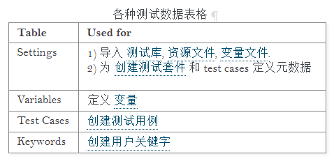

### 1  ui自动化概述

```python
1 结构框架推荐：
selenium驱动
unittest单元测试框架
selenium+Rf
selenium+pytest

2 什么项目适合ui自动化？
一个项目稳定下来，需求变动不大，并且ui页面也较为稳定不会频繁变动，开发周期足够长，有充足的时间来进行自动化的搭建和维护。

3 ui自动化框架选择？
基于unittest和selenium的框架
基于robotframework和selenium的框架

优缺点：
基于unittest，优点代码编写扩展性高；缺点框架上手需要一定基础，编写框架重复造轮子。

基于rf，优点集成式框架，界面友好，日志，关键字驱动，容易上手。
```

### 2  selenium相关

`参考 selenium_cs01.py  (1~4)（E:\work\python\study_cs\unit_selenium）`

[ui自动化学习汇总](https://blog.csdn.net/CCGGAAG/article/details/89669592)

from selenium import webdriver

-  [xpath定位](https://www.w3school.com.cn/xpath/xpath_nodes.asp) 

  [xpath元素定位详解](https://blog.csdn.net/CCGGAAG/article/details/87195824)

```xml
七种类型的节点: 元素 属性 文本 命名空间 处理指令 注释以及文档节点(或称根节点)
1）谷歌浏览器自动获取xpath方式: 
右键——>检查——>开发者工具;
点击指针工具选中页面上的元素;
在源码标识蓝色界面上右键>选择copy>Copy Selector 或者Copy Xpath;
2）火狐浏览器自动获取xpath方式:
用firefox浏览器的firebug+firepath插件来定位xpath（这两个插件大家在火狐浏览器的附加组件里下载即可），定位的模式我们可以选择不同的显示模式来显示xpath、css。
```

- webdriver基本定位方法

```python
1）元素定位
find_element() 寻找符合条件的第一个元素
find_elements() 寻找所有符合条件的元素
driver.find_element(By.NAME, "kw1") # 引用by方法定位元素
driver.find_element("name", "kw1")  # 使用字符串传递定位类型
element_loc = ("name", "kw1") driver.find_element(*element_loc) # 使用元组传递定位类型

2）application标签页查看Cookies

3）js相关语法??? 后续根据需要研究学习

4）等待时间
implicitly_wait(time_to_wait) # 设置全局元素查找的超时时间
set_script_timeout(time_to_wait) # 设置全局js异步脚本超时时间
set_page_load_timeout(time_to_wait) #设置全局页面载入超时时间
```

### 3  单元测试框架unittest ( 测试脚手架  测试用例  测试套件  测试运行器)

`参考unit_cs01.py（1~4）（目录：E:\work\python\study_cs\unit_selenium）`

https://www.jianshu.com/p/3aad32ed83bf?from=timeline
https://docs.python.org/zh-cn/3/library/unittest.html 官方文档
https://www.cnblogs.com/yufeihlf/p/5707929.html#test1     unittest单元测试框架总结 

```python
setUp() 和 tearDown() 方法，可以设置测试开始前与完成后需要执行的指令。
setUp测试执行前的初始化工作
tearDown方法用于测试用例执行之后的善后工作

测试用例以test开头，名字如（test_case1 or testAdd ）
unittest.main() 提供了一个测试脚本的命令行接口
unittest.TestCase父类，如setUp和tearDown方法，可以在子类重写，覆盖父类方法

class Demo(unittest.TestCase) # 新建一个类，继承unittest
@unittest.skip('暂时跳过测试用例2的测试')
@skipIf(condition, reason) 满足条件时跳过该方法
@skipUnless(condition, reason) 不满足条件时，跳过该方法
@classmethod 该类下所有测试用例执行前，运行此方法

创建测试条件，批量运行测试用例

python cs_3.py  
python -m unittest study_cs/cs_3.py  # 测试模块可以通过制定文件路径测试
python -m unittest cs_3 cs_1  # 测试模块 ( 你可以传入模块名、类或方法名或他们的任意组合 )
python -m unittest cs_3.IntegerArithmeticTestCase # 测试类
python -m unittest cs_3.IntegerArithmeticTestCase.testAdd # 测试类的方法
python -m unittest -v cs_3 # 在调用测试脚本时添加 -v 参数使 unittest.main() 显示更为详细的信息
python -m unittest # 探索性测试
python -m unittest -h # 命令行选项

在unittest中复用旧的测试代码 ???后续研究
```

### 4  robot framework学习  

`参考 E:\work\python\study_cs\robot\rf_demo` 

(Robot Framework如果您想使用Python进行测试自动化工作，最好的选择就是Robot Framework）

[robotframework官网](https://robotframework.org/#examples)

[robot framework中文文档最新版](https://robotframework-userguide-cn.readthedocs.io/zh_CN/latest/)

[全面学习robotframework框架二](https://www.jianshu.com/p/dc9dea0741d5)

```shell
1 Robot Framework IDE (RIDE) 编辑器的基本使用：
1）创建测试项目RF_DEMO 
2）创建测试套件 Suite 
3）创建测试用例 Case
4）点击最右侧 Library 按钮即可

2 pybot 安装rf后，自动出现pybot
pybot --version 查看rf版本
pybot E:\work\python\study_cs\RF_DEMO\suite_demo01.robot

pybot D:\robot  # 执行整个项目下的所有用例
pybot D:\robot\testsuit.txt # 执行某个suite用例，pybot suite路径
pybot --testcase1_login in D:\robot\testsuit.txt # 执行某个测试用例，pybot –测试用例名 in 该测试用例所在suite
pybot --ouputdir D:\ropot D:robot\testsuit.txt # 将测试结果输出固定路径，pybot –outputdir 报告路径 用例路径
pybot --include nomal D:\robot # 执行某个tag的测试用例，pybot –include [tag name] [项目路径]

3 查看报告
用例执行完毕后会生成三个文件分别是：log.html、output.xml、report.html
output.xml：记录的测试结果是XML文件，根据特定的需要可以编写脚本读取XML文件并生成特定的测试报告
log.html：会记录Robotframework运行的每一步操作，主要用于编写测试脚本的过程查看
report,html：为测试报告，整理性的展示测试用例的运行情况
```

#### 4.1 rf基本语法和执行方式

```shell
1 rf文件执行方式
cmd窗口执行: pybot pratice_setup_and_teardown.robot  # 备注有时需要指明文件全路径
pycharm方式： 右键——external tools——运行测试套件或者测试用例

2 robotframework概述：以project为单位管理的
一个project可以包含多个Test Suite；一个Test Suite可以包含多个测试用例；
一个Test Suite有四部分组成：Settings、Variables、Test Cases、Keywords;
Setting – 定义了说明性文档，引用的库，标签，以及测试用例的Setup， Teardown等配置信息
Variables – 文件中所用到的变量
TestCases – 具体的测试用例描述及操作步骤
Keywords – 用户自定义的关键字，是对系统关键字的再次封装。

关键字驱动的用例结构: 系统先进入一个初始态(Open Login Page)，然后对系统进行某些操作(Input Name, Input Password, Submit Credentials), 最后校验系统的表现是否符合预期(Welcome Page Should Be Open)。

3 基本语法 （参考文件rf_grammar.txt）
开头设置好引用的库，具体写到 *** Settings ***, 注意空格和字符* 的个数与格式。
全局变量，定义在*** Variables *** 下面，格式为${variablename} variablevalue 注意中间有俩空格，当然这里空格的个数不做强制性的要求。
测试用例定义在*** Test Cases ***， 注意空格和* 之间的格式即可。
测试用例内部，一般有如下步骤： 准备参数， 执行动作， 获取返回结果并进行断言。

1）robot framework可识别扩展名:（注：特别的文件扩展名 .robot 从Robot Framework 2.7.6版本后开始支持）
HTML: .html, .htm 和 .xhtml
TSV: .tsv
纯文本: .txt 和特殊的 .robot # 纯文本格式是Robot Framework中最常用的一种数据格式，分割单元格的方式：使用两个或更多的空格（最少需要2个空格）, 还可以使用前后都有空格的管道符(a | b)。关键字和参数之间推荐使用4个空格隔开。
reStructuredText: .rst 和 .rest

2）各种测试数据表格
参考图 04_1_rf测试表格.png

# Setting	Value	Value	Value
# Variable	Value	Value	Value
# TestCase	Action	Argument	Argument

3) 变量
${notvar} 标量
@{notvar} 列表
%{ENV_VAR} 环境变量
# not comment
命名参数 arg=value
变量优先级：通过命令行设置的变量>在用例文件的变量表格中定义的变量>导入的资源和变量文件中的变量>内置变量, 如 ${TEMPDIR} 和 ${TEST_NAME} 
变量的作用域：可以拥有 全局作用域, 测试套件作用域, 测试用例作用域 或者局部作用域。

4） 创建用户关键字
用户关键字创建在关键字表格中,用户关键字的名称占表格的第一列. 同样, 用户关键字也是由关键字组成的, 包括库关键字和其它用户关键字. 这些关键字一般写在第二列。
[Arguments]    @{varargs}    &{kwargs}    ${arg}=default value    ${arg2}=${VARIABLE} # 用户关键字可接受列表、字典、默认值


```



#### 4.2 使用测试库

```shell
1 测试库一般是通过设置 Library 设置项来导入, 不过也可以通过使用调用关键字 Import Library 来导入。
1)设置Library : 
*** Settings ***
Library    PythonLibrary.py
Library    /absolute/path/JavaLibrary.java
Library    relative/path/PythonDirLib/    possible    arguments
Library    ${RESOURCES}/Example.class
Library    my.package.TestLibrary  
Library    com.company.TestLib    WITH NAME    TestLib
Library    ${LIBRARY}             WITH NAME    MyName   # 为库设置别名
Library    SomeLibrary    localhost        1234    WITH NAME    LocalLib # 若库需要参数, 参数的位置在原库名和 WITH NAME 之间

2) 使用Import Library关键字: 
*** Test Cases ***
Example
    Do Something
    Import Library    MyLibrary    arg1    arg2
    KW From MyLibrary
    LocalLib.Some Keyword     some arg       second arg


# rf库：标准库，远程库，外部库 
```

#### 4.3  资源文件和变量文件

```shell
1 变量文件：变量文件是创建不同类型变量的强大武器. 使用变量文件可以给变量赋值为任意对象, 同时还可以动态地创建变量. 
变量可以在命令行中通过选项 --variable (-v) 单个设置, 也可以通过选项 --variablefile (-V) 设置变量文件
--variable EXAMPLE:value
--variable HOST:localhost:7272 --variable USER:robot
--variable ESCAPED:Qquotes_and_spacesQ --escape quot:Q --escape space:_
--variablefile path/to/variables.py, 使用变量文件

2 资源文件
资源文件通过在设置表格中设定 Resource 来引入. 跟在设置名称后面的值就是资源文件所在的路径。
*** Settings ***
Resource    myresources.html
Resource    ../data/resources.html
Resource    ${RESOURCES}/common.tsv  # 统一使用正斜杠(/), 在Windows系统中会自动转换为反斜杠(\)
```

#### 4.4  高级特性

```shell
1 处理同名关键字
 库关键字 和 用户关键字. 前者来自 standard libraries 或 external libraries，当关键字多时，冲突如何解决？
# 关键字的优先级将由关键字的创建方式决定:
在调用关键字的相同文件中创建. 此关键字拥有最高的优先级。
在资源文件中创建并引入(可以是直接引入,也可以是导入的别的资源文件). 此是第二高优先级。
在外部库中创建. 只有在没有其它同名的用户关键字存在的情况下才会用到。若标准库中存在了同名的关键字, 将显示警告。
标准库中创建关键字. 这些关键字的优先级最低。
# 显示处理关键字：
使用关键字全名, 即在关键字名称的前面加上其所在的资源或库的名称作为前缀, 中间使用点(.)作为分隔。长名称的格式是 LibraryName.Keyword Name。库是一个模块或者包, 则必须使用模块或包的全名(例如: com.company.Library.Some Keyword)
# 通过一个内置的关键字 Set Library Search Order 显式地指定关键字的优先级

2 超时时长设置
测试用例的超时设置可以通过设置表格中的 Test Timeout 设置项, 或者用例表格中的 [Timeout] 设置项

3 for循环 (目前采用版本 Robot Framework 3.2.1 )
# OR LOOP有2中格式，在3.1版本之前仅支持旧格式，3.1及之后能支持2中格式。
旧格式:
:FOR    ${item}    IN   @{bugs}
\    ${all}=    Set Variable    <a href="${item['url']}">${item['key']}</a> ${all}

新格式:
FOR    ${item}    IN   @{bugs}
    ${all}=    Set Variable    <a href="${item['url']}">${item['key']}</a> ${all}
END
 
# 也可以不用缩进
FOR    ${item}    IN   @{bugs}
${all}=    Set Variable    <a href="${item['url']}">${item['key']}</a> ${all}
END
```


#### 4.5  rf命名风格建议

```shell
1 一个表示变量类型的标识符($, @, &, %), 一对花括号({, }), 以及包含在花括号中的变量名:
推荐使用大写字母来表示全局变量(如 ${PATH} 或 ${TWO WORDS})
小写字母来表示局部变量(如 ${my var} 或 ${myVar})
分割单元格的方式：使用两个或更多的空格（最少需要2个空格）, 还可以使用前后都有空格的管道符(a | b)。关键字和参数之间推荐使用4个空格隔开。


```


备注：

pycharm插件和vscode具体用那个优劣后续研究???

建议测试库和工具开发者们关注支持Python 3；使用了Java实现的测试库或者内部使用了Java工具, 则需要在Jython上运行Robot；


### 5  RF自动化框架环境搭建

[Robot Framework 自动化测试框架安装](https://www.jianshu.com/p/985331427cbe)

[Robot Framework 安装配置](https://www.jianshu.com/p/9dcb4242b8f2)

[使用pycharm编写和运行RF脚本](https://blog.csdn.net/CCGGAAG/article/details/77529724)

```shell
借助于 Python 的包管理器 pip 进行安装
1 安装python
https://www.python.org/downloads/
一路next，<python_path>指python的安装目录，将 <python_path> 和 <python_path>\Scripts 加入环境变量PATH系统变量中即可

2 安装RobotFramework 
pip install robotframework     # cmd窗口 pybot --version , 如成功显示版本号，则表示robot安装成功

3 安装第三方库
pip install wxpython   # 不安装则无法运行 RIDE 编辑器
pip install robotframework-ride  # 安装 RIDE 编辑器 （一般Ride.py会自动被安装到python的Scripts目录下）

pip install robotframework-seleniumlibrary  # 用于进行 Web 自动化测试
pip install robotframework-appiumlibrary  # 用于进行 app 自动化测试
pip install robotframework-requests  # 用于进行接口自动化测试      >>>
pip install robotframework-autoitlibrary  # 用于进行 Windows GUI 自动化测试（专用于 Windows 系统，安装时需要管理员权限）  ??? 

4 浏览器驱动下载(多用谷歌或火狐)
chromedriver 下载  版本选择:  如何为Chrome配对chromedriver: https://zhuanlan.zhihu.com/p/110274934
chromedriver当置到改目录下    E:\work\python\src\python36\Scripts (windows 环境变量已配置好)

驱动下载： 
http://npm.taobao.org/mirrors/chromedriver/
https://ftp.mozilla.org/pub/firefox/releases/

5 pycharm插件配置 （Robot Framework Support 暂未启用; 目前仅启用了 intelliBot）
Robot Framework support plugin for IntelliJ Idea

https://blog.csdn.net/hy245120020/article/details/50776197  使用pycharm配置python的virtualenv环境
https://www.cnblogs.com/Huangzena/p/11772650.html  Pycharm+Rf框架的自动化

1）pycharm下载 intelliBot 插件 : Settings——Plugins——intelliBot, 重启
2）配置RF的文件类型识别: 编辑器——文件类型——Robot Feature——添加*.txt
3）配置suite和case的运行配置：在运行脚本时，可以单独运行一个用例，也可以直接运行一个用例集合suite。
所以我们这里要配置两个，打开File——settings——tools——external tools：
配置suite
Robot Run TestSuite
-d results $FileName$
$FileDir$

设置case
Robot Run SingleTestCase
-d results -t "$SelectedText$" ./
$FileDir$

4）导入已编写好的rf脚本，即可运行： 右键调出编辑菜单，然后通过external来运行
5）查看测试报告：


6 其它包下载
python -m pip install --upgrade pip
pip install -U selenium  # 源码包位置 E:\work\python\src\python36\Lib\site-packages
pip install Django
pip install -U Django # 升级Django
```

### 

五 测试框架
common    一些基础的底层方法类
config    配置文件信息
log       运行用例后，日志的存储文件夹
page      在POM设计模式下，关于具体UI页面操作的方法。
report    运行用例后，测试报告的存储文件夹
run_all   用来批量运行测试用例。
test_case 具体存放编写的测试用例。

