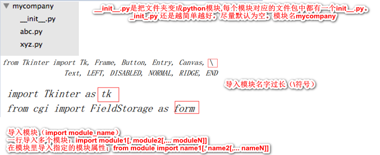
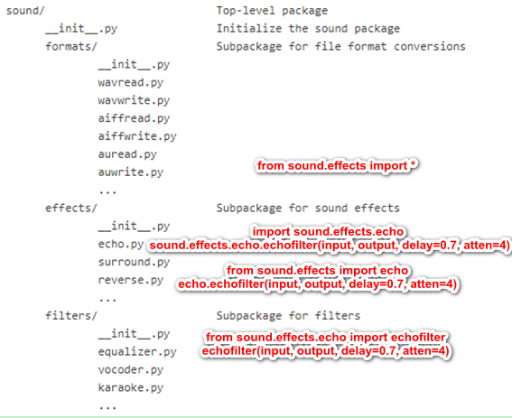
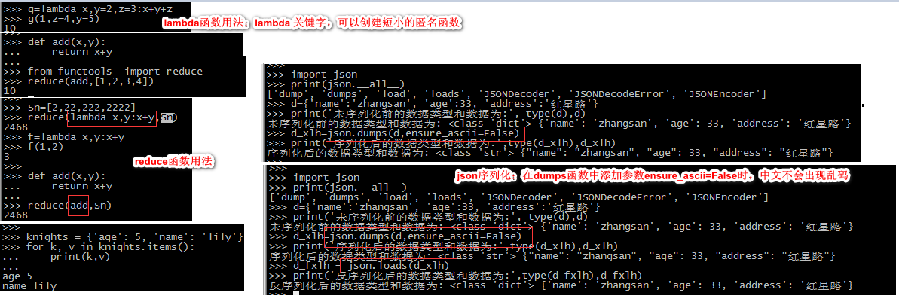
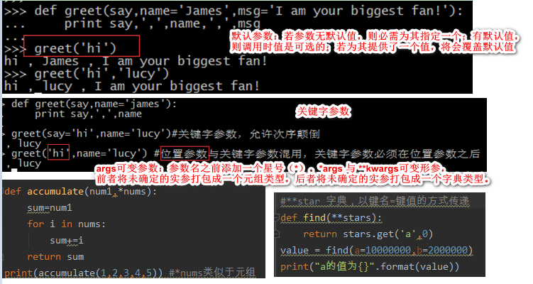
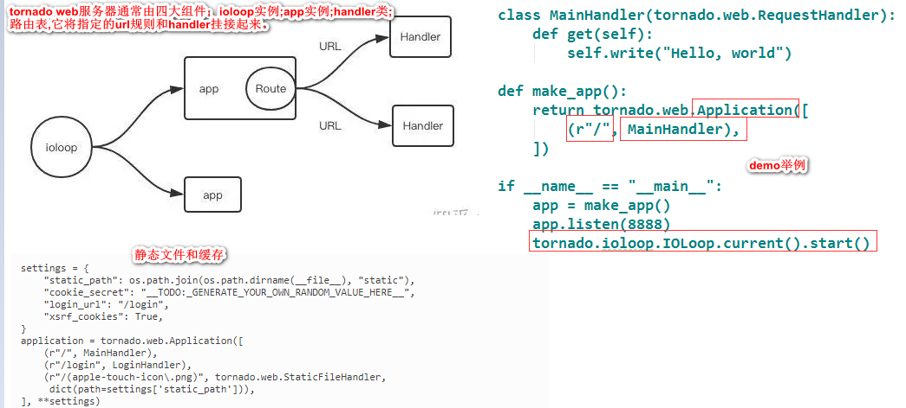

[python3文档内容](https://docs.python.org/zh-cn/3/contents.html)

[十五分钟让你了解Python套路](https://www.jianshu.com/p/36ae91c38279)

[python教程](https://www.readwithu.com/Article/codeSpecification/codeSpecification_first.html)

python特性是动态语言：变量本身类型不固定的语言称之为动态语言。

- 合理的命名规则
- 清晰可读的代码
- 良好的代码结构
- OO的理解
- 基于之上的代码重用
- 设计模式
- 框架

## 1、python代码规范

### 1.1 编码规范

 [PEP 8（Python Enhancement Proposal）](https://zhuanlan.zhihu.com/p/88729367)；  [Google的Python风格指南](https://github.com/zh-google-styleguide/zh-google-styleguide)；

- 缩进：统一使用四空格缩进

  行宽：每行代码不要超过80字符(方便查看代码)

- 引号：

  自然语言使用双引号"..."，例如错误信息；很多情况还是 unicode，使用`u"你好世界"`。

  机器标识使用单引号 `'...'` ，例如 dict 里的 key。

  正则表达式使用原生的双引号`r"..."`。

  文档字符串 (docstring) 使用三个双引号 `"""......"""`。

- 空行：模块级函数和类定义之间空两行；类成员函数之间空一行。

  ```python
  class A:
      
      def __init__(self):
          pass
      
      def hello(self):
          pass
      
      
  def main():
      pass
  ```

- **import语法**

  import 语句应该分行书写;

  import语句应该放在文件头部，置于模块说明及docstring之后，于全局变量之前；

  import语句应该使用 **absolute** import；

  import语句应该按照顺序排列，每组之间用一个空行分隔；

  导入其他模块的类定义时，可以使用相对导入;

  如果发生命名冲突，则可使用命名空间。

  ```python
  import os   # 模块导入，注意：自己创建模块时要注意命名，不能和python自带的模块名重名
  import sys
  from subprocess import Popen, PIPE  # 正确的写法  from xxx import xx 
  
  from foo.bar import Bar # absolute import
  import xxx as xx
  
  from myclass import MyClass # 导入其他模块的类定义时，可以使用相对导入
  
  #不推荐的写法
  from ..bar import Bar
  import sys,os
  from foo import *
  
  # 如果发生命名冲突，则可使用命名空
  import bar
  import foo.bar
  
  bar.Bar()
  foo.bar.Bar()
  ```

- 空格

  - 在二元运算符两边各空一格`[=,-,+=,==,>,in,is not, and]`:

  ```python
  # 正确写法
  i = i + 1
  sum += 1
  x = x*2 - 1
  hypot2 = x * x + y * y
  c = (a + b) * (a - b)
  
  在注释符号#后面加一个空格，但是#！/usr/bin/python的#后面不能有空格。
  ```

  - 函数的参数列表中，`,`之后要有空格
  - 函数的参数列表中，默认值等号两边不要添加空格
  - 左括号之后，右括号之前不要加多余的空格
  - 字典对象的左括号之前不要多余的空格
  - 不要为对齐赋值语句而使用的额外空格
  - 在list、dict、tuple、set参数列表的后面加一个空格

  ```python
   def complex(real, imag):
          pass
   
   def complex(real, imag=0.0):
      pass
   
   spam(ham[1], {eggs: 2})
   dict['key'] = list[index]
   
  x = 1
  y = 2
  long_variable = 3
  ```

- 换行：python支持括号内换行

  ```python
  # 第二行缩进到括号的起始处
  foo = long_function_name(var_one, var_two,
                           var_three, var_four)
  
  # 第二行缩进 4 个空格，适用于起始括号就换行的情形
  def long_function_name(
          var_one, var_two, var_three,
          var_four):
      print(var_one)
   
  # 使用反斜杠\换行，二元运算符+ .等应出现在行末；长字符串也可以用此法换行
  session.query(MyTable).\
          filter_by(id=1).\
          one()
  
  print 'Hello, '\
        '%s %s!' %\
        ('Harry', 'Potter')
  
  # if/for/while一定要换行
  if foo == 'blah':
      do_blah_thing()
  ```


- 禁用复合语句

  ```shell
  # 正确的写法
  do_first()
  do_second()
  do_third()
  
  # 不推荐的写法
  do_first();do_second();do_third();
  ```

- docstring规范

  模块内容的顺序：模块说明和docstring→import→globals&constants→其他定义。所有的公共模块、函数、类、方法，都应该写 docstring 。私有方法不一定需要，但应该在 def 后提供一个块注释来说明。 docstring 的结束"""应该独占一行，除非此 docstring 只有一行。
  
  ```python
  """Return a foobar
  Optional plotz says to frobnicate the bizbaz first.
  """
  
  """Oneline docstring"""
  ```

### 1.2 注释

- 文件说明注释

  ```python
  '''
  @Author:xxx
  @File:my_name.py
  @Time:2019/10/14 22:02
  '''
  ```

- 块注释: “#”号后空一格，段落件用空行分开（同样需要“#”号）

  ```python
  # 块注释
  # 块注释
  #
  # 块注释
  # 块注释
  ```

- 行注释:至少使用两个空格和语句分开，注意不要使用无意义的注释

  ```python
  # 正确的写法
  x = x + 1  # 边框加粗一个像素
  
  # 不推荐的写法(无意义的注释)
  x = x + 1 # x加1
  ```

- 文档注释docstring: 作为文档的Docstring一般出现在模块头部、函数和类的头部，这样在python中可以通过对象的__doc__对象获取文档. 编辑器和IDE也可以根据Docstring给出自动提示。

  - 不要在文档注释复制函数定义原型, 而是具体描述其具体内容, 解释具体参数和返回值等；

  - 对函数参数、返回值等的说明采用numpy标准；

  - 文档注释不限于中英文, 但不要中英文混用。优先使用英文写注释，英文不好全部写中文。
  - 文档注释不是越长越好, 通常一两句话能把情况说清楚即可；在代码关键部分，能写注释的要尽量写注释; 比较重要的注释段，使用多个等号隔开，可以更加醒目，突出重要性；
  - 模块、公有类、公有方法, 能写文档注释的, 应该尽量写文档注释

  ```python
  # 文档注释以 """ 开头和结尾, 首行不换行, 如有多行, 末行必需换行, 以下是Google的docstring风格示例
  # -*- coding: utf-8 -*-
  """Example docstrings.
  
  This module demonstrates documentation as specified by the `Google Python
  Style Guide`_. Docstrings may extend over multiple lines. Sections are created
  with a section header and a colon followed by a block of indented text.
  
  Example:
      Examples can be given using either the ``Example`` or ``Examples``
      sections. Sections support any reStructuredText formatting, including
      literal blocks::
  
          $ python example_google.py
  
  Section breaks are created by resuming unindented text. Section breaks
  are also implicitly created anytime a new section starts.
  """
  
  
  #  正确的写法
  def function(a, b):
      """计算并返回a到b范围内数据的平均值"""
      ... ...
  
  # numpy标准
  def func(arg1, arg2):
      """在这里写函数的一句话总结(如: 计算平均值).
  
      这里是具体描述.
  
      参数
      ----------
      arg1 : int
          arg1的具体描述
      arg2 : int
          arg2的具体描述
  
      返回值
      -------
      int
          返回值的具体描述
  
      参看
      --------
      otherfunc : 其它关联函数等...
  
      示例
      --------
      示例使用doctest格式, 在`>>>`后的代码可以被文档测试工具作为测试用例自动运行
  ```

### 1.3  命名规范

- 模块: 尽量使用小写命名，首字母保持小写，尽量不要用下划线（除非多单词，且数量不多的情况下）。

  ```python
  # 正确的模块名
  import decoder
  import html_parser
  # 不推荐的模块名
  import Decoder
  ```

- 类: 使用驼峰(CamelCase)命名风格，首字母大写，私有类可用一个下划线开头。将相关的类和顶级函数放在同一个模块里. 不像Java, 没必要限制一个类一个模块。类的属性（方法和变量）命名使用全部小写的方式，可以使用下画线。类的属性若与关键字名字冲突，后缀一个下画线，尽量不要使用缩略等其他方式。为避免与子类属性命名冲突，在类的一些属性前，可以加两条下画线作为前缀。

  ```python
  class Farm():
      pass
  
  class AnimalFarm(Farm):
      pass
  
  class _PrivateFarm(Farm):
      pass
  ```

- 函数:  函数名一律小写，如有多个单词，用下划线隔开。私有函数在函数前加一个下画线。

  ```python
  def run():
      pass
  
  def run_with_env():
      pass
  
  # 私有函数在函数前加一个下划线_
  class Person():
      
      def _private_func():
          pass
  ```

- 变量名:  变量名尽量小写，如有多个单词，用下划线隔开。异常命名使用CapWords+Error后缀的方式。

  ```python
  if __name__ == '__main__':
      count = 0
      school_name = ''
  ```

- 常量： 常量采用全大写，若多个单词，使用下划线隔开。

  ```python
  # 常量命名规范
  MAX_CLIENT = 100
  MAX_CONNECTION = 1000
  CONNECTION_TIMEOUT = 600
  MAX_OVERFLOW = 100
  
  Class FooBar:
  
      def foo_bar(self, print_):
          print(print_)
  ```

### 1.4 编码建议

- 若无特殊情况，文件头部必须加`#-*-coding:utf-8-*-`标识。
- 尽可能使用'is'或'is not'取代'=='或'！='，另外在编码中if x is not None优于if x。
- 使用if some_list而不是if len（some_list）判断某个list是否为空，其他类型同理。
- 使用startswith（）和endswith（）代替切片进行序列前缀或后缀的检查，比如if foo.startswith（'bar'）优于if foo[：3]=='bar'。
- 用isinstance而不是type判断类型。
- 使用字符串的join方法拼接字符串。

### 1.5 python2与python3区别

Python的__future__库。__future__库里面包含不少从Python 3到Python 2的特性，充分使用__future__库，可以很好地兼容Python 2和Python 3。

-  print函数
  print 'Python',python_version()  # python2
  print('Python',python_version()) # python3
-  python2中raw_input和input均存在，python3仅有input
  my_input=input('enter a number:')  # python3输入一个数，返回str
-  除法 /和//
-  异常：python3中使用as作为关键词，捕获异常的语法由except exc，var改为except exc as var
-  xrange：在Python 2中，有两个方法获得一定范围内的数字：range方法返回一个列表，xrange方法返回一个迭代器。而在Python 3中，range方法返回迭代器，xrange方法不再存在。
-  不等于运算符: 在Python 3中去掉了<>，只有！=一种写法。
-  全局函数Callable（） :Python 2中，可以使用全局函数callable来检查一个对象是否可调用。在Python3中，这个全局函数被取消了，为了检查一个对象是否可调用，可以检查其特殊方法__call__的存在性。
-  去掉了repr表达式：在Python 3中只允许使用repr函数。
-  在Python 3去除了long类型，现在只有一种整型int，但它的作用就像Python 2中的long类型。

- 核心类差异

  Python 2中用ASCII码作为默认编码，导致String有两种类型：str和Unicode。Python 3中只支持Unicode的String。

  Python 2中存在老式类和新式类的区别，Python 3统一采用新式类。新式类声明要求继承object，必须用新式类应用多重继承。

### 1.6 python概述

- 交互式编程：不需要创建脚本文件，在命令行中输入python。（ll /usr/bin/python*）
  执行脚本文件：python test.py     ./test.py
  魔术字符串：#!/usr/local/bin/python（帮你在系统搜索中找到指定python解释器路径）
  UNIX下，python解释器的路径一般为/usr/local/bin/python或/usr/bin/python
  查看版本：python3 -V		 sys.version

- ASCII编码和unicode编码区别：ASCII编码是1个字节，而Unicode编码通常是2个字节；字母A用ASCII编码是十进制的65，二进制的01000001；A的Unicode编码是00000000 01000001

- 文件(*.py源码文件，由python程序解释；*.pyc经编译后生成的二进制字节码文件；*.pyo优化编译后的程序)

- Python对对空格和缩进很敏感；一句话有冒号的下一行往往要缩进，该缩进就缩进；变量赋值不需要类型声明；括号在pyhton中不是必须的；
  pass是空语句，是为了保持程序结构的完整性。一般用作占位语句。
  break（跳出整个循环）和continue（跳出本次环，继续执行下一轮循环）
  退出系统：exit()   ctrl+D退出 ctrl+z     sys.exit()
  在同一行中使用多条语句，语句之间使用分号;分割

- 模块的搜索路径:先在当前目录中搜索，如果找不到，则在sys.path变量中给出的目录列表中查找。sys.path（输入脚本的目录（当前目录）;环境变量 PYTHONPATH 表示的目录列表中搜索;Python 默认安装路径中搜索。

  （临时生效）：动态增加路径sys.path.append(‘/home/wang/wokespace’)     

  （永久生效）vim ~/.bashrc，将内容export PYTHONPATH=$PYTHONPATH:/home/wang/workspace 附加到文件末尾，修改PYTHONPATH变量。

- bytes和str两种类型转换的函数encode(),decode(),str通过encode()可以编码为指定的bytes。若从网络或磁盘上读取了字节流，则读到的数据就是bytes。bytes变为str，用decode()方法

- b'hello'    python对bytes类型的数据用带b前缀的单引号或双引号表示。x = b'xxx'转换为真正的（Unicode）字符串   str(x, 'utf-8')

## 2 、PyCharm（集成开发环境IDE）

### 2.1 windows下python安装

- 官网下载地址  https://www.python.org/

- 手动配置环境变量

在命令提示框中 cmd 上输入 ： path=%path%;C:\Python

备注：`C:\Python` 是 Python 的安装目录，如果你的安装目录是其他地方，就得填上你对应的目录。

`默认第三方库路径：/usr/lib64/python2.7/site-packages/`

`字体元素路径：/usr/lib64/python2.7/site-packages/matplotlib/mpl-data/fonts/ttf`

### 2.2 集成的开发环境pycharm

PyCharm 下载地址 : https://www.jetbrains.com/pycharm/download/

[PyCharm 安装教程](https://www.runoob.com/w3cnote/pycharm-windows-install.html)

- **pycharm快捷键**

  驼峰前缀过滤列表  MyFirstProject(MyPythonProject)  ，搜索关键词`MPr`。

  列选择  Shift + Alt

  列出类、方法或变量的所有方法  Ctrl+Alt+F7

## 3、python基本语法

### 3.1 print函数和基本字符编码

- print函数

https://www.runoob.com/python3/python-func-print.html

```python
print("Hello World")

a = 1
b = 'runoob'
print(a,b)

print("aaa""bbb")
print("aaa","bbb")
print("www","runoob","com",sep=".")  # 设置间隔符

print('My name is %s, and I am %d years old. I am %.2f meter tall' % ('lin', 25, 1.73))

print('{},{}'.format('lin', 25))
print('{0},{1},{2}'.format('lin', 'male', 25))
print('{name},{sex},{age}'.format(age=25, sex='male', name='lin'))
print('My name is {:*<8}, and I am {} years old.'.format('lin', '25'))
print('I am {:.2f} meter tall.'.format(1.73))
print(r'C:\some\name')   # 加r和不加区别：'r'是防止字符转义，若路径中出现'\t'，不加r，'\t'会被转义。加'r'之后'\t'就能保留原有的样子。
```

- 基本字符编码

  最早的Python 只支持 ASCII 编码，普通的字符串 'ABC' 在 Python 内部都是 ASCII 编码的。Python 在后来添加了对 Unicode 的支持，以 Unicode 表示的字符串用`u'...'`表示。

  `UTF-8 并不意味着你的 .py 文件就是 UTF-8 编码的，必须要确保文本编辑器正使用 UTF-8 without BOM 编码。`
  
  常用的编码方式为 ： "uft-16"    , "utf-8", "gbk", "gb2312", "ascii" , "latin1" 等，当字符串不能编码为指定的“编码方式”时，会引发异常。

```python
#!/usr/bin/env python3
# -*- coding: utf-8 -*-
```

第1行注释告诉 Linux/OS X 系统，这是一个 Python 可执行程序，Windows 系统会忽略这个注释；

第2行注释是为了告诉 Python 解释器，按照 UTF-8 编码读取源代码，否则，你在源代码中写的中文输出可能会有乱码。

### 3.2  基本数据类型

- 字符串

  用「引号」括起来的即为字符串，引号包括单引号 `' '` ，双引号 `" "` 和 三引号 `''' '''` ，比如 `'abc'` ，`"123"` 等等。

  ```python
  # 单引号
  str1 = '一点水'
  str2 = '二点水'
  str3 = '三点水'
  print(str1, str2, str3)  # 一点水 二点水 三点水
  
  # 双引号
  str4="两'点'水"
  str5='两\'点\'水'
  print(str4,str5) # 两'点'水 两'点'水
  
  # 三引号
  str6='''两"点"水'''
  str7="两\"点\"水"
  print(str6,str7) # 两"点"水 两"点"水
  
  str8='''两
  点
  水'''
  print(str8) # 直接可以分行
  
  # 索引操作符（[]）和切片操作符（[：]）可以得到子字符串
  test='hello world'
  print(test[:])
  print(test[0],test[-1])
  print(test[1:5])
  print(test[1:])
  print(test[:5])
  # Python中，星号（*）用于字符串重复
  seq='h'
  print(seq*10)
  ```

- 整数和浮点数

  运算符 +  -  *  /  %  *幂  //取整除。

  ```python
  int1=1+1
  int2=1-2
  int3=1*2
  int4=1/2
  print(int4,type(int4)) # 0.5 <class 'float'>
  
  print(5%2) # 取模，返回除法的余数
  print(2**3) # 返回x的y次幂  8
  print(11//2) # 取整返回商的整数部分  5
  print(11.0//2.0) # 输出5.0
  ```

- 布尔值: 布尔值可以用 `and`、`or` 和 `not` 运算

  ```python
  True
  False
  ```

- 空值

  ```python
  None  # 每种编程语言都有自己的特殊值——空值，在 Python 中，用 None 来表示
  ```

- 按位运算及原码、补码

  [原码、反码、补码知识详细讲解](https://blog.csdn.net/zl10086111/article/details/80907428)

  - 机器数：一个数在计算机中的二进制表示形式; 机器数带符号的，最高位存放符号位(正数为0，负数为1)
    十进制中的数 +3 ，计算机字长为8位，转换成二进制就是 00000011。如果是 -3 ，就是 10000011 

  - 真值：由于第一位是符号位，所以机器数的形式值不等于真正的值。带符号位的机器数对应的真正数值称为机器数的真值。
    0000 0011的真值 = +000 0001 = +3，1000 0011的真值 = –000 0011 = –3

  - 原码、反码、补码基础概念：

    **原码:** 符号位加上真值的绝对值，即用第一标识符号位，其余表示值。

    [+1]原 = 0000 0001

    [-1]原 = 1000 0001

    由于第一位为符号位，所以八位二进制的取值范围[1111 1111 , 0111 1111]，即[-127 , 127]。

    **反码：**正数的反码是其本身，负数的反码是在原码的基础上，符号位不变，其余各位取反。

    **补码：**正数的补码就是其本身，负数的补码是在其原码的基础上, 符号位不变, 其余各位取反, 最后+1. (即在反码的基础上+1)

    [+1] = [00000001]原 = [00000001]反 = [00000001]补

    [-1] = [10000001]原 = [11111110]反 = [11111111]补

  - **为什么存在反码、补码？**

    1-1 = 1 + (-1) = 0 , 所以机器可以**只有加法**而没有减法, 这样计算机运算的设计就更简单了。

    原码计算  1-1 =1+(-1)= [00000001]原+[10000001]原=[10000010]原=-2  (按照原码计算，结果错误，不合理)。
    反码计算  1-1 =1+(-1)= [00000001]原+[10000001]原=[00000001]反+[11111110]反=[11111111]反=[10000000]原=-0  (理解上+0和-0是一样的, 但是0带符号是没有任何意义的)。

    补码计算 1-1 = 1 + (-1) = [0000 0001]原 + [1000 0001]原 = [0000 0001]补 + [1111 1111]补 = [0000 0000]补=[0000 0000]原 (完美解决)。

  ```python
  0|0=0; 0|1=1; 1|0=1; 1|1=1  # 按位或， 同1得1
  0&0=0; 0&1=0; 1&0=0; 1&1=1  # 按位与， 全1得1
  0^0=0; 0^1=1; 1^0=1; 1^1=0  # 按位异或，相异为1
  
  # 按位取反
  a = 9
  b = ~a  # b即 -10   https://www.runoob.com/python/python-exercise-example55.html
  ```

  

### 3.3 基本数据类型转换

| 方法                   | 说明                                                  |
| ---------------------- | ----------------------------------------------------- |
| int(x [,base ])        | 将x转换为一个整数                                     |
| float(x )              | 将x转换到一个浮点数                                   |
| complex(real [,imag ]) | 创建一个复数                                          |
| str(x )                | 将对象 x 转换为字符串                                 |
| repr(x )               | 将对象 x 转换为表达式字符串                           |
| eval(str )             | 用来计算在字符串中的有效 Python 表达式,并返回一个对象 |
| tuple(s )              | 将序列 s 转换为一个元组                               |
| list(s )               | 将序列 s 转换为一个列表                               |
| chr(x )                | 将一个整数转换为一个字符                              |
| unichr(x )             | 将一个整数转换为 Unicode 字符                         |
| ord(x )                | 将一个字符转换为它的整数值                            |
| hex(x )                | 将一个整数转换为一个十六进制字符串                    |
| oct(x )                | 将一个整数转换为一个八进制字符串                      |

### 3.4 变量

Python 定义变量时不需要声明数据类型，因此可以把任意的数据类型赋值给变量，且同一个变量可以反复赋值，而且可以是不同的数据类型。

`在开发中，尽量避免使用全局变量 global  time，因为不同模块、不同函数均可以自由访问全局变量，可能会造成全局变量的不可预知性。`

- 变量指向

  变量名必须是大小写英文、数字和下划线（_）的组合，且不能用数字开头，比如：a=88

```python
# a开始指向字符串，b=a创建了变量b，变量 b 也指向了a 指向的字符串 Hello Python，最后 a=123
a='hello python'
b=a
a=123
print("varible b %s" % b) # varible b hello python
```

- 多个变量赋值

```python
a=b=c=2
a,b,c=1,2,3
print(type(a))  # 查看变量的类型
```

- 静态变量

  

### 3.5 列表、元组、字典和集合

- 列表list ：什么是列表；创建、访问、更新、删除列表；列表运算符；列表函数和方法

  列表：Python 内置的一种数据类型。 它是一种有序的集合，可以随时添加和删除其中的元素。

  ```python
  # 中括号 [] 括起来的数据, 里面的每一个数据叫元素, 之间用逗号分隔,数据类型可以不同
  
  # 列表创建及访问、更新、删除
  list1=['两点水','twowter','liangdianshui',123]
  print(list1[1:2])
  print(list1[3])
  print(list1[:])
  
  list1[0]='2点水'  # 修改或更新列表
  list1.append('六点水') # 添加列表元素
  
  list1.remove(123) # 移除列表的元素
  del list1[1]
  print(list1)
  
  
  alist=[1,2,3,4,5,6]
  print(alist[::-1]) # 反转列表[6, 5, 4, 3, 2, 1]
  print(a_list[1：：2]) # [2，4，6]，获取列表所有偶数项元素
  print(alist[::2]) # [1, 3, 5],获取列表所有奇数项元素
  
  # 列表运算符
  print(len(list1)) # 求长度
  print([1,2,3]+[4,5,6]) # 求和
  print(['hi']*4) # 复制 ['hi', 'hi', 'hi', 'hi']
  print(3 in [1,2,3]) # 元素是否存在列表中
  for x in list1: print(x)  #迭代
  for i in range(len(list1)): print(i,list1[i]) # i代表下标，list1[i]列表元素
  for i in range(1,101) # 1,100
  
  for index,element in enumerate(list1):print(index,element)
  for i in enumerate(list1):print(i)
  for i in iter(list1):print(i) # i代表列表元素
      
  # 列表常用函数
  list.reverse()	反向列表中元素
  list.sort([func])	对原列表进行排序
  list.insert(index, obj)	将对象插入列表
  list.pop(obj=list[-1])	移除列表中的一个元素（默认最后一个元素），并且返回该元素的值
  list.append(obj)	在列表末尾添加新的对象
  list.count(obj)	统计某个元素在列表中出现的次数
  len(list)	列表元素个数
  max(list)	返回列表元素最大值
  min(list)	返回列表元素最小值
  ```

  - 列表例子实践

    ```python
    user=['liangdianshui','twowater','两点水']
    print("产品用户: ",user)
    print("产品用户数: ",len(user))
    print("查看具体用户: ",user[0],user[1],user[2])
    user.append("Lily")
    print("追加后的产品用户: ",user)
    user.insert(0,'VIP用户') # 方法第一位
    print("vip最佳用户: ",user)
    user.pop()
    print("删除末尾元素: ",user)
    user.pop(1)
    print("删除指定位置的元素: ",user)
    user[2]='2点水'
    print("替换元素: ",user)
    
    newUser=[['VIP用户',11111],['twowater',22222],['三点水',33333]]  #
    print('不同元素类型的list数据',newUser)
    
    print(','.join(str(n) for n in user))  # 按逗号分隔列表
    
    # for 遍历
    for i in range(len(tuple1)):print(i,tuple1[i])
    for elem in tuple1:print(elem)
    ```

- 元组tuple

  元组不可变，一旦创建就无法修改，没有append()，insert() 这样的方法，但它也有获取某个索引值的方法，但是不能赋值。建议代码中能用元组代替 list 就尽量用 tuple。

  ```python
  # 元组用"()"标识。内部元素用逗号隔开。但元组不能二次赋值，相当于只读列表。不可变性atuple=(1,2,3)
  
  # 创建元组
  tuple1=('两点水','twowter','liangdianshui',123,456)
  tuple2='两点水','twowter','liangdianshui',123,456
  tuple3=()
  tuple4=(123,) # 元组中只包含一个元素时，需要在元素后面添加逗号。 不加逗号，创建出来的就不是 元组（tuple），而是指 123 这个数
  print(type(tuple1),type(tuple2),type(tuple3),type(tuple4))
  
  # 访问元组
  print(tuple1[0])
  print(tuple2[0])
  # 修改元组
  list1=[123,456]
  tuple1=('两点水','twowater','liangdianshui',list1)
  print(tuple1)
  list1[0]=789
  list1[1]=100
  print(tuple1) # 实质变的是列表中的元素
  
  del tuple2 # 删除元组
  print(tuple([1,2,3]))	# 将列表转换为元组
  ```

  - 元组例子实践

    ```python
    name1 = ('一点水', '两点水', '三点水', '四点水', '五点水')
    name2 = ('1点水', '2点水', '3点水', '4点水', '5点水')
    list1 = [1, 2, 3, 4, 5]
    print(len(name1))  # 计算元素个数
    print(name1 + name2) # 连接,两个元组相加
    print(name1 * 2) # 复制元组
    print('一点水' in name1) # 元素是否存在 (name1 这个元组中是否含有一点水这个元素)
    print(max(name2)) # 元素的最大值
    print(min(name2)) # 元素的最小值
    print(tuple(list1)) # 将列表转换为元组
    ```

- 字典dic

  是另一种可变容器，且可存储任意数据类型。dict = {key1 : value1, key2 : value2 }

  `注意：键必须唯一，但值则不必。值可以取任意类型，但是键必须是不可变的。`

  ```python
   # 字典用{}包裹，由索引(key)和它对应的值value组成，是无序的对象集合。adict={'x':1, 'y':2, 'z':3}
  
  # 字典
  dict1={'liangdianshui':'111111' ,'twowater':'222222' ,'两点水':'333333'}
  print(dict1['两点水'])  #查找字典
  dict1['jack']='444444' # 新增一个键值对
  print(dict1)
  dict1['liangdianshui']='555555' # 修改键值对
  print(dict1)
  del dict1['两点水'] # 删除字典中的元素
  print(dict1)
  dict1.clear() # 删除字典中的所有元素
  print(dict1)
  del dict1 # 删除字典
  
  # for循环遍历字典中的元素
  dict2={'liliy':'111111' ,'lucy':'222222' ,'jack':'333333'}
  for key in dict2: print(key,dict2[key])
  for key, value in dict2.items():print(key,value) # dict.items()以列表返回可遍历的(键, 值) 元组数组
  ```

- 集合set

  set是一个**无序不重复元素集**。基本功能包括关系测试和消除重复元素。set 和 dict 类似，但是 set 不存储 value 值的。

  ```python
  # set用法
  set1=set([123,456,789,123,123])  # 创建set
  print(set1)
  set1.add(123) # 添加，可重复添加，但是不会起效果
  print(set1)
  set1.remove(456)
  print(set1)
  # set的交集、并集和差集
  set1=set('hello')
  set2=set(['p','y','y','h','o','n'])
  set3=set1 & set2 # 交集 (求两个 set 集合中相同的元素)
  print('交集 set3:',set3)
  set4=set1 | set2
  print('并集 set4:',set4)
  set5=set1 - set2
  set6=set2 - set1
  print('差集 set5:',set5)
  print('差集 set6:',set6)
  list1 = [111,222,333,444,111,222,333,444,555,666]  # 去除海量列表里重复元素，用 hash 来解决也行，只不过感觉在性能上不是很高，用 set 解决还是很不错
  set7=set(list1)
  print('去除列表里重复元素 set7:',set7)
  ```

-  Numpy数组   array([1, 2, 3])

### 3.6 条件语句和循环语句

- 条件语句

  if语句的基本形式，if多条件判断，if多条件同时判断，if嵌套

  ```python
  # if基本形式
  result=59
  if result>60:
      print('及格')
  else:
      print('不及格')
  
  num=6
  if num:
      print("hello")
  
  # if多条件判断
  results = 89
  if results > 90:
      print('优秀')
  elif results > 80:
      print('良好')
  elif results > 60:
      print ('及格')
  else :
      print ('不及格')
  
  # if多条件同时判断
  java = 86
  python = 68
  if ( java >= 80  and java < 90 )  or ( python >= 80 and python < 90):
      print('良好')
  
  # if 嵌套
  if java>60:
      if python>60:
          print('及格')
  ```

- 循环语句和条件语句综合

| 循环控制语句 |                                                              |
| :----------- | ------------------------------------------------------------ |
| break        | 在语句块执行过程中终止循环，并且跳出整个循环                 |
| continue     | 在语句块执行过程中终止当前循环，跳出该次循环，执行下一次循环 |
| pass         | pass 是空语句，是为了保持程序结构的完整性                    |

```python
# 简单循环
list1=[]
for letter in 'Hello 两点水':
    list1.append(letter)
print(list1)

# 打印9*9乘法表
for i in range(1,10):
    for j in range(1,i+1):
        print('{}x{}={}\t'.format(i,j,i*j),end=' ')
    print() # 换行符

# 判断闰年
year=int(input('输入年份:'))
if (year%4==0) and (year%100)!=0 or (year%400)==0:
    print('{}是闰年'.format((year)))
else:
    print('{}不是闰年'.format((year)))
   

# while循环
count=0
while count<3:
    print('loop {}'.format(count))
    count+=1
```

### 3.7 函数和函数变量作用域

使用的大多数都是 Python 的内置函数，如`print()` 函数。

函数是什么? 如何定义函数？ 函数的返回值？函数的参数？ 函数传值问题？ 匿名函数？

- **Python的作用域一共有4种**

  L（Local）局部作用域。E（Enclosing）闭包函数外的函数中。G（Global）全局作用域。B（Built-in）内置作用域（内置函数所在模块的范围）。`以L→E→G→B的规则查找即：在局部找不到，便去局部外的局部找（例如闭包），再找不到就去全局找，再者去内置作用域中找。`

```python
g_count=0   # 全局作用域
def outer():
    o_count=1   # 闭包函数外的函数中
    def inner():
        i_count=2  # 局部作用域

# 内置作用域是通过一个名为builtins的标准模块来实现的，但是这个变量名自身并没有放入内置作用域内，所以必须导入这个模块才能够使用它。
import builtins
dir(builtins)
```


- 内建函数

```python
# range函数可创建一个整数列表，一般用在for循环中,函数语法：range（start，stop[，step]）
函数语法：range（start，stop[，step]）,start：计数从start开始,stop：计数到stop结束,不包括stop。step：步长，默认为1。
range（0，5） # range（5）等价于range（0，5），是[0，1，2，3，4]，没有5

# open函数:需要传入8个参数，分别是fileName、mode、buffering、encoding、errors、newline、closefd、opener，比较重要的是fileName、mode、encoding，除了fileName参数，其他都有默认值。 由于文件读写时都有可能产生IOError，一旦出错，后面的f.close方法就不会被调用。所以，为了保证无论是否出错都能正确地关闭文件，我们可以使用try...finally来实现。

filename='1.txt'
try:
    fp=open(filename,"r")
    print(fp.read())
except IOError:
    print('文件打开失败，%s文件不存在' % filename)
finally:
    fp.close()
# 简化try...finally太烦琐，Python引入了with语句来自动帮我们调用close方法
with open(filename,"r") as fp:
    try:
        print(fp.read())
    except IOError:
        print('文件打开失败，%s文件不存在' % filename
```

  

- 自定义函数参数

```python
def 函数名(参数1，参数2....参数n):
    函数体
    return 语句

# *hobby是可变参数，且 hobby就是一个 tuple （元祖），**hobby是关键字参数，hobby 就是一个dict（字典）

# 关键字参数，位置参数
def print_user_info( name , age , sex = '男' ):
    # 打印用户信息
    print('昵称：{}'.format(name) , end = ' ')
    print('年龄：{}'.format(age) , end = ' ')
    print('性别：{}'.format(sex))
    return
print_user_info( '两点水' , 18 , '女') # 调用 print_user_info 函数
print_user_info( name = '两点水' ,age = 18 , sex = '女')

# 可变参数 *args  **args
def print_user_info_tuple(name , age , sex = '男',*hobby):
    print('昵称：{}'.format(name) , end = ' ')
    print('年龄：{}'.format(age) , end = ' ')
    print('性别：{}'.format(sex))
    print('爱好：{}'.format(hobby))
    return ;
print_user_info_tuple('Lucy',5,'女','篮球','羽毛球','跑步')


def print_user_info_dict(name , age , sex = '男',**hobby):
    print('昵称：{}'.format(name) , end = ' ')
    print('年龄：{}'.format(age) , end = ' ')
    print('性别：{}'.format(sex))
    print('爱好：{}'.format(hobby))
    return ;
print_user_info_dict('Lucy',5,'女',hobby = ('打篮球','打羽毛球','跑步'))
```

- 函数返回值

  **不可更改的类型**：类似 c++ 的值传递；**可更改的类型**：类似 c++ 的引用传递；

  **在 Python 中，字符串，整形，浮点型，tuple 是不可更改的对象，而 list ， dict 等是可以更改的对象。**

- 匿名函数

  python 使用 lambda 来创建匿名函数。

  ```python
  # 匿名函数 lambda，其只是一个表达式，拥有自己的命名空间，不能访问自有参数列表之外或全局命名空间里的参数 lambda [arg1 [,arg2,.....argn]]:expression
  sum=lambda num1,num2:num1+num2
  print(sum(1,2))
  multiply = lambda x, y: x * y
  print(multiply(3,4))
  ```

### 3.8 迭代器和生成器

- **迭代器**

  **迭代:**  for 循环来遍历这个 list 或 tuple ，这种遍历就是迭代。python中，只要是可迭代对象，无论有没有下标，都是可以迭代的。

  **迭代器：**是一个可以记住遍历的位置的对象。迭代器对象从第一个元素开始访问，直到所有的元素被访问完结束。迭代器有两个基本的方法：iter() 和 next(),且字符串，列表或元组对象都可用于创建迭代器。

  - for相关迭代

    ```python
    # for相关迭代
    for char in 'Lily':
        print(char, end=' ')
    print()
    
    list1 = [1, 2, 3, 4, 5]
    for elem in list1:
        print(elem, end=' ')
    print()
    
    dict1 = {'name': 'Lily', 'age': '23', 'sex': '男'}
    for key in dict1:
        print(key, end=' ')
    print()
    
    for x, y in [(1, 'a'), (2, 'b'), (3, 'c')]:
        print(x, y)
    ```

  - 迭代器创建

    ```python
    # 迭代器创建
    str1 = 'Lily'
    iter1 = iter(str1)
    # list对象创建迭代器
    list1 = [1, 2, 3, 4]
    iter2 = iter(list1)
    # tuple(元祖) 对象创建迭代器
    tuple1 = (1, 2, 3, 4)
    iter3 = iter(tuple1)
    
    # for 循环遍历迭代器对象
    for x in iter1:
        print(x, end=' ')
    
    print('\n------------------------')
    
    # next() 函数遍历迭代器
    while True:
        try:
            print(next(iter3))
        except StopIteration:
            break
    ```

- **生成器**

  - list生成式

    ```python
    # 列表生成式
    list1=list ( range (1,31) )
    print(list1)
    print('\n'.join([' '.join ('%dx%d=%2d' % (x,y,x*y)  for x in range(1,y+1)) for y in range(1,10)]))
    
    # list生成式语法
    [expr for iter_var in iterable]  # 首先迭代iterable里的所有内容，每一次迭代，都把iterable 里相应内容放到iter_var中，再在表达式中应用该iter_var的内容，最后用表达式的计算值生成一个列表。
    
    [expr for iter_var in iterable if cond_expr] # 只有满足条件的内容才把iterable里相应内容放到iter_var中，再在表达式中应用该 iter_var 的内容，最后用表达式的计算值生成一个列表。
    
    list2=[x*x for x in range (1,11)] # 求平方
    print(list2)
    list3=[x*x for x in range (1,11) if x %2==0] # 偶数求平方
    print(list3)
    ```

  - 生成器

    [带yield函数为生成器](https://blog.csdn.net/mieleizhi0522/article/details/82142856)

    受内存限制，列表容量有限。若创建一个包含 1000 万个元素的列表，不仅占用很大的存储空间，如果我们仅仅需要访问前面几个元素，那后面绝大多数元素占用的空间都白白浪费了。**在 Python 中，这种一边循环一边计算的机制，称为生成器：generator。**跟普通函数不同的是，生成器是一个返回迭代器的函数，只能用于迭代操作。

    ```python
    #  生成器创建，把一个列表生成式的 [] 改成 ()，创建 List 和 generator 的区别仅在于最外层的 [] 和 ()
    gen = (x * x for x in range(10))
    print(gen)
    for num in gen:  # 遍历生成器
        print(num, end=' ')
    print()
    
    
    def my_function():
        for i in range(10):
            yield i
    
    
    print(my_function())
    
    
    # 打印杨辉三角
    def triangles(n):
        L = [1]
        while True:
            yield L
            L.append(0)
            L = [L[i - 1] + L[i] for i in range(len(L))]
    
    
    n = 0
    for t in triangles(10):  # 直接修改函数名即可运行
        print(t)
        n = n + 1
        if n == 10:
            break
    ```

  - 同时迭代多个序列

    ```python
    # 同时迭代多个序列
    names = ['laingdianshui', 'twowater', '两点水']
    ages = [18, 19, 20]
    for name, age in zip(names, ages):
        print(name, age)
    dict1= dict(zip(names,ages))
    print(dict1)
    ```

### 3.9 面向对象

  不想导入的属性名称加上一个下划线( _ )

- 面向对象概念

面向过程: 解决对象的过程。
面向对象: 用分类的眼光去看世界的一种方法
类: 用来描述相同的属性和方法的集合。它定义了该集合中每个对象所共有的属性和方法。对象是类的实例。
对象: 通过类定义的数据结构实例。类就相对于工厂里面的模具，对象就是根据模具制造出来的产品。**从模具变成产品的过程，我们就称为类的实例化。**类实例化之后，就变成对象了。也就是相当于例子中的产品。

三大特性：继承、封装和多态。

继承：即一个派生类继承基类的字段和方法（一个 Dog 类型的对象派生自 Animal 类，这是模拟"是一个（is-a）"关系）。

封装：就是将抽象得到的数据和行为（或功能）相结合，形成一个有机的整体（即类）；封装的目的是增强安全性和简化编程。

多态：是指对不同类型的变量进行相同的操作，它会根据对象（或类）类型的不同而表现出不同的行为。

- 类语法

  ```python
  # 旧式类
  class OldClass:
      def __init__(self, account, name):
          self.account = account
          self.name = name
  
  
  # 新式类
  class NewClass(object):
      def __init__(self, account, name):
          self.account = account
          self.name = name
  
  
  if __name__ == '__main__':
      old_class = OldClass(111111, 'OldClass')
      print(old_class)
      print(type(old_class))
      print(dir(old_class))
      print('\n')
      new_class = NewClass(222222, 'NewClass')
      print(new_class)
      print(type(new_class))
      print(dir(new_class))
      
  # 类的继承
  class ClassName(Base1,Base2,Base3):
      <statement-1>
      .
      .
      .
      <statement-N>
  ```

- 类举例

  ```python
  # 类的继承
  class UserInfo(object):
      lv = 5
  
      def __init__(self, name, age, account):
          self.name = name
          self._age = age
          self.__account = account
  
      def get_account(self):
          print('get count:',self.__account)
          return self.__account
  
      @classmethod
      def get_name(cls):
          return cls.lv
  
      @property
      def get_age(self):
          return self._age
  
  
  class UserInfo2(UserInfo):
      def __init__(self, name, age, account, sex):
          super(UserInfo2, self).__init__(name, age, account)
          self.sex = sex # 可以公开访问
  
  # 类的多态
  class User(object):
      def __init__(self, name):
          self.name = name
  
      def printUser(self):
          print('Hello !' + self.name)
  
  
  class UserVip(User):
      def printUser(self):
          print('Hello ! 尊敬的Vip用户：' + self.name)
  
  
  class UserGeneral(User):
      def printUser(self):
          print('Hello ! 尊敬的用户：' + self.name)
  
  
  def printUserInfo(user):
      user.printUser()
  
  
  #类的访问控制
  class UserInfo(object):
      def __init__(self, name, age, account):
          self.name = name # 公开访问
          self._age = age  # 私有属性，
          self.__account = account # 这里是两个下划线的属性，在创建这个类的时候，是不可以直接访问到两个下划线的属性
  
      def get_account(self):
          return self.__account
  
  ```

  

### 3.10 模块与包

模块？模块的使用？主模块和非主模块？包？作用域？

类（可以封装方法和变量） ：变量 函数

封装函数用的是 `def` , 封装类用的是 `class`。封装模块，是不需要任何语句的。

- **模块**：变量 函数  类。**一个 .py 文件就称之为一个模块（Module）**。存在模块大大提高了代码的可维护。包括Python 内置的模块和来自第三方的模块。使用模块可以规避函数名和变量名冲突，相同名字的函数和变量完全可以分别存在不同的模块中。尽量不要与内置函数名字冲突。

- **模块使用**

  ```python
  import sys
  import math
  from sys import version  # 直接导入version属性  from ··· import * 导入该模块所有属性
  import os
  import this  # python彩蛋
  
  print(sys.path)
  print(version)
  print(math.pi)
  print(math.pow.__doc__)  # 打印函数的注释
  
  x = 5
  print(id(x))  # 返回变量x的内存地址
  print(dir(list))  # 查看函数功能    print(dir(str))  
  print(type(x))  # 查看x类型
  print(isinstance(x, int))  # 判断x是否为int
  print(os.getcwd()) # 返回当前工作目录
  #  help(os)查看帮助，按q键退出
  ```

- **主模块和非主模块**

  一个函数调用了其它函数完成一项功能，称这个函数为主函数; 若一个函数没有调用其它函数，则称这种函数为非主函数。

  主模块：一个模块被直接使用，而没有被别人调用。非主模块：一个模块被别人调用。`__name__` 属性值是一个变量，且这个变量是系统给出的。用 `__name__` 属性判断主模块和非主模块。若一个属性的值是 `__main__` ,那么就说明这个模块是主模块。

  当.py文件被直接运行时，`__name__=='__main__ '`之下的代码块将被运行；当.py文件以模块形式被导入时，if `__name__=='__main__ '`之下的代码块不被运行。

- **包和作用域**

  `__init__.py` 的文件存在原因？这个文件是必须存在的，否则，Python 就把这个目录当成普通目录，而不是一个包 。`__init__.py` 可以是空文件，也可以有Python代码，因为 `__init__.py` 本身就是一个模块，而它对应的模块名就是它的包名。**init.py 文件的作用是将文件夹当做模块，目录中必须包含 init.py 文件**。

- **双下划线包起来的方法，都统称为"魔术方法**

  `__new__` 是用来创建类并返回这个类的实例, 而`__init__` 只是将传入的参数来初始化该实例。先是调用了 `__new__` 方法来创建一个对象，把参数传给 `__init__` 方法进行实例化。
  
- **文件操作：**打开；写入；读取；关闭；定位；改名；删除；写入时会把原来的覆盖掉。close() 方法允许调用多次。

   try except语句变化:  try:    ....    except Exception as e:    ....

  

### 3.11 元类

**元类就是用来创建类的。也可以换个理解方式就是：元类就是类的类。**type 就是内建的元类。也就是 Python 自带的元类。

先定义类，然后创建实例。如何创建出类呢？先定义metaclass，然后创建类。所以metaclass允许你创建类或者修改类。你可以把类看成metaclass 创建出来的实例。

https://www.readwithu.com/Article/PythonBasis/python12/4.html

**元类的主要目的就是为了当创建类时能够自动地改变类。**

**元类的主要用途**：创建API。

https://www.readwithu.com/Article/PythonBasis/python12/5.html

### 3.12 线程与进程

- 同时执行多任务的方案？

  多进程

  多线程

  多进程+多线程(多进程和多线程的程序的复杂度要远远高于我们前面写的单进程单线程的程序)

- 多线程编程，创建线程后，其状态如下: 

  New新建-》Runnable就绪。等待调度-》Running运行-》Blocked阻塞。阻塞可能在 Wait Locked Sleeping-》Dead消亡

- 线程按照类型分类：

  主线程，子线程，守护线程(后台线程)，前台线程。

- **如果想要充分地使用多核 CPU 的资源，在 Python 中大部分情况需要使用多进程。**

  ```python
  def worker(interval, name):
      print(name + ' start')
      time.sleep(interval)
      print(name + ' end')
  
  
  if __name__=='__main__':
      for i in range(4):
          p=multiprocessing.Process(target=worker, args=(i, '两点水'+str(i)))
          p.start()
  
  print("The number of CPU is:" + str(multiprocessing.cpu_count()))
  ```

  

  ```python
  # 进程 p 添加 daemon 属性, 当主进程结束时，子进程也会跟着结束，因此无子进程信息打印。 join 方法的主要作用是：阻塞当前进程，直到调用 join 方法的那个进程执行完，再继续执行当前进程。
  # 创建子进程，采用Pool方法创建。 p = Pool(4)
  def worker(interval):
      print('工作开始时间：{0}'.format(time.ctime()))
      time.sleep(interval)
      print('工作结果时间：{0}'.format(time.ctime()))
  
  
  if __name__ == '__main__':
      p = multiprocessing.Process(target=worker, args=(3,))
      p.daemon = True
      p.start()
      p.join()
      print('【EMD】')
  ```

  

### 3.13 正则表达式

备注:  xxx.py起名字不能和模块名称相同。

```python
a='两点水|twowater|liangdianshui|草根程序员|ReadingWithU'

find_all=re.findall('两点水',a)  # findall 函数中第一个参数写正则表达式的规则
print(find_all)

if len(find_all)>0:
    print('a含有该字符串')
else:
    print('a不含该字符串')

find_all=re.findall('[a-z]',a)
print(find_all)

# 字符集一对方括号 “[]” 里面的字符关系是"或（OR）"关系
a='uav,ubv,ucv,uwv,uzv,ucv,uov'
find_all=re.findall('u[abc]v',a)  #  取 u 和 v 中间是 a 或 b 或 c 的字符
print(find_all)

find_all=re.findall('u[^abc]v',a) # 取中间非a，b，c
print(find_all)

a = 'uav_ubv_ucv_uwv_uzv_ucv_uov&123-456-789'
find_all1=re.findall('\d',a) #匹配所有数字字符
find_all2=re.findall('[0-9]',a) # 匹配所有数字字符
find_all3=re.findall('[^0-9]',a) # 匹配所有非数字字符 \D
print(find_all1)
print(find_all2)
print(find_all3)
find_all6 = re.findall('[A-Za-z0-9_]', a) #findall6 = re.findall('[A-Za-z0-9_]', a) #
print(find_all6)


# 数量词的词法是：{min,max} ; \b[1-9][0-9]{3}\b,匹配的是 1000 ~ 9999 之间的数字( “\b” 表示单词边界）;
a = 'java*&39android##@@python'
find_all = re.findall('[a-z]{4,7}', a)
print(find_all)

# sub用于替换字符串中的匹配项, repl替换的字符串，count模式匹配后最大的替换次数
phone = "2004-959-559 # 这是一个电话号码"
# 删除注释
num = re.sub(r'#.*$', "", phone)
print("电话号码 : ", num)
# 移除非数字的内容
num = re.sub(r'\D', "", phone)
print("电话号码 : ", num)

# 匹配成功re.search方法返回一个匹配的对象,否则返回 None
print(re.search('www','www.baidu.com'))
```

### 3.14 闭包和装饰器

- **闭包**

全局变量降低了函数或模块之间的通用性，不同的函数或模块都要依赖于全局变量。同样，全局变量降低了代码的可读性。用闭包来解决。闭包避免了使用全局变量，此外，闭包允许将函数与其所操作的某些数据（环境）关连起来。而且使用闭包，可以使代码变得更加的优雅。装饰器，也是基于闭包实现的。

闭包： 内部函数的局部作用域中可以访问外部函数局部作用域中变量的行为。当某个函数被当成对象返回时，夹带了外部变量，就形成了一个闭包。 

查看闭包：所有函数都有一个 `__closure__` 属性，如果函数是闭包的话，那么它返回的是一个由 cell 组成的元组对象。cell 对象的 cell_contents 属性就是存储在闭包中的变量。

```shell
# 闭包，返回函数
time=0
def study_time(time):
    def insert_time(min): #在函数内部实现时间相加，最后返回最终的时间值。
        nonlocal  time
        time=time+min
        return  time

    return insert_time  # 返回insert_time函数

f=study_time(time)
print(f(2))
print(f(10))

print(f.__closure__)
print(f.__closure__[0].cell_contents)
```

- **装饰器**

  需求改变，函数结构和功能就会改变，会导致产生很多重复性代码。规避方式：使用函数式编程来解决（弊端：每次调用的时候，我们都不得不把原来的函数作为参数传递进去）。
  
  python函数的两个特点：函数也是一个对象；函数里可以嵌套函数。
  
  Python 设计出了 `@` 语法糖，让 定义装饰器，把装饰器调用原函数再把结果赋值为原函数的对象名的过程变得更加简单，方便，易操作。Python 装饰器的核心可以说就是它的语法糖。

```python
def decorator(func):
    def punch(*args,**kwargs):
        print(time.strftime('%Y-%m-%d',time.localtime(time.time())))
        func(*args,**kwargs)
    return punch


@decorator
def punch(name,department):
    print('昵称:{0}  部门：{1} 打卡成功'.format(name,department))

@decorator
def print_args(reason, **kwargs):
    print(reason)
    print(kwargs)


punch('两点水', 'xxx部门')
print_args('两点水', sex='男', age=99)
```

  

  







## 4、python报错解决方案

- local variable ‘a’ referenced before assignment

```python
a=3
def func1():
    global a  # python的函数中和全局同名的变量，如果你有修改变量的值就会变成局部变量，对该变量的引用自然就会出现没定义这样的错误了。用 global关键字 声明a为全局变量 ，问题即可解决
    a=a+4
    print(a)
```


- **错误和异常:** 错误无法通过其它代码进行处理的问题。如语法错误和逻辑错误。异常是程序执行过程中出现的未知问题，这里语法和逻辑都是正确的，可以通过其他代码进行处理。

```python
# 错误
if # 语法错误 SyntaxError
1/0 # 逻辑错误 

# 异常
除零异常（ZeroDiviceError）：除数写成了0。
名称异常（NameError）：变量未定义。
类型异常（TypeError）：不同类型数据进行相加。
索引异常（IndexError）：超出索引范围。
键异常（KeyError）：没有对应名称的键。
值异常（ValueError）：将字符型数据转换成整型数据。
属性异常（AttributeError）：对象没有对应名称的属性。
迭代器异常（StopIteration）：迭代次数超出迭代器内容个数。
```

-  **异常处理**try…except…

```python
# 一个try语句可以有多个except语句，用以指定不同的异常，但最多只有一个会被执行。
try:
    x=int(input('输入一个整数'))
    if 30/x >5:
        print("hello world!")
except ValueError:
    print('invalid num')
except ZeroDivisionError:
    print('the divior can not be zero')
except:
    print('handle other exceptions...')  
# 输入非数字，抛出ValueError。输入0，抛出ZeroDivisionError。输入其它类型错误，执行except:后的处理语句
```

- 抛出异常：raise允许程序员强制地抛出一个特定的异常


```python
raise NameError('python')
# 当这个异常严重影响程序整体功能实现的时候，就必须进行手动抛出，对异常进行修改。如果异常无伤大雅，可以直接对其进行打印，这样可以避免因为小的异常而终止后续程序的运行。
```

- 清理动作

  try语句有另一种可选的finally从句，用于自定义一些扫尾清理工作。无论是正常退出、异常退出，还是通过break、continue、return退出，finally语句总是在退出try语句前被执行

- **自定义异常**：在Python中，可以通过继承Exception类来自定义新的异常类。

```python
class MyError(Exception):
    def __init__(self,msg,code_error):
        self.msg=msg
        self.code_error=code_error
    
    def __str__(self):
        return self.msg+str(self.code_error)
    
def age_set(age):
        if age <= 0 or age > 200: # 抛出异常, 相当于try语句有错误
            raise('不符合',404)
        else:
            print('小明的年龄是%d' % age)
try:
    age_set(-18)
except Exception as e:   # 自定义异常触发
    print('my Exception msg: %s' % e.msg)
```

## 2 python网络框架

`4种Python网络框架：Django、Tornado、Flask(支持快速建站的框架)、Twisted(底层自定义协议网络框架)。`

`要性能Tornado 首选; Tornado 适合高度定制，适合访问量大，异步情况多的网站。也可以用于定制api服务。`

`要开发速度，Django; 适合初学者或小团队的快速开发，适合做管理类、博客类网站、或者功能十分复杂需求十分多的网站。`

## 2.1 Flask框架


### 2.2  **Django框架（企业级开发框架）MVC框架**

[Django文档](https://docs.djangoproject.com/zh-hans/2.0/)

`url请求-->访问路由系统(负责分发请求到相应视图函数)-->视图函数(处理请求)-->DataBase(数据库操作数据生成对应页面返回给用户)`

```shell
# 安装 django相关命令
pip3 install Django==2.1.1
python3 
sudo python3 -m pip install --upgrade pip //pip升级
sudo pip3 install -U Django==2.0.0 //升级Django版本
python3 -m django --version
print(django.get_version())
django-admin version
django-admin help（备注：django-admin应该使用python3.6版本）

# 创建项目(实战eg) https://docs.djangoproject.com/zh-hans/2.0/intro/tutorial01/
django-admin startproject mysite //在当前目录下创建一个 mysite 目录
python3 manage.py runserver
python3 manage.py runserver xx.xx.xx.xx:8800
访问:http://xx.xx.xx.xx:8800/
备注：settings.py中如下进行设置ALLOWED_HOSTS = ['xx.xx.xx.xx']

创建投票应用（重点关注 views.py和urls.py、models.py ）
python3 manage.py startapp polls //创建应用，在 manage.py所在的文件夹下
python3 manage.py runserver 127.0.0.1:8800
http://127.0.0.1:8800/polls/
        
python3 manage.py makemigrations polls //'polls.apps.PollsConfig'写入INSTALLED_APPS python3 manage.py sqlmigrate polls 0001
python3 manage.py migrate //移植到数据库，在数据库创建对应的数据表
python3 manage.py check //用于检查项目中的问题
# python api交互
python3 manage.py shell
创建一个管理员账号： python3 manage.py createsuperuser 用户名·admin 密码123abc23邮箱admin@example.com 
templates 目录：将页面的设计从代码中分离出来，Django会在templates目录里查找模板文件。
python3 manage.py test polls //运行测试用例
```

### 2.3  **Tornado框架（高并发处理框架）**

[tornado用户指南](https://tornado-zh.readthedocs.io/zh/latest/guide.html)

`Tornado 是一个Python web框架和异步网络库，通过使用非阻塞网络I/O, Tornado 可以支持上万级的连接，处理 长连接, WebSockets, 和其他需要与每个用户保持长久连接的应用`

```shell
# 安装：pip3 install tornado
tornado利用epoll解决了c10k问题,用一个进程/线程来同时处理若干个连接的想法，减少了硬件资源的浪费。
c10常见场景 两种高并发场景：用户量大，高并发。如秒杀抢购，双十一，618和春节抢票。大量的HTTP持久连接。
核心模块 ioloop模块: tornado.ioloop.IOLoop.current().start() IOLoop类，current()类的一个方法 结果是返回一个当前线程的IOLoop的实例，start()也是IOLoop的方法，调用后开启循环。epoll负责监控。
Tornado异步处理(请求特别耗时，把它丢在哪里，继续处理下一个请求，确保请求不会卡死)
```



